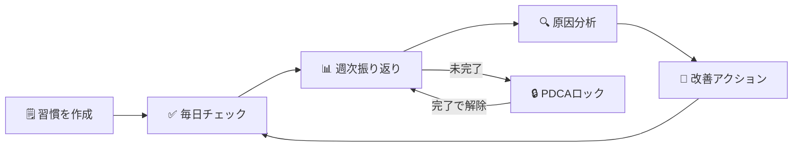

# HabitFlow（ハビットフロー）

> **甘えを可視化する** — 習慣 × PDCA × AI で自己成長を加速する

<br>

## 📸 画面イメージ

<br>

<p align="center">
  
  
  
</p>

<p align="center">
  <em>ダッシュボード &nbsp;&nbsp;&nbsp; 週次振り返り &nbsp;&nbsp;&nbsp; 習慣管理</em>
</p>

<br>

---

<br>

## 🧭 利用フロー

<br>



<br>

---

<br>

[](https://www.ruby-lang.org/)
[](https://rubyonrails.org/)
[](https://www.postgresql.org/)
[](https://www.docker.com/)

<br>

---

<br>

## 🌐 本番環境

<br>

**URL**: https://habitflow-web.onrender.com

<br>

| 項目 | 内容 |
|:---|:---|
| ホスティング | Render（無料プラン） |
| データベース | PostgreSQL 16 |
| デプロイ | GitHub の `main` ブランチへの Push で自動実行 |

<br>

> ⚠️ **Render 無料プランのスリープについて**
> 15分間アクセスがないとサービスがスリープします。
> 初回アクセス時は起動まで **約30〜60秒** かかる場合があります。
> スリープ対策として Google Apps Script（10分おきにアクセス）を設定しています。

<br>

---

<br>

## 📋 サービス概要

<br>

HabitFlow は「なぜ習慣が続かないのか」の**真の原因**を究明し、改善サイクルを自動化する自己成長サポートアプリです。

<br>

### 解決する課題

<br>

多くの習慣管理アプリは「記録するだけ」で終わります。<br>
「仕事が忙しかった」「疲れていた」という表面的な言い訳で習慣が途切れ、同じ失敗を繰り返す。<br>
**この「甘え」は明文化・可視化されていないから許されてしまいます。**

<br>

### HabitFlow の解決アプローチ

<br>

1. **週次振り返り** — できなかった理由を明文化して記録
2. **PDCA強制ロック** — 振り返りを完了しないと新しい習慣を追加できない仕組み
3. **AI分析連携（拡張機能）** — 外部 AI に現状を共有し、「なぜ？」を3回繰り返して真の原因を究明

<br>

---

<br>

## 📸 スクリーンショット

<br>

### ① ダッシュボード

今週の達成率と今日の習慣チェックリストを一覧表示します。

<br>


<br>

---

<br>

### ② 週次振り返り

今週の習慣達成結果を確認し、振り返りコメントを記録する画面です。過去の振り返り履歴も一覧で確認できます。

<br>


<br>

---

<br>

### ③ 習慣管理

登録済みの習慣と今週の進捗率をカード形式で表示します。

<br>


<br>

---

<br>

## ✅ 実装済み機能一覧

<br>

### 認証機能

<br>

| 機能 | 説明 |
|:---|:---|
| ユーザー登録 | メールアドレス・パスワードで新規登録 |
| ログイン / ログアウト | bcrypt による安全な認証 |
| セッション管理 | `reset_session` によるセッション固定攻撃対策 |

<br>

### 習慣管理機能

<br>

| 機能 | 説明 |
|:---|:---|
| 習慣の登録 | 習慣名（最大50文字）と週次目標回数（1〜7回）を設定 |
| 習慣の削除 | 論理削除（`deleted_at`）で過去データを保持したまま削除 |
| 日次記録 | チェックボックスをクリックするだけで即時保存（ページリロード不要） |
| 週次進捗統計 | 今週の達成率・達成日数を自動計算して表示 |

<br>

### ダッシュボード

<br>

| 機能 | 説明 |
|:---|:---|
| 今週の達成率 | 全習慣の平均達成率をプログレスバーで表示 |
| 今日の習慣チェックリスト | 今日記録すべき習慣の一覧をチェックボックス付きで表示 |
| PDCA ロック警告バナー | 振り返り未完了時に警告バナーを表示（振り返りページへの導線付き） |

<br>

### 週次振り返り機能

<br>

| 機能 | 説明 |
|:---|:---|
| 振り返り一覧 | 過去の完了済み振り返りと今週の達成率サマリーを表示 |
| 振り返り入力 | 今週の習慣実績を確認しながらコメント（最大1000文字）を記録 |
| 振り返り詳細 | 保存済みの振り返り内容と習慣別達成率を閲覧 |
| スナップショット保存 | 振り返り時点の習慣名・目標値を永続保存（後から習慣を変更しても過去記録は正確に表示） |

<br>

### PDCA 強制ロック機能

<br>

| 機能 | 説明 |
|:---|:---|
| ロック発動 | 月曜 AM4:00 以降、前週の振り返りが未完了の場合に自動ロック |
| ロック中の制限 | 習慣の新規追加・削除をブロック（日次記録のチェックは継続可能） |
| ロック自動解除 | 振り返りを完了すると即時解除され、緑色のバナーで通知 |

<br>

### UI / UX

<br>

| 機能 | 説明 |
|:---|:---|
| レスポンシブデザイン | スマホ・タブレット・PC すべてに対応 |
| ハンバーガーメニュー | モバイルでのナビゲーション |
| トースト通知 | 操作結果をフェードアウトアニメーション付きで表示 |
| カスタムエラーページ | 404 / 422 / 500 エラーページをカスタムデザインで表示 |
| アクセシビリティ | WCAG 2.1 AA 基準準拠（スキップリンク・ARIA 属性・キーボード操作対応） |

<br>

---

<br>

## 🔧 技術的な工夫

<br>

### 1. AM4:00 基準の日付管理

<br>

深夜に習慣を行うユーザーを考慮し、1日の境界を **AM4:00** に設定しています。  
`Time.now` ではなく `Time.current` を使用し、タイムゾーン（JST）を確実に適用しています。

<br>

```ruby
def self.today_date
  now = Time.current
  now.hour < 4 ? now.to_date - 1.day : now.to_date
end
```

<br>

### 2. N+1 問題の解消

<br>

ダッシュボードでは複数の習慣と記録を同時に表示するため、`index_by` と `group(:habit_id).count` を使い、**それぞれ1クエリで**一括取得しています。ループ内での DB アクセスを完全に排除し、習慣が増えてもクエリ数が変わらない設計にしています。

<br>

```ruby
# 今日の記録を O(1) で参照できるハッシュに変換（1クエリ）
@today_records_hash = current_user.habit_records
  .where(recorded_on: today).index_by(&:habit_id)

# 今週の集計も1クエリで完結
@weekly_counts_hash = current_user.habit_records
  .where(recorded_on: week_start..(week_start + 6.days))
  .group(:habit_id).count
```

<br>

### 3. PDCA 強制ロックの設計

<br>

「振り返りをしたくなる仕組み」ではなく「**振り返りをしないと前に進めない仕組み**」を採用しました。  
行動心理学の「実行意図（Implementation Intention）」に基づき、振り返りを完了しないと習慣の追加・削除を物理的にブロックします。UI だけでなくサーバー側でも必ずチェックし、API ツールからの直接リクエストも防いでいます。

<br>

### 4. スナップショット設計による履歴の正確性

<br>

振り返り保存時点の習慣名・目標値を `weekly_reflection_habit_summaries` に記録しています。  
後から習慣を変更・削除しても**過去の振り返り詳細ページは常に正確な値を表示**できます。

<br>

---

<br>

## 🛠️ 技術スタック

<br>

### バックエンド

<br>

| 技術 | バージョン | 用途 |
|:---|:---|:---|
| Ruby | 3.4.7 | プログラミング言語 |
| Ruby on Rails | 7.2.3 | Web フレームワーク |
| PostgreSQL | 16 | データベース |
| bcrypt | 3.1.7 | パスワードハッシュ化 |
| Puma | 5.0以上 | Web サーバー |

<br>

### フロントエンド

<br>

| 技術 | 用途 |
|:---|:---|
| Hotwire（Turbo） | ページリロードなしの即時 UI 更新 |
| Hotwire（Stimulus） | 軽量な JavaScript コントローラー |
| Tailwind CSS | ユーティリティファーストの CSS フレームワーク |
| Importmap | Node.js 不要の JavaScript モジュール管理 |

<br>

### インフラ・開発環境

<br>

| 技術 | 用途 |
|:---|:---|
| Docker / Docker Compose | ローカル開発環境の統一 |
| Render（無料プラン） | 本番環境ホスティング |
| GitHub | バージョン管理・自動デプロイトリガー |

<br>

### 開発補助ツール

<br>

| ツール | 用途 |
|:---|:---|
| Bullet | N+1 問題の自動検出（development 環境のみ） |
| Brakeman | セキュリティ脆弱性の静的解析 |
| RuboCop | コーディング規約チェック |
| Capybara / Selenium | E2E テスト |

<br>

---

<br>

## 🗄️ データベース設計（MVP 範囲）

<br>

### テーブル構成

<br>

| テーブル名 | 説明 |
|:---|:---|
| `users` | ユーザー情報・認証 |
| `habits` | 習慣（論理削除対応） |
| `habit_records` | 日次記録（AM4:00 基準・ユニーク制約） |
| `weekly_reflections` | 週次振り返り（ユニーク制約） |
| `weekly_reflection_habit_summaries` | 振り返り時点のスナップショット |

<br>

詳細は [`docs/er-diagram-mvp.md`](docs/er-diagram-mvp.md) および [`docs/database-schema-mvp.md`](docs/database-schema-mvp.md) を参照してください。

<br>

---

<br>

## 🚀 開発環境セットアップ

<br>

### 前提条件

<br>

以下がインストールされていることを確認してください。

<br>

| ツール | バージョン | 確認コマンド |
|:---|:---|:---|
| Docker Desktop | 24.0 以上 | `docker --version` |
| Docker Compose | 2.20 以上 | `docker compose version` |
| Git | 任意 | `git --version` |

<br>

### 手順

<br>

**① リポジトリのクローン**

<br>

```bash
git clone https://github.com/KK-arina/HabitFlow.git
cd HabitFlow
```

<br>

**② Docker コンテナの起動**

<br>

```bash
docker compose up
```

<br>

初回起動時は以下が自動実行されます（数分かかります）。

- Ruby イメージのダウンロード
- PostgreSQL イメージのダウンロード
- `bundle install`（Gem のインストール）
- Tailwind CSS のビルド

<br>

**③ データベースの作成とマイグレーション**

<br>

```bash
# 別のターミナルで実行（コンテナ起動中に行う）

# データベースを作成する
# db:create → config/database.yml の設定を元に development / test 用DBを作成する
docker compose exec web bin/rails db:create

# マイグレーションを実行する
# db:migrate → db/migrate/ 内の未実行ファイルを順番に適用してテーブルを作成する
docker compose exec web bin/rails db:migrate
```

<br>

**④ サンプルデータの投入（任意）**

<br>

```bash
# db:seed → db/seeds.rb を実行してデモ用のサンプルデータを投入する
# 実行後は test@example.com / password でログインできます
docker compose exec web bin/rails db:seed
```

<br>

**⑤ 動作確認**

<br>

ブラウザで http://localhost:3000 にアクセスしてランディングページが表示されれば成功です。

<br>

**⑥ コンテナの停止**

<br>

```bash
# Ctrl+C で停止（フォアグラウンド起動の場合）
# または別ターミナルで以下を実行
docker compose down
```

<br>

---

<br>

## 💻 開発コマンド一覧

<br>

### 基本操作

<br>

```bash
# コンテナ起動
docker compose up

# コンテナ停止
docker compose down

# コンテナ起動（バックグラウンド実行）
docker compose up -d
```

<br>

### Rails コマンド

<br>

```bash
# ⚠️ Rails コマンドは必ず「docker compose exec web」を先頭に付けて実行する
# 理由: コンテナ内の Ruby/Rails 環境を使用するため
#       「docker compose run」は一時コンテナを作成するため非推奨

# Rails コンソール（データの確認・操作に使用）
docker compose exec web bin/rails console

# マイグレーション実行
docker compose exec web bin/rails db:migrate

# マイグレーションのロールバック（直前のマイグレーションを取り消す）
docker compose exec web bin/rails db:rollback

# テスト実行（全テスト）
docker compose exec web bin/rails test

# テスト実行（特定ファイルのみ）
docker compose exec web bin/rails test test/models/user_test.rb
```

<br>

### Tailwind CSS

<br>

```bash
# 手動ビルド（CSSファイルを生成する）
docker compose exec web bin/rails tailwindcss:build

# 監視モード（ファイル変更を検知して自動ビルドする）
docker compose exec web bin/rails tailwindcss:watch
```

<br>

### データベース操作

<br>

```bash
# データベースを削除して再作成（テーブル定義をリセットしたい場合）
docker compose exec web bin/rails db:reset

# テスト用データベースを最新の状態に更新
docker compose exec web bin/rails db:test:prepare

# 現在のスキーマ状態を確認
docker compose exec web bin/rails db:schema:dump
```

<br>

### ログ確認

<br>

```bash
# Rails サーバーのログをリアルタイムで確認する
docker compose logs -f web

# データベースのログを確認する
docker compose logs -f db
```

<br>

---

<br>

## 📱 使い方ガイド（簡易版）

<br>

詳細は [`docs/user_guide.md`](docs/user_guide.md) を参照してください。

<br>

### 基本的な使い方の流れ

<br>

```
【毎日】5〜15分
  ↓
ダッシュボードを開く
  ↓
今日の習慣にチェックを入れる（自動保存）
  ↓
進捗率が自動更新される

【日曜夜】30〜60分
  ↓
週次振り返りページを開く
  ↓
今週の達成結果を確認する
  ↓
振り返りコメントを入力して完了する
  ↓
PDCAロックが解除される → 来週も習慣を追加・管理できる
```

<br>

### デモアカウント

<br>

| 項目 | 内容 |
|:---|:---|
| メールアドレス | `test@example.com` |
| パスワード | `password` |

<br>

> ⚠️ デモアカウントは公開環境です。個人情報は入力しないでください。

<br>

---

<br>

## ⚠️ 既知の制限事項

<br>

### MVP 未実装機能

<br>

以下の機能は設計済みですが、MVP 段階では実装していません。

<br>

| 機能 | 状態 | 予定 |
|:---|:---|:---|
| タスク管理 | 未実装 | 本リリースで追加予定 |
| AI 分析連携（自動パース） | 未実装 | 本リリースで追加予定 |
| パスワードリセット | 未実装 | 本リリースで追加予定 |
| オンボーディング（初回ガイド） | 未実装 | 本リリースで追加予定 |
| グラフ・チャート表示 | 未実装 | 本リリースで追加予定 |
| 数値型習慣（冊数・時間） | 未実装 | 本リリースで追加予定 |
| 除外日設定（習慣ごとに実施しない曜日を設定） | 未実装 | 本リリースで追加予定 |

<br>

### インフラ・環境制限

<br>

| 制限 | 内容 | 対策 |
|:---|:---|:---|
| Render 無料プランのスリープ | 15分間アクセスがないと起動に30〜60秒かかる | Google Apps Script で10分おきに ping を送信 |
| Render 無料 DB の有効期限 | PostgreSQL インスタンスが作成から **90日で自動削除** される | レビュー期間内に確認を完了する |
| 自動バックアップなし | Render 無料プランにはDB自動バックアップがない | 本番移行時は有料プランへ移行する |
| メール送信機能なし | パスワードリセットには Action Mailer の設定が必要 | MVP 後に実装予定 |

<br>

### 仕様上の注意点

<br>

| 項目 | 仕様 |
|:---|:---|
| 日付の切り替え基準 | 深夜 **AM4:00** を1日の境界とする（例: AM3:59 は前日として記録） |
| PDCA ロックの発動タイミング | **月曜 AM4:00** 以降に前週の振り返りが未完了の場合にロックされる |
| 振り返り入力可能期間 | 週次振り返りページは常に開けるが、ロック解除には完了が必要 |
| 習慣の削除 | 論理削除（実データは残る）のため完全な削除はできない |

<br>

---

<br>

## 🔒 セキュリティ対策

<br>

| 対策 | 実装内容 |
|:---|:---|
| CSRF 対策 | Rails 標準の `authenticity_token` + ログイン時 `reset_session` |
| XSS 対策 | ERB の自動 HTML エスケープ・Content Security Policy（CSP）設定 |
| SQL インジェクション対策 | Active Record のプレースホルダー使用（生 SQL なし） |
| Strong Parameters | `params.permit()` で許可するパラメータを明示 |
| セッション管理 | `httponly: true` / `secure: true`（本番）/ `same_site: :lax` |
| 認可制御 | `current_user.habits.find` で他ユーザーのデータへのアクセスを遮断 |

<br>

---

<br>

## 📁 プロジェクト構成

<br>

```
habitflow/
├── app/
│   ├── controllers/
│   │   ├── application_controller.rb      # 認証・ロック判定・エラーハンドリングの共通処理
│   │   ├── dashboards_controller.rb       # ダッシュボード
│   │   ├── habits_controller.rb           # 習慣の CRUD
│   │   ├── habit_records_controller.rb    # 習慣の日次記録（Turbo Stream 対応）
│   │   ├── weekly_reflections_controller.rb # 週次振り返り
│   │   ├── sessions_controller.rb         # ログイン・ログアウト
│   │   ├── users_controller.rb            # ユーザー登録
│   │   ├── errors_controller.rb           # カスタムエラーページ
│   │   └── pages_controller.rb            # ランディングページ
│   ├── models/
│   │   ├── user.rb                        # ユーザー認証・has_many 設定
│   │   ├── habit.rb                       # 習慣・論理削除・週次進捗計算
│   │   ├── habit_record.rb                # 日次記録・AM4:00 基準・UNIQUE 制約
│   │   ├── weekly_reflection.rb           # 週次振り返り・complete! メソッド
│   │   └── weekly_reflection_habit_summary.rb # スナップショット・達成率計算
│   ├── javascript/controllers/
│   │   ├── habit_record_controller.js     # チェックボックス即時保存（楽観的 UI）
│   │   ├── mobile_menu_controller.js      # ハンバーガーメニュー開閉
│   │   └── form_submit_controller.js      # フォーム送信ローディング・二重送信防止
│   └── views/
│       ├── dashboards/                    # ダッシュボード画面
│       ├── habits/                        # 習慣一覧・新規作成画面
│       ├── habit_records/                 # 習慣記録パーシャル（Turbo Stream 用）
│       ├── weekly_reflections/            # 振り返り一覧・入力・詳細画面
│       ├── shared/                        # ヘッダー・フッター・エラー表示パーシャル
│       ├── errors/                        # 404・422・500 エラーページ
│       └── layouts/application.html.erb  # 全ページ共通レイアウト
├── db/
│   ├── migrate/                           # マイグレーションファイル群
│   ├── schema.rb                          # 現在のDBスキーマ（自動生成）
│   └── seeds.rb                           # デモ用サンプルデータ
├── docs/
│   ├── er-diagram-mvp.md                  # ER 図（Mermaid 形式）
│   ├── database-schema-mvp.md             # テーブル定義書
│   ├── user_guide.md                      # 使い方ガイド（簡易版）
│   ├── logging_and_backup.md              # 本番ログ確認・バックアップ手順
│   └── screenshots/                       # スクリーンショット格納フォルダ
│       ├── dashboard.png                  # ダッシュボード画面
│       ├── habits_index.png               # 習慣一覧画面
│       └── weekly_reflection.png          # 週次振り返り画面
├── test/
│   ├── models/                            # モデル単体テスト
│   ├── integration/                       # 統合テスト（E2E フロー）
│   ├── controllers/                       # コントローラーテスト
│   └── fixtures/                          # テスト用固定データ
├── config/
│   ├── application.rb                     # アプリ設定（タイムゾーン・セッション）
│   ├── routes.rb                          # ルーティング定義
│   ├── initializers/
│   │   └── content_security_policy.rb     # CSP 設定（nonce 方式）
│   └── environments/
│       └── production.rb                  # 本番環境設定（セキュリティヘッダー）
├── Dockerfile                             # 本番用 Docker イメージ（マルチステージビルド）
├── Dockerfile.dev                         # 開発用 Docker イメージ
├── docker-compose.yml                     # Docker Compose 設定
├── render.yaml                            # Render デプロイ設定（IaC）
└── Gemfile                                # Gem 依存関係
```

<br>

---

<br>

## 🧪 テスト

<br>

### テスト実行

<br>

```bash
# 全テストを実行する
# 実行時間: 約30〜60秒
docker compose exec web bin/rails test
```

<br>

### 現在のテスト状況

<br>

```
221 runs, 648 assertions, 0 failures, 0 errors, 0 skips
```

<br>

### テストファイル構成

<br>

| ファイル | 種別 | 内容 |
|:---|:---|:---|
| `test/models/user_test.rb` | モデル | ユーザー認証・バリデーション |
| `test/models/habit_test.rb` | モデル | 習慣管理・論理削除 |
| `test/models/habit_record_test.rb` | モデル | 日次記録・AM4:00 境界値 |
| `test/models/weekly_reflection_test.rb` | モデル | 週次振り返り・complete! |
| `test/integration/user_auth_flow_test.rb` | E2E | 登録→ログイン→ログアウトのフロー |
| `test/integration/habit_full_flow_test.rb` | E2E | 習慣作成→記録→進捗確認のフロー |
| `test/integration/weekly_reflection_flow_test.rb` | E2E | 振り返り作成→詳細確認のフロー |
| `test/integration/pdca_lock_flow_test.rb` | E2E | ロック発動→解除→習慣作成のフロー |
| `test/integration/error_cases_test.rb` | E2E | 404・認可エラー・他ユーザーアクセス防止 |
| `test/integration/production_final_check_test.rb` | E2E | 本番環境最終動作確認（19ケース） |

<br>

---

<br>

## 🐛 トラブルシューティング

<br>

### ポート 3000 が使用中

<br>

```bash
# 使用中のプロセスを確認する
lsof -i :3000

# 確認後、そのプロセスを終了する（PID は上記コマンドで確認）
kill -9 <PID>
```

<br>

### データベース接続エラー

<br>

```bash
# コンテナとボリュームを完全に削除して再起動する
# ⚠️ -v オプションで DB データも削除されるため注意
docker compose down -v
docker compose up
```

<br>

### Tailwind CSS が反映されない

<br>

```bash
# ビルド成果物が存在するか確認する
docker compose exec web ls app/assets/builds/

# 存在しない場合は手動でビルドする
docker compose exec web bin/rails tailwindcss:build
```

<br>

### テスト実行時のエラー

<br>

```bash
# Sprockets キャッシュをクリアする（Permission denied エラーの場合）
sudo rm -rf tmp/cache/assets

# テスト用 DB を最新状態に更新する
docker compose exec web bin/rails db:test:prepare
```

<br>

### Render デプロイエラー

<br>

| エラー | 原因 | 対処 |
|:---|:---|:---|
| `Missing secret_key_base` | `RAILS_MASTER_KEY` が未設定 | Render の Environment Variables に `config/master.key` の内容を設定 |
| `PG::ConnectionBad` | `DATABASE_URL` が未設定 | `render.yaml` の `fromDatabase` 設定を確認 |
| CSS が全く適用されない | `RAILS_SERVE_STATIC_FILES` が未設定 | Environment Variables に `RAILS_SERVE_STATIC_FILES=true` を追加 |

<br>

---

<br>

## 📚 関連ドキュメント

<br>

| ドキュメント | 内容 |
|:---|:---|
| [`docs/user_guide.md`](docs/user_guide.md) | **使い方ガイド**: 初めて使う方向けの操作手順 |
| [`docs/architecture.md`](docs/architecture.md) | **設計・技術実装ノート**: サービス設計・ER図・技術選定の理由・実装詳細 |
| [`docs/development.md`](docs/development.md) | **開発進捗ログ**: Week別SP管理・Issue完了記録・テスト推移・教訓まとめ |
| [`docs/operations.md`](docs/operations.md) | **運用・デプロイ記録**: 本番環境設定・確認チェックリスト・トラブルシューティング |

<br>

---

<br>

## 🏆 開発を通じて得た主要な教訓

<br>

### タイムゾーン設定は必ず最初に行う

<br>

`config.time_zone = "Tokyo"` を設定しないと Rails は UTC で動作し、<br>
本番環境でロック時刻が9時間ズレる致命的なバグが発生します（Issue #37 で発見）。

<br>

### `Time.current` / `Date.current` を使う

<br>

`Time.now` / `Date.today` はサーバーのローカル時刻を返しタイムゾーン設定が無視されます。<br>
Rails アプリでは必ず `Time.current` / `Date.current` を使用してください。

<br>

### `form_with` の HTTP メソッド自動判定に注意

<br>

`form_with model:` は `persisted? = true` のレコードを渡すと自動で `PATCH` を送信します。<br>
routes に `update` がない設計の場合は `url:` と `method: :post` を明示してください。

<br>

### テストでは値で直接レコードを特定する

<br>

`order(created_at: :desc).first` は fixtures の `created_at` 順序に依存するため不安定です。<br>
`find_by(name: "...")` など値で特定し、`assert_not_nil` でセットで確認してください。

<br>

---

<br>

## 📄 ライセンス

<br>

このプロジェクトは個人の学習・ポートフォリオ目的で作成されています。

<br>

---

<br>

*© 2026 HabitFlow — 甘えを可視化する*
