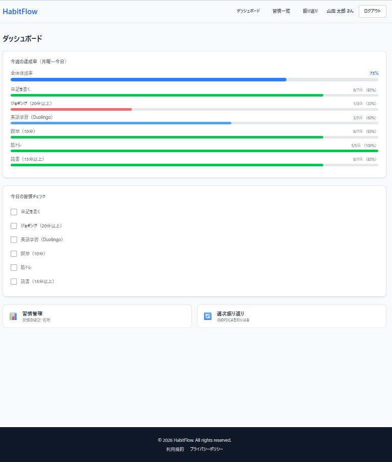
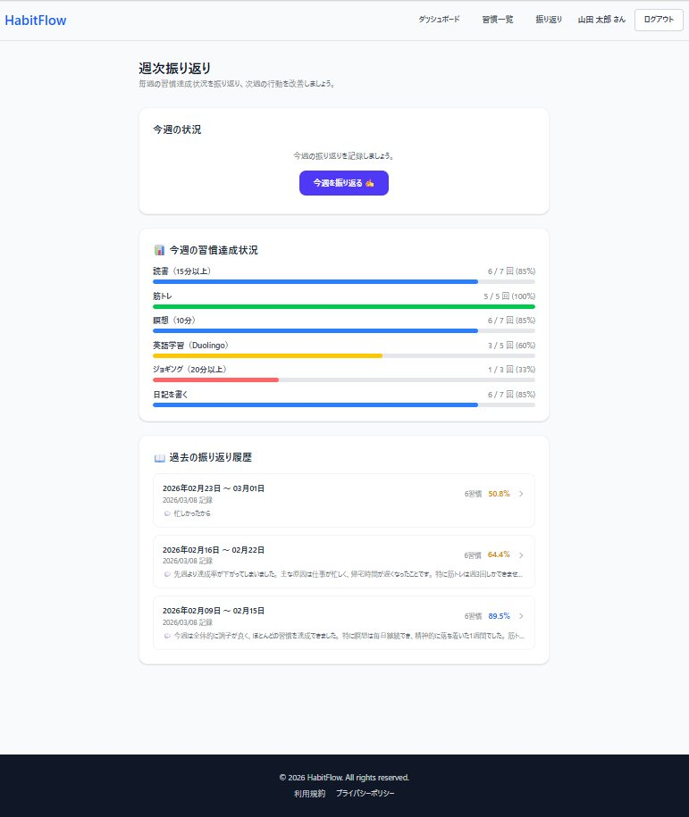
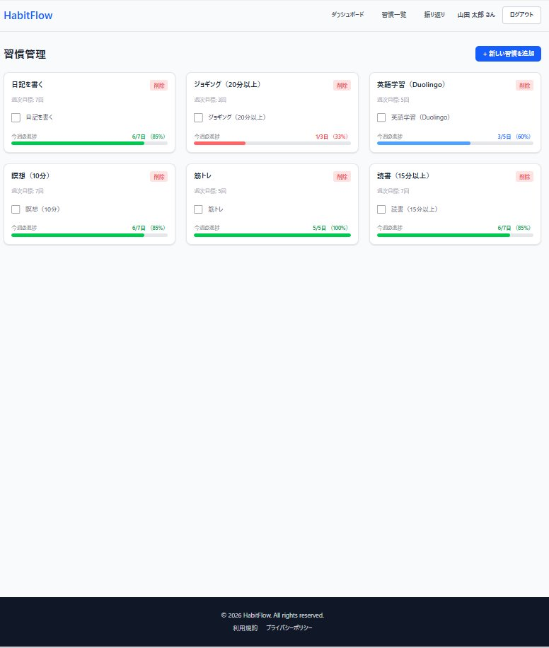
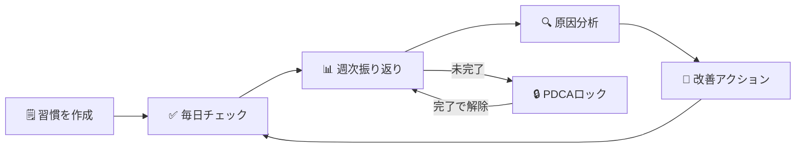

# HabitFlow（ハビットフロー）

> **甘えを可視化する** — 習慣 × PDCA × AI で自己成長を加速する

<br>

## 📸 画面イメージ

<br>

<p align="center">
  
  
  
</p>

<p align="center">
  <em>ダッシュボード &nbsp;&nbsp;&nbsp; 週次振り返り &nbsp;&nbsp;&nbsp; 習慣管理</em>
</p>

<br>

---

<br>

## 🧭 利用フロー

<br>



<br>

---

<br>

[](https://www.ruby-lang.org/)
[](https://rubyonrails.org/)
[](https://www.postgresql.org/)
[](https://www.docker.com/)
[](https://github.com/KK-arina/HabitFlow/tree/feature/A-1-db-migrations)
[](https://github.com/KK-arina/HabitFlow/tree/feature/A-2-production-deploy)
[](https://github.com/KK-arina/HabitFlow/tree/feature/A-3-good-job)
[](https://github.com/KK-arina/runteq_graduation_project/tree/feature/A-4-resend-mailer)
[](https://github.com/KK-arina/HabitFlow/tree/feature/A-5-habit-templates-seed)
[](https://github.com/KK-arina/HabitFlow/tree/feature/A-6-db-index-audit)
[](https://github.com/KK-arina/HabitFlow/tree/feature/A-7-transaction-design)
[](https://github.com/KK-arina/HabitFlow/tree/feature/B-1-numeric-habit)
[](https://github.com/KK-arina/HabitFlow/tree/feature/B-2-habit-excluded-days)
[](https://github.com/KK-arina/HabitFlow/tree/feature/B-3-streak-calculation)
[](https://github.com/KK-arina/HabitFlow/tree/feature/B-4-habit-archive)
[](https://github.com/KK-arina/HabitFlow/tree/feature/B-5-habit-menu-modal)
[](https://github.com/KK-arina/HabitFlow/tree/feature/B-6-habit-color-icon-sort)
[]()

<br>

---

<br>

## 🌐 本番環境

<br>

**URL**: https://habitflow-web.onrender.com

<br>

| 項目 | 内容 |
|:---|:---|
| ホスティング | Render（無料プラン） |
| データベース | Neon Serverless PostgreSQL 16（永続・無料） |
| デプロイ | GitHub の `main` ブランチへの Push で自動実行 |
| Web サーバー | Puma（Worker: 2 / Thread: 3 / Cluster mode） |

<br>

> ⚠️ **Render 無料プランのスリープについて**<br>
> 15分間アクセスがないとサービスがスリープします。<br>
> 初回アクセス時は起動まで **約30〜60秒** かかる場合があります。

<br>

> 📌 **Neon を採用した理由**<br>
> Render 内蔵の無料 PostgreSQL は作成から **90日で自動削除** される制限がある。<br>
> Neon Serverless Postgres は永続的な無料プランを提供しており、長期運用に最適。<br>
> また Render と同じ Singapore リージョンに配置することで Web ↔ DB 間のレイテンシを最小化している。

<br>

---

<br>

### 🚧 本リリース開発進捗

<br>

| Week | テーマ | ISSUE | SP | 状態 |
|:---|:---|:---:|:---:|:---:|
| Week A | DB・インフラ基盤 | #A-1〜#A-7 | 24 | ✅ 完了 |
| Week B | 習慣機能拡張 | #B-1〜#B-7 | 28 | 🟡 進行中 |
| Week C | タスク管理機能 | #C-1〜#C-7 | 28 | ⬜ 未着手 |
| Week D | AI分析・PMVV機能 | #D-1〜#D-11 | 42 | ⬜ 未着手 |
| Week E | 週次振り返り拡張 | #E-1〜#E-5 | 22 | ⬜ 未着手 |
| Week F | 認証拡張 | #F-1〜#F-6 | 19 | ⬜ 未着手 |
| Week G | 通知・設定拡張 | #G-1〜#G-8 | 30 | ⬜ 未着手 |
| Week H | フロントエンド強化 | #H-1〜#H-9 | 30 | ⬜ 未着手 |
| Week I | 品質・テスト・デプロイ | #I-1〜#I-6 | 22 | ⬜ 未着手 |
| **合計** | | **67** | **222** | |

<br>

#### ✅ 完了済みISSUE

<br>

| ISSUE | タイトル | 完了日 | ブランチ |
|:---|:---|:---:|:---|
| #A-1 | 本リリース用DBマイグレーション（全差分） | 2026-03-20 | feature/A-1-db-migrations |
| #A-2 | 本番環境デプロイ（Render + Neon PostgreSQL） | 2026-03-20 | feature/A-2-production-deploy |
| #A-3 | GoodJob 導入・非同期処理基盤構築 | 2026-03-20 | feature/A-3-good-job |
| #A-4 | Resend メール送信設定 | 2026-03-22 | feature/A-4-resend-mailer |
| #A-5 | habit_templates シードデータ・モデル作成 | 2026-03-22 | feature/A-5-habit-templates-seed |
| #A-6 | DBインデックス監査・最適化 | 2026-03-22 | feature/A-6-db-index-audit |
| #A-7 | DBトランザクション設計・複数テーブル更新の整合性保証 | 2026-03-22 | feature/A-7-transaction-design |
| #B-1 | 数値型習慣の記録・達成率計算・リフレクション手法対応 | 2026-03-27 | feature/B-1-numeric-habit |
| #B-2 | 習慣の除外日設定（habit_excluded_days） | 2026-03-28 | feature/B-2-habit-excluded-days |
| #B-3 | ストリーク計算・表示（current_streak / longest_streak） | 2026-03-29 | feature/B-3-streak-calculation |
| #B-4 | 習慣のアーカイブ機能（archived_at）| 2026-03-29 | feature/B-4-habit-archive |
| #B-5 | 習慣削除確認モーダル（M-1）⋯メニュー + デスクトップモーダル / スマホボトムシート | 2026-03-30 | feature/B-5-habit-menu-modal |
| #B-6 | 習慣のカラー・アイコン・Drag&Drop 並び替え（acts_as_list + SortableJS） | 2026-04-05 | feature/B-6-habit-color-icon-sort |

<br>

---

<br>

## 📋 サービス概要

<br>

HabitFlow は「なぜ習慣が続かないのか」の**真の原因**を究明し、改善サイクルを自動化する自己成長サポートアプリです。

<br>

### 解決する課題

<br>

多くの習慣管理アプリは「記録するだけ」で終わります。<br>
「仕事が忙しかった」「疲れていた」という表面的な言い訳で習慣が途切れ、同じ失敗を繰り返す。<br>
**この「甘え」は明文化・可視化されていないから許されてしまいます。**

<br>

### HabitFlow の解決アプローチ

<br>

1. **週次振り返り** — できなかった理由を明文化して記録
2. **PDCA強制ロック** — 振り返りを完了しないと新しい習慣を追加できない仕組み
3. **AI分析連携（拡張機能）** — 外部 AI に現状を共有し、「なぜ？」を3回繰り返して真の原因を究明

<br>

---

<br>

## 📸 スクリーンショット

<br>

### ① ダッシュボード

今週の達成率と今日の習慣チェックリストを一覧表示します。

<br>


<br>

---

<br>

### ② 週次振り返り

今週の習慣達成結果を確認し、振り返りコメントを記録する画面です。過去の振り返り履歴も一覧で確認できます。

<br>


<br>

---

<br>

### ③ 習慣管理

登録済みの習慣と今週の進捗率をカード形式で表示します。

<br>


<br>

---

<br>

## ✅ 実装済み機能一覧

<br>

### 認証機能

<br>

| 機能 | 説明 |
|:---|:---|
| ユーザー登録 | メールアドレス・パスワードで新規登録 |
| ログイン / ログアウト | bcrypt による安全な認証 |
| セッション管理 | `reset_session` によるセッション固定攻撃対策 |

<br>

### 習慣管理機能

<br>

| 機能 | 説明 |
|:---|:---|
| 習慣の登録 | 習慣名（最大50文字）と週次目標回数（1〜7回）を設定 |
| 習慣の削除 | 論理削除（`deleted_at`）で過去データを保持したまま削除 |
| 日次記録 | チェックボックスをクリックするだけで即時保存（ページリロード不要） |
| 週次進捗統計 | 今週の達成率・達成日数を自動計算して表示 |

<br>

### ダッシュボード

<br>

| 機能 | 説明 |
|:---|:---|
| 今週の達成率 | 全習慣の平均達成率をプログレスバーで表示 |
| 今日の習慣チェックリスト | 今日記録すべき習慣の一覧をチェックボックス付きで表示 |
| PDCA ロック警告バナー | 振り返り未完了時に警告バナーを表示（振り返りページへの導線付き） |

<br>

### 週次振り返り機能

<br>

| 機能 | 説明 |
|:---|:---|
| 振り返り一覧 | 過去の完了済み振り返りと今週の達成率サマリーを表示 |
| 振り返り入力 | 今週の習慣実績を確認しながらコメント（最大1000文字）を記録 |
| 振り返り詳細 | 保存済みの振り返り内容と習慣別達成率を閲覧 |
| スナップショット保存 | 振り返り時点の習慣名・目標値を永続保存（後から習慣を変更しても過去記録は正確に表示） |

<br>

### PDCA 強制ロック機能

<br>

| 機能 | 説明 |
|:---|:---|
| ロック発動 | 月曜 AM4:00 以降、前週の振り返りが未完了の場合に自動ロック |
| ロック中の制限 | 習慣の新規追加・削除をブロック（日次記録のチェックは継続可能） |
| ロック自動解除 | 振り返りを完了すると即時解除され、緑色のバナーで通知 |

<br>

### UI / UX

<br>

| 機能 | 説明 |
|:---|:---|
| レスポンシブデザイン | スマホ・タブレット・PC すべてに対応 |
| ハンバーガーメニュー | モバイルでのナビゲーション |
| トースト通知 | 操作結果をフェードアウトアニメーション付きで表示 |
| カスタムエラーページ | 404 / 422 / 500 エラーページをカスタムデザインで表示 |
| アクセシビリティ | WCAG 2.1 AA 基準準拠（スキップリンク・ARIA 属性・キーボード操作対応） |

<br>

---

<br>

## 🚀 本リリース実装済み機能

<br>

### #A-1: 本リリース用 DB マイグレーション

<br>

**ブランチ:** `feature/A-1-db-migrations`<br>
**完了日:** 2026-03-20<br>
**対象:** MVP版スキーマからの全差分をマイグレーションファイルとして実装

<br>

#### 既存テーブルへのカラム追加

<br>

| テーブル | 追加カラム | 目的 |
|:---|:---|:---|
| `users` | `provider` / `uid` | OmniAuth（Google/LINE）ログイン対応 |
| `users` | `line_user_id` | LINE Messaging API 通知送信用 |
| `users` | `first_login_at` | オンボーディング完了判定（NULL=未完了） |
| `habits` | `measurement_type` | チェック型(0) / 数値型(1) の区別 |
| `habits` | `unit` | 数値型習慣の単位（分・冊・km など） |
| `habits` | `current_streak` / `longest_streak` | ストリーク（継続日数）管理 |
| `habits` | `allow_rest_mode` | お休みモード中のストリーク維持フラグ |
| `habits` | `archived_at` | 卒業習慣のアーカイブ（`deleted_at` とは別管理） |
| `habits` | `color` / `icon` / `position` | UI カスタマイズ・並び替え |
| `habit_records` | `numeric_value` | 数値型習慣の実績値（decimal型・精度保証） |
| `habit_records` | `memo` | 日次メモ（AI 分析精度向上に活用） |
| `habit_records` | `is_manual_input` | 自動記録 vs 手動修正の区別 |
| `habit_records` | `deleted_at` | 論理削除（統計整合性の保持） |
| `weekly_reflections` | `year` / `week_number` | ISO週番号による重複防止 |
| `weekly_reflections` | `mood` | 気分スコア（1〜5） |
| `weekly_reflections` | `direct_reason` / `background_situation` | 構造化された振り返り入力 |

<br>

#### 新規作成テーブル

<br>

| テーブル | 役割 | 主な設計ポイント |
|:---|:---|:---|
| `habit_excluded_days` | 習慣ごとの除外曜日 | UNIQUE制約(habit_id, day_of_week) |
| `tasks` | タスク管理（Must/Should/Could） | 4種インデックス・ai_generated フラグ |
| `ai_analyses` | AI分析結果の保存 | is_latest フラグ・input_snapshot(jsonb)・UNIQUE制約2種 |
| `user_settings` | ユーザー設定の一元管理 | 通知/お休みモード/AIコスト制御 |
| `user_purposes` | PMVV目標のバージョン管理 | is_active フラグ・analysis_state enum |
| `habit_templates` | オンボーディング用マスタ | カテゴリ別テンプレート |
| `notification_logs` | 通知送信履歴 | deep_link_url・ポリモーフィック関連 |
| `push_subscriptions` | Web Push購読情報（将来用） | 機能実装は後続リリース |
| `password_reset_tokens` | パスワードリセット | token_digest（ハッシュ化保存）・多重発行防止 |

<br>

### #A-2: 本番環境デプロイ（Render + Neon PostgreSQL）

<br>

**ブランチ:** `feature/A-2-production-deploy`<br>
**完了日:** 2026-03-20<br>
**本番URL:** https://habitflow-web.onrender.com

<br>

#### 採用構成

<br>

| 役割 | サービス | 理由 |
|:---|:---|:---|
| Web サービス | Render（無料プラン） | GitHub 連携で自動デプロイ・クレカ不要 |
| データベース | Neon Serverless PostgreSQL 16 | 永続無料・Render 内蔵 DB の90日削除問題を回避 |
| リージョン | Singapore（両サービス統一） | Web ↔ DB 間のレイテンシを最小化 |

<br>

#### 主な設定内容

<br>

| ファイル | 変更内容 |
|:---|:---|
| `render.yaml` | Neon 対応に全面書き換え・puma 直接起動・GoodJob Worker 準備（コメントアウト） |
| `config/puma.rb` | Worker 設定・`on_worker_boot`・`Integer()` 型安全変換を追加 |
| `bin/docker-entrypoint` | `db:prepare` → `db:migrate` に変更（Neon は CREATE DATABASE 権限なし） |

<br>

#### 環境変数設定（Render）

<br>

| Key | 管理方法 | 用途 |
|:---|:---|:---|
| `RAILS_ENV` | render.yaml に記載 | 本番環境モード指定 |
| `DATABASE_URL` | Render ダッシュボードで手動設定 | Neon 接続文字列 |
| `RAILS_MASTER_KEY` | Render ダッシュボードで手動設定 | credentials 復号キー |
| `RAILS_LOG_TO_STDOUT` | render.yaml に記載 | Render Logs タブへの出力 |
| `RAILS_SERVE_STATIC_FILES` | render.yaml に記載 | CSS/JS の直接配信 |
| `WEB_CONCURRENCY` | render.yaml に記載 | Puma Worker 数（2） |

<br>

### #A-3: GoodJob 導入・非同期処理基盤構築

<br>

**ブランチ:** `feature/A-3-good-job`<br>
**完了日:** 2026-03-20<br>
**概要:** Redis 不要の非同期ジョブ処理エンジン GoodJob を導入し、<br>
AI 分析・通知・ストリーク計算等のバックグラウンド処理基盤を構築。<br>

<br>

#### 技術選定の理由

<br>

| 技術 | 採用理由 |
|:---|:---|
| GoodJob | PostgreSQL のみで動作。Redis 不要のため Render 無料プランと相性が良い |
| Sidekiq (不採用) | 高性能だが Redis が必要。Render 無料プランではコスト増になる |

<br>

#### GoodJob の設定

<br>

| 設定項目 | 値 | 理由 |
|:---|:---|:---|
| `execution_mode` (development) | `:async` | Web プロセス内でスレッド実行。Docker 1台で完結 |
| `execution_mode` (production) | `:external` | Render の Worker サービスが別プロセスで実行 |
| `max_threads` | `3` | Web(6) + Worker(3) = 9 コネクション。Neon 無料プラン上限以内 |
| `poll_interval` | `30秒` | DB への SELECT 頻度と遅延のバランス点 |
| `cleanup_preserved_jobs_before_seconds_ago` | `86400秒（24時間）` | Neon 無料プランの容量制限に対応 |

<br>

#### cron ジョブ一覧（JST 基準）

<br>

| ジョブクラス | cron (UTC) | JST 実行時刻 | 役割 |
|:---|:---:|:---:|:---|
| `StreakCalculationJob` | `5 19 * * *` | 毎日 AM4:05 | ストリーク計算（#B-3 で本実装） |
| `DailyNotificationCountResetJob` | `5 15 * * *` | 毎日 00:05 | 通知カウントリセット |
| `MonthlyAiCountResetJob` | `0 15 * * *` | 毎日 00:00 | 月初のみ AI 使用回数リセット |
| `GoodJob::CleanupJobsJob` | `0 18 * * *` | 毎日 03:00 | 完了済みジョブ削除 |

<br>

月次リセットは cron 式を毎日実行にして、ジョブ内で `Time.current.day == 1` をチェックする方式を採用。<br>
UTC 変換による cron 式の複雑化を避けるための設計。

<br>

#### 作成・変更ファイル一覧

<br>

| ファイル | 変更内容 |
|:---|:---|
| `Gemfile` | `gem "good_job"` 追加（4.x 系・バージョン固定なし） |
| `Gemfile` | `gem "minitest", "~> 5.1"` 追加（GoodJob が 6.x を引き込む問題を防止） |
| `config/application.rb` | `config.active_job.queue_adapter = :good_job` 追加 |
| `config/initializers/good_job.rb` | 新規作成（`Rails.application.configure` 形式・cron 4件） |
| `config/environments/development.rb` | `execution_mode = :async` 追加 |
| `config/environments/production.rb` | `execution_mode = :external` 追加 |
| `config/environments/test.rb` | `queue_adapter = :test` 追加 |
| `config/routes.rb` | GoodJob ダッシュボードを catch-all より前にマウント |
| `render.yaml` | Worker サービスを有効化（`--max-threads=3` を明示） |
| `app/jobs/application_job.rb` | `retry_on` / `discard_on` を追加 |
| `app/jobs/streak_calculation_job.rb` | 新規作成（#B-3 で本実装予定） |
| `app/jobs/daily_notification_count_reset_job.rb` | 新規作成 |
| `app/jobs/monthly_ai_count_reset_job.rb` | 新規作成 |
| `app/jobs/hello_good_job.rb` | 動作確認用（確認後削除可） |
| `db/migrate/YYYYMMDDHHMMSS_create_good_jobs.rb` | GoodJob 4.x 用テーブル5種を作成 |

<br>

#### 作成された DB テーブル

<br>

| テーブル名 | 役割 |
|:---|:---|
| `good_jobs` | ジョブキュー本体 |
| `good_job_batches` | バッチ処理管理 |
| `good_job_executions` | 実行履歴 |
| `good_job_processes` | Worker プロセス管理 |
| `good_job_settings` | GoodJob 内部設定 |

<br>

#### GoodJob ダッシュボード

<br>

| 環境 | URL | 認証 |
|:---|:---|:---|
| development | `http://localhost:3000/good_job` | なし |
| production | `https://habitflow-web.onrender.com/good_job` | Basic 認証（環境変数設定時のみ公開） |

<br>

本番環境での公開には Render ダッシュボードで以下の環境変数を設定する。<br>
```
GOOD_JOB_LOGIN=（任意のユーザー名）
GOOD_JOB_PASSWORD=（強力なパスワード）
```

<br>

#### Render Worker サービス設定

<br>
```yaml
- type: worker
  name: habitflow-worker
  runtime: docker
  region: singapore
  plan: free
  startCommand: bundle exec good_job start --max-threads=3
```

<br>

`--max-threads=3` を明示する理由:<br>
GoodJob のデフォルトスレッド数は 5。明示しないと Neon 無料プランの DB コネクション上限を超えるリスクがある。

<br>

### #A-4: Resend メール送信設定

<br>

**ブランチ:** `feature/A-4-resend-mailer`<br>
**完了日:** 2026-03-22<br>
**概要:** パスワードリセット・CSVエクスポート完了通知・週次レポートメールに使用する<br>
Resend をAction Mailerに接続。開発環境では letter_opener でブラウザプレビュー確認。

<br>

#### 技術選定の理由

<br>

| 技術 | 採用理由 |
|:---|:---|
| Resend | クレカ不要・月3,000通無料・Rails用gem公式提供。SendGrid（クレカ必要）・Mailgun（設定複雑）より優位 |
| letter_opener | 開発環境での無駄な送信を防止。ブラウザでメール内容をプレビュー確認できる |

<br>

#### Action Mailer 設定内容

<br>

| 環境 | delivery_method | 説明 |
|:---|:---|:---|
| development | `:letter_opener` | 実際には送信せず `tmp/letter_opener/` にHTMLとして保存 |
| production | `:resend` | Resend APIを経由して実際にメール送信 |

<br>

#### 本番環境の設定

<br>

| 設定項目 | 値 | 理由 |
|:---|:---|:---|
| `delivery_method` | `:resend` | Resend API経由でメール送信 |
| `raise_delivery_errors` | `true` | 送信失敗時に例外を発生させてエラーを検知 |
| `default_url_options` | `host: "habitflow-web.onrender.com"` | パスワードリセットメール内リンクのURLを正しく生成 |
| `asset_host` | `"https://habitflow-web.onrender.com"` | メール内画像・CSSの絶対URLを生成 |

<br>

#### 作成・変更ファイル一覧

<br>

| ファイル | 変更内容 |
|:---|:---|
| `Gemfile` | `gem "resend"` / `gem "letter_opener"` 追加 |
| `config/initializers/resend.rb` | 新規作成（APIキーを環境変数から初期化） |
| `config/environments/production.rb` | Action Mailer本番設定追加（delivery_method・raise_delivery_errors・default_url_options・asset_host）<br>GoodJob execution_mode を `:external` → `:async` に変更（Render Worker非対応のため）<br>GoodJob max_threads を `2` に設定（Freeプランリソース制約対応） |
| `config/environments/development.rb` | letter_opener設定追加 |
| `app/mailers/application_mailer.rb` | fromアドレスを `HabitFlow <onboarding@resend.dev>` に設定 |
| `app/mailers/test_mailer.rb` | 新規作成（動作確認用・将来のMailer実装の参考） |
| `render.yaml` | `RESEND_API_KEY` 環境変数を追加（`sync: false`）<br>Workerセクションをコメントアウト（Render Freeプランは Worker 非対応） |

<br>

#### Render 環境変数設定

<br>

| Key | 管理方法 | 用途 |
|:---|:---|:---|
| `RESEND_API_KEY` | Render ダッシュボードで手動設定 | Resend API認証キー |

<br>

#### GoodJob execution_mode の変更理由

<br>

#A-3 では production の execution_mode を `:external`（別Workerプロセス）に設定していたが、<br>
Render の Background Worker は Free プランが存在しない（最低 $7/月 の Starter プラン）ため、<br>
`:async`（Webプロセス内でバックグラウンドスレッドを実行）に変更した。<br>

<br>

| モード | 動作 | 採用環境 |
|:---|:---|:---|
| `:async` | Webプロセス内のスレッドでジョブを実行 | 本番（Render Free）・開発 |
| `:external` | 別プロセス（Worker）でジョブを実行 | 有料プラン移行時 |

<br>

> ⚠️ `:async` モードはWebサーバーと同一プロセスのため、<br>
> 重い処理（CSV生成・AI分析）はWebレスポンスに影響する可能性があります。<br>
> 有料プランへの移行時は `:external` に戻し、render.yaml の Worker 設定を有効化してください。

<br>

### #A-5: habit_templates シードデータ・モデル作成

<br>

**ブランチ:** `feature/A-5-habit-templates-seed`<br>
**完了日:** 2026-03-22<br>
**概要:** オンボーディングで使用する習慣テンプレートのマスタデータを実装。<br>
カテゴリ別18件のプリセットデータを登録し、ユーザーがスムーズに習慣を選択できるようにする。

<br>

#### 登録テンプレート一覧（18件）

<br>

| カテゴリ | 件数 | 習慣名 |
|:---|:---|:---|
| 健康（health） | 5件 | 読書・瞑想・睡眠日記・水を飲む・早起き |
| フィットネス（fitness） | 5件 | 筋トレ・ジョギング・ストレッチ・ウォーキング・体重記録 |
| 学習（study） | 4件 | 英語学習・プログラミング学習・読書（学習）・オンライン講座 |
| マインド（mind） | 4件 | 日記・感謝リスト・呼吸法・デジタルデトックス |

<br>

#### 作成ファイル一覧

<br>

| ファイル | 変更内容 |
|:---|:---|
| `app/models/habit_template.rb` | 新規作成（enum / バリデーション / スコープ） |
| `db/seeds.rb` | habit_templates シードデータを Step 8 として末尾に追記 |

<br>

#### HabitTemplate モデルの設計

<br>

| 設定 | 内容 |
|:---|:---|
| `measurement_type` enum | `check_type`(0) / `numeric_type`(1) |
| `category` enum | `health`(0) / `fitness`(1) / `study`(2) / `mind`(3) / `other`(4) |
| バリデーション | name（必須・100文字以内）/ default_weekly_target（1〜7の整数） |
| スコープ | `active` / `ordered` / `active_ordered` |

<br>

#### 設計上の判断

<br>

- `find_or_initialize_by` + `assign_attributes` + `save!` を採用<br>
  → 既存レコードも更新されるため、description や sort_order の修正が本番 DB に反映される<br>
  → `find_or_create_by!` のブロック方式では既存データが更新されないため不採用<br>
- slug カラムの追加は見送り<br>
  → schema.rb に定義がなく #A-1 のスコープ外。`name + category` の複合キーで一意性を保証できる<br>
- `enum _prefix: true` は見送り<br>
  → 使用箇所が生まれる #H-5（オンボーディング拡張）のタイミングで改めて検討する（YAGNI原則）

<br>

### #A-6: DBインデックス監査・最適化

<br>

**ブランチ:** `feature/A-6-db-index-audit`<br>
**完了日:** 2026-03-22<br>
**概要:** データ量が増加しやすいテーブルのインデックスを実測クエリで確認し、<br>
不足インデックスを追加。Bullet / rack-mini-profiler によるN+1監視基盤を構築。

<br>

#### スキーマ監査結果

<br>

| 対象 | 結果 | 内容 |
|:---|:---:|:---|
| `habit_records(user_id, record_date)` | ✅ 設定済み | ダッシュボード週次集計クエリに使用 |
| `habit_records(user_id, habit_id, record_date)` UNIQUE | ✅ 設定済み | 1日1件制約をDBレベルで保証 |
| `tasks(user_id, status, due_date)` | ✅ 設定済み | タスク一覧フィルタクエリに使用 |
| `notification_logs(user_id, created_at)` | ✅ 設定済み | 通知履歴・件数チェックに使用 |
| `weekly_reflections(user_id, week_start_date)` UNIQUE | ✅ 設定済み | 同一週の重複振り返りを防止 |
| `idx_weekly_reflections_user_week_completed` 部分INDEX | ✅ 設定済み | `User#locked?` の毎リクエスト実行クエリに使用 |
| `notification_logs.deep_link_url` | ❌ **未設定→追加** | #A-1設計済みだが未設定だった |
| `tasks` 複合部分インデックス | ❌ **未設定→追加** | `deleted_at IS NULL` フィルタ付き4条件クエリを最適化 |

<br>

#### 追加インデックス詳細

<br>

| インデックス名 | 対象 | 種別 | 理由 |
|:---|:---|:---|:---|
| `index_notification_logs_on_deep_link_url` | `notification_logs.deep_link_url` | 通常INDEX | 通知種別ごとの遷移先分析クエリを高速化 |
| `idx_tasks_active_tasks` | `tasks(user_id, status, deleted_at, due_date)` WHERE deleted_at IS NULL | 複合部分INDEX | `deleted_at IS NULL` を含む4条件クエリを Index Only Scan で完結させる |

<br>

#### なぜ `deleted_at` 単体ではなく複合部分インデックスなのか

<br>

実際のクエリパターン（TasksController#index）:<br>
```sql
WHERE user_id = ? AND status = 0 AND deleted_at IS NULL ORDER BY due_date ASC
```

<br>

`deleted_at` 単体インデックスでは `user_id` / `status` / `due_date` の条件を処理できず、<br>
結局テーブルを別途参照する「Heap Fetch」が大量発生する。<br>
`(user_id, status, deleted_at, due_date)` の複合インデックス + `WHERE deleted_at IS NULL` の部分インデックスにより<br>
インデックスだけで完結する「Index Only Scan」が可能になり最速になる。

<br>

#### マイグレーション設計のポイント

<br>

| 設計 | 内容 |
|:---|:---|
| `disable_ddl_transaction!` | 本番環境での書き込みロック回避（`algorithm: :concurrently` の使用に必須） |
| `up/down` 形式 | `change` 形式では rollback 時に concurrently での削除が保証されないため明示 |
| `if_not_exists: true` | 冪等性の確保（何度実行しても安全） |

<br>

#### 導入・設定ファイル一覧

<br>

| ファイル | 変更内容 |
|:---|:---|
| `Gemfile` | `gem "rack-mini-profiler", require: false` 追加（development グループ） |
| `config/initializers/bullet.rb` | 新規作成（N+1検出設定・`unused_eager_loading_enable` 含む） |
| `config/initializers/rack_mini_profiler.rb` | 新規作成（Turbo Drive サポート・rescue LoadError 対応） |
| `db/migrate/YYYYMMDDHHMMSS_add_missing_indexes_for_performance.rb` | 新規作成（2インデックス追加） |
| `db/explain_analyze_audit.sql` | 新規作成（監査用 EXPLAIN ANALYZE スクリプト7件） |
| `test/db/index_audit_test.rb` | 新規作成（インデックス存在確認テスト・部分INDEX where条件まで検証） |

<br>

### #A-7: DBトランザクション設計・複数テーブル更新の整合性保証

<br>

**ブランチ:** `feature/A-7-transaction-design`<br>
**完了日:** 2026-03-22<br>
**概要:** 複数テーブルを横断する更新処理をトランザクションで保護し、<br>
部分的な失敗による中途半端なDB状態を防ぐ基盤を構築。<br>
ビジネスロジックをサービスクラスに集約し、コントローラーを軽量化した。

<br>

#### トランザクション保護対象フロー

<br>

| フロー | 保護対象テーブル | サービスクラス |
|:---|:---|:---|
| 振り返り完了 | `weekly_reflections` + `weekly_reflection_habit_summaries` | `WeeklyReflectionCompleteService` |
| 習慣記録保存 | `habit_records`（将来: + `habits.current_streak`） | `HabitRecordSaveService` |
| ユーザー退会 | `users` + `password_reset_tokens` + `user_settings` | `UserDestroyService` |
| AI提案確定（骨格） | `habits` + `tasks`（Issue #D-3〜#D-4 で本実装） | `AiProposalConfirmService` |

<br>

#### ApplicationRecord.with_transaction の設計

```ruby
# app/models/application_record.rb
def self.with_transaction(&block)
  # ブロック内で例外が発生すると Rails が自動ロールバックし例外を再 raise する
  # rescue はサービスクラス側で書く（with_transaction 内では rescue しない）
  ActiveRecord::Base.transaction(&block)
end
```

<br>

| 設計判断 | 理由 |
|:---|:---|
| `with_transaction` 内で `rescue` しない | transaction ブロックの内側で rescue すると例外がロールバック前にキャッチされ、DBが中途半端な状態でコミットされる危険がある |
| rescue はサービスクラス側に置く | transaction ブロックの外側で rescue することで「ロールバック完了 → エラー通知」の順序が保証される |
| ネスト禁止 | `with_transaction` の中で `with_transaction` を呼ぶと内側の失敗が外側に伝播しない。`create_all_for_reflection!` 内部の `transaction` は外側に合流するため問題ない |

<br>

#### WeeklyReflection モデルのバグ修正

<br>

`weekly_reflections` テーブルには `UNIQUE(user_id, year, week_number)` 制約があるが、<br>
`year` / `week_number` が `nil` のまま保存されていた本番バグを `before_validation` で修正。

```ruby
# app/models/weekly_reflection.rb
before_validation :set_year_and_week_number

def set_year_and_week_number
  return unless week_start_date.present?
  self.year        = week_start_date.cwyear  # ISO週番号ベースの年
  self.week_number = week_start_date.cweek   # ISO週番号（1〜53）
end
```

<br>

#### 作成・変更ファイル一覧

<br>

| ファイル | 変更内容 |
|:---|:---|
| `app/models/application_record.rb` | `with_transaction` クラスメソッドを追加 |
| `app/models/weekly_reflection.rb` | `before_validation :set_year_and_week_number` を追加（バグ修正） |
| `app/services/weekly_reflection_complete_service.rb` | 新規作成（振り返り完了フロー） |
| `app/services/habit_record_save_service.rb` | 新規作成（習慣記録フロー） |
| `app/services/user_destroy_service.rb` | 新規作成（退会処理フロー） |
| `app/services/ai_proposal_confirm_service.rb` | 新規作成（骨格のみ・Issue #D-3〜#D-4 で本実装） |
| `app/controllers/weekly_reflections_controller.rb` | `create` アクションをサービスクラスに委譲 |
| `app/controllers/habit_records_controller.rb` | `create` / `update` アクションをサービスクラスに委譲 |
| `test/test_helper.rb` | `require "minitest/mock"` を追加（stub 使用に必要） |
| `test/fixtures/weekly_reflections.yml` | 全 fixture に `year` / `week_number` を追加 |
| `test/services/application_record_with_transaction_test.rb` | 新規作成（5テスト） |
| `test/services/weekly_reflection_complete_service_test.rb` | 新規作成（6テスト） |
| `test/services/habit_record_save_service_test.rb` | 新規作成（3テスト） |

<br>

### #B-1: 数値型習慣の記録・達成率計算・リフレクション手法対応

<br>

**ブランチ:** `feature/B-1-numeric-habit`<br>
**完了日:** 2026-03-27<br>
**概要:** 習慣の記録タイプを「チェック型（やった/やらない）」と「数値型（分・冊・km等）」に拡張。<br>
振り返りフォームにリフレクション手法（なぜ？→どう？→からの？）のフィールドを追加し、<br>
全画面での単位表示の統一・数値型補正ロジックの実装・UIのハイライト修正を実施した。

<br>

#### 実装内容

<br>

| カテゴリ | 内容 |
|:---|:---|
| DB | `next_action` カラムを `weekly_reflections` に追加（「からの？」フィールド対応） |
| Model | `Habit` に `measurement_type` enum・`weekly_target` バリデーション分岐を追加 |
| Model | `HabitRecord` に `numeric_value` バリデーション・`find_or_create_for` 数値型対応を追加 |
| Service | `HabitRecordSaveService` を数値型に対応・戻り値の `errors:[]` 配列形式に統一 |
| Service | `WeeklyReflectionCompleteService` に `corrections` 引数・差分補正ロジック・キー検証・`is_manual_input` 除外を追加 |
| Controller | `HabitRecordsController` に `Float()` 安全変換を追加 |
| Controller | `HabitRecordsController` の Strong Parameters に `:numeric_value` を追加 |
| Controller | `HabitsController` の Strong Parameters に `:unit` / `:measurement_type` を追加 |
| Controller | `DashboardsController` の `build_habit_stats` をチェック型/数値型の COUNT/SUM 分岐に更新 |
| Controller | `WeeklyReflectionsController` に `corrections` 受け渡し・Strong Parameters 追加・`build_habit_stats` 数値型対応 |
| View | `_habit_record.html.erb` にチェック型/数値型の UI 切り替え・`format("%g")` による数値表示統一 |
| View | `dashboards/index.html.erb` の単位表示をチェック型→「日」/数値型→ `habit.unit` に分岐 |
| View | `weekly_reflections/index.html.erb` の単位表示を同様に分岐 |
| View | `habits/new.html.erb` に `measurement_type` / `unit` フィールドを追加 |
| View | `weekly_reflections/new.html.erb` にリフレクション3項目フォーム・数値補正フィールドを追加 |
| View | `weekly_reflections/show.html.erb` にリフレクション3項目の表示を追加 |
| JS | `habit_form_controller.js` に `measurementLabel` ターゲット・`connect()` でのハイライト初期化を追加 |
| JS | `habit_record_controller.js` の `saveNumeric` を `event.target` 方式に変更（複数習慣対応） |

<br>

#### 振り返りフォームのリフレクション手法対応

<br>

| DBカラム | UIラベル | リフレクション項目の説明 |
|:---|:---|:---|
| `direct_reason` | なぜ？（直接の原因） | できなかった直接の理由を記述する |
| `background_situation` | どう？（改善策） | 次週どう改善するかを記述する |
| `next_action` | からの？（次への展開） | 具体的な次のアクションを記述する（#B-1 で新規追加） |
| `reflection_comment` | 自由コメント（任意） | 自由記述（最大1000文字） |

<br>

#### 数値補正ロジックの設計（差分補正方式）

<br>

振り返り画面でユーザーが週合計を手動補正できる機能を実装した。

<br>

```
例: 月曜20分・火曜30分・水曜25分 = 合計75分 → 補正後90分に設定したい
  差分 = 90 - 75 = +15分
  → 日曜日（week_end_date）のレコードに15分を追加保存
  → 月〜水の各日記録はそのまま保持される
```

<br>

| 設計ポイント | 内容 |
|:---|:---|
| 差分補正方式 | 各日の記録を壊さず週合計だけを調整する |
| `is_manual_input` フラグ | 補正レコードを日常記録と区別して再補正時の二重加算を防止 |
| `current_sum` から補正レコードを除外 | `.where(is_manual_input: [false, nil])` で再補正が安定する |
| キー形式のホワイトリスト検証 | `/\Ahabit_\d+\z/` でSQLインジェクションを防ぐ |
| 認可チェック | `@user.habits.find_by(id:)` 経由で他ユーザーの習慣を操作不可 |
| マイナス差分のクランプ | `new_value < 0` のとき `0.0` にクランプして負の記録を防ぐ |

<br>

#### 単位表示の統一ルール（全画面共通）

<br>

| 習慣タイプ | 表示例 | 使用する値 |
|:---|:---|:---|
| チェック型 | `3/7日（43%）` | `completed_count` と「日」固定 |
| 数値型 | `6/7冊（85%）` | `numeric_sum` と `habit.unit` |

<br>

数値の整形には全画面で `format("%g", value.to_f)` を統一使用。<br>
`format("%g", 6.0)` → `"6"`、`format("%g", 6.5)` → `"6.5"` と自動整形される。<br>
入力フィールドの `value` 属性・進捗表示・補正フィールドを含む全ての数値表示で統一する。

<br>

#### ラジオボタンのハイライトバグ修正

<br>

**問題：** 数値型カードをクリックしてもチェック型カードの青枠が残る。<br>
**原因：** `label` タグの青枠（`border-blue-500 bg-blue-50`）をサーバー側（ERB）のみで設定しており、<br>
ユーザーがクリックして切り替えたとき JavaScript 側でラベルのクラスを更新していなかった。<br>
**修正：** `habit_form_controller.js` に以下を追加した。

<br>

| 追加内容 | 目的 |
|:---|:---|
| `measurementLabel` ターゲットを `static targets` に追加 | JS から label タグを直接参照できるようにする |
| `connect()` メソッドを追加 | ページ読み込み時に `toggleUnit()` を自動実行し初期状態を同期する |
| `toggleUnit()` 内でラベルのクラスを付け替える処理を追加 | クリック時に青枠が正しく移動するようにする |
| ERB 側の条件分岐クラスを削除 | JS に管理を一本化し責務を分離する |

<br>

```
動作フロー:
  ページ読み込み → connect() → toggleUnit() → 現在の選択に合わせてラベルに青枠を付与
  カードをクリック → change イベント → toggleUnit() → クリックしたカードに青枠を移動
```

<br>

### #B-2: 習慣の除外日設定（habit_excluded_days）

<br>

**ブランチ:** `feature/B-2-habit-excluded-days`<br>
**完了日:** 2026-03-28<br>
**概要:** 習慣ごとに「実施しない曜日」を設定できる除外日機能を実装。<br>
除外日は達成率計算の分母から除外され、土日を除外した習慣は5日/5日=100%で達成となる。<br>
習慣の新規作成・編集フォームに曜日チェックボックスを追加し、一覧カードに除外曜日を表示する。

<br>

#### 実装内容

<br>

| カテゴリ | 内容 |
|:---|:---|
| Model | `HabitExcludedDay` モデル作成（`belongs_to :habit` / `day_of_week: 0-6` バリデーション / `DAY_NAMES` 定数） |
| Model | `Habit` に `has_many :habit_excluded_days` 追加 |
| Model | `Habit` に `excluded_day_numbers` メソッド追加（除外日番号の配列を昇順で返す） |
| Model | `Habit` に `effective_weekly_target` メソッド追加（`min(weekly_target, 7-除外日数)` を返す） |
| Model | `Habit#weekly_progress_stats` をチェック型の分母を `effective_weekly_target` に変更 |
| Controller | `HabitsController` に `save_excluded_days!`（destroy_all→再登録方式）追加 |
| Controller | `HabitsController#create` をトランザクションで習慣保存と除外日保存を一体化 |
| Controller | `HabitsController` に `edit` / `update` アクション追加 |
| Controller | `HabitsController#index` / `DashboardsController#index` / `WeeklyReflectionsController` に `includes(:habit_excluded_days)` 追加（N+1防止） |
| Controller | 各コントローラーの `build_habit_stats` でチェック型の分母を `effective_weekly_target` に変更 |
| View | `habits/new.html.erb` に除外曜日チェックボックス追加（グリッドレイアウト・スマホ対応・バリデーションエラー後の状態復元） |
| View | `habits/edit.html.erb` を新規作成（既存除外日をチェック済み状態で表示・記録タイプ変更不可） |
| View | `habits/index.html.erb` に「除外: 土・日」表示・編集ボタン追加 |
| Route | `config/routes.rb` に `edit` / `update` を追加 |
| Test | `HabitExcludedDay` モデルテスト15件追加 |
| Fix | `test/fixtures/habit_excluded_days.yml` を削除（NOT NULL 制約違反の根本解決） |

<br>

#### effective_weekly_target の計算設計

```
実施予定日数 = min(weekly_target, 7 - 除外日数)

例1: 目標5日 / 除外: 土日(2日) → min(5, 5) = 5日 → 5/5日 = 100%
例2: 目標5日 / 除外なし      → min(5, 7) = 5日 → 従来通り
例3: 目標7日 / 除外: 5日     → min(7, 2) = 2日 → 物理的な実施可能日数が分母
```

<br>

チェック型のみ除外日が分母に影響する。数値型（分・冊・km）は絶対数値目標のため除外日に影響されない。

<br>

#### フォーム設計のポイント

<br>

| 設計 | 内容 |
|:---|:---|
| `check_box_tag "excluded_day_numbers[]"` | `habit` ネームスペース外で送信（habit テーブルのカラムではないため） |
| `destroy_all` → 再登録方式 | 更新時に「チェックを全て外す」操作も確実に DB に反映できる |
| `params.key?(:excluded_day_numbers)` | edit 画面でバリデーションエラー後の再表示時は params を優先し、通常表示は DB の値を使う |
| `focus-within:ring-2` | `sr-only` で非表示のチェックボックスへのキーボードフォーカスをラベルに可視化 |
| `has-[:checked]:border-blue-500` | JavaScript なしで選択状態を視覚的にハイライト |

<br>

#### 作成・変更ファイル一覧

<br>

| ファイル | 変更内容 |
|:---|:---|
| `app/models/habit_excluded_day.rb` | 新規作成（バリデーション・DAY_NAMES/DAY_NAMES_FULL定数） |
| `app/models/habit.rb` | `has_many :habit_excluded_days` / `excluded_day_numbers` / `effective_weekly_target` / `weekly_progress_stats` 更新 |
| `app/controllers/habits_controller.rb` | `edit` / `update` / `save_excluded_days!` 追加・`includes` 追加・`build_habit_stats` 更新 |
| `app/controllers/dashboards_controller.rb` | `includes(:habit_excluded_days)` / `effective_weekly_target` 対応 |
| `app/controllers/weekly_reflections_controller.rb` | `includes(:habit_excluded_days)` / `effective_weekly_target` 対応 |
| `app/views/habits/new.html.erb` | 除外日チェックボックス追加・バリデーションエラー後の状態復元 |
| `app/views/habits/edit.html.erb` | 新規作成（既存除外日をチェック済みで表示・記録タイプ変更不可） |
| `app/views/habits/index.html.erb` | 「除外: 土・日」表示・編集ボタン追加・フォールバック値修正 |
| `config/routes.rb` | `edit` / `update` を追加 |
| `test/models/habit_excluded_day_test.rb` | 新規作成（15件） |
| `test/fixtures/habit_excluded_days.yml` | 削除（NOT NULL 違反の根本解決） |

<br>

#### テスト結果

<br>
```
B-2テスト: 15 runs, 33 assertions, 0 failures, 0 errors, 0 skips
全テスト:  291 runs, 792 assertions, 0 failures, 0 errors, 0 skips
```

<br>

### #B-3: ストリーク計算・表示（current_streak / longest_streak）

<br>

**ブランチ:** `feature/B-3-streak-calculation`<br>
**完了日:** 2026-03-29<br>
**概要:** 習慣の継続日数（ストリーク）を GoodJob で日次計算し、<br>
`habits.current_streak` / `longest_streak` に保存。<br>
ダッシュボード・習慣一覧に「🔥 N日」として表示する。<br>
AM4:00 基準・除外日考慮・お休みモード対応の完全実装。

<br>

#### 実装内容

<br>

| カテゴリ | 内容 |
|:---|:---|
| Model | `Habit#calculate_streak!` を追加（AM4:00基準・90日遡及・N+1防止の pluck+Hash化） |
| Model | `Habit#on_rest_mode?` を追加（現在のお休みモード状態を返す・UI表示用） |
| Model | `Habit#rest_mode_on_date?(date)` を追加（日付単位のお休みモード判定・ストリーク計算用） |
| Model | `HabitRecord#recorded?` を追加（チェック型: completed / 数値型: numeric_value > 0） |
| Model | `HabitRecord#first_recorded_today?` を追加（created_at が today_for_record と一致するか） |
| Model | `HabitRecord#updated_today?` を追加（updated_at が created_at より新しく今日の日付か） |
| Model | `User` に `has_one :user_setting` を追加（on_rest_mode? の参照に必要） |
| Job | `StreakCalculationJob` を本実装（毎日AM4:05・find_each・個別エラーはスキップ） |
| View | `_habit_record.html.erb` の状態バッジを5パターンに更新（未記録/今日記録済み/今日更新済み/記録済み） |
| View | `dashboards/index.html.erb` に🔥ストリークバッジ追加（7日以上→橙色/1〜6日→黄色） |
| View | `habits/index.html.erb` にストリークバッジ追加（継続日数・最高記録を表示） |
| Test | `test/models/habit_streak_test.rb` を新規作成（25件・33assertions） |

<br>

#### calculate_streak! のアルゴリズム

<br>
```
基準日（AM4:00境界の「今日」）から過去90日に向かって1日ずつ遡る
  ↓
その日が除外日（habit_excluded_days）なら → スキップ（ストリークを壊さず増やさない）
  ↓
達成済み（completed=true または numeric_value > 0）なら → streak + 1
  ↓
未達成 + rest_mode_on_date?(date) = true なら → スキップ（ストリーク維持）
  ↓
未達成 + お休みモードなし → break（ストリーク確定）
```

<br>

#### on_rest_mode? と rest_mode_on_date? の使い分け

<br>

| メソッド | 判定対象 | 用途 |
|:---|:---|:---|
| `on_rest_mode?` | 今この瞬間 | ビューでのUI表示判定 |
| `rest_mode_on_date?(date)` | 指定した過去の日付 | ストリーク計算（過去日付を遡るため必須） |

<br>

`on_rest_mode?` だけを使うと「昨日はお休みモード中だったが今日は終了している」ケースで<br>
昨日の未達成が誤って「通常未達成」と判定されストリークがリセットされるバグが発生する。<br>
`rest_mode_on_date?(date)` は `rest_mode_until.to_date >= date` で日付単位に判定するため正確。

<br>

#### 表示状態の5パターン

<br>

| `record_status` | 条件 | 表示 | 色 |
|:---|:---|:---|:---|
| `:not_recorded` | habit_record が nil | 未記録（非表示） | sr-only |
| `:updated_today` | updated_at > created_at かつ今日 | ↑ 今日更新済み | 青 |
| `:recorded_today` | created_at が今日 | ✓ 今日記録済み | 緑 |
| `:previously_recorded` | 昨日以前に作成・今日は未更新 | ✓ 記録済み | 緑 |

<br>

`updated_today?` を `first_recorded_today?` より先に判定する理由:<br>
今日初入力後にすぐ変更した場合、`first_recorded_today?` も `updated_today?` も true になるが<br>
ユーザーには「更新済み」として表示するのが正しいため `updated_today?` を優先する。

<br>

#### longest_streak の保護設計

```ruby
new_longest = [longest_streak, streak].max
update_columns(
  current_streak:            streak,
  longest_streak:            new_longest,  # 過去最高は絶対に下がらない
  last_streak_calculated_at: Time.current
)
```

<br>

`update_columns` を使う理由: バリデーションスキップ・`updated_at` 非更新・高速化。<br>
ストリーク計算はバッチ処理で頻繁に実行されるため `update!` のオーバーヘッドを避ける。

<br>

#### 作成・変更ファイル一覧

<br>

| ファイル | 変更内容 |
|:---|:---|
| `app/models/habit.rb` | `calculate_streak!` / `on_rest_mode?` / `rest_mode_on_date?` を追加 |
| `app/models/habit_record.rb` | `recorded?` / `first_recorded_today?` / `updated_today?` を追加 |
| `app/models/user.rb` | `has_one :user_setting` を追加 |
| `app/jobs/streak_calculation_job.rb` | 本実装（includes N+1防止・個別エラースキップ） |
| `app/views/habit_records/_habit_record.html.erb` | 状態バッジを5パターンに更新 |
| `app/views/dashboards/index.html.erb` | 🔥ストリークバッジ追加 |
| `app/views/habits/index.html.erb` | ストリークバッジ・最高記録表示追加 |
| `test/models/habit_streak_test.rb` | 新規作成（25件） |
| `test/fixtures/habit_excluded_days.yml` | 削除（外部キー違反の根本解決） |

<br>

#### テスト結果

<br>
```
B-3テスト: 25 runs, 33 assertions, 0 failures, 0 errors, 0 skips
全テスト:  316 runs, 825 assertions, 0 failures, 0 errors, 0 skips
```

<br>

### #B-4: 習慣のアーカイブ機能（archived_at）

<br>

**ブランチ:** `feature/B-4-habit-archive`<br>
**完了日:** 2026-03-29<br>
**概要:** 習慣の「削除（deleted_at）」と「卒業アーカイブ（archived_at）」を明確に区別する機能を実装。<br>
達成して卒業した習慣をアーカイブとして残しつつ、アクティブ一覧から非表示にする。<br>
アーカイブ一覧ページ・復元機能・状態ガード付きのモデルメソッドを実装した。

<br>

#### 実装内容

<br>

| カテゴリ | 内容 |
|:---|:---|
| Model | `scope :active` を修正（`archived_at: nil` の条件を追加） |
| Model | `scope :archived` を新規追加（`deleted_at: nil AND archived_at IS NOT NULL`） |
| Model | `archive!` メソッドを追加（状態ガード付き：二重実行・削除済みで RuntimeError） |
| Model | `unarchive!` メソッドを追加（状態ガード付き：未アーカイブで RuntimeError） |
| Model | `archived?` メソッドを追加（`archived_at.present?` を返す可読性向上ヘルパー） |
| Model | `active?` メソッドを修正（`deleted_at.nil? && archived_at.nil?` に変更） |
| Controller | `archive` アクション追加（POST /habits/:id/archive → habits#archive） |
| Controller | `unarchive` アクション追加（PATCH /habits/:id/unarchive → habits#unarchive） |
| Controller | `archived` アクション追加（GET /habits/archived → 8-2番画面） |
| Controller | `set_habit` を修正（`where(deleted_at: nil).find` に変更） |
| Controller | `before_action :require_unlocked` に `:archive` を追加 |
| Route | `collection do get :archived end` を追加（`archived_habits_path`） |
| Route | `member do post :archive / patch :unarchive end` を追加 |
| View | `habits/index.html.erb` にヘッダーの「📦 アーカイブ済みを見る」リンクを追加 |
| View | `habits/index.html.erb` の各習慣カードに `button_to` で「📦 卒業」ボタンを追加 |
| View | `habits/archived.html.erb` を新規作成（8-2番画面・スマホ・デスクトップ両対応） |
| Test | `test/models/habit_archive_test.rb` を新規作成（22件） |
| Test | `test/controllers/habits_archive_controller_test.rb` を新規作成（6件） |

<br>

#### 習慣の状態管理設計

<br>

| 状態 | 条件 | 操作可否 |
|:---|:---|:---|
| アクティブ | `deleted_at: nil AND archived_at: nil` | 全操作可能 |
| アーカイブ済み | `deleted_at: nil AND archived_at: 設定済み` | 復元のみ可能 |
| 削除済み | `deleted_at: 設定済み` | 操作不可 |

<br>

#### archive! の状態ガード設計

```ruby
def archive!
  raise RuntimeError, "すでにアーカイブ済みです" if archived?
  raise RuntimeError, "削除済みのため操作できません" if deleted?
  update!(archived_at: Time.current)
end

def unarchive!
  raise RuntimeError, "アーカイブされていません" unless archived?
  update!(archived_at: nil)
end
```

<br>

状態ガードをモデルに集約することで、コントローラーが薄くなり（単一責任の原則）、<br>
不正な状態遷移（二重アーカイブ・削除済み習慣のアーカイブ）をデータ層で防いでいる。

<br>

#### set_habit の変更履歴と設計意図

<br>

| バージョン | 実装 | 問題 |
|:---|:---|:---|
| MVP版 | `current_user.habits.active.find` | アーカイブ済み習慣が `unarchive` で取得不可 |
| B-4初版 | `current_user.habits.find` | 論理削除済み習慣も取得できてしまい既存テスト失敗 |
| B-4最終版 | `current_user.habits.where(deleted_at: nil).find` | 削除済みを除外・アーカイブ済みは操作可能 |

<br>

`where(deleted_at: nil)` を使うことで「削除済みだけ排除」し、<br>
アクティブ（`archived_at: nil`）とアーカイブ済み（`archived_at: 設定済み`）の両方を操作対象にできる。<br>
`current_user.habits.` で絞り込むため他ユーザーの習慣は RecordNotFound になりセキュリティも維持される。

<br>

#### button_to 採用の理由

<br>

アーカイブボタンは `link_to + data-turbo-method: :post` から `button_to` に変更した。

<br>

| 方式 | POST の仕組み | リスク |
|:---|:---|:---|
| `link_to + turbo_method` | Turbo が JS で POST に変換（疑似POST） | JS無効・Turbo読み込み失敗時に GET になる |
| `button_to` | `<form method="post">` として展開（本物のPOST） | JS なしでも確実に POST が送られる |

<br>

`form: { style: "display:inline" }` を指定することで他のボタンと横並びのレイアウトを維持している。

<br>

#### アーカイブ一覧ページ（8-2番画面）の設計

<br>

| 設計 | 内容 |
|:---|:---|
| グレートーン配色 | アクティブ習慣（白背景）と視覚的に区別（`bg-gray-50 / text-gray-600`） |
| レスポンシブ | `grid-cols-1 md:grid-cols-2 lg:grid-cols-3`（スマホ1列・タブレット2列・PC3列） |
| Empty State | 0件時に「卒業ボタンでアーカイブできます」の案内とボタンを表示 |
| アーカイブ日表示 | `habit.archived_at.strftime("%Y年%m月%d日")` で卒業日を表示 |
| 最高ストリーク表示 | `longest_streak > 0` のときに「🔥 N日」を表示して達成を称える |
| パンくず代わり | 「← 習慣一覧に戻る」リンクでユーザーが迷子にならないよう設置 |

<br>

#### 作成・変更ファイル一覧

<br>

| ファイル | 変更内容 |
|:---|:---|
| `app/models/habit.rb` | `scope :active` 修正・`scope :archived` 追加・`archive!` / `unarchive!` / `archived?` / `active?` 追加 |
| `app/controllers/habits_controller.rb` | `archive` / `unarchive` / `archived` アクション追加・`set_habit` 修正・`before_action` 更新 |
| `config/routes.rb` | `collection :archived` / `member :archive` / `member :unarchive` を追加 |
| `app/views/habits/index.html.erb` | 「📦 アーカイブ済みを見る」リンク追加・`button_to` でアーカイブボタン追加 |
| `app/views/habits/archived.html.erb` | 新規作成（8-2番画面・グレートーン・Empty State・復元ボタン） |
| `test/models/habit_archive_test.rb` | 新規作成（22件：scope・archive!/unarchive!・状態ガード異常系） |
| `test/controllers/habits_archive_controller_test.rb` | 新規作成（6件：archived一覧・archive・unarchive・他ユーザー防止） |

<br>

#### テスト結果

<br>
```
B-4テスト: 22 runs, 33 assertions, 0 failures, 0 errors, 0 skips
全テスト:  344 runs, 867 assertions, 0 failures, 0 errors, 0 skips
```

<br>

### #B-5: 習慣削除確認モーダル（M-1）

<br>

**ブランチ:** `feature/B-5-habit-menu-modal`<br>
**完了日:** 2026-03-30<br>
**概要:** 習慣削除時の誤操作防止モーダルを実装。<br>
「アーカイブ」「完全に削除」の2択を提示し、スマホはボトムシート形式で表示する。<br>
PDCAロック中は「⋯」メニュー自体を非表示にし、サーバー側と合わせた二重防御を実現する。

<br>

#### 実装内容

<br>

| カテゴリ | 内容 |
|:---|:---|
| JS | `habit_menu_controller.js` を新規作成（Stimulusコントローラー） |
| JS | デスクトップ（768px以上）: 画面中央オーバーレイモーダルを表示 |
| JS | スマホ（768px未満）: 画面下部からスライドインするボトムシートを表示 |
| JS | `window.innerWidth >= 768` でデスクトップ/スマホを判定して切り替え |
| JS | Escapeキー・オーバーレイクリック・キャンセルボタンでモーダルを閉じる |
| JS | `document.body.style.overflow = "hidden"` でモーダル表示中は背景スクロールを禁止 |
| View | `_habit_card_actions.html.erb` パーシャルを新規作成（⋯ボタン + モーダルUI） |
| View | `content_for :modals` でモーダルHTMLを `</body>` 直前に出力（CSSバグ回避） |
| View | `habits/index.html.erb` のカード右上ボタン群を「⋯」メニューに置き換え |
| Layout | `application.html.erb` に `<%= yield :modals %>` を `</body>` 直前に追加 |
| Test | `habits_menu_controller_test.rb` を新規作成（14件） |
| Fix | `habit_excluded_day_test.rb` / `habits_controller_test.rb` に `travel_to` を追加（曜日依存バグ修正） |

<br>

#### モーダルUIの構成

<br>

| UI要素 | 内容 |
|:---|:---|
| 「⋯」ボタン | 習慣カード右上に表示。ロック中は `unless locked` で出力しない |
| デスクトップモーダル | `fixed inset-0 bg-black/50` のオーバーレイ + 中央白パネル |
| スマホボトムシート | `fixed inset-0` + `items-end` + `translate-y` アニメーションでスライドイン |
| アーカイブボタン | `button_to archive_habit_path` で POST /habits/:id/archive |
| 削除ボタン | `button_to habit_path` で DELETE /habits/:id |
| キャンセルボタン | `closeMenu()` でモーダルを閉じる |

<br>

#### 技術的な課題と解決策

<br>

**① `fixed inset-0` が効かない問題（CSSスタッキングコンテキスト）**

<br>

習慣カードの `div` に `transition-shadow` クラスがあり、<br>
CSS の仕様で `transition` プロパティを持つ祖先要素の子孫 `fixed` 要素は<br>
「ビューポート全体」ではなく「その祖先要素」を基準に配置されてしまう。<br>
`content_for :modals` でモーダルHTMLを `</body>` 直前に「逃がす」ことで解消した。

<br>

**② Tailwind `hidden`（`display: none !important`）との競合**

<br>

`classList.remove("hidden")` 後に `style.display = "flex"` で上書きしようとしても<br>
`!important` により `flex` が適用されない問題が発生した。<br>
初期状態を `style="display: none"` に変更し、JS で `style.display` を直接制御することで解消した。

<br>

**③ Stimulusスコープ外のDOM操作**

<br>

`button_to` が生成する `<form>` タグとイベントの干渉を避けるため、<br>
モーダルを `data-controller` の外側に配置した。<br>
`getElementById()` + `addEventListener` でスコープ外のモーダルを制御する設計にした。

<br>

**④ `content_for` のタイミング問題**

<br>

`connect()` でイベントリスナーを設定しようとしても、<br>
`content_for :modals` がページ末尾に出力されるため<br>
`connect()` 時点ではモーダルのDOMが存在しない場合があった。<br>
リスナーの設定を `openMenu()` 内（初回のみ）に移動し、`_listenersAttached` フラグで二重登録を防いだ。

<br>

**⑤ 既存テストの曜日依存バグ修正**

<br>

`current_week_range` は `week_start..today_for_record` の範囲で集計するため、<br>
今日が月曜の場合「週の範囲が1日分」になり複数日の記録がカウントされないバグがあった。<br>
`travel_to` で金曜・水曜に固定することで曜日に依存しないテストにした。

<br>

#### 作成・変更ファイル一覧

<br>

| ファイル | 変更内容 |
|:---|:---|
| `app/javascript/controllers/habit_menu_controller.js` | 新規作成（Stimulusコントローラー） |
| `app/views/habits/_habit_card_actions.html.erb` | 新規作成（⋯ボタン + モーダルUIパーシャル） |
| `app/views/habits/index.html.erb` | カード右上ボタン群を⋯メニューに置き換え |
| `app/views/layouts/application.html.erb` | `<%= yield :modals %>` を `</body>` 直前に追加 |
| `test/controllers/habits_menu_controller_test.rb` | 新規作成（14件） |
| `test/models/habit_excluded_day_test.rb` | `travel_to` 追加（金曜固定・曜日依存バグ修正） |
| `test/controllers/habits_controller_test.rb` | `travel_to` 追加（水曜固定・曜日依存バグ修正） |

<br>

#### テスト結果

<br>
```
B-5テスト: 14 runs, 38 assertions, 0 failures, 0 errors, 0 skips
全テスト:  358 runs, 905 assertions, 0 failures, 0 errors, 0 skips
```

<br>

### #B-6: 習慣のカラー・アイコン・Drag&Drop 並び替え

<br>

**ブランチ:** `feature/B-6-habit-color-icon-sort`<br>
**完了日:** 2026-04-05<br>
**概要:** 習慣にカラーコードとアイコン（絵文字）を設定可能にし、ダッシュボード・習慣一覧の視認性を向上。<br>
`acts_as_list` gem でユーザーごとの並び順を DB 管理し、SortableJS + Stimulus で<br>
Drag & Drop 並び替え（即時保存）を実装。

<br>

#### 実装内容

<br>

| カテゴリ | 内容 |
|:---|:---|
| Gem | `acts_as_list` を追加（`position` カラムで並び順管理・`scope: :user_id` でユーザー別管理） |
| Model | `Habit` に `acts_as_list column: :position, scope: :user_id, add_new_at: :bottom` を追加 |
| Model | `scope :active` の order を `position ASC NULLS LAST, created_at ASC` に変更（並び替え順を反映） |
| Model | `color` バリデーション追加（`#rrggbb` 形式・`allow_blank: true`） |
| Model | `icon` バリデーション追加（最大2文字・`allow_blank: true`） |
| Controller | `sort` アクション追加（`PATCH /habits/sort`・`insert_at` で position 更新） |
| Controller | `require_unlocked` に `:sort` を追加（PDCAロック中は並び替え不可） |
| Controller | `habit_params` に `:color` / `:icon` を追加（Strong Parameters） |
| Route | `collection do patch :sort end` を追加（`sort_habits_path`） |
| Importmap | `Sortable` を jsdelivr CDN からピン留め（ESM 形式・CDN は `cdnjs` では 404 のため `jsdelivr` を採用） |
| JS | `habit_sort_controller.js` を新規作成（SortableJS + fetch で PATCH 送信） |
| JS | `forceFallback: true` を設定（`display: grid` コンテナでの動作を保証） |
| JS | `habit_form_controller.js` に `selectColor()` / `selectIcon()` / `syncInitialState()` を追加 |
| JS | `syncInitialState()` で hidden input の値から初期選択状態を JS 側で一元管理（ERB 依存を排除） |
| View | `new.html.erb` / `edit.html.erb` にカラーピッカー（8色スウォッチ）・アイコン選択（16絵文字）UI を追加 |
| View | カラー・アイコンは hidden input + Stimulus で管理（スウォッチは `<button>` のためそのままでは送信されない） |
| View | `habits/index.html.erb` のグリッドコンテナに `data-controller="habit-sort"` / `data-habit-sort-sort-url-value` / `data-habit-sort-locked-value` を追加 |
| View | 各カードに `data-habit-id` / ドラッグハンドルボタン（`data-sort-handle`）を追加 |
| View | カード左ボーダーにインラインスタイルで `habit.color` を反映（Tailwind 動的クラスはビルド対象外のためインラインスタイル採用） |
| View | カード習慣名の前にアイコン（`habit.icon`）を表示 |
| View | `dashboards/index.html.erb` にアイコン表示・カラープログレスバーを追加 |
| View | `habit_records/_habit_record.html.erb` のチェック型・数値型ラベルにアイコン表示を追加（対応漏れ修正） |
| Test | `test/models/habit_sort_test.rb` を新規作成（8件） |
| Test | `test/controllers/habits_sort_controller_test.rb` を新規作成（3件） |

<br>

#### カラー・アイコンの UI 設計

<br>

| 設計 | 内容 |
|:---|:---|
| hidden input 方式 | カラースウォッチ・アイコンボタンは `<button>` 要素のためフォーム送信されない。Stimulus が hidden input の value を更新することで Rails に届ける |
| ERB での初期選択 | `selected_color == color_item[:value]` で初期選択クラスを付与（ERB + JS の二重管理で確実に表示） |
| syncInitialState() | `connect()` 時に hidden input の値を読んでスウォッチ・アイコンの選択状態を JS で同期（バリデーションエラー後の再表示も正確） |
| hover クラスは HTML に記述 | Tailwind の `hover:scale-110` を JS（classList）で動的追加するとビルド対象外になるリスクがあるため HTML に常時記述する |
| インラインスタイルでカラー適用 | `style="border-left: 4px solid <%= habit.color %>"` → Tailwind は動的カラーコードを静的解析できないためインラインスタイルを採用 |

<br>

#### Drag & Drop 実装の設計

<br>

| 設計 | 内容 |
|:---|:---|
| SortableJS + Stimulus | importmap（CDN）経由で SortableJS を読み込み、Stimulus コントローラー内で初期化 |
| handle 指定 | `handle: "[data-sort-handle]"` でハンドルアイコン以外からのドラッグを防止（チェックボックスや数値入力との誤操作防止） |
| forceFallback: true | `display: grid` のコンテナで SortableJS のネイティブ DnD が正常に動作しないため CSS フォールバック実装を強制 |
| 即時保存 | `onEnd` コールバックで DOM 順から habitIds 配列を取得し `PATCH /habits/sort` に fetch 送信 |
| ロック中は無効化 | ERB 側でハンドル非表示 + JS 側で `if (this.lockedValue) return`（Stimulus の `locked: Boolean` Value）+ サーバー側 `require_unlocked` の三重防御 |
| 二重防御設計 | サーバー側の `sort` アクションは `require_unlocked` で保護されているため、JS を無効化しても操作不可 |
| position NULL 対応 | scope :active の ORDER に `NULLS LAST` を指定（既存レコードの position が NULL でも末尾に表示） |

<br>

#### CDN 選定の経緯

<br>

| CDN | URL | 結果 |
|:---|:---|:---:|
| cdnjs.cloudflare.com | `.../Sortable/1.15.2/Sortable.esm.js` | ❌ 404（ESM 版が存在しない） |
| cdn.jsdelivr.net | `.../sortablejs@1.15.0/modular/sortable.esm.js` | ✅ 200 OK |

<br>

importmap は ECMAScript Module（ESM）形式のみ対応。<br>
`cdnjs` の `1.15.2` には ESM 版が存在しないため `jsdelivr` の `1.15.0` を採用した。

<br>

#### 作成・変更ファイル一覧

<br>

| ファイル | 変更内容 |
|:---|:---|
| `Gemfile` | `gem "acts_as_list"` 追加 |
| `app/models/habit.rb` | `acts_as_list` 設定・`scope :active` order 変更・`color` / `icon` バリデーション追加 |
| `app/controllers/habits_controller.rb` | `sort` アクション追加・`require_unlocked` に `:sort` 追加・`habit_params` に `:color` / `:icon` 追加 |
| `config/routes.rb` | `collection do patch :sort end` を追加 |
| `config/importmap.rb` | `pin "Sortable"` を jsdelivr CDN で追加 |
| `app/javascript/controllers/habit_sort_controller.js` | 新規作成（SortableJS + fetch・`forceFallback: true`） |
| `app/javascript/controllers/habit_form_controller.js` | `selectColor()` / `selectIcon()` / `syncInitialState()` 追加・`colorInput` / `colorSwatch` / `iconInput` / `iconButton` ターゲット追加 |
| `app/views/habits/new.html.erb` | カラーピッカー・アイコン選択 UI 追加 |
| `app/views/habits/edit.html.erb` | カラーピッカー・アイコン選択 UI 追加 |
| `app/views/habits/index.html.erb` | Drag & Drop コンテナ設定・カラー左ボーダー・アイコン・ドラッグハンドル追加 |
| `app/views/dashboards/index.html.erb` | アイコン表示・カラープログレスバー追加 |
| `app/views/habit_records/_habit_record.html.erb` | チェック型・数値型ラベルにアイコン（`habit.icon`）表示を追加（対応漏れ修正） |
| `test/models/habit_sort_test.rb` | 新規作成（8件：カラー・アイコンバリデーション・acts_as_list 動作確認） |
| `test/controllers/habits_sort_controller_test.rb` | 新規作成（3件：並び替え保存・未ログイン・不正ID混入） |

<br>

#### テスト結果

<br>
```
B-6テスト: 11 runs, 0 failures, 0 errors, 0 skips
全テスト:  369 runs, 929 assertions, 0 failures, 0 errors, 0 skips
```

<br>

---

<br>

## 🔧 技術的な工夫

<br>

### 1. AM4:00 基準の日付管理

<br>

深夜に習慣を行うユーザーを考慮し、1日の境界を **AM4:00** に設定しています。<br>
`Time.now` ではなく `Time.current` を使用し、タイムゾーン（JST）を確実に適用しています。<br>
```ruby
def self.today_date
  now = Time.current
  now.hour < 4 ? now.to_date - 1.day : now.to_date
end
```

<br>

### 2. N+1 問題の解消

<br>

ダッシュボードでは複数の習慣と記録を同時に表示するため、`index_by` と `group(:habit_id).count` を使い、**それぞれ1クエリで**一括取得しています。ループ内での DB アクセスを完全に排除し、習慣が増えてもクエリ数が変わらない設計にしています。<br>
```ruby
# 今日の記録を O(1) で参照できるハッシュに変換（1クエリ）
@today_records_hash = current_user.habit_records
  .where(recorded_on: today).index_by(&:habit_id)

# 今週の集計も1クエリで完結
@weekly_counts_hash = current_user.habit_records
  .where(recorded_on: week_start..(week_start + 6.days))
  .group(:habit_id).count
```

<br>

### 3. PDCA 強制ロックの設計

<br>

「振り返りをしたくなる仕組み」ではなく「**振り返りをしないと前に進めない仕組み**」を採用しました。  
行動心理学の「実行意図（Implementation Intention）」に基づき、振り返りを完了しないと習慣の追加・削除を物理的にブロックします。UI だけでなくサーバー側でも必ずチェックし、API ツールからの直接リクエストも防いでいます。

<br>

### 4. スナップショット設計による履歴の正確性

<br>

振り返り保存時点の習慣名・目標値を `weekly_reflection_habit_summaries` に記録しています。  
後から習慣を変更・削除しても**過去の振り返り詳細ページは常に正確な値を表示**できます。

<br>

### 5. 本リリース DB 設計の主要ポイント

<br>

**① `deleted_at` と `archived_at` の分離設計**

<br>

habits テーブルで削除（`deleted_at`）と卒業アーカイブ（`archived_at`）を別カラムで管理。<br>
「もう使わない習慣」と「達成して卒業した習慣」を区別し、アーカイブは復元可能にしている。

<br>

**② `ai_analyses` の再実行対応設計（`is_latest` フラグ）**

<br>

当初は `UNIQUE(weekly_reflection_id)` のみの制約だったが、AI の再実行・精度改善時に詰まる問題を発見。<br>
`is_latest` フラグを追加し、`UNIQUE(weekly_reflection_id) WHERE is_latest = true` という部分インデックスに変更。<br>
過去の分析履歴（`input_snapshot` / `prompt_version` / `model_name`）を削除せず保持できる設計になっている。

<br>

**③ `password_reset_tokens` のセキュリティ設計**

<br>

平文トークンを DB に保存する設計から `token_digest`（ハッシュ化済み）保存に変更。<br>
DB 漏洩時に攻撃者がリセット URL を再現できない構造にしている（Devise と同じアプローチ）。<br>
また `user_id` に UNIQUE 制約を追加し、1ユーザーにつきトークンが1件のみ存在する設計で多重発行を防止。

<br>

**④ `notification_logs.deep_link_url` によるディープリンク設計**

<br>

LINE 通知をタップした際にアプリ内の特定画面へ直接遷移できるよう、遷移先パスを通知ログに保存。<br>
未ログイン時は `/login?redirect_to={deep_link_url}` を経由してログイン後に自動遷移する。

<br>

**⑤ `disable_ddl_transaction!` による本番ダウンタイムゼロのインデックス追加**

<br>

`notification_logs` への追加インデックスは `algorithm: :concurrently` を使用。<br>
通常のインデックス作成はテーブル全体に書き込みロックをかけるが、<br>
`concurrently` を指定することで本番環境でもユーザーへの影響なくインデックスを追加できる。

<br>

### 6. `db:prepare` ではなく `db:migrate` を使う理由

<br>

Neon などのマネージド PostgreSQL では「DB 作成権限（`CREATE DATABASE`）」がユーザーに付与されていない。<br>
`db:prepare` は「DB が存在しなければ作成 → マイグレーション実行」という処理のため、<br>
CREATE DATABASE ステップで権限エラーが発生し `exit 1` → デプロイ失敗ループになる。<br>
`db:migrate` は既存 DB に対してマイグレーションのみ実行するため、マネージド DB で正しく動作する。<br>
何度実行しても適用済みはスキップされるため安全（冪等性あり）。<br>
```ruby
# ❌ Neon ではエラーになる（CREATE DATABASE 権限なし）
DISABLE_DATABASE_ENVIRONMENT_CHECK=1 ./bin/rails db:prepare

# ✅ Neon で正しく動作する（既存 DB へのマイグレーションのみ）
./bin/rails db:migrate
```

<br>

### 7. `exec` による Graceful Shutdown の実現

<br>

`startCommand` や `docker-entrypoint` の最後で `exec` を使って Puma を起動している。<br>
`exec` を使わない場合、シェル（PID 1）→ Puma（PID 2）という親子関係になり、<br>
Render の停止シグナル（SIGTERM）がシェルに届いても Puma に転送されず強制終了（SIGKILL）される。<br>
`exec` を使うと Puma が PID 1 になり SIGTERM を直接受け取れるため、<br>
処理中のリクエストを完了してから終了する Graceful Shutdown が機能する。<br>
```bash
# ❌ exec なし：シェルが PID 1 のまま → SIGTERM が Puma に届かない
bundle exec puma -C config/puma.rb

# ✅ exec あり：Puma が PID 1 になる → Graceful Shutdown が機能する
exec bundle exec puma -C config/puma.rb
```

<br>

### 8. GoodJob のバージョン問題と解決アプローチ（#A-3）

<br>

**① バージョン体系の罠**

<br>

GoodJob はバージョンによって設定 API と DB スキーマが大きく変わる。<br>

| バージョン | 状態 |
|:---|:---|
| 3.3.x | Rails 7.2 の新 API（`enqueue_after_transaction_commit?`）に未対応 |
| 3.30.1 | 3.x 系の最終安定版 |
| 3.99.x | 4.x への移行版。DB スキーマが変わる |
| 4.x | Rails 7.2 / 8.x 正式対応。最新設計 ← 採用 |

<br>

最終的に GoodJob 4.x（最新版・バージョン固定なし）を採用。<br>
`good_job:install` で 4.x 用の完全なスキーマを新規生成することで解決。

<br>

**② 設定 API の変遷**

<br>

GoodJob 4.x では `GoodJob.configure { |c| ... }` ブロックが廃止されている。<br>
`Rails.application.configure do ... end` ブロック内に `config.good_job.*` 形式で設定する。<br>
これが 4.x で動作する公式推奨の書き方。

<br>

**③ catch-all ルートと GoodJob ダッシュボードの順序問題**

<br>

Rails のルーティングは上から順に評価される。<br>
`match "*path", to: "errors#not_found", via: :all`（catch-all）が先にあると<br>
`/good_job` も 404 になってしまう。<br>
GoodJob のマウントを catch-all より前に記述することで解決。

<br>

**④ `docker compose restart` vs `docker compose up --build` の違い**

<br>

| コマンド | 挙動 |
|:---|:---|
| `docker compose restart` | コンテナ再起動のみ。コードの変更は反映されない |
| `docker compose up --build` | Docker イメージを再ビルド。`bundle install` が再実行される |

<br>

`execution_mode` 等の設定変更は `--build` なしでは反映されない。<br>
gem の追加・変更・設定ファイルの変更後は必ず `docker compose up --build` を実行すること。

<br>

### 9. 非同期処理（GoodJob）の構成について（#A-4 で変更）

<br>

本アプリでは GoodJob を使用して非同期処理を実装しています。<br>
本来は Background Worker（別プロセス）を使用する構成が推奨されますが、<br>
Render の Free プランでは Worker が利用できないため、以下の構成を採用しています。<br>

<br>

| 項目 | 内容 |
|:---|:---|
| `execution_mode` | `:async`（Webプロセス内でバックグラウンド処理を実行） |
| `max_threads` | `2`（Freeプランのリソース制約に合わせて制限） |
| ジョブの永続化 | PostgreSQL（Neon）に保存されるため再起動後も消えない |

<br>

#### 制約事項

<br>

- Webサーバーとジョブ処理が同一プロセスのため、重い処理（CSV生成・AI分析）は<br>
  Webのレスポンス速度に影響する可能性があります<br>
- 本番用途では Worker 分離構成を推奨します<br>

<br>

#### 将来的な拡張

<br>

有料プラン（Starter: $7/月）移行時に以下の変更で Worker を分離できます。<br>
```ruby
# config/environments/production.rb
config.good_job.execution_mode = :external  # :async から変更
```

<br>

render.yaml の Worker 設定のコメントアウトを解除することで<br>
自動的に habitflow-worker が作成されます。<br>

### 10. 開発環境でのメール確認（letter_opener）

<br>

開発中に実際のメール送信を行うと以下の問題が発生する。<br>
- Resend の無料枠（月3,000通）を無駄に消費する<br>
- 実在するアドレスに誤ってメールが届く危険がある<br>

<br>

letter_opener gem を使うことで `deliver_now` を呼んでも実際には送信せず、<br>
`tmp/letter_opener/` にHTMLファイルとして保存される。<br>
Docker環境ではブラウザが自動で開かないため、以下のコマンドで内容を確認する。<br>

```bash
# 生成されたメールファイルを確認する
docker compose exec web ls tmp/letter_opener/

# 内容を確認する（ファイル名は ls で確認したものに置き換える）
docker compose exec web cat tmp/letter_opener/【フォルダ名】/plain.html
```

<br>

### 11. seeds.rb の冪等性設計（find_or_initialize_by パターン）

<br>

`find_or_create_by!` のブロック方式は「新規作成時のみ」属性をセットするため、<br>
既存レコードが永遠に更新されないという問題がある。<br>
例えば description を後から修正しても、本番 DB には反映されない。<br>

<br>

`find_or_initialize_by` + `assign_attributes` + `save!` を組み合わせることで<br>
新規作成・既存更新の両方を1つのパターンで安全に処理できる。<br>
```ruby
# ❌ find_or_create_by! ブロック方式：既存データが更新されない
HabitTemplate.find_or_create_by!(name: data[:name], category: data[:category]) do |t|
  t.description = data[:description]  # 既存レコードがあればここは実行されない
end

# ✅ find_or_initialize_by + assign_attributes：新規・既存どちらも正しく処理される
template = HabitTemplate.find_or_initialize_by(name: data[:name], category: data[:category])
is_new = template.new_record?  # assign_attributes の前に確認（重要）
template.assign_attributes(description: data[:description], ...)
template.save!
```

<br>

`new_record?` は `assign_attributes` の**前**に確認すること。<br>
`assign_attributes` 後はインスタンスの状態が変化するため、正確な新規/既存判定ができなくなる場合がある。

<br>

### 12. インデックス設計と本番ダウンタイムゼロの実現（#A-6）

<br>

**① インデックス監査の観点**

<br>

単体インデックスと複合インデックスでは、同じクエリに対するパフォーマンスが大きく異なる。<br>
```sql
-- このクエリに対して...
WHERE user_id = ? AND status = 0 AND deleted_at IS NULL ORDER BY due_date ASC

-- ❌ deleted_at 単体インデックス → Heap Fetch が大量発生
-- ✅ (user_id, status, deleted_at, due_date) 複合部分インデックス → Index Only Scan で完結
```

<br>

**② `algorithm: :concurrently` の使い方**

<br>

通常の `add_index` はテーブル全体に書き込みロックをかけるため、<br>
本番稼働中に実行するとその間ユーザーが操作できなくなる。<br>
`disable_ddl_transaction!` + `algorithm: :concurrently` を組み合わせることで<br>
他の操作をブロックせずにインデックスを追加できる。<br>

<br>

**③ `change` ではなく `up/down` を使う理由**

<br>

`change` メソッドでは Rails が自動で逆操作（rollback 時の処理）を生成しようとするが、<br>
`concurrently` で作ったインデックスの削除も `concurrently` で行う必要があり<br>
自動生成では対応できない。`up/down` を明示することで rollback の挙動を完全にコントロールできる。

<br>

### 13. サービスクラスによるトランザクション境界の集約（#A-7）

<br>

**① rescue の位置がトランザクションの正確さを決める**

<br>

`ActiveRecord::Base.transaction do ... end` のブロック「内側」に `rescue` を書くと、<br>
例外がロールバックをトリガーする前にキャッチされ、DBが中途半端な状態でコミットされる。<br>
```ruby
# ❌ transaction の内側で rescue → ロールバックが発生しない
ActiveRecord::Base.transaction do
  save!
rescue => e
  { success: false }  # ← ここでキャッチするとロールバックされずコミットされる
end

# ✅ transaction の外側で rescue → ロールバック完了後にキャッチ
ActiveRecord::Base.transaction do
  save!              # ← ここで例外発生 → Rails が自動ロールバック
end
rescue => e          # ← ロールバック完了後にここに来る
{ success: false }
```

<br>

**② テストでのクラス汚染防止: `stub` の活用**

<br>

テスト内でクラスメソッドやインスタンスメソッドを `define_method` で直接書き換えると、<br>
`ensure` での復元が不完全な場合に他テストに影響するフレーキーテストが発生する。<br>
`minitest/mock` の `stub` はブロックを抜けると自動で元に戻るため安全。<br>
```ruby
# ❌ define_method + remove_method → 元のメソッドも消えてしまう
WeeklyReflection.define_method(:complete!) { raise ... }
ensure
  WeeklyReflection.remove_method(:complete!)  # 元の実装も削除される

# ✅ stub → ブロックを抜けると自動で元に戻る
error_lambda = -> { raise ActiveRecord::RecordInvalid, invalid_record }
reflection.stub(:complete!, error_lambda) do
  # このブロック内だけ complete! が差し替えられる
end
```

<br>

### 14. ストリーク計算の N+1 防止設計（#B-3）

<br>

ストリーク計算は全ユーザー × 全習慣をバッチ処理するため、N+1 が発生すると処理時間が指数的に増大する。<br>
以下の設計で全ての N+1 を排除している。

<br>

**① 90日分の記録を1クエリで一括取得・Hash化**

```ruby
# ❌ ループ内でクエリ → 90日 × 習慣数 のクエリが発生
(0..90).each do |i|
  HabitRecord.find_by(record_date: date - i, ...)  # N+1
end

# ✅ 90日分を1クエリで取得して Hash に変換 → ループ内はメモリ参照のみ
records_map = habit_records
  .where(record_date: start_date..reference_date)
  .pluck(:record_date, :completed, :numeric_value)
  .each_with_object({}) { |(date, comp, num), hash| hash[date] = ... }
```

<br>

**② Job 側で includes を使って関連データを一括取得**

```ruby
Habit.active
  .includes(:habit_excluded_days)   # excluded_day_numbers の N+1 防止
  .includes(user: :user_setting)    # on_rest_mode? の N+1 防止
  .find_each { |habit| habit.calculate_streak!(reference_date) }
```

<br>

`find_each` を使う理由: 大量レコードを1000件ずつバッチ処理してメモリ効率を高めるため。<br>
`each` は全レコードを一括ロードするが `find_each` は分割して処理するためユーザー数が増えても安全。

<br>

### 15. on_rest_mode? と rest_mode_on_date? の分離設計（#B-3）

<br>

お休みモードの判定を「現在」と「過去の日付」で分離している。<br>

<br>

**なぜ分離が必要か:**<br>
ストリーク計算では基準日から過去に向かって1日ずつ遡るため、<br>
各日が「その日にお休みモード中だったか」を正確に判定する必要がある。<br>
`on_rest_mode?`（現在時刻での判定）を使うと、<br>
「昨日はお休みモード中だったが今日（計算時点）は終了している」ケースで<br>
昨日の未達成が誤って「通常未達成」と判定されストリークがリセットされるバグになる。<br>
```ruby
# on_rest_mode? → 今この瞬間のお休みモード状態（UI表示用）
def on_rest_mode?
  user.user_setting&.rest_mode_active?
end

# rest_mode_on_date?(date) → 指定した日付のお休みモード状態（ストリーク計算用）
def rest_mode_on_date?(date)
  return false unless allow_rest_mode
  setting = user.user_setting
  return false unless setting&.rest_mode_until.present?
  setting.rest_mode_until.to_date >= date  # その日はまだお休み期間内か
end
```

<br>

### 16. travel_to のネスト禁止と代替手法（#B-3）

<br>

Rails 7.x 以降は `travel_to` ブロックの入れ子を `RuntimeError` として禁止している。<br>
「昨日作成されたレコード」を再現したい場合に `travel_to` を2重にネストするパターンは使えない。<br>
```ruby
# ❌ travel_to のネスト → RuntimeError
travel_to Time.zone.local(2026, 4, 12) do
  record = HabitRecord.create!(...)
  travel_to Time.zone.local(2026, 4, 13) do  # RuntimeError: Calling travel_to with a block...
    assert_not record.first_recorded_today?
  end
end

# ✅ update_columns で created_at を直接書き換えて「昨日作成」を再現する
travel_to Time.zone.local(2026, 4, 13, 10, 0, 0) do
  record = HabitRecord.create!(record_date: Date.new(2026, 4, 12), ...)
  # created_at を昨日に強制変更（update_columns はバリデーション・タイムスタンプ更新をスキップ）
  record.update_columns(created_at: Time.zone.local(2026, 4, 12, 10, 0, 0))
  assert_not record.first_recorded_today?
end
```

<br>

**③ `before_validation` で UNIQUE 制約の前提データを自動セット**

<br>

`before_save` はバリデーション「後」に実行されるため、UNIQUE 制約のバリデーションに間に合わない。<br>
`year` / `week_number` のような「保存前に必ず値が必要なカラム」は `before_validation` でセットする。<br>
これにより fixtures を経由した場合でも `year` / `week_number` が正しくセットされる。

<br>

---

<br>

## 🛠️ 技術スタック

<br>

### バックエンド

<br>

| 技術 | バージョン | 用途 |
|:---|:---|:---|
| Ruby | 3.4.7 | プログラミング言語 |
| Ruby on Rails | 7.2.3 | Web フレームワーク |
| PostgreSQL | 16 | データベース |
| bcrypt | 3.1.7 | パスワードハッシュ化 |
| Puma | 7.1.0（~> 7.0） | Web サーバー |

<br>

### 本リリース追加予定スタック

<br>

| 技術 | 用途 | ISSUE | 状態 |
|:---|:---|:---|:---:|
| Neon Serverless Postgres | 永続無料 DB（Render 内蔵 DB の90日削除回避） | #A-2 | ✅ 完了 |
| GoodJob 4.x | バックグラウンドジョブ（AI分析・通知・ストリーク計算） | #A-3 | ✅ 完了 |
| Resend | メール送信（パスワードリセット・週次レポート） | #A-4 | ✅ 完了 |
| letter_opener | 開発環境メールプレビュー | #A-4 | ✅ 完了 |
| habit_templates マスタデータ | オンボーディング用習慣テンプレート（18件） | #A-5 | ✅ 完了 |
| OmniAuth Google/LINE | ソーシャルログイン | #F-1 / #F-2 | ⬜ 未着手 |
| LINE Messaging API | プッシュ通知 | #G-1 | ⬜ 未着手 |
| Gemini API / Groq | AI分析（PMVV・週次振り返り） | #D-2 / #D-4 | ⬜ 未着手 |
| Solid Cache | Redis不要のキャッシュ（Render構成最適化） | #I-6 | ⬜ 未着手 |
| Sentry | エラー監視・本番ログ | #I-5 | ⬜ 未着手 |
| acts_as_list | 習慣の並び替え | #B-6 | ✅ 完了 |

<br>

### フロントエンド

<br>

| 技術 | 用途 |
|:---|:---|
| Hotwire（Turbo） | ページリロードなしの即時 UI 更新 |
| Hotwire（Stimulus） | 軽量な JavaScript コントローラー |
| Tailwind CSS | ユーティリティファーストの CSS フレームワーク |
| Importmap | Node.js 不要の JavaScript モジュール管理 |

<br>

### インフラ・開発環境

<br>

| 技術 | 用途 |
|:---|:---|
| Docker / Docker Compose | ローカル開発環境の統一 |
| Render（無料プラン） | 本番環境ホスティング（Web Service） |
| Neon Serverless PostgreSQL | 本番環境データベース（永続無料） |
| GitHub | バージョン管理・自動デプロイトリガー |

<br>

### 開発補助ツール

<br>

| ツール | 用途 |
|:---|:---|
| Bullet | N+1 問題の自動検出（development 環境のみ） |
| Brakeman | セキュリティ脆弱性の静的解析 |
| RuboCop | コーディング規約チェック |
| Capybara / Selenium | E2E テスト |
| rack-mini-profiler | ページのSQL数・実行時間をリアルタイム表示（development 環境のみ） |

<br>

---

<br>

## 🗄️ データベース設計

<br>

### MVP 実装済みテーブル

<br>

| テーブル名 | 説明 |
|:---|:---|
| `users` | ユーザー情報・認証 |
| `habits` | 習慣（論理削除対応） |
| `habit_records` | 日次記録（AM4:00 基準・ユニーク制約） |
| `weekly_reflections` | 週次振り返り（ユニーク制約） |
| `weekly_reflection_habit_summaries` | 振り返り時点のスナップショット |

<br>

### 本リリース追加テーブル（#A-1 完了）

<br>

| テーブル名 | 説明 | 状態 |
|:---|:---|:---:|
| `habit_excluded_days` | 習慣ごとの除外曜日 | ✅ 追加済み |
| `tasks` | タスク管理（Must/Should/Could） | ✅ 追加済み |
| `ai_analyses` | AI分析結果 | ✅ 追加済み |
| `user_settings` | ユーザー設定 | ✅ 追加済み |
| `user_purposes` | PMVV目標管理 | ✅ 追加済み |
| `habit_templates` | オンボーディング用テンプレート | ✅ 追加済み |
| `notification_logs` | 通知送信履歴 | ✅ 追加済み |
| `push_subscriptions` | Web Push購読情報（将来用） | ✅ 追加済み |
| `password_reset_tokens` | パスワードリセット | ✅ 追加済み |

<br>

詳細は [`docs/er-diagram-mvp.md`](docs/er-diagram-mvp.md) および [`docs/database-schema-mvp.md`](docs/database-schema-mvp.md) を参照してください。

<br>

---

<br>

## 🚀 開発環境セットアップ

<br>

### 前提条件

<br>

以下がインストールされていることを確認してください。

<br>

| ツール | バージョン | 確認コマンド |
|:---|:---|:---|
| Docker Desktop | 24.0 以上 | `docker --version` |
| Docker Compose | 2.20 以上 | `docker compose version` |
| Git | 任意 | `git --version` |

<br>

### 手順

<br>

**① リポジトリのクローン**

<br>

```bash
git clone https://github.com/KK-arina/HabitFlow.git
cd HabitFlow
```

<br>

**② Docker コンテナの起動**

<br>

```bash
docker compose up
```

<br>

初回起動時は以下が自動実行されます（数分かかります）。

- Ruby イメージのダウンロード
- PostgreSQL イメージのダウンロード
- `bundle install`（Gem のインストール）
- Tailwind CSS のビルド

<br>

**③ データベースの作成とマイグレーション**

<br>

```bash
# 別のターミナルで実行（コンテナ起動中に行う）

# データベースを作成する
# db:create → config/database.yml の設定を元に development / test 用DBを作成する
docker compose exec web bin/rails db:create

# マイグレーションを実行する
# db:migrate → db/migrate/ 内の未実行ファイルを順番に適用してテーブルを作成する
docker compose exec web bin/rails db:migrate
```

<br>

**④ サンプルデータの投入（任意）**

<br>

```bash
# db:seed → db/seeds.rb を実行してデモ用のサンプルデータを投入する
# 実行後は test@example.com / password でログインできます
docker compose exec web bin/rails db:seed
```

<br>

**⑤ 動作確認**

<br>

ブラウザで http://localhost:3000 にアクセスしてランディングページが表示されれば成功です。

<br>

**⑥ コンテナの停止**

<br>

```bash
# Ctrl+C で停止（フォアグラウンド起動の場合）
# または別ターミナルで以下を実行
docker compose down
```

<br>

---

<br>

## 💻 開発コマンド一覧

<br>

### 基本操作

<br>

```bash
# コンテナ起動
docker compose up

# コンテナ停止
docker compose down

# コンテナ起動（バックグラウンド実行）
docker compose up -d
```

<br>

### Rails コマンド

<br>

```bash
# ⚠️ Rails コマンドは必ず「docker compose exec web」を先頭に付けて実行する
# 理由: コンテナ内の Ruby/Rails 環境を使用するため
#       「docker compose run」は一時コンテナを作成するため非推奨

# Rails コンソール（データの確認・操作に使用）
docker compose exec web bin/rails console

# マイグレーション実行
docker compose exec web bin/rails db:migrate

# マイグレーションのロールバック（直前のマイグレーションを取り消す）
docker compose exec web bin/rails db:rollback

# テスト実行（全テスト）
docker compose exec web bin/rails test

# テスト実行（特定ファイルのみ）
docker compose exec web bin/rails test test/models/user_test.rb
```

<br>

### Tailwind CSS

<br>

```bash
# 手動ビルド（CSSファイルを生成する）
docker compose exec web bin/rails tailwindcss:build

# 監視モード（ファイル変更を検知して自動ビルドする）
docker compose exec web bin/rails tailwindcss:watch
```

<br>

### データベース操作

<br>

```bash
# データベースを削除して再作成（テーブル定義をリセットしたい場合）
docker compose exec web bin/rails db:reset

# テスト用データベースを最新の状態に更新
docker compose exec web bin/rails db:test:prepare

# 現在のスキーマ状態を確認
docker compose exec web bin/rails db:schema:dump
```

<br>

### ログ確認

<br>

```bash
# Rails サーバーのログをリアルタイムで確認する
docker compose logs -f web

# データベースのログを確認する
docker compose logs -f db
```

<br>

---

<br>

## 📱 使い方ガイド（簡易版）

<br>

詳細は [`docs/user_guide.md`](docs/user_guide.md) を参照してください。

<br>

### 基本的な使い方の流れ

<br>

```
【毎日】5〜15分
  ↓
ダッシュボードを開く
  ↓
今日の習慣にチェックを入れる（自動保存）
  ↓
進捗率が自動更新される

【日曜夜】30〜60分
  ↓
週次振り返りページを開く
  ↓
今週の達成結果を確認する
  ↓
振り返りコメントを入力して完了する
  ↓
PDCAロックが解除される → 来週も習慣を追加・管理できる
```

<br>

### デモアカウント

<br>

| 項目 | 内容 |
|:---|:---|
| メールアドレス | `test@example.com` |
| パスワード | `password` |

<br>

> ⚠️ デモアカウントは公開環境です。個人情報は入力しないでください。

<br>

---

<br>

## ⚠️ 既知の制限事項

<br>

### MVP 未実装機能

<br>

以下の機能は設計済みですが、MVP 段階では実装していません。

<br>

| 機能 | 状態 | 予定 |
|:---|:---|:---|
| タスク管理 | 未実装 | 本リリースで追加予定 |
| AI 分析連携（自動パース） | 未実装 | 本リリースで追加予定 |
| パスワードリセット | 未実装 | 本リリースで追加予定 |
| オンボーディング（初回ガイド） | 未実装 | 本リリースで追加予定 |
| グラフ・チャート表示 | 未実装 | 本リリースで追加予定 |
| 数値型習慣（冊数・時間・km等） | ✅ 実装済み（#B-1） | — |
| 除外日設定（習慣ごとに実施しない曜日を設定） | ✅ 実装済み（#B-2） | — |
| 習慣のアーカイブ | ✅ 実装済み（#B-4） | — |

<br>

### インフラ・環境制限

<br>

| 制限 | 内容 | 対策 |
|:---|:---|:---|
| Render 無料プランのスリープ | 15分間アクセスがないと起動に30〜60秒かかる | スリープ仕様として許容（ポートフォリオ用途） |
| Neon 無料プランの制限 | コンピュートリソースに上限あり（通常の用途では十分） | ユーザー増加時は有料プランへ移行 |
| 自動バックアップなし | Neon 無料プランには自動バックアップがない | 本番移行時は有料プランへ移行する |
| GoodJob Worker 非対応 | Render Free プランは Background Worker が利用不可（最低$7/月） | :async モードでWebプロセス内でジョブを実行（#A-4で対応済み） |
| メール送信 | Resend によるメール送信基盤を構築済み（#A-4完了） | パスワードリセット等は #F-4 で実装予定 |

<br>

### 仕様上の注意点

<br>

| 項目 | 仕様 |
|:---|:---|
| 日付の切り替え基準 | 深夜 **AM4:00** を1日の境界とする（例: AM3:59 は前日として記録） |
| PDCA ロックの発動タイミング | **月曜 AM4:00** 以降に前週の振り返りが未完了の場合にロックされる |
| 振り返り入力可能期間 | 週次振り返りページは常に開けるが、ロック解除には完了が必要 |
| 習慣の削除 | 論理削除（実データは残る）のため完全な削除はできない |

<br>

---

<br>

## 🔒 セキュリティ対策

<br>

| 対策 | 実装内容 |
|:---|:---|
| CSRF 対策 | Rails 標準の `authenticity_token` + ログイン時 `reset_session` |
| XSS 対策 | ERB の自動 HTML エスケープ・Content Security Policy（CSP）設定 |
| SQL インジェクション対策 | Active Record のプレースホルダー使用（生 SQL なし） |
| Strong Parameters | `params.permit()` で許可するパラメータを明示 |
| セッション管理 | `httponly: true` / `secure: true`（本番）/ `same_site: :lax` |
| 認可制御 | `current_user.habits.find` で他ユーザーのデータへのアクセスを遮断 |
| エラーメッセージ設計 | I18n（`ja.yml`）でメッセージを管理。重複メール時は存在を推測されにくい文言に変更 |
| メールバリデーション | 最大255文字制限・DB レベルの UNIQUE 制約で二重防御 |

<br>

---

<br>

## 📁 プロジェクト構成

<br>

```
habitflow/
├── app/
│   ├── controllers/
│   │   ├── application_controller.rb      # 認証・ロック判定・エラーハンドリングの共通処理
│   │   ├── dashboards_controller.rb       # ダッシュボード（変更: includes・effective_weekly_target対応 #B-2）
│   │   ├── habits_controller.rb           # 習慣の CRUD（変更: archive/unarchive/archived追加・set_habit修正 #B-4）
│   │   ├── habit_records_controller.rb    # 習慣の日次記録（変更: Float() 安全変換・numeric_value 対応 #B-1）
│   │   ├── weekly_reflections_controller.rb # 週次振り返り（変更: corrections 受け渡し・build_habit_stats 数値型対応 #B-1）
│   │   ├── sessions_controller.rb         # ログイン・ログアウト
│   │   ├── users_controller.rb            # ユーザー登録
│   │   ├── errors_controller.rb           # カスタムエラーページ
│   │   └── pages_controller.rb            # ランディングページ
│   ├── models/
│   │   ├── user.rb                        # ユーザー認証・has_many 設定
│   │   ├── habit.rb                       # 習慣・論理削除・週次進捗計算
│   │   ├── habit_record.rb                # 日次記録・AM4:00 基準・UNIQUE 制約
│   │   ├── weekly_reflection.rb           # 週次振り返り・complete! メソッド
│   │   ├── weekly_reflection_habit_summary.rb # スナップショット・達成率計算
│   │   ├── habit_template.rb                  # #A-5: オンボーディング用習慣テンプレートマスタ
│   │   ├── habit_excluded_day.rb              # #B-2: 除外日モデル（DAY_NAMES定数・バリデーション）
│   │   └── user_setting.rb                    # ユーザー設定（rest_mode_active?・#B-3で参照）
│   ├── services/
│   │   ├── weekly_reflection_complete_service.rb  # #A-7 #B-1: 振り返り完了フロー（corrections引数・差分補正ロジック追加）
│   │   ├── habit_record_save_service.rb            # #A-7 #B-1: 習慣記録保存フロー（数値型対応・errors:[]配列形式統一）
│   │   ├── user_destroy_service.rb                 # #A-7: 退会処理フロー（個人情報匿名化）
│   │   └── ai_proposal_confirm_service.rb          # #A-7: AI提案確定フロー骨格（#D-3〜#D-4で本実装）
│   ├── javascript/controllers/
│   │   ├── habit_record_controller.js     # チェックボックス即時保存（変更: saveNumeric event.target方式に変更 #B-1）
│   │   ├── habit_form_controller.js       # #B-1 追加: 習慣作成フォームの動的切り替え（#B-6追記: selectColor/selectIcon/syncInitialState追加）
│   │   ├── mobile_menu_controller.js      # ハンバーガーメニュー開閉
│   │   ├── form_submit_controller.js      # フォーム送信ローディング・二重送信防止
│   │   ├── habit_menu_controller.js       # #B-5 新規: 習慣削除確認モーダル（⋯メニュー・デスクトップ/スマホ切替・オーバーレイクリック・Escape対応）
│   │   └── habit_sort_controller.js       # #B-6 新規: 習慣一覧の Drag&Drop 並び替え（SortableJS + fetch・forceFallback対応）
│   ├── jobs/
│   │   ├── application_job.rb                          # 変更: retry_on / discard_on 追加（#A-3）
│   │   ├── streak_calculation_job.rb                   # #A-3 #B-3: ストリーク計算（本実装完了）
│   │   ├── daily_notification_count_reset_job.rb       # #A-3: 日次通知カウントリセット
│   │   ├── monthly_ai_count_reset_job.rb               # #A-3: 月次AI使用回数リセット
│   │   └── hello_good_job.rb                           # #A-3: 動作確認用（確認後削除可）
│   ├── mailers/
│   │   ├── application_mailer.rb                       # #A-4: 全メール共通設定（fromアドレス）
│   │   └── test_mailer.rb                              # #A-4: 動作確認用メイラー（将来のMailer実装の参考）
│   └── views/
│       ├── dashboards/                    # ダッシュボード画面（変更: 🔥ストリークバッジ追加 #B-3）
│       ├── habits/                        # 習慣一覧・新規作成・編集・アーカイブ一覧画面（変更: ⋯メニュー置き換え・_habit_card_actions.html.erb追加 #B-5）
│       ├── habit_records/                 # 習慣記録パーシャル（変更: 状態バッジ5パターン #B-3）
│       ├── weekly_reflections/            # 振り返り一覧・入力・詳細画面（変更: リフレクション3項目・数値補正フィールド追加 #B-1）
│       ├── shared/                        # ヘッダー・フッター・エラー表示パーシャル
│       ├── errors/                        # 404・422・500 エラーページ
│       └── layouts/
│           └── application.html.erb  # 全ページ共通レイアウト（変更: yield :modals を</body>直前に追加 #B-5）
├── db/
│   ├── migrate/
│   │   ├── （MVP既存マイグレーション群）
│   │   ├── YYYYMMDDHHMMSS_add_columns_to_users.rb          # #A-1
│   │   ├── YYYYMMDDHHMMSS_add_columns_to_habits.rb         # #A-1
│   │   ├── YYYYMMDDHHMMSS_add_columns_to_habit_records.rb  # #A-1
│   │   ├── YYYYMMDDHHMMSS_create_habit_excluded_days.rb    # #A-1
│   │   ├── YYYYMMDDHHMMSS_add_columns_to_weekly_reflections.rb  # #A-1
│   │   ├── YYYYMMDDHHMMSS_create_tasks.rb                  # #A-1
│   │   ├── YYYYMMDDHHMMSS_create_ai_analyses.rb            # #A-1
│   │   ├── YYYYMMDDHHMMSS_create_user_settings.rb          # #A-1
│   │   ├── YYYYMMDDHHMMSS_create_user_purposes.rb          # #A-1
│   │   ├── YYYYMMDDHHMMSS_create_habit_templates.rb        # #A-1
│   │   ├── YYYYMMDDHHMMSS_create_notification_logs.rb      # #A-1
│   │   ├── YYYYMMDDHHMMSS_create_push_subscriptions.rb     # #A-1
│   │   ├── YYYYMMDDHHMMSS_create_password_reset_tokens.rb  # #A-1
│   │   ├── YYYYMMDDHHMMSS_add_foreign_key_to_ai_analyses_for_user_purpose.rb  # #A-1
│   │   ├── YYYYMMDDHHMMSS_add_is_latest_to_ai_analyses.rb  # #A-1
│   │   ├── YYYYMMDDHHMMSS_add_indexes_to_notification_logs.rb  # #A-1
│   │   ├── YYYYMMDDHHMMSS_change_token_to_digest_in_password_reset_tokens.rb  # #A-1
│   │   ├── YYYYMMDDHHMMSS_remove_extraneous_finished_at_index.rb  # #A-3
│   │   ├── YYYYMMDDHHMMSS_create_good_jobs.rb              # #A-3
│   │   ├── YYYYMMDDHHMMSS_add_missing_indexes_for_performance.rb  # #A-6: 不足インデックス2種追加
│   │   └── YYYYMMDDHHMMSS_add_next_action_to_weekly_reflections.rb  # #B-1: からの？カラム追加（text型・null許可）
│   ├── explain_analyze_audit.sql          # #A-6: インデックス監査用SQLスクリプト（7クエリ）
│   ├── schema.rb                          # 現在のDBスキーマ（自動生成）
│   └── seeds.rb                           # デモ用サンプルデータ
├── config/
│   ├── application.rb                     # アプリ設定（タイムゾーン・セッション）
│   ├── routes.rb                          # ルーティング定義
│   ├── importmap.rb                       # #B-6: Sortable.js を jsdelivr CDN でピン留め追加
│   ├── initializers/
│   │   ├── content_security_policy.rb     # CSP 設定（nonce 方式）
│   │   ├── good_job.rb                    # #A-3: GoodJob設定（cron 4件・max_threads等）
│   │   ├── resend.rb                      # #A-4: Resend APIキー初期化
│   │   ├── bullet.rb                      # #A-6: N+1検出設定（development環境のみ）
│   │   └── rack_mini_profiler.rb          # #A-6: クエリ数・実行時間可視化（development環境のみ）
│   └── environments/
│       ├── development.rb                 # 変更: letter_opener設定追加（#A-4）
│       └── production.rb                  # 変更: Action Mailer設定・GoodJob :async化（#A-4）
├── Dockerfile                             # 本番用 Docker イメージ（マルチステージビルド）
├── Dockerfile.dev                         # 開発用 Docker イメージ
├── docker-compose.yml                     # Docker Compose 設定
├── render.yaml                            # 変更: RESEND_API_KEY追加・Worker設定コメントアウト（#A-4）
├── Gemfile                                # 変更: resend・letter_opener gem追加（#A-4）
└── test/
    ├── db/
    │   └── index_audit_test.rb            # #A-6: インデックス・UNIQUE制約の存在確認テスト
    ├── services/
    │   ├── application_record_with_transaction_test.rb  # #A-7: with_transaction の動作確認（5テスト）
    │   ├── weekly_reflection_complete_service_test.rb   # 変更: 補正ロジック・再補正・セキュリティテスト追加（#B-1）
    │   └── habit_record_save_service_test.rb            # #A-7: 習慣記録フローのテスト（3テスト）
    ├── models/
    │   ├── habit_record_test.rb              # 変更: numeric_value バリデーション・Service経由保存テスト追加（#B-1）
    │   ├── habit_excluded_day_test.rb     # #B-2: 除外日モデルテスト（15件）
    │   ├── habit_streak_test.rb           # #B-3: ストリーク計算テスト（25件・境界値・除外日・お休みモード）
    │   ├── habit_archive_test.rb          # #B-4: アーカイブ機能テスト（22件：scope・状態遷移・状態ガード異常系）
    │   └── habit_sort_test.rb             # #B-6: カラー・アイコンバリデーション・acts_as_list 動作確認（8件）
    ├── integration/
    │   └── numeric_habit_flow_test.rb   # #B-1 追加: 数値型習慣の統合テスト（E2E・6ケース）
    └── controllers/
        ├── habits_archive_controller_test.rb  # #B-4: アーカイブコントローラーテスト（6件：archived一覧・archive・unarchive・他ユーザー防止）
        ├── habits_menu_controller_test.rb   # #B-5: ⋯メニュー・モーダル・アーカイブ・削除・ロック状態テスト（14件）
        └── habits_sort_controller_test.rb # #B-6: 並び替え保存・未ログイン・不正ID混入テスト（3件）
```

<br>

---

<br>

## 🧪 テスト

<br>

### テスト実行

<br>

```bash
# 全テストを実行する
# 実行時間: 約30〜60秒
docker compose exec web bin/rails test
```

<br>

### 現在のテスト状況

<br>

```
369 runs, 929 assertions, 0 failures, 0 errors, 0 skips
```

<br>

### テストファイル構成

<br>

| ファイル | 種別 | 内容 |
|:---|:---|:---|
| `test/models/user_test.rb` | モデル | ユーザー認証・バリデーション |
| `test/models/habit_test.rb` | モデル | 習慣管理・論理削除 |
| `test/models/habit_record_test.rb` | モデル | 日次記録・AM4:00 境界値 |
| `test/models/weekly_reflection_test.rb` | モデル | 週次振り返り・complete! |
| `test/integration/user_auth_flow_test.rb` | E2E | 登録→ログイン→ログアウトのフロー |
| `test/integration/habit_full_flow_test.rb` | E2E | 習慣作成→記録→進捗確認のフロー |
| `test/integration/weekly_reflection_flow_test.rb` | E2E | 振り返り作成→詳細確認のフロー |
| `test/integration/pdca_lock_flow_test.rb` | E2E | ロック発動→解除→習慣作成のフロー |
| `test/integration/error_cases_test.rb` | E2E | 404・認可エラー・他ユーザーアクセス防止 |
| `test/integration/production_final_check_test.rb` | E2E | 本番環境最終動作確認（19ケース） |
| `test/db/index_audit_test.rb` | DBインデックス監査 | インデックス・UNIQUE制約の存在確認（#A-6） |
| `test/services/application_record_with_transaction_test.rb` | サービス | `with_transaction` のロールバック動作確認 |
| `test/services/weekly_reflection_complete_service_test.rb` | サービス | 振り返り完了フローのトランザクション・ロールバック検証 |
| `test/services/habit_record_save_service_test.rb` | サービス | 習慣記録保存フローの動作確認 |
| `test/models/habit_record_test.rb` | モデル | `numeric_value` バリデーション・Service経由保存（#B-1追記） |
| `test/integration/numeric_habit_flow_test.rb` | E2E | 数値型習慣の作成→記録→進捗確認→ダッシュボード表示のフロー（#B-1） |
| `test/services/weekly_reflection_complete_service_test.rb` | サービス | 差分補正・再補正・マイナスクランプ・セキュリティ（#B-1追記） |
| `test/models/habit_excluded_day_test.rb` | モデル | 除外日バリデーション・UNIQUE制約・effective_weekly_target・達成率計算（#B-2・15件） |
| `test/models/habit_streak_test.rb` | モデル | ストリーク計算・longest_streak保護・除外日・お休みモード日付単位判定・AM4:00境界値（#B-3・25件） |
| `test/models/habit_archive_test.rb` | モデル | アーカイブscope・archive!/unarchive!・状態ガード異常系（#B-4・22件） |
| `test/controllers/habits_archive_controller_test.rb` | コントローラー | archived一覧・archive・unarchive・他ユーザー防止（#B-4・6件） |
| `test/controllers/habits_menu_controller_test.rb` | コントローラー | ⋯メニュー表示・モーダルID属性・アーカイブ/削除動作・ロック状態・他ユーザー防止（#B-5・14件） |
| `test/models/habit_excluded_day_test.rb` | モデル | 曜日依存バグ修正のため `travel_to` 追加（金曜固定・#B-5修正） |
| `test/controllers/habits_controller_test.rb` | コントローラー | 曜日依存バグ修正のため `travel_to` 追加（水曜固定・#B-5修正） |
| `test/models/habit_sort_test.rb` | モデル | カラー・アイコンバリデーション・acts_as_list 並び順・insert_at 動作確認（#B-6・8件） |
| `test/controllers/habits_sort_controller_test.rb` | コントローラー | 並び替え保存・未ログイン防止・不正ID混入の安全処理（#B-6・3件） |

<br>

---

<br>

## 🐛 トラブルシューティング

<br>

### ポート 3000 が使用中

<br>

```bash
# 使用中のプロセスを確認する
lsof -i :3000

# 確認後、そのプロセスを終了する（PID は上記コマンドで確認）
kill -9 <PID>
```

<br>

### データベース接続エラー

<br>

```bash
# コンテナとボリュームを完全に削除して再起動する
# ⚠️ -v オプションで DB データも削除されるため注意
docker compose down -v
docker compose up
```

<br>

### Tailwind CSS が反映されない

<br>

```bash
# ビルド成果物が存在するか確認する
docker compose exec web ls app/assets/builds/

# 存在しない場合は手動でビルドする
docker compose exec web bin/rails tailwindcss:build
```

<br>

### テスト実行時のエラー

<br>

```bash
# Sprockets キャッシュをクリアする（Permission denied エラーの場合）
sudo rm -rf tmp/cache/assets

# テスト用 DB を最新状態に更新する
docker compose exec web bin/rails db:test:prepare
```

<br>

### Render デプロイエラー

<br>

| エラー | 原因 | 対処 |
|:---|:---|:---|
| `Missing secret_key_base` | `RAILS_MASTER_KEY` が未設定 | Render の Environment Variables に `config/master.key` の内容を設定 |
| `PG::ConnectionBad` | `DATABASE_URL` が未設定 | `render.yaml` の `fromDatabase` 設定を確認 |
| CSS が全く適用されない | `RAILS_SERVE_STATIC_FILES` が未設定 | Environment Variables に `RAILS_SERVE_STATIC_FILES=true` を追加 |
| `acts_as_list` チェックサムエラー（frozen mode） | `Gemfile.lock` の `acts_as_list` エントリが空のまま push された | `docker compose exec web bundle install` を実行して `Gemfile.lock` を更新し再 push |

<br>

---

<br>

## 📚 関連ドキュメント

<br>

| ドキュメント | 内容 |
|:---|:---|
| [`docs/user_guide.md`](docs/user_guide.md) | **使い方ガイド**: 初めて使う方向けの操作手順 |
| [`docs/architecture.md`](docs/architecture.md) | **設計・技術実装ノート**: サービス設計・ER図・技術選定の理由・実装詳細 |
| [`docs/development.md`](docs/development.md) | **開発進捗ログ**: Week別SP管理・Issue完了記録・テスト推移・教訓まとめ |
| [`docs/operations.md`](docs/operations.md) | **運用・デプロイ記録**: 本番環境設定・確認チェックリスト・トラブルシューティング |

<br>

---

<br>

## 🏆 開発を通じて得た主要な教訓

<br>

### タイムゾーン設定は必ず最初に行う

<br>

`config.time_zone = "Tokyo"` を設定しないと Rails は UTC で動作し、<br>
本番環境でロック時刻が9時間ズレる致命的なバグが発生します（Issue #37 で発見）。

<br>

### `Time.current` / `Date.current` を使う

<br>

`Time.now` / `Date.today` はサーバーのローカル時刻を返しタイムゾーン設定が無視されます。<br>
Rails アプリでは必ず `Time.current` / `Date.current` を使用してください。

<br>

### `form_with` の HTTP メソッド自動判定に注意

<br>

`form_with model:` は `persisted? = true` のレコードを渡すと自動で `PATCH` を送信します。<br>
routes に `update` がない設計の場合は `url:` と `method: :post` を明示してください。

<br>

### テストでは値で直接レコードを特定する

<br>

`order(created_at: :desc).first` は fixtures の `created_at` 順序に依存するため不安定です。<br>
`find_by(name: "...")` など値で特定し、`assert_not_nil` でセットで確認してください。

<br>

### 既存マイグレーションは絶対に変更しない

<br>

一度コミット・適用したマイグレーションファイルは修正せず、必ず新しいマイグレーションで対応する。<br>
既存ファイルを変更すると、チームメンバーや本番環境で `rails db:migrate` を実行したとき<br>
「実際のDBと schema.rb の差分」が発生し、原因不明のバグにつながる。<br>
レビューで修正点が見つかった場合も「追加マイグレーション」で対応する（#A-1 で実践）。

<br>

### Docker 環境では `bundle exec` を必ずつける

<br>

`docker compose exec web rails ...` は `rails` コマンドが PATH に存在しない場合にエラーになる。<br>
`docker compose exec web bundle exec rails ...` または `docker compose exec web bin/rails ...` を使う。<br>
`bin/rails` は `bundle exec rails` と同等の Binstub（実行ショートカット）であり、どちらでもよい。

<br>

### UNIQUE 制約は「再実行・再分析」のユースケースを先に考える

<br>

AI 分析テーブルに `UNIQUE(weekly_reflection_id)` のみ設定すると、<br>
プロンプト改善による再分析ができなくなる（UNIQUE 制約違反エラー）。<br>
`is_latest` フラグと部分インデックス `WHERE is_latest = true` を組み合わせることで、<br>
「最新分析は1件のみ」という制約を保ちつつ、過去分析の履歴も残せる設計になる。

<br>

### セキュリティ設計は最初から `token_digest` 方式にする

<br>

パスワードリセットトークンを平文で DB に保存すると、DB 漏洩時に全ユーザーのリセット URL が復元される。<br>
`SecureRandom.hex(32)` で生成した平文トークンをメール URL に含め、<br>
DB には `Digest::SHA256.hexdigest(token)` のみを保存する Devise 方式が安全。<br>
後から変更すると既存トークンが全て無効になるため、最初から実装すること。

<br>

### `disable_ddl_transaction!` は本番インデックス追加の必須知識

<br>

本番環境で `add_index` を通常実行すると、完了までテーブルに書き込みロックがかかりユーザーが操作できなくなる。<br>
`disable_ddl_transaction!` + `algorithm: :concurrently` を使うことでロックなしにインデックスを追加できる。<br>
ただしトランザクション内では使用できないため、マイグレーション内の処理はシンプルに保つこと。

<br>

### マネージド DB では `db:migrate` を使う

<br>

Neon・RDS・PlanetScale などのマネージド DB は「DB 作成権限（`CREATE DATABASE`）」が付与されていない。<br>
`db:prepare`（DB 作成 + マイグレーション）ではなく `db:migrate`（マイグレーションのみ）を使うこと。<br>
`bin/docker-entrypoint` でこの設定を誤ると `exit 1` → デプロイ失敗ループになる（#A-2 で発見）。

<br>

### `exec` を使わないと Graceful Shutdown が機能しない

<br>

`startCommand` や `docker-entrypoint` の最後で Puma を起動する際は必ず `exec` を付ける。<br>
`exec` なしだとシェルが PID 1 のまま残り、Render の SIGTERM が Puma に届かず強制終了される。<br>
`exec bundle exec puma -C config/puma.rb` と書くことで Puma が PID 1 になり正常に Graceful Shutdown できる。

<br>

### Render の環境変数と render.yaml の重複に注意

<br>

`render.yaml` に `sync: false` で定義した環境変数は Render ダッシュボードで手動設定する。<br>
`render.yaml` で `value:` を設定した環境変数は自動でセットされる。<br>
両方で同じ Key を設定すると「Duplicate keys are not allowed」エラーになる。<br>
`DATABASE_URL` を `sync: false` にしているにもかかわらず手動で追加すると重複するため注意（#A-2 で発生）。

<br>

### Puma の `on_worker_boot` は Worker 数が 1 以上のときに必須

<br>

マルチプロセスモード（`WEB_CONCURRENCY >= 1`）では、fork によって DB コネクションが複数 Worker で共有される。<br>
`on_worker_boot` で `ActiveRecord::Base.establish_connection` を呼ぶことで各 Worker が独立したコネクションを確立し直す。<br>
これがないと断続的な「DB コネクションが壊れた」エラーが発生する（特に高負荷時）。

<br>

### GoodJob のバージョンアップはスキーマも一緒に更新する

<br>

GoodJob は 3.x → 4.x でテーブル構成が大きく変わる（3.x: 2テーブル → 4.x: 5テーブル）。<br>
`good_job:update` はバージョンアップ用だが、前提テーブルが存在しないとマイグレーションが失敗する。<br>
古いテーブルを削除してから `good_job:install` を再実行するのが最もクリーンな移行方法。

<br>

### `:async` と `:external` の使い分けを環境ごとに明示する

<br>

GoodJob の `execution_mode` は `config/initializers/` で一括設定せず、<br>
`config/environments/development.rb` と `config/environments/production.rb` に分けて記述する。<br>
一括設定では環境判定ロジックが initializer に混入し、テストや CI での挙動が読みにくくなる。<br>
環境ファイルに分離することで「この環境ではこの設定」が明確になり、意図しない動作を防げる。

<br>

### Gemfile変更後は必ずDockerイメージを再ビルドする

<br>

`docker compose exec web bundle install` を実行してもコンテナ内に gem が反映されない場合がある。<br>
Dockerfile は `COPY Gemfile Gemfile.lock ./` → `bundle install` の順でビルドしているため、<br>
Gemfile を変更した場合は以下の手順が必要。<br>

```bash
# ① ローカルで bundle install を実行して Gemfile.lock を更新する
bundle install

# ② Gemfile.lock が更新されたことを確認する
grep "gem名" Gemfile.lock

# ③ Dockerイメージを再ビルドする（--no-cache でキャッシュを使わない）
docker compose down
docker compose build --no-cache
docker compose up -d
```

<br>

`bundle install` → `docker compose up -d`（再起動のみ）では gem が反映されない。<br>
必ず `docker compose build --no-cache` でイメージを再ビルドすること。

<br>

また Render での本番ビルドは `--frozen` モードで `bundle install` を実行するため、<br>
`Gemfile.lock` のチェックサムが不正（空エントリ）だとビルドが失敗する。<br>
1.530 Your lockfile has an empty CHECKSUMS entry for "acts_as_list"
このエラーが出た場合は `docker compose exec web bundle install` でローカルの `Gemfile.lock` を更新し、<br>
更新された `Gemfile.lock` を必ずコミットして push すること。

<br>

### APIキーは絶対にコードに直書きしない・チャットに貼らない

<br>

Resend の API キー（`re_` から始まる文字列）をコードに直書きすると GitHub に公開され悪用される。<br>
チャットや Issue に貼り付けた場合も同様にリスクがあるため、以下の対応を即座に実施する。<br>

<br>
```
1. Resend ダッシュボード → API Keys → 漏洩したキーを削除
2. 新しいキーを作成
3. Render ダッシュボード → Environment → 新しいキーの値に更新
```

<br>

環境変数（ENV）を使いコードには変数名のみを記載することで漏洩を防ぐ。<br>
```ruby
# ❌ 直書き（絶対にやってはいけない）
Resend.api_key = "re_xxxxxxxx"

# ✅ 環境変数から取得（正しい方法）
Resend.api_key = ENV.fetch("RESEND_API_KEY", nil)
```

<br>

### マネージド DB への本番テストは Shell 不要の方法を使う

<br>

Render の Free プランは Shell が利用不可（有料プランのみ）。<br>
本番環境での動作確認は以下の方法で代替できる。<br>

```bash
# curl コマンドで Resend API を直接呼び出してメール送信テスト
curl -X POST https://api.resend.com/emails \
  -H "Authorization: Bearer ${RESEND_API_KEY}" \
  -H "Content-Type: application/json" \
  -d '{
    "from": "HabitFlow ",
    "to": ["your_email@example.com"],
    "subject": "テスト",
    "text": "テスト送信"
  }'
```

<br>

Resend ダッシュボード（Emails タブ）でステータスが `Delivered` になっていることを確認する。<br>
実際の機能テスト（パスワードリセット等）は各機能の実装時（#F-4 等）に実施する。

<br>

### seeds.rb はマスタデータの「唯一の正」として設計する

<br>

`find_or_create_by!` のブロック方式だと既存レコードが更新されず、<br>
本番環境でテンプレートの説明文や目標回数を修正したい場合に反映できなくなる。<br>
`find_or_initialize_by` + `assign_attributes` + `save!` を使うことで<br>
seeds.rb が「唯一の正（Single Source of Truth）」として機能し、<br>
`rails db:seed` を再実行するだけで本番 DB に変更を反映できる（#A-5 で採用）。

<br>

### `new_record?` は `assign_attributes` の前に確認する

<br>

`find_or_initialize_by` でインスタンスを取得後、`new_record?` で新規/既存を判定するとき、<br>
`assign_attributes` を呼んだ後に `new_record?` を確認すると<br>
インスタンスの内部状態が変化して正確な判定ができなくなる場合がある。<br>
必ず `assign_attributes` の**前**に `is_new = template.new_record?` として値を保存すること（#A-5 で実践）。

<br>

### gem の require 名と gem 名は異なる場合がある

<br>

Ruby の `require` はファイルシステム上のファイル名を指定するため、<br>
gem 名にハイフンが含まれていても require 名はアンダースコアになる。<br>

<br>

| 種類 | 記法 |
|:---|:---|
| gem 名（Gemfile に書く名前） | `rack-mini-profiler` |
| require 名（require に書く名前） | `rack_mini_profiler`（アンダースコア） |

<br>

ハイフンのまま `require "rack-mini-profiler"` と書くと `LoadError` が発生してアプリが起動できなくなる。<br>
gem の README や公式ドキュメントで require 名を必ず確認すること。<br>
また `rescue LoadError` を入れることで万が一の場合でもアプリが起動できなくなることを防げる（#A-6 で実践）。

<br>

### インデックスは「単体」より「実クエリに合わせた複合」が最適

<br>

インデックスはカラム単体で追加するより、実際に発行されるクエリの条件・順序に合わせた<br>
複合インデックスにすることで「Index Only Scan」が可能になり最大限の効果が得られる。<br>

```sql
-- ❌ deleted_at 単体インデックス
--    WHERE user_id=? AND status=0 AND deleted_at IS NULL ORDER BY due_date
--    → user_id / status / due_date はカバーできず Heap Fetch が大量発生

-- ✅ 複合部分インデックス (user_id, status, deleted_at, due_date) WHERE deleted_at IS NULL
--    → インデックスだけで WHERE + ORDER BY が完結（Index Only Scan）
```

<br>

インデックスを追加する前に `EXPLAIN ANALYZE` で実際のクエリプランを確認し、<br>
「Seq Scan」が発生していないかを必ず検証すること（`db/explain_analyze_audit.sql` を参照）。

<br>

### `Bullet.unused_eager_loading_enable` でオーバーフェッチも検出する

<br>

N+1問題（クエリが足りない）だけでなく、`includes` で先読みしたのに使わなかった<br>
「オーバーフェッチ」も `Bullet.unused_eager_loading_enable = true` で検出できる。<br>
N+1を直すために `includes` を追加しすぎると今度は不要なデータを大量取得する問題が起きる。<br>
両方向の最適化を `Bullet` で監視することでパフォーマンスを最良の状態に保てる（#A-6 で設定）。

<br>

### トランザクション内の rescue の位置は必ず外側にする（#A-7）

<br>

`ActiveRecord::Base.transaction do ... rescue ... end` と書くと rescue が transaction ブロックの内側になり、<br>
例外がロールバックをトリガーする前にキャッチされてしまう。DBが中途半端な状態でコミットされる最悪のパターン。<br>
`with_transaction` のような共通ラッパーを作る場合も rescue は書かず、呼び出し元（サービスクラス）に任せる。

<br>

### テストでクラスを直接書き換えるな。stub を使え（#A-7）

<br>

`WeeklyReflection.define_method(:complete!) { raise ... }` のようにクラスを直接書き換えると、<br>
`ensure` での `remove_method` が元のメソッドも削除してしまい、他テストで `NoMethodError` が発生するフレーキーテストになる。<br>
`test_helper.rb` に `require "minitest/mock"` を追加すれば `stub` が使え、<br>
ブロックを抜けると自動で元に戻るため安全。クラスのグローバル状態を汚染しない。

<br>

### `year` / `week_number` など UNIQUE 制約に使うカラムは `before_validation` でセットする（#A-7）

<br>

`before_save` はバリデーション後に実行されるため、UNIQUE 制約のバリデーションには間に合わない。<br>
また fixtures はモデルのコールバックを経由しないため、`before_validation` を追加しても<br>
既存 fixtures には `year: 値` を直接記述する必要がある。<br>
テストが単体では通るが複数テストをまとめて実行すると落ちる（フレーキー）場合は<br>
この種の「DB制約の前提データが nil」問題を疑うこと。

<br>

### `Float()` と `.to_f` は用途で使い分けること（#B-1）

<br>

`"abc".to_f` は `0.0` を返す（変換失敗をサイレントに無視する）。<br>
Controller でユーザー入力を `to_f` のまま変換すると、不正な文字列が `0` として保存されるバグになる。<br>
`Float("abc")` は `ArgumentError` を発生させるため、`rescue` で `nil` を返してモデルのバリデーションで弾ける。<br>
Controller の入力受け取りには必ず `Float()` + `rescue` を使うこと。
```ruby
# ❌ .to_f → "abc" が 0.0 になる（バグの温床）
params[:numeric_value].to_f

# ✅ Float() + rescue → 変換失敗は nil として扱いモデルのバリデーションで弾く
def parse_numeric_value(raw)
  Float(raw)
rescue ArgumentError, TypeError
  nil
end
```

<br>

### `format("%g")` で数値表示を全画面統一すること（#B-1）

<br>

`record.numeric_value.to_f` は `6.0` のように小数点以下のゼロをそのまま出力する。<br>
`format("%g", value.to_f)` を使うことで `6.0` → `6`、`6.5` → `6.5` と自然な表示になる。<br>
入力フィールドの `value` 属性・進捗表示・補正フィールドなど全ての数値表示で統一すること。<br>
1箇所でも `to_f` を使いっぱなしにすると画面間で表示が不統一になる。

<br>

### Stimulus の `connect()` で初期状態を必ず JS 側でも同期すること（#B-1）

<br>

ラジオボタンのカードハイライトをサーバー側（ERB）のみで制御すると、<br>
ユーザーがクリックして選択を切り替えたときに見た目が変わらないバグが発生する。<br>
Stimulus コントローラーに `connect()` を追加し、ページ読み込み時に JS でも初期状態を適用すること。<br>
「初期表示 = ERB の責務、ユーザー操作後 = JS の責務」と責務を分離するのが正しい設計。<br>
ERB 側でスタイルの条件分岐を書きつつ JS 側でも制御するという二重管理は避ける。

<br>

### `find_or_create_by!` に初期値を渡すときは `create_with` を使うこと（#B-1）

<br>

`find_or_create_by!(user:, habit:, record_date:, numeric_value: 0.0)` のように直接渡すと<br>
`numeric_value` も「検索条件」に含まれてしまい、値が異なる既存レコードが見つからず別レコードが作成される。<br>
`create_with(numeric_value: 0.0, completed: false).find_or_create_by!(...)` とすることで<br>
「検索条件はそのまま」「新規作成時のみ初期値をセット」という意図を正しく実装できる。
```ruby
# ❌ 直接渡す → 検索条件にも含まれてしまう
HabitRecord.find_or_create_by!(user: u, habit: h, record_date: d, numeric_value: 0.0)

# ✅ create_with で「新規作成時だけ」適用する
HabitRecord
  .create_with(numeric_value: 0.0, completed: false)
  .find_or_create_by!(user: u, habit: h, record_date: d)
```

<br>

### 差分補正方式で「元データ」と「補正データ」を分離すること（#B-1）

<br>

数値型習慣の週合計を手動補正する際、既存の日次記録を上書きすると履歴が失われる。<br>
「差分を week_end_date のレコードに加算する」差分補正方式を採用することで<br>
各日の記録（事実）はそのまま保持しながら、週合計だけを調整できる。<br>
補正レコードには `is_manual_input: true` を付与し、再補正時に `current_sum` の計算から除外することで<br>
「何度再補正しても元の記録を基準にする」安定した挙動を実現できる。

<br>

### テストの日付衝突は `travel_to` で各テストに別の日付を割り当てること（#B-1）

<br>

`Date.current` を複数テストで共有すると `UNIQUE(user_id, habit_id, record_date)` 制約が衝突し、<br>
「たまに失敗する（フレーキー）テスト」になる。Minitest はテストをランダム順で実行するため<br>
前のテストで同日のレコードが作成されていると次のテストが失敗する。<br>
各テストに `travel_to Time.zone.local(2026, 4, 10, ...)` で異なる日付を割り当てることで解消できる。
```ruby
# ❌ 全テストが同じ日付を使う → ランダム実行で衝突
test "A" do
  travel_to Time.zone.local(2026, 3, 22, 10, 0) do ... end
end
test "B" do
  travel_to Time.zone.local(2026, 3, 22, 10, 0) do ... end  # 衝突！
end

# ✅ 各テストに異なる日付を割り当てる
test "A" do
  travel_to Time.zone.local(2026, 4, 10, 10, 0) do ... end
end
test "B" do
  travel_to Time.zone.local(2026, 4, 11, 10, 0) do ... end
end
```

<br>

### フィクスチャはテーブル追加時に必ず内容を確認する（#B-2）

<br>

`bin/rails generate model` は自動でフィクスチャファイルを生成するが、<br>
`one: {}` は「全カラムが nil のレコード」を意味するため、<br>
`NOT NULL` 制約があるカラムが含まれると `ActiveRecord::NotNullViolation` が発生する。<br>
テストで setup メソッド内で動的にデータを作成する方式の場合、フィクスチャは不要なため削除する。<br>
空ファイルにするより削除する方が将来の事故を完全に防げる。<br>
```bash
# ❌ 自動生成のままにする（one: {} が NOT NULL 違反を引き起こす）
# test/fixtures/habit_excluded_days.yml に one: {} two: {} が残る

# ✅ 不要なフィクスチャファイルを削除する
git rm test/fixtures/habit_excluded_days.yml
```

<br>

### `save_excluded_days!` は必ず先頭で `destroy_all` する（#B-2）

<br>

除外日の更新処理で「チェックを全て外す」操作（`params[:excluded_day_numbers]` が nil）に対応するには、<br>
処理の先頭で `habit.habit_excluded_days.destroy_all` を実行してから保存し直す必要がある。<br>
`return if excluded_day_params.blank?` を先に書くと nil のとき既存データが削除されずバグになる。<br>
「リセット＆セーブ」方式により追加・削除・変更の全パターンを1つのロジックで処理できる。<br>
```ruby
# ❌ blank? チェックを先に書く → チェックを全て外しても除外日が残る
def save_excluded_days!(habit, params)
  return if params.blank?     # ← nil のとき destroy_all が呼ばれない
  habit.habit_excluded_days.destroy_all
  ...
end

# ✅ destroy_all を先頭に置く → 全解除も確実に反映される
def save_excluded_days!(habit, params)
  habit.habit_excluded_days.destroy_all  # ← 常に実行する
  return if params.blank?
  ...
end
```

<br>

### ストリーク計算でお休みモードは「日付単位」で判定すること（#B-3）

<br>

`on_rest_mode?`（現在時刻での判定）をストリーク計算に使うと、<br>
計算時点（AM4:05）ではお休みモードが終了していても、昨日はお休みモード中だったケースを正しく処理できない。<br>
過去日付を遡るストリーク計算では必ず `rest_mode_on_date?(date)` で日付単位の判定をすること。<br>
`rest_mode_until.to_date >= date` でその日がお休み期間内かどうかを正確に判定できる。

<br>

### travel_to のネストは Rails 7.x 以降では RuntimeError になる（#B-3）

<br>

「昨日作成されたレコード」を再現するために `travel_to` を入れ子にするパターンは使えない。<br>
代わりに `update_columns(created_at: 昨日の日時)` で直接タイムスタンプを書き換える方法を使う。<br>
`update_columns` はバリデーションと `updated_at` の自動更新をスキップするため、<br>
任意のタイムスタンプ値を設定できる（テスト専用の手法として有効）。

<br>

### フィクスチャは generate 後に必ず不要ファイルを削除する（#B-3）

<br>

`habit_excluded_days.yml` のように `setup` で動的にデータを作成するテストでは<br>
フィクスチャファイル自体が不要。残っていると存在しない habit_id を参照する外部キー違反が発生し<br>
全テストが `PG::ForeignKeyViolation` で落ちる。<br>
フィクスチャが不要と判断したら `git rm` で完全に削除し `db:test:prepare` でリセットすること。

<br>

### update_columns はストリークのような「計算結果カラム」の更新に最適（#B-3）

<br>

ストリーク計算はバッチジョブで全習慣に対して毎日実行される。<br>
`update!` はバリデーション・コールバック・`updated_at` の更新が走るため処理コストが高い。<br>
`update_columns` はバリデーションをスキップして直接 UPDATE するため高速。<br>
また `updated_at` が更新されないため「ストリーク計算による更新」と「ユーザーによる更新」を区別できる。<br>
`last_streak_calculated_at` に計算時刻を記録することでデバッグや再計算判定にも活用できる。

<br>

### set_habit のスコープは「削除済み除外」と「状態問わず取得」を分けて考えること（#B-4）

<br>

`scope :active`（`deleted_at: nil AND archived_at: nil`）で `set_habit` を絞り込むと、<br>
アーカイブ済み習慣を `unarchive` しようとしたとき RecordNotFound になって操作できない。<br>
かといってスコープなしの `.find` にすると論理削除済み習慣も取得できてしまい既存テストが壊れる。<br>
`where(deleted_at: nil).find` が最適解。「削除済みだけ排除・archived_at は問わない」設計にすることで<br>
アクティブ・アーカイブ済みの両方を操作対象にしつつ、削除済みへの操作は RecordNotFound で弾ける。

<br>

### 状態変更メソッドの状態ガードはモデルに集約すること（#B-4）

<br>

コントローラーで `if @habit.active?` と状態チェックを書くとコントローラーが肥大化し、<br>
将来 API や他コントローラーから同じメソッドを呼んだとき状態ガードが抜ける危険がある。<br>
`archive!` / `unarchive!` の中で `raise RuntimeError` で状態ガードをすることで、<br>
どこから呼んでも不正な状態遷移を防げる（二重アーカイブ・削除済み習慣のアーカイブ等）。<br>
コントローラー側は `rescue RuntimeError => e` で `flash[:alert] = e.message` するだけでよい。

<br>

### `link_to + data-turbo-method` はフォールバックが弱い。状態変更には `button_to` を使うこと（#B-4）

<br>

`link_to + data: { turbo_method: :post }` は Turbo が JS で POST に変換する疑似 POST のため、<br>
JavaScript が無効・Turbo の読み込み失敗時に GET リクエストになってしまう。<br>
`button_to` は `<form method="post">` として HTML に展開されるため JS なしでも確実に POST が送られる。<br>
横並びのボタン群の中で使う場合は `form: { style: "display:inline" }` でレイアウト崩れを防ぐこと。

<br>

### 異常系テストは正常系と同じくらい重要（#B-4）

<br>

正常系（happy path）だけテストしていると「二重アーカイブ」「削除済み習慣のアーカイブ」のような<br>
ありえない操作をしたときにどうなるかが保証されない。<br>
`assert_raises(RuntimeError)` で異常系テストを追加することで状態ガードが正しく機能することを確認できる。<br>
テスト件数が増えても `0 failures, 0 errors` を保てるよう異常系も網羅する習慣をつけること。

<br>

### CSS の `transition` は子孫要素の `fixed` を無効化する（#B-5）

<br>

CSSの仕様として、`transition` / `transform` / `will-change` プロパティを持つ祖先要素があると<br>
その子孫の `position: fixed` 要素が「ビューポート全体」ではなく「その祖先要素」を基準に配置される。<br>
Tailwind の `transition-shadow` クラスもこの罠にはまる。<br>
`fixed inset-0` のモーダルが正しく全画面を覆わない場合はこの仕様を疑うこと。<br>
解決策は `content_for :modals` + `yield :modals` でモーダルHTMLを `</body>` 直前に出力し、<br>
`transition` の影響を受けない場所にDOMを配置すること。<br>
```html


  モーダル  


<!-- ✅ content_for で  直前に出力 → transition の影響を受けない -->
<% content_for :modals do %>
  モーダル  
<% end %>
```

<br>

### Tailwind の `hidden`（`!important`）は `style.display` で上書きできない（#B-5）

<br>

Tailwind の `hidden` クラスは `display: none !important` を適用するため、<br>
JS で `classList.remove("hidden")` 後に `style.display = "flex"` を設定しても<br>
`!important` が勝ってしまい `flex` が適用されない。<br>
モーダルの初期状態を `style="display: none;"` にして Tailwind の `hidden` を使わないか、<br>
または `style.display` を直接制御することで解消できる。<br>
```html


```

<br>

### Stimulus スコープ外のDOM操作は `getElementById` + `addEventListener` を使う（#B-5）

<br>

Stimulus の `target`（`data-controller="xxx"` 要素の内側のみ有効）と<br>
`button_to` が生成する `<form>` タグを同じ `data-controller` 内に置くと<br>
イベントバブリングが `form` 要素を経由して `overlayClick` の判定が崩れる。<br>
モーダルを `data-controller` の外側に配置し、`getElementById()` で取得して<br>
`addEventListener` でイベントを設定することでこの干渉を回避できる。<br>
`stopPropagation` でパネル内クリックのバブリングをブロックし、<br>
オーバーレイに到達するクリックは必ずオーバーレイクリックと判定する設計にする。

<br>

### `content_for` のDOM出力タイミングと Stimulus の `connect()` のタイミングは異なる（#B-5）

<br>

`content_for :modals` はページ末尾（`</body>` 直前）に出力される。<br>
Stimulus の `connect()` は `data-controller` 要素がDOMに接続されたタイミングで呼ばれるが、<br>
ページのレンダリング順によっては `connect()` の時点でモーダルのDOMがまだ存在しないことがある。<br>
`connect()` 内で `getElementById()` が `null` を返してリスナーが設定されないバグを防ぐには、<br>
リスナーの設定を `openMenu()` 内（ユーザーが⋯ボタンをクリックした時点）に移動する。<br>
`_listenersAttached` フラグで初回のみ設定し二重登録を防ぐこと。

<br>

### `current_week_range` を使うテストは `travel_to` で曜日を固定すること（#B-5）

<br>

`current_week_range` は `week_start..today_for_record` の範囲で集計する。<br>
今日が月曜日の場合、`week_start` = 月曜・`today_for_record` = 月曜となり<br>
「今週の範囲が1日分」になって複数日に作成した記録がカウントされないバグが発生する。<br>
週中日（金曜・水曜など）に `travel_to` で固定することで曜日に依存しないテストにできる。<br>
```ruby
# ❌ 今日が月曜なら week_start..monday = 1日分のみ → 複数件作っても1件しかカウントされない
test "3日分の記録が表示されること" do
  3.times { |i| HabitRecord.create!(record_date: week_start + i.days, ...) }
  get habits_path
  assert_match(/3\/7日/, response.body)  # 今日が月曜なら失敗する
end

# ✅ 水曜に固定 → week_start..wednesday = 3日分が確実にカウントされる
test "3日分の記録が表示されること" do
  travel_to Time.zone.parse("2025-01-15 10:00:00") do  # 水曜
    3.times { |i| HabitRecord.create!(record_date: week_start + i.days, ...) }
    get habits_path
    assert_match(/3\/7日/, response.body)
  end
end
```

<br>

### Tailwind の動的クラスは JS や ERB 変数で生成してはいけない（#B-6）

<br>

Tailwind はビルド時にソースコードを静的解析して「使用するクラス一覧」を生成する。<br>
`"bg-#{color}"` のような動的生成や `classList.add("hover:scale-110")` のような JS での動的追加は<br>
Tailwind のビルド対象として認識されず、本番環境で CSS が当たらないバグになる。<br>
動的な値（カラーコード・JS で操作するスタイル）はインラインスタイルか `style` 属性を使い、<br>
`hover:` のような擬似クラスは HTML に直接記述してビルド対象に含めること。<br>
```erb
<%# ❌ 動的クラス → ビルド対象外 %>


<%# ✅ インラインスタイル → 動的カラーコードを安全に適用 %>

```

<br>

### CDN から importmap で ESM 形式を読み込む際はバージョンに注意すること（#B-6）

<br>

importmap は ECMAScript Module（ESM）形式のみ対応している。<br>
`cdnjs.cloudflare.com` の SortableJS `1.15.2` には ESM 版が存在せず 404 になる。<br>
CDN を変更する前に Network タブでステータスコードを確認し、<br>
404 の場合は別の CDN（jsdelivr 等）または別バージョンを試すこと。<br>
`cdn.jsdelivr.net/npm/sortablejs@1.15.0/modular/sortable.esm.js` が ESM 対応の安定版。

<br>

### `display: grid` のコンテナでは SortableJS に `forceFallback: true` が必要（#B-6）

<br>

SortableJS はデフォルトでブラウザのネイティブ Drag & Drop API を使用するが、<br>
`display: grid` のコンテナではドラッグイベントが正常に発火しない場合がある。<br>
`forceFallback: true` を設定することで SortableJS 独自の実装（マウスイベントベース）に切り替わり、<br>
グリッドレイアウトでも正常にドラッグ操作が機能するようになる。<br>
```javascript
// ❌ display:grid では onStart/onEnd が発火しないことがある
Sortable.create(element, { handle: "[data-sort-handle]" })

// ✅ forceFallback: true でグリッドレイアウトに対応
Sortable.create(element, {
  handle: "[data-sort-handle]",
  forceFallback: true,
  fallbackClass: "opacity-75"
})
```

<br>

### Stimulus の Values API を必ず定義してから使うこと（#B-6）

<br>

`this.sortUrlValue` のように Stimulus の Values API を使う場合、<br>
`static values = { sortUrl: String }` の定義が必ないと `undefined` になりエラーになる。<br>
定義が漏れていると「コントローラーは connect されているのに動かない」という分かりにくいバグになる。<br>
Boolean 型（`locked: Boolean`）を使うと HTML の `"true"/"false"` 文字列が自動で `true/false` に変換される。<br>
```javascript
// ❌ static values 未定義 → this.sortUrlValue が undefined
export default class extends Controller {
  connect() {
    fetch(this.sortUrlValue, ...)  // undefined
  }
}

// ✅ 使用する Value を必ず定義する
export default class extends Controller {
  static values = { sortUrl: String, locked: Boolean }
  connect() {
    if (this.lockedValue) return
    fetch(this.sortUrlValue, ...)  // 正しく動作する
  }
}
```

<br>

### ドラッグ&ドロップのロック制御はサーバー・JS・UI の三重防御にすること（#B-6）

<br>

PDCAロック中に並び替えを防止するには以下の三重防御が必要。<br>
UI だけ（ハンドル非表示）では開発者ツールで DOM を操作されると突破できる。<br>
JS だけでも Rails の PATCH エンドポイントに直接リクエストされると突破できる。<br>

<br>

| 防御層 | 実装 | 効果 |
|:---|:---|:---|
| UI 層 | `<% unless @locked %>` でハンドルボタンを出力しない | ユーザーにドラッグ操作の導線を見せない |
| JS 層 | `if (this.lockedValue) return` で SortableJS を初期化しない | DOM 操作でハンドルを追加されても並び替え不可 |
| サーバー層 | `before_action :require_unlocked, only: [:sort]` | 直接 HTTP リクエストを送っても 403/redirect |

<br>

### `insert_at` のインデックスは 1 始まりであることに注意すること（#B-6）

<br>

`each_with_index` のインデックスは 0 始まりだが、<br>
`acts_as_list` の `insert_at(n)` は 1 始まりの position を設定する。<br>
`habit.insert_at(index)` ではなく `habit.insert_at(index + 1)` とすること。<br>
また `each_with_index` は `next` でスキップしてもインデックスは進む点に注意。<br>
存在しない ID（99999 等）を混入させた場合、スキップされた分 position にギャップが生じる。<br>
```ruby
# ❌ 0始まりのまま渡す → position=0 は acts_as_list の想定外
habit_ids.each_with_index do |id, index|
  habit.insert_at(index)  # 0始まり
end

# ✅ +1 して 1始まりにする
habit_ids.each_with_index do |id, index|
  habit = current_user.habits.find_by(id: id)
  next unless habit
  habit.insert_at(index + 1)  # 1始まり
end
```

<br>

---

<br>

## 📄 ライセンス

<br>

このプロジェクトは個人の学習・ポートフォリオ目的で作成されています。

<br>

---

<br>

*© 2026 HabitFlow — 甘えを可視化する*
