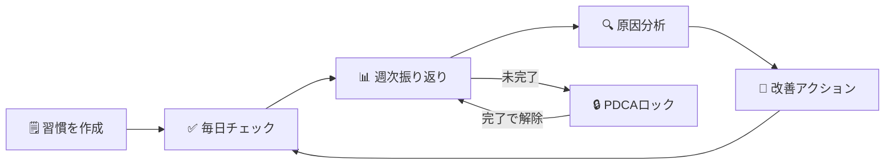

# HabitFlow（ハビットフロー）

> **甘えを可視化する** — 習慣 × PDCA × AI で自己成長を加速する

<br>

## 📸 画面イメージ

<br>

<p align="center">
  
  
  
</p>

<p align="center">
  <em>ダッシュボード &nbsp;&nbsp;&nbsp; 週次振り返り &nbsp;&nbsp;&nbsp; 習慣管理</em>
</p>

<br>

---

<br>

## 🧭 利用フロー

<br>



<br>

---

<br>

[](https://www.ruby-lang.org/)
[](https://rubyonrails.org/)
[](https://www.postgresql.org/)
[](https://www.docker.com/)
[](https://github.com/KK-arina/HabitFlow/tree/feature/A-1-db-migrations)
[](https://github.com/KK-arina/HabitFlow/tree/feature/A-3-good-job)
[](https://github.com/KK-arina/HabitFlow/tree/feature/A-2-production-deploy)
[](https://github.com/KK-arina/runteq_graduation_project/tree/feature/A-4-resend-mailer)
[]()

<br>

---

<br>

## 🌐 本番環境

<br>

**URL**: https://habitflow-web.onrender.com

<br>

| 項目 | 内容 |
|:---|:---|
| ホスティング | Render（無料プラン） |
| データベース | Neon Serverless PostgreSQL 16（永続・無料） |
| デプロイ | GitHub の `main` ブランチへの Push で自動実行 |
| Web サーバー | Puma（Worker: 2 / Thread: 3 / Cluster mode） |

<br>

> ⚠️ **Render 無料プランのスリープについて**<br>
> 15分間アクセスがないとサービスがスリープします。<br>
> 初回アクセス時は起動まで **約30〜60秒** かかる場合があります。

<br>

> 📌 **Neon を採用した理由**<br>
> Render 内蔵の無料 PostgreSQL は作成から **90日で自動削除** される制限がある。<br>
> Neon Serverless Postgres は永続的な無料プランを提供しており、長期運用に最適。<br>
> また Render と同じ Singapore リージョンに配置することで Web ↔ DB 間のレイテンシを最小化している。

<br>

---

<br>

### 🚧 本リリース開発進捗

<br>

| Week | テーマ | ISSUE | SP | 状態 |
|:---|:---|:---:|:---:|:---:|
| Week A | DB・インフラ基盤 | #A-1〜#A-7 | 24 | 🟡 進行中 |
| Week B | 習慣機能拡張 | #B-1〜#B-7 | 28 | ⬜ 未着手 |
| Week C | タスク管理機能 | #C-1〜#C-7 | 28 | ⬜ 未着手 |
| Week D | AI分析・PMVV機能 | #D-1〜#D-11 | 42 | ⬜ 未着手 |
| Week E | 週次振り返り拡張 | #E-1〜#E-5 | 22 | ⬜ 未着手 |
| Week F | 認証拡張 | #F-1〜#F-6 | 19 | ⬜ 未着手 |
| Week G | 通知・設定拡張 | #G-1〜#G-8 | 30 | ⬜ 未着手 |
| Week H | フロントエンド強化 | #H-1〜#H-9 | 30 | ⬜ 未着手 |
| Week I | 品質・テスト・デプロイ | #I-1〜#I-6 | 22 | ⬜ 未着手 |
| **合計** | | **67** | **222** | |

<br>

#### ✅ 完了済みISSUE

<br>

| ISSUE | タイトル | 完了日 | ブランチ |
|:---|:---|:---:|:---|
| #A-1 | 本リリース用DBマイグレーション（全差分） | 2026-03-20 | feature/A-1-db-migrations |
| #A-2 | 本番環境デプロイ（Render + Neon PostgreSQL） | 2026-03-20 | feature/A-2-production-deploy |
| #A-3 | GoodJob 導入・非同期処理基盤構築 | 2026-03-20 | feature/A-3-good-job |
| #A-4 | Resend メール送信設定 | 2026-03-22 | feature/A-4-resend-mailer |
| #A-5 | habit_templates シードデータ・モデル作成 | 2026-03-22 | feature/A-5-habit-templates-seed |

<br>

---

<br>

## 📋 サービス概要

<br>

HabitFlow は「なぜ習慣が続かないのか」の**真の原因**を究明し、改善サイクルを自動化する自己成長サポートアプリです。

<br>

### 解決する課題

<br>

多くの習慣管理アプリは「記録するだけ」で終わります。<br>
「仕事が忙しかった」「疲れていた」という表面的な言い訳で習慣が途切れ、同じ失敗を繰り返す。<br>
**この「甘え」は明文化・可視化されていないから許されてしまいます。**

<br>

### HabitFlow の解決アプローチ

<br>

1. **週次振り返り** — できなかった理由を明文化して記録
2. **PDCA強制ロック** — 振り返りを完了しないと新しい習慣を追加できない仕組み
3. **AI分析連携（拡張機能）** — 外部 AI に現状を共有し、「なぜ？」を3回繰り返して真の原因を究明

<br>

---

<br>

## 📸 スクリーンショット

<br>

### ① ダッシュボード

今週の達成率と今日の習慣チェックリストを一覧表示します。

<br>


<br>

---

<br>

### ② 週次振り返り

今週の習慣達成結果を確認し、振り返りコメントを記録する画面です。過去の振り返り履歴も一覧で確認できます。

<br>


<br>

---

<br>

### ③ 習慣管理

登録済みの習慣と今週の進捗率をカード形式で表示します。

<br>


<br>

---

<br>

## ✅ 実装済み機能一覧

<br>

### 認証機能

<br>

| 機能 | 説明 |
|:---|:---|
| ユーザー登録 | メールアドレス・パスワードで新規登録 |
| ログイン / ログアウト | bcrypt による安全な認証 |
| セッション管理 | `reset_session` によるセッション固定攻撃対策 |

<br>

### 習慣管理機能

<br>

| 機能 | 説明 |
|:---|:---|
| 習慣の登録 | 習慣名（最大50文字）と週次目標回数（1〜7回）を設定 |
| 習慣の削除 | 論理削除（`deleted_at`）で過去データを保持したまま削除 |
| 日次記録 | チェックボックスをクリックするだけで即時保存（ページリロード不要） |
| 週次進捗統計 | 今週の達成率・達成日数を自動計算して表示 |

<br>

### ダッシュボード

<br>

| 機能 | 説明 |
|:---|:---|
| 今週の達成率 | 全習慣の平均達成率をプログレスバーで表示 |
| 今日の習慣チェックリスト | 今日記録すべき習慣の一覧をチェックボックス付きで表示 |
| PDCA ロック警告バナー | 振り返り未完了時に警告バナーを表示（振り返りページへの導線付き） |

<br>

### 週次振り返り機能

<br>

| 機能 | 説明 |
|:---|:---|
| 振り返り一覧 | 過去の完了済み振り返りと今週の達成率サマリーを表示 |
| 振り返り入力 | 今週の習慣実績を確認しながらコメント（最大1000文字）を記録 |
| 振り返り詳細 | 保存済みの振り返り内容と習慣別達成率を閲覧 |
| スナップショット保存 | 振り返り時点の習慣名・目標値を永続保存（後から習慣を変更しても過去記録は正確に表示） |

<br>

### PDCA 強制ロック機能

<br>

| 機能 | 説明 |
|:---|:---|
| ロック発動 | 月曜 AM4:00 以降、前週の振り返りが未完了の場合に自動ロック |
| ロック中の制限 | 習慣の新規追加・削除をブロック（日次記録のチェックは継続可能） |
| ロック自動解除 | 振り返りを完了すると即時解除され、緑色のバナーで通知 |

<br>

### UI / UX

<br>

| 機能 | 説明 |
|:---|:---|
| レスポンシブデザイン | スマホ・タブレット・PC すべてに対応 |
| ハンバーガーメニュー | モバイルでのナビゲーション |
| トースト通知 | 操作結果をフェードアウトアニメーション付きで表示 |
| カスタムエラーページ | 404 / 422 / 500 エラーページをカスタムデザインで表示 |
| アクセシビリティ | WCAG 2.1 AA 基準準拠（スキップリンク・ARIA 属性・キーボード操作対応） |

<br>

---

<br>

## 🚀 本リリース実装済み機能

<br>

### #A-1: 本リリース用 DB マイグレーション

<br>

**ブランチ:** `feature/A-1-db-migrations`<br>
**完了日:** 2026-03-20<br>
**対象:** MVP版スキーマからの全差分をマイグレーションファイルとして実装

<br>

#### 既存テーブルへのカラム追加

<br>

| テーブル | 追加カラム | 目的 |
|:---|:---|:---|
| `users` | `provider` / `uid` | OmniAuth（Google/LINE）ログイン対応 |
| `users` | `line_user_id` | LINE Messaging API 通知送信用 |
| `users` | `first_login_at` | オンボーディング完了判定（NULL=未完了） |
| `habits` | `measurement_type` | チェック型(0) / 数値型(1) の区別 |
| `habits` | `unit` | 数値型習慣の単位（分・冊・km など） |
| `habits` | `current_streak` / `longest_streak` | ストリーク（継続日数）管理 |
| `habits` | `allow_rest_mode` | お休みモード中のストリーク維持フラグ |
| `habits` | `archived_at` | 卒業習慣のアーカイブ（`deleted_at` とは別管理） |
| `habits` | `color` / `icon` / `position` | UI カスタマイズ・並び替え |
| `habit_records` | `numeric_value` | 数値型習慣の実績値（decimal型・精度保証） |
| `habit_records` | `memo` | 日次メモ（AI 分析精度向上に活用） |
| `habit_records` | `is_manual_input` | 自動記録 vs 手動修正の区別 |
| `habit_records` | `deleted_at` | 論理削除（統計整合性の保持） |
| `weekly_reflections` | `year` / `week_number` | ISO週番号による重複防止 |
| `weekly_reflections` | `mood` | 気分スコア（1〜5） |
| `weekly_reflections` | `direct_reason` / `background_situation` | 構造化された振り返り入力 |

<br>

#### 新規作成テーブル

<br>

| テーブル | 役割 | 主な設計ポイント |
|:---|:---|:---|
| `habit_excluded_days` | 習慣ごとの除外曜日 | UNIQUE制約(habit_id, day_of_week) |
| `tasks` | タスク管理（Must/Should/Could） | 4種インデックス・ai_generated フラグ |
| `ai_analyses` | AI分析結果の保存 | is_latest フラグ・input_snapshot(jsonb)・UNIQUE制約2種 |
| `user_settings` | ユーザー設定の一元管理 | 通知/お休みモード/AIコスト制御 |
| `user_purposes` | PMVV目標のバージョン管理 | is_active フラグ・analysis_state enum |
| `habit_templates` | オンボーディング用マスタ | カテゴリ別テンプレート |
| `notification_logs` | 通知送信履歴 | deep_link_url・ポリモーフィック関連 |
| `push_subscriptions` | Web Push購読情報（将来用） | 機能実装は後続リリース |
| `password_reset_tokens` | パスワードリセット | token_digest（ハッシュ化保存）・多重発行防止 |

<br>

### #A-2: 本番環境デプロイ（Render + Neon PostgreSQL）

<br>

**ブランチ:** `feature/A-2-production-deploy`<br>
**完了日:** 2026-03-20<br>
**本番URL:** https://habitflow-web.onrender.com

<br>

#### 採用構成

<br>

| 役割 | サービス | 理由 |
|:---|:---|:---|
| Web サービス | Render（無料プラン） | GitHub 連携で自動デプロイ・クレカ不要 |
| データベース | Neon Serverless PostgreSQL 16 | 永続無料・Render 内蔵 DB の90日削除問題を回避 |
| リージョン | Singapore（両サービス統一） | Web ↔ DB 間のレイテンシを最小化 |

<br>

#### 主な設定内容

<br>

| ファイル | 変更内容 |
|:---|:---|
| `render.yaml` | Neon 対応に全面書き換え・puma 直接起動・GoodJob Worker 準備（コメントアウト） |
| `config/puma.rb` | Worker 設定・`on_worker_boot`・`Integer()` 型安全変換を追加 |
| `bin/docker-entrypoint` | `db:prepare` → `db:migrate` に変更（Neon は CREATE DATABASE 権限なし） |

<br>

#### 環境変数設定（Render）

<br>

| Key | 管理方法 | 用途 |
|:---|:---|:---|
| `RAILS_ENV` | render.yaml に記載 | 本番環境モード指定 |
| `DATABASE_URL` | Render ダッシュボードで手動設定 | Neon 接続文字列 |
| `RAILS_MASTER_KEY` | Render ダッシュボードで手動設定 | credentials 復号キー |
| `RAILS_LOG_TO_STDOUT` | render.yaml に記載 | Render Logs タブへの出力 |
| `RAILS_SERVE_STATIC_FILES` | render.yaml に記載 | CSS/JS の直接配信 |
| `WEB_CONCURRENCY` | render.yaml に記載 | Puma Worker 数（2） |

<br>

### #A-3: GoodJob 導入・非同期処理基盤構築

<br>

**ブランチ:** `feature/A-3-good-job`<br>
**完了日:** 2026-03-20<br>
**概要:** Redis 不要の非同期ジョブ処理エンジン GoodJob を導入し、<br>
AI 分析・通知・ストリーク計算等のバックグラウンド処理基盤を構築。<br>

<br>

#### 技術選定の理由

<br>

| 技術 | 採用理由 |
|:---|:---|
| GoodJob | PostgreSQL のみで動作。Redis 不要のため Render 無料プランと相性が良い |
| Sidekiq (不採用) | 高性能だが Redis が必要。Render 無料プランではコスト増になる |

<br>

#### GoodJob の設定

<br>

| 設定項目 | 値 | 理由 |
|:---|:---|:---|
| `execution_mode` (development) | `:async` | Web プロセス内でスレッド実行。Docker 1台で完結 |
| `execution_mode` (production) | `:external` | Render の Worker サービスが別プロセスで実行 |
| `max_threads` | `3` | Web(6) + Worker(3) = 9 コネクション。Neon 無料プラン上限以内 |
| `poll_interval` | `30秒` | DB への SELECT 頻度と遅延のバランス点 |
| `cleanup_preserved_jobs_before_seconds_ago` | `86400秒（24時間）` | Neon 無料プランの容量制限に対応 |

<br>

#### cron ジョブ一覧（JST 基準）

<br>

| ジョブクラス | cron (UTC) | JST 実行時刻 | 役割 |
|:---|:---:|:---:|:---|
| `StreakCalculationJob` | `5 19 * * *` | 毎日 AM4:05 | ストリーク計算（#B-3 で本実装） |
| `DailyNotificationCountResetJob` | `5 15 * * *` | 毎日 00:05 | 通知カウントリセット |
| `MonthlyAiCountResetJob` | `0 15 * * *` | 毎日 00:00 | 月初のみ AI 使用回数リセット |
| `GoodJob::CleanupJobsJob` | `0 18 * * *` | 毎日 03:00 | 完了済みジョブ削除 |

<br>

月次リセットは cron 式を毎日実行にして、ジョブ内で `Time.current.day == 1` をチェックする方式を採用。<br>
UTC 変換による cron 式の複雑化を避けるための設計。

<br>

#### 作成・変更ファイル一覧

<br>

| ファイル | 変更内容 |
|:---|:---|
| `Gemfile` | `gem "good_job"` 追加（4.x 系・バージョン固定なし） |
| `Gemfile` | `gem "minitest", "~> 5.1"` 追加（GoodJob が 6.x を引き込む問題を防止） |
| `config/application.rb` | `config.active_job.queue_adapter = :good_job` 追加 |
| `config/initializers/good_job.rb` | 新規作成（`Rails.application.configure` 形式・cron 4件） |
| `config/environments/development.rb` | `execution_mode = :async` 追加 |
| `config/environments/production.rb` | `execution_mode = :external` 追加 |
| `config/environments/test.rb` | `queue_adapter = :test` 追加 |
| `config/routes.rb` | GoodJob ダッシュボードを catch-all より前にマウント |
| `render.yaml` | Worker サービスを有効化（`--max-threads=3` を明示） |
| `app/jobs/application_job.rb` | `retry_on` / `discard_on` を追加 |
| `app/jobs/streak_calculation_job.rb` | 新規作成（#B-3 で本実装予定） |
| `app/jobs/daily_notification_count_reset_job.rb` | 新規作成 |
| `app/jobs/monthly_ai_count_reset_job.rb` | 新規作成 |
| `app/jobs/hello_good_job.rb` | 動作確認用（確認後削除可） |
| `db/migrate/YYYYMMDDHHMMSS_create_good_jobs.rb` | GoodJob 4.x 用テーブル5種を作成 |

<br>

#### 作成された DB テーブル

<br>

| テーブル名 | 役割 |
|:---|:---|
| `good_jobs` | ジョブキュー本体 |
| `good_job_batches` | バッチ処理管理 |
| `good_job_executions` | 実行履歴 |
| `good_job_processes` | Worker プロセス管理 |
| `good_job_settings` | GoodJob 内部設定 |

<br>

#### GoodJob ダッシュボード

<br>

| 環境 | URL | 認証 |
|:---|:---|:---|
| development | `http://localhost:3000/good_job` | なし |
| production | `https://habitflow-web.onrender.com/good_job` | Basic 認証（環境変数設定時のみ公開） |

<br>

本番環境での公開には Render ダッシュボードで以下の環境変数を設定する。<br>
```
GOOD_JOB_LOGIN=（任意のユーザー名）
GOOD_JOB_PASSWORD=（強力なパスワード）
```

<br>

#### Render Worker サービス設定

<br>
```yaml
- type: worker
  name: habitflow-worker
  runtime: docker
  region: singapore
  plan: free
  startCommand: bundle exec good_job start --max-threads=3
```

<br>

`--max-threads=3` を明示する理由:<br>
GoodJob のデフォルトスレッド数は 5。明示しないと Neon 無料プランの DB コネクション上限を超えるリスクがある。

<br>

### #A-4: Resend メール送信設定

<br>

**ブランチ:** `feature/A-4-resend-mailer`<br>
**完了日:** 2026-03-22<br>
**概要:** パスワードリセット・CSVエクスポート完了通知・週次レポートメールに使用する<br>
Resend をAction Mailerに接続。開発環境では letter_opener でブラウザプレビュー確認。

<br>

#### 技術選定の理由

<br>

| 技術 | 採用理由 |
|:---|:---|
| Resend | クレカ不要・月3,000通無料・Rails用gem公式提供。SendGrid（クレカ必要）・Mailgun（設定複雑）より優位 |
| letter_opener | 開発環境での無駄な送信を防止。ブラウザでメール内容をプレビュー確認できる |

<br>

#### Action Mailer 設定内容

<br>

| 環境 | delivery_method | 説明 |
|:---|:---|:---|
| development | `:letter_opener` | 実際には送信せず `tmp/letter_opener/` にHTMLとして保存 |
| production | `:resend` | Resend APIを経由して実際にメール送信 |

<br>

#### 本番環境の設定

<br>

| 設定項目 | 値 | 理由 |
|:---|:---|:---|
| `delivery_method` | `:resend` | Resend API経由でメール送信 |
| `raise_delivery_errors` | `true` | 送信失敗時に例外を発生させてエラーを検知 |
| `default_url_options` | `host: "habitflow-web.onrender.com"` | パスワードリセットメール内リンクのURLを正しく生成 |
| `asset_host` | `"https://habitflow-web.onrender.com"` | メール内画像・CSSの絶対URLを生成 |

<br>

#### 作成・変更ファイル一覧

<br>

| ファイル | 変更内容 |
|:---|:---|
| `Gemfile` | `gem "resend"` / `gem "letter_opener"` 追加 |
| `config/initializers/resend.rb` | 新規作成（APIキーを環境変数から初期化） |
| `config/environments/production.rb` | Action Mailer本番設定追加（delivery_method・raise_delivery_errors・default_url_options・asset_host）<br>GoodJob execution_mode を `:external` → `:async` に変更（Render Worker非対応のため）<br>GoodJob max_threads を `2` に設定（Freeプランリソース制約対応） |
| `config/environments/development.rb` | letter_opener設定追加 |
| `app/mailers/application_mailer.rb` | fromアドレスを `HabitFlow <onboarding@resend.dev>` に設定 |
| `app/mailers/test_mailer.rb` | 新規作成（動作確認用・将来のMailer実装の参考） |
| `render.yaml` | `RESEND_API_KEY` 環境変数を追加（`sync: false`）<br>Workerセクションをコメントアウト（Render Freeプランは Worker 非対応） |

<br>

#### Render 環境変数設定

<br>

| Key | 管理方法 | 用途 |
|:---|:---|:---|
| `RESEND_API_KEY` | Render ダッシュボードで手動設定 | Resend API認証キー |

<br>

#### GoodJob execution_mode の変更理由

<br>

#A-3 では production の execution_mode を `:external`（別Workerプロセス）に設定していたが、<br>
Render の Background Worker は Free プランが存在しない（最低 $7/月 の Starter プラン）ため、<br>
`:async`（Webプロセス内でバックグラウンドスレッドを実行）に変更した。<br>

<br>

| モード | 動作 | 採用環境 |
|:---|:---|:---|
| `:async` | Webプロセス内のスレッドでジョブを実行 | 本番（Render Free）・開発 |
| `:external` | 別プロセス（Worker）でジョブを実行 | 有料プラン移行時 |

<br>

> ⚠️ `:async` モードはWebサーバーと同一プロセスのため、<br>
> 重い処理（CSV生成・AI分析）はWebレスポンスに影響する可能性があります。<br>
> 有料プランへの移行時は `:external` に戻し、render.yaml の Worker 設定を有効化してください。

<br>

### #A-5: habit_templates シードデータ・モデル作成

<br>

**ブランチ:** `feature/A-5-habit-templates-seed`<br>
**完了日:** 2026-03-22<br>
**概要:** オンボーディングで使用する習慣テンプレートのマスタデータを実装。<br>
カテゴリ別18件のプリセットデータを登録し、ユーザーがスムーズに習慣を選択できるようにする。

<br>

#### 登録テンプレート一覧（18件）

<br>

| カテゴリ | 件数 | 習慣名 |
|:---|:---|:---|
| 健康（health） | 5件 | 読書・瞑想・睡眠日記・水を飲む・早起き |
| フィットネス（fitness） | 5件 | 筋トレ・ジョギング・ストレッチ・ウォーキング・体重記録 |
| 学習（study） | 4件 | 英語学習・プログラミング学習・読書（学習）・オンライン講座 |
| マインド（mind） | 4件 | 日記・感謝リスト・呼吸法・デジタルデトックス |

<br>

#### 作成ファイル一覧

<br>

| ファイル | 変更内容 |
|:---|:---|
| `app/models/habit_template.rb` | 新規作成（enum / バリデーション / スコープ） |
| `db/seeds.rb` | habit_templates シードデータを Step 8 として末尾に追記 |

<br>

#### HabitTemplate モデルの設計

<br>

| 設定 | 内容 |
|:---|:---|
| `measurement_type` enum | `check_type`(0) / `numeric_type`(1) |
| `category` enum | `health`(0) / `fitness`(1) / `study`(2) / `mind`(3) / `other`(4) |
| バリデーション | name（必須・100文字以内）/ default_weekly_target（1〜7の整数） |
| スコープ | `active` / `ordered` / `active_ordered` |

<br>

#### 設計上の判断

<br>

- `find_or_initialize_by` + `assign_attributes` + `save!` を採用<br>
  → 既存レコードも更新されるため、description や sort_order の修正が本番 DB に反映される<br>
  → `find_or_create_by!` のブロック方式では既存データが更新されないため不採用<br>
- slug カラムの追加は見送り<br>
  → schema.rb に定義がなく #A-1 のスコープ外。`name + category` の複合キーで一意性を保証できる<br>
- `enum _prefix: true` は見送り<br>
  → 使用箇所が生まれる #H-5（オンボーディング拡張）のタイミングで改めて検討する（YAGNI原則）

<br>

---

<br>

## 🔧 技術的な工夫

<br>

### 1. AM4:00 基準の日付管理

<br>

深夜に習慣を行うユーザーを考慮し、1日の境界を **AM4:00** に設定しています。  
`Time.now` ではなく `Time.current` を使用し、タイムゾーン（JST）を確実に適用しています。

<br>

```ruby
def self.today_date
  now = Time.current
  now.hour < 4 ? now.to_date - 1.day : now.to_date
end
```

<br>

### 2. N+1 問題の解消

<br>

ダッシュボードでは複数の習慣と記録を同時に表示するため、`index_by` と `group(:habit_id).count` を使い、**それぞれ1クエリで**一括取得しています。ループ内での DB アクセスを完全に排除し、習慣が増えてもクエリ数が変わらない設計にしています。

<br>

```ruby
# 今日の記録を O(1) で参照できるハッシュに変換（1クエリ）
@today_records_hash = current_user.habit_records
  .where(recorded_on: today).index_by(&:habit_id)

# 今週の集計も1クエリで完結
@weekly_counts_hash = current_user.habit_records
  .where(recorded_on: week_start..(week_start + 6.days))
  .group(:habit_id).count
```

<br>

### 3. PDCA 強制ロックの設計

<br>

「振り返りをしたくなる仕組み」ではなく「**振り返りをしないと前に進めない仕組み**」を採用しました。  
行動心理学の「実行意図（Implementation Intention）」に基づき、振り返りを完了しないと習慣の追加・削除を物理的にブロックします。UI だけでなくサーバー側でも必ずチェックし、API ツールからの直接リクエストも防いでいます。

<br>

### 4. スナップショット設計による履歴の正確性

<br>

振り返り保存時点の習慣名・目標値を `weekly_reflection_habit_summaries` に記録しています。  
後から習慣を変更・削除しても**過去の振り返り詳細ページは常に正確な値を表示**できます。

<br>

### 5. 本リリース DB 設計の主要ポイント

<br>

**① `deleted_at` と `archived_at` の分離設計**

<br>

habits テーブルで削除（`deleted_at`）と卒業アーカイブ（`archived_at`）を別カラムで管理。<br>
「もう使わない習慣」と「達成して卒業した習慣」を区別し、アーカイブは復元可能にしている。

<br>

**② `ai_analyses` の再実行対応設計（`is_latest` フラグ）**

<br>

当初は `UNIQUE(weekly_reflection_id)` のみの制約だったが、AI の再実行・精度改善時に詰まる問題を発見。<br>
`is_latest` フラグを追加し、`UNIQUE(weekly_reflection_id) WHERE is_latest = true` という部分インデックスに変更。<br>
過去の分析履歴（`input_snapshot` / `prompt_version` / `model_name`）を削除せず保持できる設計になっている。

<br>

**③ `password_reset_tokens` のセキュリティ設計**

<br>

平文トークンを DB に保存する設計から `token_digest`（ハッシュ化済み）保存に変更。<br>
DB 漏洩時に攻撃者がリセット URL を再現できない構造にしている（Devise と同じアプローチ）。<br>
また `user_id` に UNIQUE 制約を追加し、1ユーザーにつきトークンが1件のみ存在する設計で多重発行を防止。

<br>

**④ `notification_logs.deep_link_url` によるディープリンク設計**

<br>

LINE 通知をタップした際にアプリ内の特定画面へ直接遷移できるよう、遷移先パスを通知ログに保存。<br>
未ログイン時は `/login?redirect_to={deep_link_url}` を経由してログイン後に自動遷移する。

<br>

**⑤ `disable_ddl_transaction!` による本番ダウンタイムゼロのインデックス追加**

<br>

`notification_logs` への追加インデックスは `algorithm: :concurrently` を使用。<br>
通常のインデックス作成はテーブル全体に書き込みロックをかけるが、<br>
`concurrently` を指定することで本番環境でもユーザーへの影響なくインデックスを追加できる。

<br>

### 6. `db:prepare` ではなく `db:migrate` を使う理由

<br>

Neon などのマネージド PostgreSQL では「DB 作成権限（`CREATE DATABASE`）」がユーザーに付与されていない。<br>
`db:prepare` は「DB が存在しなければ作成 → マイグレーション実行」という処理のため、<br>
CREATE DATABASE ステップで権限エラーが発生し `exit 1` → デプロイ失敗ループになる。<br>
`db:migrate` は既存 DB に対してマイグレーションのみ実行するため、マネージド DB で正しく動作する。<br>
何度実行しても適用済みはスキップされるため安全（冪等性あり）。

```ruby
# ❌ Neon ではエラーになる（CREATE DATABASE 権限なし）
DISABLE_DATABASE_ENVIRONMENT_CHECK=1 ./bin/rails db:prepare

# ✅ Neon で正しく動作する（既存 DB へのマイグレーションのみ）
./bin/rails db:migrate
```

<br>

### 7. `exec` による Graceful Shutdown の実現

<br>

`startCommand` や `docker-entrypoint` の最後で `exec` を使って Puma を起動している。<br>
`exec` を使わない場合、シェル（PID 1）→ Puma（PID 2）という親子関係になり、<br>
Render の停止シグナル（SIGTERM）がシェルに届いても Puma に転送されず強制終了（SIGKILL）される。<br>
`exec` を使うと Puma が PID 1 になり SIGTERM を直接受け取れるため、<br>
処理中のリクエストを完了してから終了する Graceful Shutdown が機能する。

```bash
# ❌ exec なし：シェルが PID 1 のまま → SIGTERM が Puma に届かない
bundle exec puma -C config/puma.rb

# ✅ exec あり：Puma が PID 1 になる → Graceful Shutdown が機能する
exec bundle exec puma -C config/puma.rb
```

<br>

### 8. GoodJob のバージョン問題と解決アプローチ（#A-3）

<br>

**① バージョン体系の罠**

<br>

GoodJob はバージョンによって設定 API と DB スキーマが大きく変わる。<br>

| バージョン | 状態 |
|:---|:---|
| 3.3.x | Rails 7.2 の新 API（`enqueue_after_transaction_commit?`）に未対応 |
| 3.30.1 | 3.x 系の最終安定版 |
| 3.99.x | 4.x への移行版。DB スキーマが変わる |
| 4.x | Rails 7.2 / 8.x 正式対応。最新設計 ← 採用 |

<br>

最終的に GoodJob 4.x（最新版・バージョン固定なし）を採用。<br>
`good_job:install` で 4.x 用の完全なスキーマを新規生成することで解決。

<br>

**② 設定 API の変遷**

<br>

GoodJob 4.x では `GoodJob.configure { |c| ... }` ブロックが廃止されている。<br>
`Rails.application.configure do ... end` ブロック内に `config.good_job.*` 形式で設定する。<br>
これが 4.x で動作する公式推奨の書き方。

<br>

**③ catch-all ルートと GoodJob ダッシュボードの順序問題**

<br>

Rails のルーティングは上から順に評価される。<br>
`match "*path", to: "errors#not_found", via: :all`（catch-all）が先にあると<br>
`/good_job` も 404 になってしまう。<br>
GoodJob のマウントを catch-all より前に記述することで解決。

<br>

**④ `docker compose restart` vs `docker compose up --build` の違い**

<br>

| コマンド | 挙動 |
|:---|:---|
| `docker compose restart` | コンテナ再起動のみ。コードの変更は反映されない |
| `docker compose up --build` | Docker イメージを再ビルド。`bundle install` が再実行される |

<br>

`execution_mode` 等の設定変更は `--build` なしでは反映されない。<br>
gem の追加・変更・設定ファイルの変更後は必ず `docker compose up --build` を実行すること。

<br>

### 9. 非同期処理（GoodJob）の構成について（#A-4 で変更）

<br>

本アプリでは GoodJob を使用して非同期処理を実装しています。<br>
本来は Background Worker（別プロセス）を使用する構成が推奨されますが、<br>
Render の Free プランでは Worker が利用できないため、以下の構成を採用しています。<br>

<br>

| 項目 | 内容 |
|:---|:---|
| `execution_mode` | `:async`（Webプロセス内でバックグラウンド処理を実行） |
| `max_threads` | `2`（Freeプランのリソース制約に合わせて制限） |
| ジョブの永続化 | PostgreSQL（Neon）に保存されるため再起動後も消えない |

<br>

#### 制約事項

<br>

- Webサーバーとジョブ処理が同一プロセスのため、重い処理（CSV生成・AI分析）は<br>
  Webのレスポンス速度に影響する可能性があります<br>
- 本番用途では Worker 分離構成を推奨します<br>

<br>

#### 将来的な拡張

<br>

有料プラン（Starter: $7/月）移行時に以下の変更で Worker を分離できます。<br>
```ruby
# config/environments/production.rb
config.good_job.execution_mode = :external  # :async から変更
```

<br>

render.yaml の Worker 設定のコメントアウトを解除することで<br>
自動的に habitflow-worker が作成されます。<br>

### 10. 開発環境でのメール確認（letter_opener）

<br>

開発中に実際のメール送信を行うと以下の問題が発生する。<br>
- Resend の無料枠（月3,000通）を無駄に消費する<br>
- 実在するアドレスに誤ってメールが届く危険がある<br>

<br>

letter_opener gem を使うことで `deliver_now` を呼んでも実際には送信せず、<br>
`tmp/letter_opener/` にHTMLファイルとして保存される。<br>
Docker環境ではブラウザが自動で開かないため、以下のコマンドで内容を確認する。<br>

```bash
# 生成されたメールファイルを確認する
docker compose exec web ls tmp/letter_opener/

# 内容を確認する（ファイル名は ls で確認したものに置き換える）
docker compose exec web cat tmp/letter_opener/【フォルダ名】/plain.html
```

<br>

### 11. seeds.rb の冪等性設計（find_or_initialize_by パターン）

<br>

`find_or_create_by!` のブロック方式は「新規作成時のみ」属性をセットするため、<br>
既存レコードが永遠に更新されないという問題がある。<br>
例えば description を後から修正しても、本番 DB には反映されない。<br>

<br>

`find_or_initialize_by` + `assign_attributes` + `save!` を組み合わせることで<br>
新規作成・既存更新の両方を1つのパターンで安全に処理できる。<br>

```ruby
# ❌ find_or_create_by! ブロック方式：既存データが更新されない
HabitTemplate.find_or_create_by!(name: data[:name], category: data[:category]) do |t|
  t.description = data[:description]  # 既存レコードがあればここは実行されない
end

# ✅ find_or_initialize_by + assign_attributes：新規・既存どちらも正しく処理される
template = HabitTemplate.find_or_initialize_by(name: data[:name], category: data[:category])
is_new = template.new_record?  # assign_attributes の前に確認（重要）
template.assign_attributes(description: data[:description], ...)
template.save!
```

<br>

`new_record?` は `assign_attributes` の**前**に確認すること。<br>
`assign_attributes` 後はインスタンスの状態が変化するため、正確な新規/既存判定ができなくなる場合がある。

<br>

---

<br>

## 🛠️ 技術スタック

<br>

### バックエンド

<br>

| 技術 | バージョン | 用途 |
|:---|:---|:---|
| Ruby | 3.4.7 | プログラミング言語 |
| Ruby on Rails | 7.2.3 | Web フレームワーク |
| PostgreSQL | 16 | データベース |
| bcrypt | 3.1.7 | パスワードハッシュ化 |
| Puma | 7.1.0（~> 7.0） | Web サーバー |

<br>

### 本リリース追加予定スタック

<br>

| 技術 | 用途 | ISSUE | 状態 |
|:---|:---|:---|:---:|
| Neon Serverless Postgres | 永続無料 DB（Render 内蔵 DB の90日削除回避） | #A-2 | ✅ 完了 |
| GoodJob 4.x | バックグラウンドジョブ（AI分析・通知・ストリーク計算） | #A-3 | ✅ 完了 |
| Resend | メール送信（パスワードリセット・週次レポート） | #A-4 | ✅ 完了 |
| letter_opener | 開発環境メールプレビュー | #A-4 | ✅ 完了 |
| habit_templates マスタデータ | オンボーディング用習慣テンプレート（18件） | #A-5 | ✅ 完了 |
| OmniAuth Google/LINE | ソーシャルログイン | #F-1 / #F-2 | ⬜ 未着手 |
| LINE Messaging API | プッシュ通知 | #G-1 | ⬜ 未着手 |
| Gemini API / Groq | AI分析（PMVV・週次振り返り） | #D-2 / #D-4 | ⬜ 未着手 |
| Solid Cache | Redis不要のキャッシュ（Render構成最適化） | #I-6 | ⬜ 未着手 |
| Sentry | エラー監視・本番ログ | #I-5 | ⬜ 未着手 |
| acts_as_list | 習慣の並び替え | #B-6 | ⬜ 未着手 |

<br>

### フロントエンド

<br>

| 技術 | 用途 |
|:---|:---|
| Hotwire（Turbo） | ページリロードなしの即時 UI 更新 |
| Hotwire（Stimulus） | 軽量な JavaScript コントローラー |
| Tailwind CSS | ユーティリティファーストの CSS フレームワーク |
| Importmap | Node.js 不要の JavaScript モジュール管理 |

<br>

### インフラ・開発環境

<br>

| 技術 | 用途 |
|:---|:---|
| Docker / Docker Compose | ローカル開発環境の統一 |
| Render（無料プラン） | 本番環境ホスティング（Web Service） |
| Neon Serverless PostgreSQL | 本番環境データベース（永続無料） |
| GitHub | バージョン管理・自動デプロイトリガー |

<br>

### 開発補助ツール

<br>

| ツール | 用途 |
|:---|:---|
| Bullet | N+1 問題の自動検出（development 環境のみ） |
| Brakeman | セキュリティ脆弱性の静的解析 |
| RuboCop | コーディング規約チェック |
| Capybara / Selenium | E2E テスト |

<br>

---

<br>

## 🗄️ データベース設計

<br>

### MVP 実装済みテーブル

<br>

| テーブル名 | 説明 |
|:---|:---|
| `users` | ユーザー情報・認証 |
| `habits` | 習慣（論理削除対応） |
| `habit_records` | 日次記録（AM4:00 基準・ユニーク制約） |
| `weekly_reflections` | 週次振り返り（ユニーク制約） |
| `weekly_reflection_habit_summaries` | 振り返り時点のスナップショット |

<br>

### 本リリース追加テーブル（#A-1 完了）

<br>

| テーブル名 | 説明 | 状態 |
|:---|:---|:---:|
| `habit_excluded_days` | 習慣ごとの除外曜日 | ✅ 追加済み |
| `tasks` | タスク管理（Must/Should/Could） | ✅ 追加済み |
| `ai_analyses` | AI分析結果 | ✅ 追加済み |
| `user_settings` | ユーザー設定 | ✅ 追加済み |
| `user_purposes` | PMVV目標管理 | ✅ 追加済み |
| `habit_templates` | オンボーディング用テンプレート | ✅ 追加済み |
| `notification_logs` | 通知送信履歴 | ✅ 追加済み |
| `push_subscriptions` | Web Push購読情報（将来用） | ✅ 追加済み |
| `password_reset_tokens` | パスワードリセット | ✅ 追加済み |

<br>

詳細は [`docs/er-diagram-mvp.md`](docs/er-diagram-mvp.md) および [`docs/database-schema-mvp.md`](docs/database-schema-mvp.md) を参照してください。

<br>

---

<br>

## 🚀 開発環境セットアップ

<br>

### 前提条件

<br>

以下がインストールされていることを確認してください。

<br>

| ツール | バージョン | 確認コマンド |
|:---|:---|:---|
| Docker Desktop | 24.0 以上 | `docker --version` |
| Docker Compose | 2.20 以上 | `docker compose version` |
| Git | 任意 | `git --version` |

<br>

### 手順

<br>

**① リポジトリのクローン**

<br>

```bash
git clone https://github.com/KK-arina/HabitFlow.git
cd HabitFlow
```

<br>

**② Docker コンテナの起動**

<br>

```bash
docker compose up
```

<br>

初回起動時は以下が自動実行されます（数分かかります）。

- Ruby イメージのダウンロード
- PostgreSQL イメージのダウンロード
- `bundle install`（Gem のインストール）
- Tailwind CSS のビルド

<br>

**③ データベースの作成とマイグレーション**

<br>

```bash
# 別のターミナルで実行（コンテナ起動中に行う）

# データベースを作成する
# db:create → config/database.yml の設定を元に development / test 用DBを作成する
docker compose exec web bin/rails db:create

# マイグレーションを実行する
# db:migrate → db/migrate/ 内の未実行ファイルを順番に適用してテーブルを作成する
docker compose exec web bin/rails db:migrate
```

<br>

**④ サンプルデータの投入（任意）**

<br>

```bash
# db:seed → db/seeds.rb を実行してデモ用のサンプルデータを投入する
# 実行後は test@example.com / password でログインできます
docker compose exec web bin/rails db:seed
```

<br>

**⑤ 動作確認**

<br>

ブラウザで http://localhost:3000 にアクセスしてランディングページが表示されれば成功です。

<br>

**⑥ コンテナの停止**

<br>

```bash
# Ctrl+C で停止（フォアグラウンド起動の場合）
# または別ターミナルで以下を実行
docker compose down
```

<br>

---

<br>

## 💻 開発コマンド一覧

<br>

### 基本操作

<br>

```bash
# コンテナ起動
docker compose up

# コンテナ停止
docker compose down

# コンテナ起動（バックグラウンド実行）
docker compose up -d
```

<br>

### Rails コマンド

<br>

```bash
# ⚠️ Rails コマンドは必ず「docker compose exec web」を先頭に付けて実行する
# 理由: コンテナ内の Ruby/Rails 環境を使用するため
#       「docker compose run」は一時コンテナを作成するため非推奨

# Rails コンソール（データの確認・操作に使用）
docker compose exec web bin/rails console

# マイグレーション実行
docker compose exec web bin/rails db:migrate

# マイグレーションのロールバック（直前のマイグレーションを取り消す）
docker compose exec web bin/rails db:rollback

# テスト実行（全テスト）
docker compose exec web bin/rails test

# テスト実行（特定ファイルのみ）
docker compose exec web bin/rails test test/models/user_test.rb
```

<br>

### Tailwind CSS

<br>

```bash
# 手動ビルド（CSSファイルを生成する）
docker compose exec web bin/rails tailwindcss:build

# 監視モード（ファイル変更を検知して自動ビルドする）
docker compose exec web bin/rails tailwindcss:watch
```

<br>

### データベース操作

<br>

```bash
# データベースを削除して再作成（テーブル定義をリセットしたい場合）
docker compose exec web bin/rails db:reset

# テスト用データベースを最新の状態に更新
docker compose exec web bin/rails db:test:prepare

# 現在のスキーマ状態を確認
docker compose exec web bin/rails db:schema:dump
```

<br>

### ログ確認

<br>

```bash
# Rails サーバーのログをリアルタイムで確認する
docker compose logs -f web

# データベースのログを確認する
docker compose logs -f db
```

<br>

---

<br>

## 📱 使い方ガイド（簡易版）

<br>

詳細は [`docs/user_guide.md`](docs/user_guide.md) を参照してください。

<br>

### 基本的な使い方の流れ

<br>

```
【毎日】5〜15分
  ↓
ダッシュボードを開く
  ↓
今日の習慣にチェックを入れる（自動保存）
  ↓
進捗率が自動更新される

【日曜夜】30〜60分
  ↓
週次振り返りページを開く
  ↓
今週の達成結果を確認する
  ↓
振り返りコメントを入力して完了する
  ↓
PDCAロックが解除される → 来週も習慣を追加・管理できる
```

<br>

### デモアカウント

<br>

| 項目 | 内容 |
|:---|:---|
| メールアドレス | `test@example.com` |
| パスワード | `password` |

<br>

> ⚠️ デモアカウントは公開環境です。個人情報は入力しないでください。

<br>

---

<br>

## ⚠️ 既知の制限事項

<br>

### MVP 未実装機能

<br>

以下の機能は設計済みですが、MVP 段階では実装していません。

<br>

| 機能 | 状態 | 予定 |
|:---|:---|:---|
| タスク管理 | 未実装 | 本リリースで追加予定 |
| AI 分析連携（自動パース） | 未実装 | 本リリースで追加予定 |
| パスワードリセット | 未実装 | 本リリースで追加予定 |
| オンボーディング（初回ガイド） | 未実装 | 本リリースで追加予定 |
| グラフ・チャート表示 | 未実装 | 本リリースで追加予定 |
| 数値型習慣（冊数・時間） | 未実装 | 本リリースで追加予定 |
| 除外日設定（習慣ごとに実施しない曜日を設定） | 未実装 | 本リリースで追加予定 |

<br>

### インフラ・環境制限

<br>

| 制限 | 内容 | 対策 |
|:---|:---|:---|
| Render 無料プランのスリープ | 15分間アクセスがないと起動に30〜60秒かかる | スリープ仕様として許容（ポートフォリオ用途） |
| Neon 無料プランの制限 | コンピュートリソースに上限あり（通常の用途では十分） | ユーザー増加時は有料プランへ移行 |
| 自動バックアップなし | Neon 無料プランには自動バックアップがない | 本番移行時は有料プランへ移行する |
| GoodJob Worker 非対応 | Render Free プランは Background Worker が利用不可（最低$7/月） | :async モードでWebプロセス内でジョブを実行（#A-4で対応済み） |
| メール送信 | Resend によるメール送信基盤を構築済み（#A-4完了） | パスワードリセット等は #F-4 で実装予定 |

<br>

### 仕様上の注意点

<br>

| 項目 | 仕様 |
|:---|:---|
| 日付の切り替え基準 | 深夜 **AM4:00** を1日の境界とする（例: AM3:59 は前日として記録） |
| PDCA ロックの発動タイミング | **月曜 AM4:00** 以降に前週の振り返りが未完了の場合にロックされる |
| 振り返り入力可能期間 | 週次振り返りページは常に開けるが、ロック解除には完了が必要 |
| 習慣の削除 | 論理削除（実データは残る）のため完全な削除はできない |

<br>

---

<br>

## 🔒 セキュリティ対策

<br>

| 対策 | 実装内容 |
|:---|:---|
| CSRF 対策 | Rails 標準の `authenticity_token` + ログイン時 `reset_session` |
| XSS 対策 | ERB の自動 HTML エスケープ・Content Security Policy（CSP）設定 |
| SQL インジェクション対策 | Active Record のプレースホルダー使用（生 SQL なし） |
| Strong Parameters | `params.permit()` で許可するパラメータを明示 |
| セッション管理 | `httponly: true` / `secure: true`（本番）/ `same_site: :lax` |
| 認可制御 | `current_user.habits.find` で他ユーザーのデータへのアクセスを遮断 |
| エラーメッセージ設計 | I18n（`ja.yml`）でメッセージを管理。重複メール時は存在を推測されにくい文言に変更 |
| メールバリデーション | 最大255文字制限・DB レベルの UNIQUE 制約で二重防御 |

<br>

---

<br>

## 📁 プロジェクト構成

<br>

```
habitflow/
├── app/
│   ├── controllers/
│   │   ├── application_controller.rb      # 認証・ロック判定・エラーハンドリングの共通処理
│   │   ├── dashboards_controller.rb       # ダッシュボード
│   │   ├── habits_controller.rb           # 習慣の CRUD
│   │   ├── habit_records_controller.rb    # 習慣の日次記録（Turbo Stream 対応）
│   │   ├── weekly_reflections_controller.rb # 週次振り返り
│   │   ├── sessions_controller.rb         # ログイン・ログアウト
│   │   ├── users_controller.rb            # ユーザー登録
│   │   ├── errors_controller.rb           # カスタムエラーページ
│   │   └── pages_controller.rb            # ランディングページ
│   ├── models/
│   │   ├── user.rb                        # ユーザー認証・has_many 設定
│   │   ├── habit.rb                       # 習慣・論理削除・週次進捗計算
│   │   ├── habit_record.rb                # 日次記録・AM4:00 基準・UNIQUE 制約
│   │   ├── weekly_reflection.rb           # 週次振り返り・complete! メソッド
│   │   ├── weekly_reflection_habit_summary.rb # スナップショット・達成率計算
│   │   └── habit_template.rb                  # #A-5: オンボーディング用習慣テンプレートマスタ
│   ├── javascript/controllers/
│   │   ├── habit_record_controller.js     # チェックボックス即時保存（楽観的 UI）
│   │   ├── mobile_menu_controller.js      # ハンバーガーメニュー開閉
│   │   └── form_submit_controller.js      # フォーム送信ローディング・二重送信防止
│   ├── jobs/
│   │   ├── application_job.rb                          # 変更: retry_on / discard_on 追加（#A-3）
│   │   ├── streak_calculation_job.rb                   # #A-3: ストリーク計算（#B-3で本実装）
│   │   ├── daily_notification_count_reset_job.rb       # #A-3: 日次通知カウントリセット
│   │   ├── monthly_ai_count_reset_job.rb               # #A-3: 月次AI使用回数リセット
│   │   └── hello_good_job.rb                           # #A-3: 動作確認用（確認後削除可）
│   ├── mailers/
│   │   ├── application_mailer.rb                       # #A-4: 全メール共通設定（fromアドレス）
│   │   └── test_mailer.rb                              # #A-4: 動作確認用メイラー（将来のMailer実装の参考）
│   └── views/
│       ├── dashboards/                    # ダッシュボード画面
│       ├── habits/                        # 習慣一覧・新規作成画面
│       ├── habit_records/                 # 習慣記録パーシャル（Turbo Stream 用）
│       ├── weekly_reflections/            # 振り返り一覧・入力・詳細画面
│       ├── shared/                        # ヘッダー・フッター・エラー表示パーシャル
│       ├── errors/                        # 404・422・500 エラーページ
│       └── layouts/application.html.erb  # 全ページ共通レイアウト
├── db/
│   ├── migrate/
│   │   ├── （MVP既存マイグレーション群）
│   │   ├── YYYYMMDDHHMMSS_add_columns_to_users.rb          # #A-1
│   │   ├── YYYYMMDDHHMMSS_add_columns_to_habits.rb         # #A-1
│   │   ├── YYYYMMDDHHMMSS_add_columns_to_habit_records.rb  # #A-1
│   │   ├── YYYYMMDDHHMMSS_create_habit_excluded_days.rb    # #A-1
│   │   ├── YYYYMMDDHHMMSS_add_columns_to_weekly_reflections.rb  # #A-1
│   │   ├── YYYYMMDDHHMMSS_create_tasks.rb                  # #A-1
│   │   ├── YYYYMMDDHHMMSS_create_ai_analyses.rb            # #A-1
│   │   ├── YYYYMMDDHHMMSS_create_user_settings.rb          # #A-1
│   │   ├── YYYYMMDDHHMMSS_create_user_purposes.rb          # #A-1
│   │   ├── YYYYMMDDHHMMSS_create_habit_templates.rb        # #A-1
│   │   ├── YYYYMMDDHHMMSS_create_notification_logs.rb      # #A-1
│   │   ├── YYYYMMDDHHMMSS_create_push_subscriptions.rb     # #A-1
│   │   ├── YYYYMMDDHHMMSS_create_password_reset_tokens.rb  # #A-1
│   │   ├── YYYYMMDDHHMMSS_add_foreign_key_to_ai_analyses_for_user_purpose.rb  # #A-1
│   │   ├── YYYYMMDDHHMMSS_add_is_latest_to_ai_analyses.rb  # #A-1
│   │   ├── YYYYMMDDHHMMSS_add_indexes_to_notification_logs.rb  # #A-1
│   │   ├── YYYYMMDDHHMMSS_change_token_to_digest_in_password_reset_tokens.rb  # #A-1
│   │   ├── YYYYMMDDHHMMSS_remove_extraneous_finished_at_index.rb  # #A-3
│   │   └── YYYYMMDDHHMMSS_create_good_jobs.rb              # #A-3
│   ├── schema.rb                          # 現在のDBスキーマ（自動生成）
│   └── seeds.rb                           # デモ用サンプルデータ
├── config/
│   ├── application.rb                     # アプリ設定（タイムゾーン・セッション）
│   ├── routes.rb                          # ルーティング定義
│   ├── initializers/
│   │   ├── content_security_policy.rb     # CSP 設定（nonce 方式）
│   │   ├── good_job.rb                    # #A-3: GoodJob設定（cron 4件・max_threads等）
│   │   └── resend.rb                      # #A-4: Resend APIキー初期化
│   └── environments/
│       ├── development.rb                 # 変更: letter_opener設定追加（#A-4）
│       └── production.rb                  # 変更: Action Mailer設定・GoodJob :async化（#A-4）
├── Dockerfile                             # 本番用 Docker イメージ（マルチステージビルド）
├── Dockerfile.dev                         # 開発用 Docker イメージ
├── docker-compose.yml                     # Docker Compose 設定
├── render.yaml                            # 変更: RESEND_API_KEY追加・Worker設定コメントアウト（#A-4）
└── Gemfile                                # 変更: resend・letter_opener gem追加（#A-4）
```

<br>

---

<br>

## 🧪 テスト

<br>

### テスト実行

<br>

```bash
# 全テストを実行する
# 実行時間: 約30〜60秒
docker compose exec web bin/rails test
```

<br>

### 現在のテスト状況

<br>

```
233 runs, 668 assertions, 0 failures, 0 errors, 0 skips
```

<br>

### テストファイル構成

<br>

| ファイル | 種別 | 内容 |
|:---|:---|:---|
| `test/models/user_test.rb` | モデル | ユーザー認証・バリデーション |
| `test/models/habit_test.rb` | モデル | 習慣管理・論理削除 |
| `test/models/habit_record_test.rb` | モデル | 日次記録・AM4:00 境界値 |
| `test/models/weekly_reflection_test.rb` | モデル | 週次振り返り・complete! |
| `test/integration/user_auth_flow_test.rb` | E2E | 登録→ログイン→ログアウトのフロー |
| `test/integration/habit_full_flow_test.rb` | E2E | 習慣作成→記録→進捗確認のフロー |
| `test/integration/weekly_reflection_flow_test.rb` | E2E | 振り返り作成→詳細確認のフロー |
| `test/integration/pdca_lock_flow_test.rb` | E2E | ロック発動→解除→習慣作成のフロー |
| `test/integration/error_cases_test.rb` | E2E | 404・認可エラー・他ユーザーアクセス防止 |
| `test/integration/production_final_check_test.rb` | E2E | 本番環境最終動作確認（19ケース） |

<br>

---

<br>

## 🐛 トラブルシューティング

<br>

### ポート 3000 が使用中

<br>

```bash
# 使用中のプロセスを確認する
lsof -i :3000

# 確認後、そのプロセスを終了する（PID は上記コマンドで確認）
kill -9 <PID>
```

<br>

### データベース接続エラー

<br>

```bash
# コンテナとボリュームを完全に削除して再起動する
# ⚠️ -v オプションで DB データも削除されるため注意
docker compose down -v
docker compose up
```

<br>

### Tailwind CSS が反映されない

<br>

```bash
# ビルド成果物が存在するか確認する
docker compose exec web ls app/assets/builds/

# 存在しない場合は手動でビルドする
docker compose exec web bin/rails tailwindcss:build
```

<br>

### テスト実行時のエラー

<br>

```bash
# Sprockets キャッシュをクリアする（Permission denied エラーの場合）
sudo rm -rf tmp/cache/assets

# テスト用 DB を最新状態に更新する
docker compose exec web bin/rails db:test:prepare
```

<br>

### Render デプロイエラー

<br>

| エラー | 原因 | 対処 |
|:---|:---|:---|
| `Missing secret_key_base` | `RAILS_MASTER_KEY` が未設定 | Render の Environment Variables に `config/master.key` の内容を設定 |
| `PG::ConnectionBad` | `DATABASE_URL` が未設定 | `render.yaml` の `fromDatabase` 設定を確認 |
| CSS が全く適用されない | `RAILS_SERVE_STATIC_FILES` が未設定 | Environment Variables に `RAILS_SERVE_STATIC_FILES=true` を追加 |

<br>

---

<br>

## 📚 関連ドキュメント

<br>

| ドキュメント | 内容 |
|:---|:---|
| [`docs/user_guide.md`](docs/user_guide.md) | **使い方ガイド**: 初めて使う方向けの操作手順 |
| [`docs/architecture.md`](docs/architecture.md) | **設計・技術実装ノート**: サービス設計・ER図・技術選定の理由・実装詳細 |
| [`docs/development.md`](docs/development.md) | **開発進捗ログ**: Week別SP管理・Issue完了記録・テスト推移・教訓まとめ |
| [`docs/operations.md`](docs/operations.md) | **運用・デプロイ記録**: 本番環境設定・確認チェックリスト・トラブルシューティング |

<br>

---

<br>

## 🏆 開発を通じて得た主要な教訓

<br>

### タイムゾーン設定は必ず最初に行う

<br>

`config.time_zone = "Tokyo"` を設定しないと Rails は UTC で動作し、<br>
本番環境でロック時刻が9時間ズレる致命的なバグが発生します（Issue #37 で発見）。

<br>

### `Time.current` / `Date.current` を使う

<br>

`Time.now` / `Date.today` はサーバーのローカル時刻を返しタイムゾーン設定が無視されます。<br>
Rails アプリでは必ず `Time.current` / `Date.current` を使用してください。

<br>

### `form_with` の HTTP メソッド自動判定に注意

<br>

`form_with model:` は `persisted? = true` のレコードを渡すと自動で `PATCH` を送信します。<br>
routes に `update` がない設計の場合は `url:` と `method: :post` を明示してください。

<br>

### テストでは値で直接レコードを特定する

<br>

`order(created_at: :desc).first` は fixtures の `created_at` 順序に依存するため不安定です。<br>
`find_by(name: "...")` など値で特定し、`assert_not_nil` でセットで確認してください。

<br>

### 既存マイグレーションは絶対に変更しない

<br>

一度コミット・適用したマイグレーションファイルは修正せず、必ず新しいマイグレーションで対応する。<br>
既存ファイルを変更すると、チームメンバーや本番環境で `rails db:migrate` を実行したとき<br>
「実際のDBと schema.rb の差分」が発生し、原因不明のバグにつながる。<br>
レビューで修正点が見つかった場合も「追加マイグレーション」で対応する（#A-1 で実践）。

<br>

### Docker 環境では `bundle exec` を必ずつける

<br>

`docker compose exec web rails ...` は `rails` コマンドが PATH に存在しない場合にエラーになる。<br>
`docker compose exec web bundle exec rails ...` または `docker compose exec web bin/rails ...` を使う。<br>
`bin/rails` は `bundle exec rails` と同等の Binstub（実行ショートカット）であり、どちらでもよい。

<br>

### UNIQUE 制約は「再実行・再分析」のユースケースを先に考える

<br>

AI 分析テーブルに `UNIQUE(weekly_reflection_id)` のみ設定すると、<br>
プロンプト改善による再分析ができなくなる（UNIQUE 制約違反エラー）。<br>
`is_latest` フラグと部分インデックス `WHERE is_latest = true` を組み合わせることで、<br>
「最新分析は1件のみ」という制約を保ちつつ、過去分析の履歴も残せる設計になる。

<br>

### セキュリティ設計は最初から `token_digest` 方式にする

<br>

パスワードリセットトークンを平文で DB に保存すると、DB 漏洩時に全ユーザーのリセット URL が復元される。<br>
`SecureRandom.hex(32)` で生成した平文トークンをメール URL に含め、<br>
DB には `Digest::SHA256.hexdigest(token)` のみを保存する Devise 方式が安全。<br>
後から変更すると既存トークンが全て無効になるため、最初から実装すること。

<br>

### `disable_ddl_transaction!` は本番インデックス追加の必須知識

<br>

本番環境で `add_index` を通常実行すると、完了までテーブルに書き込みロックがかかりユーザーが操作できなくなる。<br>
`disable_ddl_transaction!` + `algorithm: :concurrently` を使うことでロックなしにインデックスを追加できる。<br>
ただしトランザクション内では使用できないため、マイグレーション内の処理はシンプルに保つこと。

<br>

### マネージド DB では `db:migrate` を使う

<br>

Neon・RDS・PlanetScale などのマネージド DB は「DB 作成権限（`CREATE DATABASE`）」が付与されていない。<br>
`db:prepare`（DB 作成 + マイグレーション）ではなく `db:migrate`（マイグレーションのみ）を使うこと。<br>
`bin/docker-entrypoint` でこの設定を誤ると `exit 1` → デプロイ失敗ループになる（#A-2 で発見）。

<br>

### `exec` を使わないと Graceful Shutdown が機能しない

<br>

`startCommand` や `docker-entrypoint` の最後で Puma を起動する際は必ず `exec` を付ける。<br>
`exec` なしだとシェルが PID 1 のまま残り、Render の SIGTERM が Puma に届かず強制終了される。<br>
`exec bundle exec puma -C config/puma.rb` と書くことで Puma が PID 1 になり正常に Graceful Shutdown できる。

<br>

### Render の環境変数と render.yaml の重複に注意

<br>

`render.yaml` に `sync: false` で定義した環境変数は Render ダッシュボードで手動設定する。<br>
`render.yaml` で `value:` を設定した環境変数は自動でセットされる。<br>
両方で同じ Key を設定すると「Duplicate keys are not allowed」エラーになる。<br>
`DATABASE_URL` を `sync: false` にしているにもかかわらず手動で追加すると重複するため注意（#A-2 で発生）。

<br>

### Puma の `on_worker_boot` は Worker 数が 1 以上のときに必須

<br>

マルチプロセスモード（`WEB_CONCURRENCY >= 1`）では、fork によって DB コネクションが複数 Worker で共有される。<br>
`on_worker_boot` で `ActiveRecord::Base.establish_connection` を呼ぶことで各 Worker が独立したコネクションを確立し直す。<br>
これがないと断続的な「DB コネクションが壊れた」エラーが発生する（特に高負荷時）。

<br>

### GoodJob のバージョンアップはスキーマも一緒に更新する

<br>

GoodJob は 3.x → 4.x でテーブル構成が大きく変わる（3.x: 2テーブル → 4.x: 5テーブル）。<br>
`good_job:update` はバージョンアップ用だが、前提テーブルが存在しないとマイグレーションが失敗する。<br>
古いテーブルを削除してから `good_job:install` を再実行するのが最もクリーンな移行方法。

<br>

### `:async` と `:external` の使い分けを環境ごとに明示する

<br>

GoodJob の `execution_mode` は `config/initializers/` で一括設定せず、<br>
`config/environments/development.rb` と `config/environments/production.rb` に分けて記述する。<br>
一括設定では環境判定ロジックが initializer に混入し、テストや CI での挙動が読みにくくなる。<br>
環境ファイルに分離することで「この環境ではこの設定」が明確になり、意図しない動作を防げる。

<br>

### Gemfile変更後は必ずDockerイメージを再ビルドする

<br>

`docker compose exec web bundle install` を実行してもコンテナ内に gem が反映されない場合がある。<br>
Dockerfile は `COPY Gemfile Gemfile.lock ./` → `bundle install` の順でビルドしているため、<br>
Gemfile を変更した場合は以下の手順が必要。<br>

```bash
# ① ローカルで bundle install を実行して Gemfile.lock を更新する
bundle install

# ② Gemfile.lock が更新されたことを確認する
grep "gem名" Gemfile.lock

# ③ Dockerイメージを再ビルドする（--no-cache でキャッシュを使わない）
docker compose down
docker compose build --no-cache
docker compose up -d
```

<br>

`bundle install` → `docker compose up -d`（再起動のみ）では gem が反映されない。<br>
必ず `docker compose build --no-cache` でイメージを再ビルドすること。

<br>

### APIキーは絶対にコードに直書きしない・チャットに貼らない

<br>

Resend の API キー（`re_` から始まる文字列）をコードに直書きすると GitHub に公開され悪用される。<br>
チャットや Issue に貼り付けた場合も同様にリスクがあるため、以下の対応を即座に実施する。<br>

<br>
```
1. Resend ダッシュボード → API Keys → 漏洩したキーを削除
2. 新しいキーを作成
3. Render ダッシュボード → Environment → 新しいキーの値に更新
```

<br>

環境変数（ENV）を使いコードには変数名のみを記載することで漏洩を防ぐ。<br>
```ruby
# ❌ 直書き（絶対にやってはいけない）
Resend.api_key = "re_xxxxxxxx"

# ✅ 環境変数から取得（正しい方法）
Resend.api_key = ENV.fetch("RESEND_API_KEY", nil)
```

<br>

### マネージド DB への本番テストは Shell 不要の方法を使う

<br>

Render の Free プランは Shell が利用不可（有料プランのみ）。<br>
本番環境での動作確認は以下の方法で代替できる。<br>

```bash
# curl コマンドで Resend API を直接呼び出してメール送信テスト
curl -X POST https://api.resend.com/emails \
  -H "Authorization: Bearer ${RESEND_API_KEY}" \
  -H "Content-Type: application/json" \
  -d '{
    "from": "HabitFlow ",
    "to": ["your_email@example.com"],
    "subject": "テスト",
    "text": "テスト送信"
  }'
```

<br>

Resend ダッシュボード（Emails タブ）でステータスが `Delivered` になっていることを確認する。<br>
実際の機能テスト（パスワードリセット等）は各機能の実装時（#F-4 等）に実施する。

<br>

### seeds.rb はマスタデータの「唯一の正」として設計する

<br>

`find_or_create_by!` のブロック方式だと既存レコードが更新されず、<br>
本番環境でテンプレートの説明文や目標回数を修正したい場合に反映できなくなる。<br>
`find_or_initialize_by` + `assign_attributes` + `save!` を使うことで<br>
seeds.rb が「唯一の正（Single Source of Truth）」として機能し、<br>
`rails db:seed` を再実行するだけで本番 DB に変更を反映できる（#A-5 で採用）。

<br>

### `new_record?` は `assign_attributes` の前に確認する

<br>

`find_or_initialize_by` でインスタンスを取得後、`new_record?` で新規/既存を判定するとき、<br>
`assign_attributes` を呼んだ後に `new_record?` を確認すると<br>
インスタンスの内部状態が変化して正確な判定ができなくなる場合がある。<br>
必ず `assign_attributes` の**前**に `is_new = template.new_record?` として値を保存すること（#A-5 で実践）。

<br>

---

<br>

## 📄 ライセンス

<br>

このプロジェクトは個人の学習・ポートフォリオ目的で作成されています。

<br>

---

<br>

*© 2026 HabitFlow — 甘えを可視化する*
