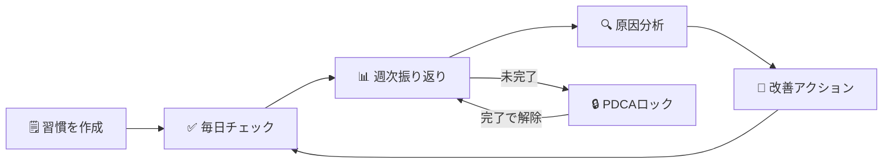

# HabitFlow（ハビットフロー）

> **甘えを可視化する** — 習慣 × PDCA × AI で自己成長を加速する

<br>

## 📸 画面イメージ

<br>

<p align="center">
  
  
  
</p>

<p align="center">
  <em>ダッシュボード &nbsp;&nbsp;&nbsp; 週次振り返り &nbsp;&nbsp;&nbsp; 習慣管理</em>
</p>

<br>

---

<br>

## 🧭 利用フロー

<br>



<br>

---

<br>

[](https://www.ruby-lang.org/)
[](https://rubyonrails.org/)
[](https://www.postgresql.org/)
[](https://www.docker.com/)
[](https://github.com/KK-arina/HabitFlow/tree/feature/A-1-db-migrations)
[](https://github.com/KK-arina/HabitFlow/tree/feature/A-2-production-deploy)
[](https://github.com/KK-arina/HabitFlow/tree/feature/A-3-good-job)
[](https://github.com/KK-arina/runteq_graduation_project/tree/feature/A-4-resend-mailer)
[](https://github.com/KK-arina/HabitFlow/tree/feature/A-5-habit-templates-seed)
[](https://github.com/KK-arina/HabitFlow/tree/feature/A-6-db-index-audit)
[](https://github.com/KK-arina/HabitFlow/tree/feature/A-7-transaction-design)
[](https://github.com/KK-arina/HabitFlow/tree/feature/B-1-numeric-habit)
[](https://github.com/KK-arina/HabitFlow/tree/feature/B-2-habit-excluded-days)
[](https://github.com/KK-arina/HabitFlow/tree/feature/B-3-streak-calculation)
[](https://github.com/KK-arina/HabitFlow/tree/feature/B-4-habit-archive)
[](https://github.com/KK-arina/HabitFlow/tree/feature/B-5-habit-menu-modal)
[](https://github.com/KK-arina/HabitFlow/tree/feature/B-6-habit-color-icon-sort)
[](https://github.com/KK-arina/HabitFlow/tree/feature/B-7-habit-record-memo)
[](https://github.com/KK-arina/HabitFlow/tree/feature/C-1-task-model-crud)
[](https://github.com/KK-arina/HabitFlow/tree/feature/C-2-task-toggle-status)
[](https://github.com/KK-arina/HabitFlow/tree/feature/C-3-task-delete-modal)
[](https://github.com/KK-arina/HabitFlow/tree/feature/C-4-weekly-reflection-task-summary)
[](https://github.com/KK-arina/HabitFlow/tree/feature/C-5-task-alarm-job)
[](https://github.com/KK-arina/HabitFlow/tree/feature/C-6-dashboard-task-priority-stats)
[](https://github.com/KK-arina/HabitFlow/tree/feature/C-7-task-ai-edit)
[](https://github.com/KK-arina/HabitFlow/tree/feature/D-1-user-purpose-model)
[](https://github.com/KK-arina/HabitFlow/tree/feature/D-2-purpose-analysis-job)
[](https://github.com/KK-arina/HabitFlow/tree/feature/D-3-pmvv-show-and-ai-result)
[](https://github.com/KK-arina/HabitFlow/tree/feature/D-4-weekly-reflection-analysis-job)
[](https://github.com/KK-arina/HabitFlow/tree/feature/D-5-crisis-intervention)
[](https://github.com/KK-arina/HabitFlow/tree/feature/D-6-ai-cost-limit)
[](https://github.com/KK-arina/HabitFlow/tree/feature/D-7-onboarding-pmvv-step)
[](https://github.com/KK-arina/HabitFlow/tree/feature/D-8-habit-ai-edit)
[](https://github.com/KK-arina/HabitFlow/tree/feature/D-9-ai-analysis-input-snapshot-validation)
[]()

<br>

---

<br>

## 🌐 本番環境

<br>

**URL**: https://habitflow-web.onrender.com

<br>

| 項目 | 内容 |
|:---|:---|
| ホスティング | Render（無料プラン） |
| データベース | Neon Serverless PostgreSQL 16（永続・無料） |
| デプロイ | GitHub の `main` ブランチへの Push で自動実行 |
| Web サーバー | Puma（Worker: 2 / Thread: 3 / Cluster mode） |

<br>

> ⚠️ **Render 無料プランのスリープについて**<br>
> 15分間アクセスがないとサービスがスリープします。<br>
> 初回アクセス時は起動まで **約30〜60秒** かかる場合があります。

<br>

> 📌 **Neon を採用した理由**<br>
> Render 内蔵の無料 PostgreSQL は作成から **90日で自動削除** される制限がある。<br>
> Neon Serverless Postgres は永続的な無料プランを提供しており、長期運用に最適。<br>
> また Render と同じ Singapore リージョンに配置することで Web ↔ DB 間のレイテンシを最小化している。

<br>

---

<br>

### 🚧 本リリース開発進捗

<br>

| Week | テーマ | ISSUE | SP | 状態 |
|:---|:---|:---:|:---:|:---:|
| Week A | DB・インフラ基盤 | #A-1〜#A-7 | 24 | ✅ 完了 |
| Week B | 習慣機能拡張 | #B-1〜#B-7 | 28 | ✅ 完了 |
| Week C | タスク管理機能 | #C-1〜#C-7 | 28 | ✅ 完了 |
| Week D | AI分析・PMVV機能 | #D-1〜#D-11 | 42 | 🟡 進行中 |
| Week E | 週次振り返り拡張 | #E-1〜#E-5 | 22 | ⬜ 未着手 |
| Week F | 認証拡張 | #F-1〜#F-6 | 19 | ⬜ 未着手 |
| Week G | 通知・設定拡張 | #G-1〜#G-8 | 30 | ⬜ 未着手 |
| Week H | フロントエンド強化 | #H-1〜#H-9 | 30 | ⬜ 未着手 |
| Week I | 品質・テスト・デプロイ | #I-1〜#I-6 | 22 | ⬜ 未着手 |
| **合計** | | **67** | **222** | |

<br>

#### ✅ 完了済みISSUE

<br>

| ISSUE | タイトル | 完了日 | ブランチ |
|:---|:---|:---:|:---|
| #A-1 | 本リリース用DBマイグレーション（全差分） | 2026-03-20 | feature/A-1-db-migrations |
| #A-2 | 本番環境デプロイ（Render + Neon PostgreSQL） | 2026-03-20 | feature/A-2-production-deploy |
| #A-3 | GoodJob 導入・非同期処理基盤構築 | 2026-03-20 | feature/A-3-good-job |
| #A-4 | Resend メール送信設定 | 2026-03-22 | feature/A-4-resend-mailer |
| #A-5 | habit_templates シードデータ・モデル作成 | 2026-03-22 | feature/A-5-habit-templates-seed |
| #A-6 | DBインデックス監査・最適化 | 2026-03-22 | feature/A-6-db-index-audit |
| #A-7 | DBトランザクション設計・複数テーブル更新の整合性保証 | 2026-03-22 | feature/A-7-transaction-design |
| #B-1 | 数値型習慣の記録・達成率計算・リフレクション手法対応 | 2026-03-27 | feature/B-1-numeric-habit |
| #B-2 | 習慣の除外日設定（habit_excluded_days） | 2026-03-28 | feature/B-2-habit-excluded-days |
| #B-3 | ストリーク計算・表示（current_streak / longest_streak） | 2026-03-29 | feature/B-3-streak-calculation |
| #B-4 | 習慣のアーカイブ機能（archived_at）| 2026-03-29 | feature/B-4-habit-archive |
| #B-5 | 習慣削除確認モーダル（M-1）⋯メニュー + デスクトップモーダル / スマホボトムシート | 2026-03-30 | feature/B-5-habit-menu-modal |
| #B-6 | 習慣のカラー・アイコン・Drag&Drop 並び替え（acts_as_list + SortableJS） | 2026-04-05 | feature/B-6-habit-color-icon-sort |
| #B-7 | habit_records.memo（日次メモ）機能 | 2026-04-06 | feature/B-7-habit-record-memo |
| #C-1 | Task モデル・基本 CRUD（Must/Should/Could優先度・todo/done/archived状態管理） | 2026-04-07 | feature/C-1-task-model-crud |
| #C-2 | タスクの完了チェック・ステータス管理（toggle_complete/archive/archive_all_done・Turbo Stream） | 2026-04-07 | feature/C-2-task-toggle-status |
| #C-3 | タスク削除確認モーダル（M-2）・手動タスク削除（ai_generated=false のみ削除可・デスクトップ中央モーダル/スマホボトムシート・Turbo Stream削除・トースト通知） | 2026-04-08 | feature/C-3-task-delete-modal |
| #C-4 | 週次振り返りのタスクスナップショット保存（weekly_reflection_task_summaries・was_completedフラグ・優先度別表示・toggle後モーダル再注入バグ修正） | 2026-04-08 | feature/C-4-weekly-reflection-task-summary |
| #C-5 | タスクアラーム通知（GoodJob + メール）・NotificationLogモデル・TaskAlarmJob・TaskMailer・alarm_enabled/scheduled_at/alarm_minutes_beforeフィールド追加・update時の再スケジュール・AlarmToggleController | 2026-04-12 | feature/C-5-task-alarm-job |
| #C-6 | ダッシュボードの Must/Should/Could 別タスク達成率表示・達成率カラーの全画面統一・習慣フォーム改善 | 2026-04-18 | feature/C-6-dashboard-task-priority-stats |
| #C-7 | タスクのAI編集ページ（11番・AI提案モーダル経由）session[:ai_context_task_id]によるアクセス制御・優先度変更不可の二重防御・ai_update_params・form_with + data: { turbo: false } | 2026-04-19 | feature/C-7-task-ai-edit |
| #D-1 | UserPurpose モデル・PMVV入力ページ（17番）・PMVV目標管理ページ（16番） | 2026-04-19 | feature/D-1-user-purpose-model |
| #D-2 | PMVV AI分析ジョブ（GoodJob + Gemini API / Groq フォールバック） | 2026-04-25 | feature/D-2-purpose-analysis-job |
| #D-3 | PMVV目標管理ページ（16番）・AI分析結果ページ（18番） | 2026-04-26 | feature/D-3-pmvv-show-and-ai-result |
| #D-4 | 週次振り返りAI分析ジョブ（GoodJob + Gemini API / Groq フォールバック） | 2026-04-26 | feature/D-4-weekly-reflection-analysis-job |
| #D-5 | 危機介入機能（Railsキーワード検出 + プロンプトルール） | 2026-05-03 | feature/D-5-crisis-intervention |
| #D-6 | AIコスト上限管理（ai_analysis_monthly_limit・14-Bモーダル） | 2026-05-03 | feature/D-6-ai-cost-limit |
| #D-7 | オンボーディング 5/5 PMVV入力ステップ | 2026-05-04 | feature/D-7-onboarding-pmvv-step |
| #D-8 | AI提案の習慣編集ページ（8番・AI経由限定）session[:ai_context_habit_id]によるアクセス制御・measurement_type変更不可の二重防御・ai_update_params・form_with + data: { turbo: false } | 2026-05-04 | feature/D-8-habit-ai-edit |
| #D-9 | AiAnalysis input_snapshot JSONBスキーマバリデーション | 2026-05-05 | feature/D-9-ai-analysis-input-snapshot-validation |

<br>

---

<br>

## 📋 サービス概要

<br>

HabitFlow は「なぜ習慣が続かないのか」の**真の原因**を究明し、改善サイクルを自動化する自己成長サポートアプリです。

<br>

### 解決する課題

<br>

多くの習慣管理アプリは「記録するだけ」で終わります。<br>
「仕事が忙しかった」「疲れていた」という表面的な言い訳で習慣が途切れ、同じ失敗を繰り返す。<br>
**この「甘え」は明文化・可視化されていないから許されてしまいます。**

<br>

### HabitFlow の解決アプローチ

<br>

1. **週次振り返り** — できなかった理由を明文化して記録
2. **PDCA強制ロック** — 振り返りを完了しないと新しい習慣を追加できない仕組み
3. **AI分析連携（拡張機能）** — 外部 AI に現状を共有し、「なぜ？」を3回繰り返して真の原因を究明

<br>

---

<br>

## 📸 スクリーンショット

<br>

### ① ダッシュボード

今週の達成率と今日の習慣チェックリストを一覧表示します。

<br>


<br>

---

<br>

### ② 週次振り返り

今週の習慣達成結果を確認し、振り返りコメントを記録する画面です。過去の振り返り履歴も一覧で確認できます。

<br>


<br>

---

<br>

### ③ 習慣管理

登録済みの習慣と今週の進捗率をカード形式で表示します。

<br>


<br>

---

<br>

## ✅ 実装済み機能一覧

<br>

### 認証機能

<br>

| 機能 | 説明 |
|:---|:---|
| ユーザー登録 | メールアドレス・パスワードで新規登録 |
| ログイン / ログアウト | bcrypt による安全な認証 |
| セッション管理 | `reset_session` によるセッション固定攻撃対策 |

<br>

### 習慣管理機能

<br>

| 機能 | 説明 |
|:---|:---|
| 習慣の登録 | 習慣名（最大50文字）と週次目標回数（1〜7回）を設定 |
| 習慣の削除 | 論理削除（`deleted_at`）で過去データを保持したまま削除 |
| 日次記録 | チェックボックスをクリックするだけで即時保存（ページリロード不要） |
| 週次進捗統計 | 今週の達成率・達成日数を自動計算して表示 |

<br>

### ダッシュボード

<br>

| 機能 | 説明 |
|:---|:---|
| 今週の達成率 | 全習慣の平均達成率をプログレスバーで表示 |
| 今日の習慣チェックリスト | 今日記録すべき習慣の一覧をチェックボックス付きで表示 |
| PDCA ロック警告バナー | 振り返り未完了時に警告バナーを表示（振り返りページへの導線付き） |

<br>

### 週次振り返り機能

<br>

| 機能 | 説明 |
|:---|:---|
| 振り返り一覧 | 過去の完了済み振り返りと今週の達成率サマリーを表示 |
| 振り返り入力 | 今週の習慣実績を確認しながらコメント（最大1000文字）を記録 |
| 振り返り詳細 | 保存済みの振り返り内容と習慣別達成率を閲覧 |
| スナップショット保存 | 振り返り時点の習慣名・目標値を永続保存（後から習慣を変更しても過去記録は正確に表示） |

<br>

### PDCA 強制ロック機能

<br>

| 機能 | 説明 |
|:---|:---|
| ロック発動 | 月曜 AM4:00 以降、前週の振り返りが未完了の場合に自動ロック |
| ロック中の制限 | 習慣の新規追加・削除をブロック（日次記録のチェックは継続可能） |
| ロック自動解除 | 振り返りを完了すると即時解除され、緑色のバナーで通知 |

<br>

### UI / UX

<br>

| 機能 | 説明 |
|:---|:---|
| レスポンシブデザイン | スマホ・タブレット・PC すべてに対応 |
| ハンバーガーメニュー | モバイルでのナビゲーション |
| トースト通知 | 操作結果をフェードアウトアニメーション付きで表示 |
| カスタムエラーページ | 404 / 422 / 500 エラーページをカスタムデザインで表示 |
| アクセシビリティ | WCAG 2.1 AA 基準準拠（スキップリンク・ARIA 属性・キーボード操作対応） |

<br>

---

<br>

## 🚀 本リリース実装済み機能

<br>

### #A-1: 本リリース用 DB マイグレーション

<br>

**ブランチ:** `feature/A-1-db-migrations`<br>
**完了日:** 2026-03-20<br>
**対象:** MVP版スキーマからの全差分をマイグレーションファイルとして実装

<br>

#### 既存テーブルへのカラム追加

<br>

| テーブル | 追加カラム | 目的 |
|:---|:---|:---|
| `users` | `provider` / `uid` | OmniAuth（Google/LINE）ログイン対応 |
| `users` | `line_user_id` | LINE Messaging API 通知送信用 |
| `users` | `first_login_at` | オンボーディング完了判定（NULL=未完了） |
| `habits` | `measurement_type` | チェック型(0) / 数値型(1) の区別 |
| `habits` | `unit` | 数値型習慣の単位（分・冊・km など） |
| `habits` | `current_streak` / `longest_streak` | ストリーク（継続日数）管理 |
| `habits` | `allow_rest_mode` | お休みモード中のストリーク維持フラグ |
| `habits` | `archived_at` | 卒業習慣のアーカイブ（`deleted_at` とは別管理） |
| `habits` | `color` / `icon` / `position` | UI カスタマイズ・並び替え |
| `habit_records` | `numeric_value` | 数値型習慣の実績値（decimal型・精度保証） |
| `habit_records` | `memo` | 日次メモ（AI 分析精度向上に活用） |
| `habit_records` | `is_manual_input` | 自動記録 vs 手動修正の区別 |
| `habit_records` | `deleted_at` | 論理削除（統計整合性の保持） |
| `weekly_reflections` | `year` / `week_number` | ISO週番号による重複防止 |
| `weekly_reflections` | `mood` | 気分スコア（1〜5） |
| `weekly_reflections` | `direct_reason` / `background_situation` | 構造化された振り返り入力 |

<br>

#### 新規作成テーブル

<br>

| テーブル | 役割 | 主な設計ポイント |
|:---|:---|:---|
| `habit_excluded_days` | 習慣ごとの除外曜日 | UNIQUE制約(habit_id, day_of_week) |
| `tasks` | タスク管理（Must/Should/Could） | 4種インデックス・ai_generated フラグ |
| `ai_analyses` | AI分析結果の保存 | is_latest フラグ・input_snapshot(jsonb)・UNIQUE制約2種 |
| `user_settings` | ユーザー設定の一元管理 | 通知/お休みモード/AIコスト制御 |
| `user_purposes` | PMVV目標のバージョン管理 | is_active フラグ・analysis_state enum |
| `habit_templates` | オンボーディング用マスタ | カテゴリ別テンプレート |
| `notification_logs` | 通知送信履歴 | deep_link_url・ポリモーフィック関連 |
| `push_subscriptions` | Web Push購読情報（将来用） | 機能実装は後続リリース |
| `password_reset_tokens` | パスワードリセット | token_digest（ハッシュ化保存）・多重発行防止 |

<br>

### #A-2: 本番環境デプロイ（Render + Neon PostgreSQL）

<br>

**ブランチ:** `feature/A-2-production-deploy`<br>
**完了日:** 2026-03-20<br>
**本番URL:** https://habitflow-web.onrender.com

<br>

#### 採用構成

<br>

| 役割 | サービス | 理由 |
|:---|:---|:---|
| Web サービス | Render（無料プラン） | GitHub 連携で自動デプロイ・クレカ不要 |
| データベース | Neon Serverless PostgreSQL 16 | 永続無料・Render 内蔵 DB の90日削除問題を回避 |
| リージョン | Singapore（両サービス統一） | Web ↔ DB 間のレイテンシを最小化 |

<br>

#### 主な設定内容

<br>

| ファイル | 変更内容 |
|:---|:---|
| `render.yaml` | Neon 対応に全面書き換え・puma 直接起動・GoodJob Worker 準備（コメントアウト） |
| `config/puma.rb` | Worker 設定・`on_worker_boot`・`Integer()` 型安全変換を追加 |
| `bin/docker-entrypoint` | `db:prepare` → `db:migrate` に変更（Neon は CREATE DATABASE 権限なし） |

<br>

#### 環境変数設定（Render）

<br>

| Key | 管理方法 | 用途 |
|:---|:---|:---|
| `RAILS_ENV` | render.yaml に記載 | 本番環境モード指定 |
| `DATABASE_URL` | Render ダッシュボードで手動設定 | Neon 接続文字列 |
| `RAILS_MASTER_KEY` | Render ダッシュボードで手動設定 | credentials 復号キー |
| `RAILS_LOG_TO_STDOUT` | render.yaml に記載 | Render Logs タブへの出力 |
| `RAILS_SERVE_STATIC_FILES` | render.yaml に記載 | CSS/JS の直接配信 |
| `WEB_CONCURRENCY` | render.yaml に記載 | Puma Worker 数（2） |

<br>

### #A-3: GoodJob 導入・非同期処理基盤構築

<br>

**ブランチ:** `feature/A-3-good-job`<br>
**完了日:** 2026-03-20<br>
**概要:** Redis 不要の非同期ジョブ処理エンジン GoodJob を導入し、<br>
AI 分析・通知・ストリーク計算等のバックグラウンド処理基盤を構築。<br>

<br>

#### 技術選定の理由

<br>

| 技術 | 採用理由 |
|:---|:---|
| GoodJob | PostgreSQL のみで動作。Redis 不要のため Render 無料プランと相性が良い |
| Sidekiq (不採用) | 高性能だが Redis が必要。Render 無料プランではコスト増になる |

<br>

#### GoodJob の設定

<br>

| 設定項目 | 値 | 理由 |
|:---|:---|:---|
| `execution_mode` (development) | `:async` | Web プロセス内でスレッド実行。Docker 1台で完結 |
| `execution_mode` (production) | `:external` | Render の Worker サービスが別プロセスで実行 |
| `max_threads` | `3` | Web(6) + Worker(3) = 9 コネクション。Neon 無料プラン上限以内 |
| `poll_interval` | `30秒` | DB への SELECT 頻度と遅延のバランス点 |
| `cleanup_preserved_jobs_before_seconds_ago` | `86400秒（24時間）` | Neon 無料プランの容量制限に対応 |

<br>

#### cron ジョブ一覧（JST 基準）

<br>

| ジョブクラス | cron (UTC) | JST 実行時刻 | 役割 |
|:---|:---:|:---:|:---|
| `StreakCalculationJob` | `5 19 * * *` | 毎日 AM4:05 | ストリーク計算（#B-3 で本実装） |
| `DailyNotificationCountResetJob` | `5 15 * * *` | 毎日 00:05 | 通知カウントリセット |
| `MonthlyAiCountResetJob` | `0 15 * * *` | 毎日 00:00 | 月初のみ AI 使用回数リセット |
| `GoodJob::CleanupJobsJob` | `0 18 * * *` | 毎日 03:00 | 完了済みジョブ削除 |

<br>

月次リセットは cron 式を毎日実行にして、ジョブ内で `Time.current.day == 1` をチェックする方式を採用。<br>
UTC 変換による cron 式の複雑化を避けるための設計。

<br>

#### 作成・変更ファイル一覧

<br>

| ファイル | 変更内容 |
|:---|:---|
| `Gemfile` | `gem "good_job"` 追加（4.x 系・バージョン固定なし） |
| `Gemfile` | `gem "minitest", "~> 5.1"` 追加（GoodJob が 6.x を引き込む問題を防止） |
| `config/application.rb` | `config.active_job.queue_adapter = :good_job` 追加 |
| `config/initializers/good_job.rb` | 新規作成（`Rails.application.configure` 形式・cron 4件） |
| `config/environments/development.rb` | `execution_mode = :async` 追加 |
| `config/environments/production.rb` | `execution_mode = :external` 追加 |
| `config/environments/test.rb` | `queue_adapter = :test` 追加 |
| `config/routes.rb` | GoodJob ダッシュボードを catch-all より前にマウント |
| `render.yaml` | Worker サービスを有効化（`--max-threads=3` を明示） |
| `app/jobs/application_job.rb` | `retry_on` / `discard_on` を追加 |
| `app/jobs/streak_calculation_job.rb` | 新規作成（#B-3 で本実装予定） |
| `app/jobs/daily_notification_count_reset_job.rb` | 新規作成 |
| `app/jobs/monthly_ai_count_reset_job.rb` | 新規作成 |
| `app/jobs/hello_good_job.rb` | 動作確認用（確認後削除可） |
| `db/migrate/YYYYMMDDHHMMSS_create_good_jobs.rb` | GoodJob 4.x 用テーブル5種を作成 |

<br>

#### 作成された DB テーブル

<br>

| テーブル名 | 役割 |
|:---|:---|
| `good_jobs` | ジョブキュー本体 |
| `good_job_batches` | バッチ処理管理 |
| `good_job_executions` | 実行履歴 |
| `good_job_processes` | Worker プロセス管理 |
| `good_job_settings` | GoodJob 内部設定 |

<br>

#### GoodJob ダッシュボード

<br>

| 環境 | URL | 認証 |
|:---|:---|:---|
| development | `http://localhost:3000/good_job` | なし |
| production | `https://habitflow-web.onrender.com/good_job` | Basic 認証（環境変数設定時のみ公開） |

<br>

本番環境での公開には Render ダッシュボードで以下の環境変数を設定する。<br>
```
GOOD_JOB_LOGIN=（任意のユーザー名）
GOOD_JOB_PASSWORD=（強力なパスワード）
```

<br>

#### Render Worker サービス設定

<br>
```yaml
- type: worker
  name: habitflow-worker
  runtime: docker
  region: singapore
  plan: free
  startCommand: bundle exec good_job start --max-threads=3
```

<br>

`--max-threads=3` を明示する理由:<br>
GoodJob のデフォルトスレッド数は 5。明示しないと Neon 無料プランの DB コネクション上限を超えるリスクがある。

<br>

### #A-4: Resend メール送信設定

<br>

**ブランチ:** `feature/A-4-resend-mailer`<br>
**完了日:** 2026-03-22<br>
**概要:** パスワードリセット・CSVエクスポート完了通知・週次レポートメールに使用する<br>
Resend をAction Mailerに接続。開発環境では letter_opener でブラウザプレビュー確認。

<br>

#### 技術選定の理由

<br>

| 技術 | 採用理由 |
|:---|:---|
| Resend | クレカ不要・月3,000通無料・Rails用gem公式提供。SendGrid（クレカ必要）・Mailgun（設定複雑）より優位 |
| letter_opener | 開発環境での無駄な送信を防止。ブラウザでメール内容をプレビュー確認できる |

<br>

#### Action Mailer 設定内容

<br>

| 環境 | delivery_method | 説明 |
|:---|:---|:---|
| development | `:letter_opener` | 実際には送信せず `tmp/letter_opener/` にHTMLとして保存 |
| production | `:resend` | Resend APIを経由して実際にメール送信 |

<br>

#### 本番環境の設定

<br>

| 設定項目 | 値 | 理由 |
|:---|:---|:---|
| `delivery_method` | `:resend` | Resend API経由でメール送信 |
| `raise_delivery_errors` | `true` | 送信失敗時に例外を発生させてエラーを検知 |
| `default_url_options` | `host: "habitflow-web.onrender.com"` | パスワードリセットメール内リンクのURLを正しく生成 |
| `asset_host` | `"https://habitflow-web.onrender.com"` | メール内画像・CSSの絶対URLを生成 |

<br>

#### 作成・変更ファイル一覧

<br>

| ファイル | 変更内容 |
|:---|:---|
| `Gemfile` | `gem "resend"` / `gem "letter_opener"` 追加 |
| `config/initializers/resend.rb` | 新規作成（APIキーを環境変数から初期化） |
| `config/environments/production.rb` | Action Mailer本番設定追加（delivery_method・raise_delivery_errors・default_url_options・asset_host）<br>GoodJob execution_mode を `:external` → `:async` に変更（Render Worker非対応のため）<br>GoodJob max_threads を `2` に設定（Freeプランリソース制約対応） |
| `config/environments/development.rb` | letter_opener設定追加 |
| `app/mailers/application_mailer.rb` | fromアドレスを `HabitFlow <onboarding@resend.dev>` に設定 |
| `app/mailers/test_mailer.rb` | 新規作成（動作確認用・将来のMailer実装の参考） |
| `render.yaml` | `RESEND_API_KEY` 環境変数を追加（`sync: false`）<br>Workerセクションをコメントアウト（Render Freeプランは Worker 非対応） |

<br>

#### Render 環境変数設定

<br>

| Key | 管理方法 | 用途 |
|:---|:---|:---|
| `RESEND_API_KEY` | Render ダッシュボードで手動設定 | Resend API認証キー |

<br>

#### GoodJob execution_mode の変更理由

<br>

#A-3 では production の execution_mode を `:external`（別Workerプロセス）に設定していたが、<br>
Render の Background Worker は Free プランが存在しない（最低 $7/月 の Starter プラン）ため、<br>
`:async`（Webプロセス内でバックグラウンドスレッドを実行）に変更した。<br>

<br>

| モード | 動作 | 採用環境 |
|:---|:---|:---|
| `:async` | Webプロセス内のスレッドでジョブを実行 | 本番（Render Free）・開発 |
| `:external` | 別プロセス（Worker）でジョブを実行 | 有料プラン移行時 |

<br>

> ⚠️ `:async` モードはWebサーバーと同一プロセスのため、<br>
> 重い処理（CSV生成・AI分析）はWebレスポンスに影響する可能性があります。<br>
> 有料プランへの移行時は `:external` に戻し、render.yaml の Worker 設定を有効化してください。

<br>

### #A-5: habit_templates シードデータ・モデル作成

<br>

**ブランチ:** `feature/A-5-habit-templates-seed`<br>
**完了日:** 2026-03-22<br>
**概要:** オンボーディングで使用する習慣テンプレートのマスタデータを実装。<br>
カテゴリ別18件のプリセットデータを登録し、ユーザーがスムーズに習慣を選択できるようにする。

<br>

#### 登録テンプレート一覧（18件）

<br>

| カテゴリ | 件数 | 習慣名 |
|:---|:---|:---|
| 健康（health） | 5件 | 読書・瞑想・睡眠日記・水を飲む・早起き |
| フィットネス（fitness） | 5件 | 筋トレ・ジョギング・ストレッチ・ウォーキング・体重記録 |
| 学習（study） | 4件 | 英語学習・プログラミング学習・読書（学習）・オンライン講座 |
| マインド（mind） | 4件 | 日記・感謝リスト・呼吸法・デジタルデトックス |

<br>

#### 作成ファイル一覧

<br>

| ファイル | 変更内容 |
|:---|:---|
| `app/models/habit_template.rb` | 新規作成（enum / バリデーション / スコープ） |
| `db/seeds.rb` | habit_templates シードデータを Step 8 として末尾に追記 |

<br>

#### HabitTemplate モデルの設計

<br>

| 設定 | 内容 |
|:---|:---|
| `measurement_type` enum | `check_type`(0) / `numeric_type`(1) |
| `category` enum | `health`(0) / `fitness`(1) / `study`(2) / `mind`(3) / `other`(4) |
| バリデーション | name（必須・100文字以内）/ default_weekly_target（1〜7の整数） |
| スコープ | `active` / `ordered` / `active_ordered` |

<br>

#### 設計上の判断

<br>

- `find_or_initialize_by` + `assign_attributes` + `save!` を採用<br>
  → 既存レコードも更新されるため、description や sort_order の修正が本番 DB に反映される<br>
  → `find_or_create_by!` のブロック方式では既存データが更新されないため不採用<br>
- slug カラムの追加は見送り<br>
  → schema.rb に定義がなく #A-1 のスコープ外。`name + category` の複合キーで一意性を保証できる<br>
- `enum _prefix: true` は見送り<br>
  → 使用箇所が生まれる #H-5（オンボーディング拡張）のタイミングで改めて検討する（YAGNI原則）

<br>

### #A-6: DBインデックス監査・最適化

<br>

**ブランチ:** `feature/A-6-db-index-audit`<br>
**完了日:** 2026-03-22<br>
**概要:** データ量が増加しやすいテーブルのインデックスを実測クエリで確認し、<br>
不足インデックスを追加。Bullet / rack-mini-profiler によるN+1監視基盤を構築。

<br>

#### スキーマ監査結果

<br>

| 対象 | 結果 | 内容 |
|:---|:---:|:---|
| `habit_records(user_id, record_date)` | ✅ 設定済み | ダッシュボード週次集計クエリに使用 |
| `habit_records(user_id, habit_id, record_date)` UNIQUE | ✅ 設定済み | 1日1件制約をDBレベルで保証 |
| `tasks(user_id, status, due_date)` | ✅ 設定済み | タスク一覧フィルタクエリに使用 |
| `notification_logs(user_id, created_at)` | ✅ 設定済み | 通知履歴・件数チェックに使用 |
| `weekly_reflections(user_id, week_start_date)` UNIQUE | ✅ 設定済み | 同一週の重複振り返りを防止 |
| `idx_weekly_reflections_user_week_completed` 部分INDEX | ✅ 設定済み | `User#locked?` の毎リクエスト実行クエリに使用 |
| `notification_logs.deep_link_url` | ❌ **未設定→追加** | #A-1設計済みだが未設定だった |
| `tasks` 複合部分インデックス | ❌ **未設定→追加** | `deleted_at IS NULL` フィルタ付き4条件クエリを最適化 |

<br>

#### 追加インデックス詳細

<br>

| インデックス名 | 対象 | 種別 | 理由 |
|:---|:---|:---|:---|
| `index_notification_logs_on_deep_link_url` | `notification_logs.deep_link_url` | 通常INDEX | 通知種別ごとの遷移先分析クエリを高速化 |
| `idx_tasks_active_tasks` | `tasks(user_id, status, deleted_at, due_date)` WHERE deleted_at IS NULL | 複合部分INDEX | `deleted_at IS NULL` を含む4条件クエリを Index Only Scan で完結させる |

<br>

#### なぜ `deleted_at` 単体ではなく複合部分インデックスなのか

<br>

実際のクエリパターン（TasksController#index）:<br>
```sql
WHERE user_id = ? AND status = 0 AND deleted_at IS NULL ORDER BY due_date ASC
```

<br>

`deleted_at` 単体インデックスでは `user_id` / `status` / `due_date` の条件を処理できず、<br>
結局テーブルを別途参照する「Heap Fetch」が大量発生する。<br>
`(user_id, status, deleted_at, due_date)` の複合インデックス + `WHERE deleted_at IS NULL` の部分インデックスにより<br>
インデックスだけで完結する「Index Only Scan」が可能になり最速になる。

<br>

#### マイグレーション設計のポイント

<br>

| 設計 | 内容 |
|:---|:---|
| `disable_ddl_transaction!` | 本番環境での書き込みロック回避（`algorithm: :concurrently` の使用に必須） |
| `up/down` 形式 | `change` 形式では rollback 時に concurrently での削除が保証されないため明示 |
| `if_not_exists: true` | 冪等性の確保（何度実行しても安全） |

<br>

#### 導入・設定ファイル一覧

<br>

| ファイル | 変更内容 |
|:---|:---|
| `Gemfile` | `gem "rack-mini-profiler", require: false` 追加（development グループ） |
| `config/initializers/bullet.rb` | 新規作成（N+1検出設定・`unused_eager_loading_enable` 含む） |
| `config/initializers/rack_mini_profiler.rb` | 新規作成（Turbo Drive サポート・rescue LoadError 対応） |
| `db/migrate/YYYYMMDDHHMMSS_add_missing_indexes_for_performance.rb` | 新規作成（2インデックス追加） |
| `db/explain_analyze_audit.sql` | 新規作成（監査用 EXPLAIN ANALYZE スクリプト7件） |
| `test/db/index_audit_test.rb` | 新規作成（インデックス存在確認テスト・部分INDEX where条件まで検証） |

<br>

### #A-7: DBトランザクション設計・複数テーブル更新の整合性保証

<br>

**ブランチ:** `feature/A-7-transaction-design`<br>
**完了日:** 2026-03-22<br>
**概要:** 複数テーブルを横断する更新処理をトランザクションで保護し、<br>
部分的な失敗による中途半端なDB状態を防ぐ基盤を構築。<br>
ビジネスロジックをサービスクラスに集約し、コントローラーを軽量化した。

<br>

#### トランザクション保護対象フロー

<br>

| フロー | 保護対象テーブル | サービスクラス |
|:---|:---|:---|
| 振り返り完了 | `weekly_reflections` + `weekly_reflection_habit_summaries` | `WeeklyReflectionCompleteService` |
| 習慣記録保存 | `habit_records`（将来: + `habits.current_streak`） | `HabitRecordSaveService` |
| ユーザー退会 | `users` + `password_reset_tokens` + `user_settings` | `UserDestroyService` |
| AI提案確定（骨格） | `habits` + `tasks`（Issue #D-3〜#D-4 で本実装） | `AiProposalConfirmService` |

<br>

#### ApplicationRecord.with_transaction の設計

```ruby
# app/models/application_record.rb
def self.with_transaction(&block)
  # ブロック内で例外が発生すると Rails が自動ロールバックし例外を再 raise する
  # rescue はサービスクラス側で書く（with_transaction 内では rescue しない）
  ActiveRecord::Base.transaction(&block)
end
```

<br>

| 設計判断 | 理由 |
|:---|:---|
| `with_transaction` 内で `rescue` しない | transaction ブロックの内側で rescue すると例外がロールバック前にキャッチされ、DBが中途半端な状態でコミットされる危険がある |
| rescue はサービスクラス側に置く | transaction ブロックの外側で rescue することで「ロールバック完了 → エラー通知」の順序が保証される |
| ネスト禁止 | `with_transaction` の中で `with_transaction` を呼ぶと内側の失敗が外側に伝播しない。`create_all_for_reflection!` 内部の `transaction` は外側に合流するため問題ない |

<br>

#### WeeklyReflection モデルのバグ修正

<br>

`weekly_reflections` テーブルには `UNIQUE(user_id, year, week_number)` 制約があるが、<br>
`year` / `week_number` が `nil` のまま保存されていた本番バグを `before_validation` で修正。

```ruby
# app/models/weekly_reflection.rb
before_validation :set_year_and_week_number

def set_year_and_week_number
  return unless week_start_date.present?
  self.year        = week_start_date.cwyear  # ISO週番号ベースの年
  self.week_number = week_start_date.cweek   # ISO週番号（1〜53）
end
```

<br>

#### 作成・変更ファイル一覧

<br>

| ファイル | 変更内容 |
|:---|:---|
| `app/models/application_record.rb` | `with_transaction` クラスメソッドを追加 |
| `app/models/weekly_reflection.rb` | `before_validation :set_year_and_week_number` を追加（バグ修正） |
| `app/services/weekly_reflection_complete_service.rb` | 新規作成（振り返り完了フロー） |
| `app/services/habit_record_save_service.rb` | 新規作成（習慣記録フロー） |
| `app/services/user_destroy_service.rb` | 新規作成（退会処理フロー） |
| `app/services/ai_proposal_confirm_service.rb` | 新規作成（骨格のみ・Issue #D-3〜#D-4 で本実装） |
| `app/controllers/weekly_reflections_controller.rb` | `create` アクションをサービスクラスに委譲 |
| `app/controllers/habit_records_controller.rb` | `create` / `update` アクションをサービスクラスに委譲 |
| `test/test_helper.rb` | `require "minitest/mock"` を追加（stub 使用に必要） |
| `test/fixtures/weekly_reflections.yml` | 全 fixture に `year` / `week_number` を追加 |
| `test/services/application_record_with_transaction_test.rb` | 新規作成（5テスト） |
| `test/services/weekly_reflection_complete_service_test.rb` | 新規作成（6テスト） |
| `test/services/habit_record_save_service_test.rb` | 新規作成（3テスト） |

<br>

### #B-1: 数値型習慣の記録・達成率計算・リフレクション手法対応

<br>

**ブランチ:** `feature/B-1-numeric-habit`<br>
**完了日:** 2026-03-27<br>
**概要:** 習慣の記録タイプを「チェック型（やった/やらない）」と「数値型（分・冊・km等）」に拡張。<br>
振り返りフォームにリフレクション手法（なぜ？→どう？→からの？）のフィールドを追加し、<br>
全画面での単位表示の統一・数値型補正ロジックの実装・UIのハイライト修正を実施した。

<br>

#### 実装内容

<br>

| カテゴリ | 内容 |
|:---|:---|
| DB | `next_action` カラムを `weekly_reflections` に追加（「からの？」フィールド対応） |
| Model | `Habit` に `measurement_type` enum・`weekly_target` バリデーション分岐を追加 |
| Model | `HabitRecord` に `numeric_value` バリデーション・`find_or_create_for` 数値型対応を追加 |
| Service | `HabitRecordSaveService` を数値型に対応・戻り値の `errors:[]` 配列形式に統一 |
| Service | `WeeklyReflectionCompleteService` に `corrections` 引数・差分補正ロジック・キー検証・`is_manual_input` 除外を追加 |
| Controller | `HabitRecordsController` に `Float()` 安全変換を追加 |
| Controller | `HabitRecordsController` の Strong Parameters に `:numeric_value` を追加 |
| Controller | `HabitsController` の Strong Parameters に `:unit` / `:measurement_type` を追加 |
| Controller | `DashboardsController` の `build_habit_stats` をチェック型/数値型の COUNT/SUM 分岐に更新 |
| Controller | `WeeklyReflectionsController` に `corrections` 受け渡し・Strong Parameters 追加・`build_habit_stats` 数値型対応 |
| View | `_habit_record.html.erb` にチェック型/数値型の UI 切り替え・`format("%g")` による数値表示統一 |
| View | `dashboards/index.html.erb` の単位表示をチェック型→「日」/数値型→ `habit.unit` に分岐 |
| View | `weekly_reflections/index.html.erb` の単位表示を同様に分岐 |
| View | `habits/new.html.erb` に `measurement_type` / `unit` フィールドを追加 |
| View | `weekly_reflections/new.html.erb` にリフレクション3項目フォーム・数値補正フィールドを追加 |
| View | `weekly_reflections/show.html.erb` にリフレクション3項目の表示を追加 |
| JS | `habit_form_controller.js` に `measurementLabel` ターゲット・`connect()` でのハイライト初期化を追加 |
| JS | `habit_record_controller.js` の `saveNumeric` を `event.target` 方式に変更（複数習慣対応） |

<br>

#### 振り返りフォームのリフレクション手法対応

<br>

| DBカラム | UIラベル | リフレクション項目の説明 |
|:---|:---|:---|
| `direct_reason` | なぜ？（直接の原因） | できなかった直接の理由を記述する |
| `background_situation` | どう？（改善策） | 次週どう改善するかを記述する |
| `next_action` | からの？（次への展開） | 具体的な次のアクションを記述する（#B-1 で新規追加） |
| `reflection_comment` | 自由コメント（任意） | 自由記述（最大1000文字） |

<br>

#### 数値補正ロジックの設計（差分補正方式）

<br>

振り返り画面でユーザーが週合計を手動補正できる機能を実装した。

<br>

```
例: 月曜20分・火曜30分・水曜25分 = 合計75分 → 補正後90分に設定したい
  差分 = 90 - 75 = +15分
  → 日曜日（week_end_date）のレコードに15分を追加保存
  → 月〜水の各日記録はそのまま保持される
```

<br>

| 設計ポイント | 内容 |
|:---|:---|
| 差分補正方式 | 各日の記録を壊さず週合計だけを調整する |
| `is_manual_input` フラグ | 補正レコードを日常記録と区別して再補正時の二重加算を防止 |
| `current_sum` から補正レコードを除外 | `.where(is_manual_input: [false, nil])` で再補正が安定する |
| キー形式のホワイトリスト検証 | `/\Ahabit_\d+\z/` でSQLインジェクションを防ぐ |
| 認可チェック | `@user.habits.find_by(id:)` 経由で他ユーザーの習慣を操作不可 |
| マイナス差分のクランプ | `new_value < 0` のとき `0.0` にクランプして負の記録を防ぐ |

<br>

#### 単位表示の統一ルール（全画面共通）

<br>

| 習慣タイプ | 表示例 | 使用する値 |
|:---|:---|:---|
| チェック型 | `3/7日（43%）` | `completed_count` と「日」固定 |
| 数値型 | `6/7冊（85%）` | `numeric_sum` と `habit.unit` |

<br>

数値の整形には全画面で `format("%g", value.to_f)` を統一使用。<br>
`format("%g", 6.0)` → `"6"`、`format("%g", 6.5)` → `"6.5"` と自動整形される。<br>
入力フィールドの `value` 属性・進捗表示・補正フィールドを含む全ての数値表示で統一する。

<br>

#### ラジオボタンのハイライトバグ修正

<br>

**問題：** 数値型カードをクリックしてもチェック型カードの青枠が残る。<br>
**原因：** `label` タグの青枠（`border-blue-500 bg-blue-50`）をサーバー側（ERB）のみで設定しており、<br>
ユーザーがクリックして切り替えたとき JavaScript 側でラベルのクラスを更新していなかった。<br>
**修正：** `habit_form_controller.js` に以下を追加した。

<br>

| 追加内容 | 目的 |
|:---|:---|
| `measurementLabel` ターゲットを `static targets` に追加 | JS から label タグを直接参照できるようにする |
| `connect()` メソッドを追加 | ページ読み込み時に `toggleUnit()` を自動実行し初期状態を同期する |
| `toggleUnit()` 内でラベルのクラスを付け替える処理を追加 | クリック時に青枠が正しく移動するようにする |
| ERB 側の条件分岐クラスを削除 | JS に管理を一本化し責務を分離する |

<br>

```
動作フロー:
  ページ読み込み → connect() → toggleUnit() → 現在の選択に合わせてラベルに青枠を付与
  カードをクリック → change イベント → toggleUnit() → クリックしたカードに青枠を移動
```

<br>

### #B-2: 習慣の除外日設定（habit_excluded_days）

<br>

**ブランチ:** `feature/B-2-habit-excluded-days`<br>
**完了日:** 2026-03-28<br>
**概要:** 習慣ごとに「実施しない曜日」を設定できる除外日機能を実装。<br>
除外日は達成率計算の分母から除外され、土日を除外した習慣は5日/5日=100%で達成となる。<br>
習慣の新規作成・編集フォームに曜日チェックボックスを追加し、一覧カードに除外曜日を表示する。

<br>

#### 実装内容

<br>

| カテゴリ | 内容 |
|:---|:---|
| Model | `HabitExcludedDay` モデル作成（`belongs_to :habit` / `day_of_week: 0-6` バリデーション / `DAY_NAMES` 定数） |
| Model | `Habit` に `has_many :habit_excluded_days` 追加 |
| Model | `Habit` に `excluded_day_numbers` メソッド追加（除外日番号の配列を昇順で返す） |
| Model | `Habit` に `effective_weekly_target` メソッド追加（`min(weekly_target, 7-除外日数)` を返す） |
| Model | `Habit#weekly_progress_stats` をチェック型の分母を `effective_weekly_target` に変更 |
| Controller | `HabitsController` に `save_excluded_days!`（destroy_all→再登録方式）追加 |
| Controller | `HabitsController#create` をトランザクションで習慣保存と除外日保存を一体化 |
| Controller | `HabitsController` に `edit` / `update` アクション追加 |
| Controller | `HabitsController#index` / `DashboardsController#index` / `WeeklyReflectionsController` に `includes(:habit_excluded_days)` 追加（N+1防止） |
| Controller | 各コントローラーの `build_habit_stats` でチェック型の分母を `effective_weekly_target` に変更 |
| View | `habits/new.html.erb` に除外曜日チェックボックス追加（グリッドレイアウト・スマホ対応・バリデーションエラー後の状態復元） |
| View | `habits/edit.html.erb` を新規作成（既存除外日をチェック済み状態で表示・記録タイプ変更不可） |
| View | `habits/index.html.erb` に「除外: 土・日」表示・編集ボタン追加 |
| Route | `config/routes.rb` に `edit` / `update` を追加 |
| Test | `HabitExcludedDay` モデルテスト15件追加 |
| Fix | `test/fixtures/habit_excluded_days.yml` を削除（NOT NULL 制約違反の根本解決） |

<br>

#### effective_weekly_target の計算設計

```
実施予定日数 = min(weekly_target, 7 - 除外日数)

例1: 目標5日 / 除外: 土日(2日) → min(5, 5) = 5日 → 5/5日 = 100%
例2: 目標5日 / 除外なし      → min(5, 7) = 5日 → 従来通り
例3: 目標7日 / 除外: 5日     → min(7, 2) = 2日 → 物理的な実施可能日数が分母
```

<br>

チェック型のみ除外日が分母に影響する。数値型（分・冊・km）は絶対数値目標のため除外日に影響されない。

<br>

#### フォーム設計のポイント

<br>

| 設計 | 内容 |
|:---|:---|
| `check_box_tag "excluded_day_numbers[]"` | `habit` ネームスペース外で送信（habit テーブルのカラムではないため） |
| `destroy_all` → 再登録方式 | 更新時に「チェックを全て外す」操作も確実に DB に反映できる |
| `params.key?(:excluded_day_numbers)` | edit 画面でバリデーションエラー後の再表示時は params を優先し、通常表示は DB の値を使う |
| `focus-within:ring-2` | `sr-only` で非表示のチェックボックスへのキーボードフォーカスをラベルに可視化 |
| `has-[:checked]:border-blue-500` | JavaScript なしで選択状態を視覚的にハイライト |

<br>

#### 作成・変更ファイル一覧

<br>

| ファイル | 変更内容 |
|:---|:---|
| `app/models/habit_excluded_day.rb` | 新規作成（バリデーション・DAY_NAMES/DAY_NAMES_FULL定数） |
| `app/models/habit.rb` | `has_many :habit_excluded_days` / `excluded_day_numbers` / `effective_weekly_target` / `weekly_progress_stats` 更新 |
| `app/controllers/habits_controller.rb` | `edit` / `update` / `save_excluded_days!` 追加・`includes` 追加・`build_habit_stats` 更新 |
| `app/controllers/dashboards_controller.rb` | `includes(:habit_excluded_days)` / `effective_weekly_target` 対応 |
| `app/controllers/weekly_reflections_controller.rb` | `includes(:habit_excluded_days)` / `effective_weekly_target` 対応 |
| `app/views/habits/new.html.erb` | 除外日チェックボックス追加・バリデーションエラー後の状態復元 |
| `app/views/habits/edit.html.erb` | 新規作成（既存除外日をチェック済みで表示・記録タイプ変更不可） |
| `app/views/habits/index.html.erb` | 「除外: 土・日」表示・編集ボタン追加・フォールバック値修正 |
| `config/routes.rb` | `edit` / `update` を追加 |
| `test/models/habit_excluded_day_test.rb` | 新規作成（15件） |
| `test/fixtures/habit_excluded_days.yml` | 削除（NOT NULL 違反の根本解決） |

<br>

#### テスト結果

<br>
```
B-2テスト: 15 runs, 33 assertions, 0 failures, 0 errors, 0 skips
全テスト:  291 runs, 792 assertions, 0 failures, 0 errors, 0 skips
```

<br>

### #B-3: ストリーク計算・表示（current_streak / longest_streak）

<br>

**ブランチ:** `feature/B-3-streak-calculation`<br>
**完了日:** 2026-03-29<br>
**概要:** 習慣の継続日数（ストリーク）を GoodJob で日次計算し、<br>
`habits.current_streak` / `longest_streak` に保存。<br>
ダッシュボード・習慣一覧に「🔥 N日」として表示する。<br>
AM4:00 基準・除外日考慮・お休みモード対応の完全実装。

<br>

#### 実装内容

<br>

| カテゴリ | 内容 |
|:---|:---|
| Model | `Habit#calculate_streak!` を追加（AM4:00基準・90日遡及・N+1防止の pluck+Hash化） |
| Model | `Habit#on_rest_mode?` を追加（現在のお休みモード状態を返す・UI表示用） |
| Model | `Habit#rest_mode_on_date?(date)` を追加（日付単位のお休みモード判定・ストリーク計算用） |
| Model | `HabitRecord#recorded?` を追加（チェック型: completed / 数値型: numeric_value > 0） |
| Model | `HabitRecord#first_recorded_today?` を追加（created_at が today_for_record と一致するか） |
| Model | `HabitRecord#updated_today?` を追加（updated_at が created_at より新しく今日の日付か） |
| Model | `User` に `has_one :user_setting` を追加（on_rest_mode? の参照に必要） |
| Job | `StreakCalculationJob` を本実装（毎日AM4:05・find_each・個別エラーはスキップ） |
| View | `_habit_record.html.erb` の状態バッジを5パターンに更新（未記録/今日記録済み/今日更新済み/記録済み） |
| View | `dashboards/index.html.erb` に🔥ストリークバッジ追加（7日以上→橙色/1〜6日→黄色） |
| View | `habits/index.html.erb` にストリークバッジ追加（継続日数・最高記録を表示） |
| Test | `test/models/habit_streak_test.rb` を新規作成（25件・33assertions） |

<br>

#### calculate_streak! のアルゴリズム

<br>
```
基準日（AM4:00境界の「今日」）から過去90日に向かって1日ずつ遡る
  ↓
その日が除外日（habit_excluded_days）なら → スキップ（ストリークを壊さず増やさない）
  ↓
達成済み（completed=true または numeric_value > 0）なら → streak + 1
  ↓
未達成 + rest_mode_on_date?(date) = true なら → スキップ（ストリーク維持）
  ↓
未達成 + お休みモードなし → break（ストリーク確定）
```

<br>

#### on_rest_mode? と rest_mode_on_date? の使い分け

<br>

| メソッド | 判定対象 | 用途 |
|:---|:---|:---|
| `on_rest_mode?` | 今この瞬間 | ビューでのUI表示判定 |
| `rest_mode_on_date?(date)` | 指定した過去の日付 | ストリーク計算（過去日付を遡るため必須） |

<br>

`on_rest_mode?` だけを使うと「昨日はお休みモード中だったが今日は終了している」ケースで<br>
昨日の未達成が誤って「通常未達成」と判定されストリークがリセットされるバグが発生する。<br>
`rest_mode_on_date?(date)` は `rest_mode_until.to_date >= date` で日付単位に判定するため正確。

<br>

#### 表示状態の5パターン

<br>

| `record_status` | 条件 | 表示 | 色 |
|:---|:---|:---|:---|
| `:not_recorded` | habit_record が nil | 未記録（非表示） | sr-only |
| `:updated_today` | updated_at > created_at かつ今日 | ↑ 今日更新済み | 青 |
| `:recorded_today` | created_at が今日 | ✓ 今日記録済み | 緑 |
| `:previously_recorded` | 昨日以前に作成・今日は未更新 | ✓ 記録済み | 緑 |

<br>

`updated_today?` を `first_recorded_today?` より先に判定する理由:<br>
今日初入力後にすぐ変更した場合、`first_recorded_today?` も `updated_today?` も true になるが<br>
ユーザーには「更新済み」として表示するのが正しいため `updated_today?` を優先する。

<br>

#### longest_streak の保護設計

```ruby
new_longest = [longest_streak, streak].max
update_columns(
  current_streak:            streak,
  longest_streak:            new_longest,  # 過去最高は絶対に下がらない
  last_streak_calculated_at: Time.current
)
```

<br>

`update_columns` を使う理由: バリデーションスキップ・`updated_at` 非更新・高速化。<br>
ストリーク計算はバッチ処理で頻繁に実行されるため `update!` のオーバーヘッドを避ける。

<br>

#### 作成・変更ファイル一覧

<br>

| ファイル | 変更内容 |
|:---|:---|
| `app/models/habit.rb` | `calculate_streak!` / `on_rest_mode?` / `rest_mode_on_date?` を追加 |
| `app/models/habit_record.rb` | `recorded?` / `first_recorded_today?` / `updated_today?` を追加 |
| `app/models/user.rb` | `has_one :user_setting` を追加 |
| `app/jobs/streak_calculation_job.rb` | 本実装（includes N+1防止・個別エラースキップ） |
| `app/views/habit_records/_habit_record.html.erb` | 状態バッジを5パターンに更新 |
| `app/views/dashboards/index.html.erb` | 🔥ストリークバッジ追加 |
| `app/views/habits/index.html.erb` | ストリークバッジ・最高記録表示追加 |
| `test/models/habit_streak_test.rb` | 新規作成（25件） |
| `test/fixtures/habit_excluded_days.yml` | 削除（外部キー違反の根本解決） |

<br>

#### テスト結果

<br>
```
B-3テスト: 25 runs, 33 assertions, 0 failures, 0 errors, 0 skips
全テスト:  316 runs, 825 assertions, 0 failures, 0 errors, 0 skips
```

<br>

### #B-4: 習慣のアーカイブ機能（archived_at）

<br>

**ブランチ:** `feature/B-4-habit-archive`<br>
**完了日:** 2026-03-29<br>
**概要:** 習慣の「削除（deleted_at）」と「卒業アーカイブ（archived_at）」を明確に区別する機能を実装。<br>
達成して卒業した習慣をアーカイブとして残しつつ、アクティブ一覧から非表示にする。<br>
アーカイブ一覧ページ・復元機能・状態ガード付きのモデルメソッドを実装した。

<br>

#### 実装内容

<br>

| カテゴリ | 内容 |
|:---|:---|
| Model | `scope :active` を修正（`archived_at: nil` の条件を追加） |
| Model | `scope :archived` を新規追加（`deleted_at: nil AND archived_at IS NOT NULL`） |
| Model | `archive!` メソッドを追加（状態ガード付き：二重実行・削除済みで RuntimeError） |
| Model | `unarchive!` メソッドを追加（状態ガード付き：未アーカイブで RuntimeError） |
| Model | `archived?` メソッドを追加（`archived_at.present?` を返す可読性向上ヘルパー） |
| Model | `active?` メソッドを修正（`deleted_at.nil? && archived_at.nil?` に変更） |
| Controller | `archive` アクション追加（POST /habits/:id/archive → habits#archive） |
| Controller | `unarchive` アクション追加（PATCH /habits/:id/unarchive → habits#unarchive） |
| Controller | `archived` アクション追加（GET /habits/archived → 8-2番画面） |
| Controller | `set_habit` を修正（`where(deleted_at: nil).find` に変更） |
| Controller | `before_action :require_unlocked` に `:archive` を追加 |
| Route | `collection do get :archived end` を追加（`archived_habits_path`） |
| Route | `member do post :archive / patch :unarchive end` を追加 |
| View | `habits/index.html.erb` にヘッダーの「📦 アーカイブ済みを見る」リンクを追加 |
| View | `habits/index.html.erb` の各習慣カードに `button_to` で「📦 卒業」ボタンを追加 |
| View | `habits/archived.html.erb` を新規作成（8-2番画面・スマホ・デスクトップ両対応） |
| Test | `test/models/habit_archive_test.rb` を新規作成（22件） |
| Test | `test/controllers/habits_archive_controller_test.rb` を新規作成（6件） |

<br>

#### 習慣の状態管理設計

<br>

| 状態 | 条件 | 操作可否 |
|:---|:---|:---|
| アクティブ | `deleted_at: nil AND archived_at: nil` | 全操作可能 |
| アーカイブ済み | `deleted_at: nil AND archived_at: 設定済み` | 復元のみ可能 |
| 削除済み | `deleted_at: 設定済み` | 操作不可 |

<br>

#### archive! の状態ガード設計

```ruby
def archive!
  raise RuntimeError, "すでにアーカイブ済みです" if archived?
  raise RuntimeError, "削除済みのため操作できません" if deleted?
  update!(archived_at: Time.current)
end

def unarchive!
  raise RuntimeError, "アーカイブされていません" unless archived?
  update!(archived_at: nil)
end
```

<br>

状態ガードをモデルに集約することで、コントローラーが薄くなり（単一責任の原則）、<br>
不正な状態遷移（二重アーカイブ・削除済み習慣のアーカイブ）をデータ層で防いでいる。

<br>

#### set_habit の変更履歴と設計意図

<br>

| バージョン | 実装 | 問題 |
|:---|:---|:---|
| MVP版 | `current_user.habits.active.find` | アーカイブ済み習慣が `unarchive` で取得不可 |
| B-4初版 | `current_user.habits.find` | 論理削除済み習慣も取得できてしまい既存テスト失敗 |
| B-4最終版 | `current_user.habits.where(deleted_at: nil).find` | 削除済みを除外・アーカイブ済みは操作可能 |

<br>

`where(deleted_at: nil)` を使うことで「削除済みだけ排除」し、<br>
アクティブ（`archived_at: nil`）とアーカイブ済み（`archived_at: 設定済み`）の両方を操作対象にできる。<br>
`current_user.habits.` で絞り込むため他ユーザーの習慣は RecordNotFound になりセキュリティも維持される。

<br>

#### button_to 採用の理由

<br>

アーカイブボタンは `link_to + data-turbo-method: :post` から `button_to` に変更した。

<br>

| 方式 | POST の仕組み | リスク |
|:---|:---|:---|
| `link_to + turbo_method` | Turbo が JS で POST に変換（疑似POST） | JS無効・Turbo読み込み失敗時に GET になる |
| `button_to` | `<form method="post">` として展開（本物のPOST） | JS なしでも確実に POST が送られる |

<br>

`form: { style: "display:inline" }` を指定することで他のボタンと横並びのレイアウトを維持している。

<br>

#### アーカイブ一覧ページ（8-2番画面）の設計

<br>

| 設計 | 内容 |
|:---|:---|
| グレートーン配色 | アクティブ習慣（白背景）と視覚的に区別（`bg-gray-50 / text-gray-600`） |
| レスポンシブ | `grid-cols-1 md:grid-cols-2 lg:grid-cols-3`（スマホ1列・タブレット2列・PC3列） |
| Empty State | 0件時に「卒業ボタンでアーカイブできます」の案内とボタンを表示 |
| アーカイブ日表示 | `habit.archived_at.strftime("%Y年%m月%d日")` で卒業日を表示 |
| 最高ストリーク表示 | `longest_streak > 0` のときに「🔥 N日」を表示して達成を称える |
| パンくず代わり | 「← 習慣一覧に戻る」リンクでユーザーが迷子にならないよう設置 |

<br>

#### 作成・変更ファイル一覧

<br>

| ファイル | 変更内容 |
|:---|:---|
| `app/models/habit.rb` | `scope :active` 修正・`scope :archived` 追加・`archive!` / `unarchive!` / `archived?` / `active?` 追加 |
| `app/controllers/habits_controller.rb` | `archive` / `unarchive` / `archived` アクション追加・`set_habit` 修正・`before_action` 更新 |
| `config/routes.rb` | `collection :archived` / `member :archive` / `member :unarchive` を追加 |
| `app/views/habits/index.html.erb` | 「📦 アーカイブ済みを見る」リンク追加・`button_to` でアーカイブボタン追加 |
| `app/views/habits/archived.html.erb` | 新規作成（8-2番画面・グレートーン・Empty State・復元ボタン） |
| `test/models/habit_archive_test.rb` | 新規作成（22件：scope・archive!/unarchive!・状態ガード異常系） |
| `test/controllers/habits_archive_controller_test.rb` | 新規作成（6件：archived一覧・archive・unarchive・他ユーザー防止） |

<br>

#### テスト結果

<br>
```
B-4テスト: 22 runs, 33 assertions, 0 failures, 0 errors, 0 skips
全テスト:  344 runs, 867 assertions, 0 failures, 0 errors, 0 skips
```

<br>

### #B-5: 習慣削除確認モーダル（M-1）

<br>

**ブランチ:** `feature/B-5-habit-menu-modal`<br>
**完了日:** 2026-03-30<br>
**概要:** 習慣削除時の誤操作防止モーダルを実装。<br>
「アーカイブ」「完全に削除」の2択を提示し、スマホはボトムシート形式で表示する。<br>
PDCAロック中は「⋯」メニュー自体を非表示にし、サーバー側と合わせた二重防御を実現する。

<br>

#### 実装内容

<br>

| カテゴリ | 内容 |
|:---|:---|
| JS | `habit_menu_controller.js` を新規作成（Stimulusコントローラー） |
| JS | デスクトップ（768px以上）: 画面中央オーバーレイモーダルを表示 |
| JS | スマホ（768px未満）: 画面下部からスライドインするボトムシートを表示 |
| JS | `window.innerWidth >= 768` でデスクトップ/スマホを判定して切り替え |
| JS | Escapeキー・オーバーレイクリック・キャンセルボタンでモーダルを閉じる |
| JS | `document.body.style.overflow = "hidden"` でモーダル表示中は背景スクロールを禁止 |
| View | `_habit_card_actions.html.erb` パーシャルを新規作成（⋯ボタン + モーダルUI） |
| View | `content_for :modals` でモーダルHTMLを `</body>` 直前に出力（CSSバグ回避） |
| View | `habits/index.html.erb` のカード右上ボタン群を「⋯」メニューに置き換え |
| Layout | `application.html.erb` に `<%= yield :modals %>` を `</body>` 直前に追加 |
| Test | `habits_menu_controller_test.rb` を新規作成（14件） |
| Fix | `habit_excluded_day_test.rb` / `habits_controller_test.rb` に `travel_to` を追加（曜日依存バグ修正） |

<br>

#### モーダルUIの構成

<br>

| UI要素 | 内容 |
|:---|:---|
| 「⋯」ボタン | 習慣カード右上に表示。ロック中は `unless locked` で出力しない |
| デスクトップモーダル | `fixed inset-0 bg-black/50` のオーバーレイ + 中央白パネル |
| スマホボトムシート | `fixed inset-0` + `items-end` + `translate-y` アニメーションでスライドイン |
| アーカイブボタン | `button_to archive_habit_path` で POST /habits/:id/archive |
| 削除ボタン | `button_to habit_path` で DELETE /habits/:id |
| キャンセルボタン | `closeMenu()` でモーダルを閉じる |

<br>

#### 技術的な課題と解決策

<br>

**① `fixed inset-0` が効かない問題（CSSスタッキングコンテキスト）**

<br>

習慣カードの `div` に `transition-shadow` クラスがあり、<br>
CSS の仕様で `transition` プロパティを持つ祖先要素の子孫 `fixed` 要素は<br>
「ビューポート全体」ではなく「その祖先要素」を基準に配置されてしまう。<br>
`content_for :modals` でモーダルHTMLを `</body>` 直前に「逃がす」ことで解消した。

<br>

**② Tailwind `hidden`（`display: none !important`）との競合**

<br>

`classList.remove("hidden")` 後に `style.display = "flex"` で上書きしようとしても<br>
`!important` により `flex` が適用されない問題が発生した。<br>
初期状態を `style="display: none"` に変更し、JS で `style.display` を直接制御することで解消した。

<br>

**③ Stimulusスコープ外のDOM操作**

<br>

`button_to` が生成する `<form>` タグとイベントの干渉を避けるため、<br>
モーダルを `data-controller` の外側に配置した。<br>
`getElementById()` + `addEventListener` でスコープ外のモーダルを制御する設計にした。

<br>

**④ `content_for` のタイミング問題**

<br>

`connect()` でイベントリスナーを設定しようとしても、<br>
`content_for :modals` がページ末尾に出力されるため<br>
`connect()` 時点ではモーダルのDOMが存在しない場合があった。<br>
リスナーの設定を `openMenu()` 内（初回のみ）に移動し、`_listenersAttached` フラグで二重登録を防いだ。

<br>

**⑤ 既存テストの曜日依存バグ修正**

<br>

`current_week_range` は `week_start..today_for_record` の範囲で集計するため、<br>
今日が月曜の場合「週の範囲が1日分」になり複数日の記録がカウントされないバグがあった。<br>
`travel_to` で金曜・水曜に固定することで曜日に依存しないテストにした。

<br>

#### 作成・変更ファイル一覧

<br>

| ファイル | 変更内容 |
|:---|:---|
| `app/javascript/controllers/habit_menu_controller.js` | 新規作成（Stimulusコントローラー） |
| `app/views/habits/_habit_card_actions.html.erb` | 新規作成（⋯ボタン + モーダルUIパーシャル） |
| `app/views/habits/index.html.erb` | カード右上ボタン群を⋯メニューに置き換え |
| `app/views/layouts/application.html.erb` | `<%= yield :modals %>` を `</body>` 直前に追加 |
| `test/controllers/habits_menu_controller_test.rb` | 新規作成（14件） |
| `test/models/habit_excluded_day_test.rb` | `travel_to` 追加（金曜固定・曜日依存バグ修正） |
| `test/controllers/habits_controller_test.rb` | `travel_to` 追加（水曜固定・曜日依存バグ修正） |

<br>

#### テスト結果

<br>
```
B-5テスト: 14 runs, 38 assertions, 0 failures, 0 errors, 0 skips
全テスト:  358 runs, 905 assertions, 0 failures, 0 errors, 0 skips
```

<br>

### #B-6: 習慣のカラー・アイコン・Drag&Drop 並び替え

<br>

**ブランチ:** `feature/B-6-habit-color-icon-sort`<br>
**完了日:** 2026-04-05<br>
**概要:** 習慣にカラーコードとアイコン（絵文字）を設定可能にし、ダッシュボード・習慣一覧の視認性を向上。<br>
`acts_as_list` gem でユーザーごとの並び順を DB 管理し、SortableJS + Stimulus で<br>
Drag & Drop 並び替え（即時保存）を実装。

<br>

#### 実装内容

<br>

| カテゴリ | 内容 |
|:---|:---|
| Gem | `acts_as_list` を追加（`position` カラムで並び順管理・`scope: :user_id` でユーザー別管理） |
| Model | `Habit` に `acts_as_list column: :position, scope: :user_id, add_new_at: :bottom` を追加 |
| Model | `scope :active` の order を `position ASC NULLS LAST, created_at ASC` に変更（並び替え順を反映） |
| Model | `color` バリデーション追加（`#rrggbb` 形式・`allow_blank: true`） |
| Model | `icon` バリデーション追加（最大2文字・`allow_blank: true`） |
| Controller | `sort` アクション追加（`PATCH /habits/sort`・`insert_at` で position 更新） |
| Controller | `require_unlocked` に `:sort` を追加（PDCAロック中は並び替え不可） |
| Controller | `habit_params` に `:color` / `:icon` を追加（Strong Parameters） |
| Route | `collection do patch :sort end` を追加（`sort_habits_path`） |
| Importmap | `Sortable` を jsdelivr CDN からピン留め（ESM 形式・CDN は `cdnjs` では 404 のため `jsdelivr` を採用） |
| JS | `habit_sort_controller.js` を新規作成（SortableJS + fetch で PATCH 送信） |
| JS | `forceFallback: true` を設定（`display: grid` コンテナでの動作を保証） |
| JS | `habit_form_controller.js` に `selectColor()` / `selectIcon()` / `syncInitialState()` を追加 |
| JS | `syncInitialState()` で hidden input の値から初期選択状態を JS 側で一元管理（ERB 依存を排除） |
| View | `new.html.erb` / `edit.html.erb` にカラーピッカー（8色スウォッチ）・アイコン選択（16絵文字）UI を追加 |
| View | カラー・アイコンは hidden input + Stimulus で管理（スウォッチは `<button>` のためそのままでは送信されない） |
| View | `habits/index.html.erb` のグリッドコンテナに `data-controller="habit-sort"` / `data-habit-sort-sort-url-value` / `data-habit-sort-locked-value` を追加 |
| View | 各カードに `data-habit-id` / ドラッグハンドルボタン（`data-sort-handle`）を追加 |
| View | カード左ボーダーにインラインスタイルで `habit.color` を反映（Tailwind 動的クラスはビルド対象外のためインラインスタイル採用） |
| View | カード習慣名の前にアイコン（`habit.icon`）を表示 |
| View | `dashboards/index.html.erb` にアイコン表示・カラープログレスバーを追加 |
| View | `habit_records/_habit_record.html.erb` のチェック型・数値型ラベルにアイコン表示を追加（対応漏れ修正） |
| Test | `test/models/habit_sort_test.rb` を新規作成（8件） |
| Test | `test/controllers/habits_sort_controller_test.rb` を新規作成（3件） |

<br>

#### カラー・アイコンの UI 設計

<br>

| 設計 | 内容 |
|:---|:---|
| hidden input 方式 | カラースウォッチ・アイコンボタンは `<button>` 要素のためフォーム送信されない。Stimulus が hidden input の value を更新することで Rails に届ける |
| ERB での初期選択 | `selected_color == color_item[:value]` で初期選択クラスを付与（ERB + JS の二重管理で確実に表示） |
| syncInitialState() | `connect()` 時に hidden input の値を読んでスウォッチ・アイコンの選択状態を JS で同期（バリデーションエラー後の再表示も正確） |
| hover クラスは HTML に記述 | Tailwind の `hover:scale-110` を JS（classList）で動的追加するとビルド対象外になるリスクがあるため HTML に常時記述する |
| インラインスタイルでカラー適用 | `style="border-left: 4px solid <%= habit.color %>"` → Tailwind は動的カラーコードを静的解析できないためインラインスタイルを採用 |

<br>

#### Drag & Drop 実装の設計

<br>

| 設計 | 内容 |
|:---|:---|
| SortableJS + Stimulus | importmap（CDN）経由で SortableJS を読み込み、Stimulus コントローラー内で初期化 |
| handle 指定 | `handle: "[data-sort-handle]"` でハンドルアイコン以外からのドラッグを防止（チェックボックスや数値入力との誤操作防止） |
| forceFallback: true | `display: grid` のコンテナで SortableJS のネイティブ DnD が正常に動作しないため CSS フォールバック実装を強制 |
| 即時保存 | `onEnd` コールバックで DOM 順から habitIds 配列を取得し `PATCH /habits/sort` に fetch 送信 |
| ロック中は無効化 | ERB 側でハンドル非表示 + JS 側で `if (this.lockedValue) return`（Stimulus の `locked: Boolean` Value）+ サーバー側 `require_unlocked` の三重防御 |
| 二重防御設計 | サーバー側の `sort` アクションは `require_unlocked` で保護されているため、JS を無効化しても操作不可 |
| position NULL 対応 | scope :active の ORDER に `NULLS LAST` を指定（既存レコードの position が NULL でも末尾に表示） |

<br>

#### CDN 選定の経緯

<br>

| CDN | URL | 結果 |
|:---|:---|:---:|
| cdnjs.cloudflare.com | `.../Sortable/1.15.2/Sortable.esm.js` | ❌ 404（ESM 版が存在しない） |
| cdn.jsdelivr.net | `.../sortablejs@1.15.0/modular/sortable.esm.js` | ✅ 200 OK |

<br>

importmap は ECMAScript Module（ESM）形式のみ対応。<br>
`cdnjs` の `1.15.2` には ESM 版が存在しないため `jsdelivr` の `1.15.0` を採用した。

<br>

#### 作成・変更ファイル一覧

<br>

| ファイル | 変更内容 |
|:---|:---|
| `Gemfile` | `gem "acts_as_list"` 追加 |
| `app/models/habit.rb` | `acts_as_list` 設定・`scope :active` order 変更・`color` / `icon` バリデーション追加 |
| `app/controllers/habits_controller.rb` | `sort` アクション追加・`require_unlocked` に `:sort` 追加・`habit_params` に `:color` / `:icon` 追加 |
| `config/routes.rb` | `collection do patch :sort end` を追加 |
| `config/importmap.rb` | `pin "Sortable"` を jsdelivr CDN で追加 |
| `app/javascript/controllers/habit_sort_controller.js` | 新規作成（SortableJS + fetch・`forceFallback: true`） |
| `app/javascript/controllers/habit_form_controller.js` | `selectColor()` / `selectIcon()` / `syncInitialState()` 追加・`colorInput` / `colorSwatch` / `iconInput` / `iconButton` ターゲット追加 |
| `app/views/habits/new.html.erb` | カラーピッカー・アイコン選択 UI 追加 |
| `app/views/habits/edit.html.erb` | カラーピッカー・アイコン選択 UI 追加 |
| `app/views/habits/index.html.erb` | Drag & Drop コンテナ設定・カラー左ボーダー・アイコン・ドラッグハンドル追加 |
| `app/views/dashboards/index.html.erb` | アイコン表示・カラープログレスバー追加 |
| `app/views/habit_records/_habit_record.html.erb` | チェック型・数値型ラベルにアイコン（`habit.icon`）表示を追加（対応漏れ修正） |
| `test/models/habit_sort_test.rb` | 新規作成（8件：カラー・アイコンバリデーション・acts_as_list 動作確認） |
| `test/controllers/habits_sort_controller_test.rb` | 新規作成（3件：並び替え保存・未ログイン・不正ID混入） |

<br>

#### テスト結果

<br>
```
B-6テスト: 11 runs, 0 failures, 0 errors, 0 skips
全テスト:  369 runs, 929 assertions, 0 failures, 0 errors, 0 skips
```

<br>

### #B-7: habit_records.memo（日次メモ）機能

<br>

**ブランチ:** `feature/B-7-habit-record-memo`<br>
**完了日:** 2026-04-06<br>
**概要:** 各習慣の日次記録に定性メモを記録できる機能を追加。<br>
AI分析の `root_cause` 精度向上に活用する。200文字以内・音声入力対応。<br>
`NOT_PROVIDED` センチネル値による部分更新設計で、チェック/数値操作時にメモが消えない設計を実現。

<br>

#### 実装内容

<br>

| カテゴリ | 内容 |
|:---|:---|
| Model | `HabitRecord` に `memo` バリデーション追加（最大200文字・任意・`allow_blank: true`） |
| Model | `HabitRecord#has_memo?` インスタンスメソッドを追加（`memo.present?` を返す） |
| Service | `HabitRecordSaveService` に `NOT_PROVIDED` センチネル値による部分更新設計を導入 |
| Service | `initialize` の引数デフォルトを `NOT_PROVIDED` に変更し「送られなかった項目は更新しない」設計に |
| Controller | `parse_service_params` を `params.key?` による送信有無判定に変更 |
| Controller | `create` / `update` アクションに `memo: service_params[:memo]` を追加 |
| View | `_habit_record.html.erb` に💬トグルボタン・テキストエリア・文字数カウンター・保存/キャンセルボタンを追加 |
| View | `data-controller="habit-record"` を最外側 div に移動（Stimulus スコープ修正） |
| View | `show_memo_area` 変数で Turbo Stream 差し替え後の展開状態をERB側で制御 |
| JS | `habit_record_controller.js` にメモ関連メソッドを追加（`toggleMemo` / `saveMemo` / `cancelMemo` / `updateMemoCount`） |
| JS | `toggle()` / `saveNumeric()` から `memo` の送信を削除（各操作が自分の項目だけを更新する設計） |
| JS | `voice_input_controller.js` を新規作成（Web Speech API・graceful degradation対応） |
| JS | `index.js` に `voice-input` コントローラーを登録 |
| CSP | `content_security_policy.rb` の `nonce_directives` を `[]` に変更（Turbo Stream との競合を解消） |
| Test | モデルテスト 8件・統合テスト 6件を追加（383 runs, 953 assertions） |

<br>

#### 設計上の判断

<br>

**① `NOT_PROVIDED` センチネル値による部分更新設計**

<br>

`memo: nil` が「メモを空にする操作」なのか「`memo` パラメータが送られなかった」なのかを<br>
デフォルト値を `nil` にすると区別できない。<br>
`:not_provided` シンボルをデフォルトにすることで<br>
「送られなかった項目は DB を変更しない」という部分更新を実現した。<br>
```ruby
NOT_PROVIDED = :not_provided

def initialize(user:, habit:, completed: NOT_PROVIDED, numeric_value: NOT_PROVIDED, memo: NOT_PROVIDED)
  ...
end

update_params = {}
update_params[:completed]     = @completed     unless @completed     == NOT_PROVIDED
update_params[:numeric_value] = @numeric_value unless @numeric_value == NOT_PROVIDED
update_params[:memo]          = @memo.presence unless @memo          == NOT_PROVIDED
habit_record.update!(update_params)
```

<br>

**② 各操作が「自分の項目だけ」送る設計**

<br>

`toggle()` → `completed` のみ送信<br>
`saveNumeric()` → `numeric_value` のみ送信<br>
`saveMemo()` → `memo` のみ送信<br>
<br>
操作ごとに担当項目を分離することで「チェックしたらメモが消えた」などの<br>
サイレントデータ消失を防いでいる。

<br>

**③ Stimulus スコープ修正（`data-controller` の移動）**

<br>

`memoArea` ターゲットが `data-controller="habit-record"` のスコープ外にあったため<br>
`Missing target element "memoArea"` エラーが発生していた。<br>
`data-controller` を最外側の wrapper div（`id="habit_record_row_xxx"`）に移動し、<br>
チェック行・メモ行の両方がスコープ内に入るよう修正した。

<br>

**④ Turbo Stream 差し替え後の表示制御はERB側で行う**

<br>

`saveMemo()` 実行後に Turbo Stream がパーシャル全体を差し替えるため、<br>
JS側で `_updateMemoToggleStyle()` を呼んでも差し替え後は古い要素への参照が無効になる。<br>
💬の青色化・メモエリアの展開状態は `show_memo_area = current_memo.present?` として<br>
ERB側で制御することで、Turbo Stream 差し替え後も正しい状態で表示される。

<br>

**⑤ CSP の `nonce_directives` を `[]` に変更**

<br>

`nonce_directives = ["script-src"]` の設定では Turbo Drive のページ遷移時に<br>
新しい body の `<script>` タグに古いページの nonce が引き継がれず<br>
Turbo Stream の DOM 差し替えがブロックされていた。<br>
`nonce_directives = []` に変更することで Turbo との競合を解消した。<br>
`script_src :self, :https, :unsafe_inline` で外部スクリプトの制御は維持される。

<br>

**⑥ 音声入力の graceful degradation**

<br>

`SpeechRecognition` が存在しない場合（Firefox など）は<br>
`connect()` 内で 🎤 ボタンを `display: none` にする。<br>
「タップしても何も起きない」という混乱を防ぐ設計。

<br>

#### 作成・変更ファイル一覧

<br>

| ファイル | 変更内容 |
|:---|:---|
| `app/models/habit_record.rb` | `memo` バリデーション追加・`has_memo?` メソッド追加 |
| `app/services/habit_record_save_service.rb` | `NOT_PROVIDED` センチネル値導入・部分更新設計に変更 |
| `app/controllers/habit_records_controller.rb` | `parse_service_params` を `params.key?` 判定に変更・`memo:` を追加 |
| `app/views/habit_records/_habit_record.html.erb` | メモUI追加・`data-controller` を最外側divに移動・`show_memo_area` 変数追加 |
| `app/javascript/controllers/habit_record_controller.js` | メモ関連メソッド追加・`toggle`/`saveNumeric` から `memo` 送信を削除 |
| `app/javascript/controllers/voice_input_controller.js` | 新規作成（Web Speech API） |
| `app/javascript/controllers/index.js` | `voice-input` コントローラーを登録 |
| `config/initializers/content_security_policy.rb` | `nonce_directives = []` に変更・`script_src` に `:unsafe_inline` 追加 |
| `test/models/habit_record_memo_test.rb` | 新規作成（8件：バリデーション・`has_memo?`） |
| `test/integration/memo_flow_test.rb` | 新規作成（6件：保存・部分更新・バリデーションエラー） |

<br>

#### テスト結果

<br>
```
B-7テスト: 14件（モデル8件・統合6件）
全テスト:  383 runs, 953 assertions, 0 failures, 0 errors, 0 skips
```

<br>

### #C-1: Task モデル・基本 CRUD

<br>

**ブランチ:** `feature/C-1-task-model-crud`<br>
**完了日:** 2026-04-07<br>
**概要:** tasks テーブルを使ったタスクの基本CRUD実装。<br>
Must/Should/Could の優先度と todo/doing/done/archived の状態管理。<br>
タスク一覧ページ（優先度別フィルタタブ）・新規作成ページ・ダッシュボード統合を実装。

<br>

#### 実装内容

<br>

| カテゴリ | 内容 |
|:---|:---|
| Model | `Task` モデル作成（enum: priority/task_type/status・バリデーション・スコープ・インスタンスメソッド） |
| Model | `User` に `has_many :tasks, dependent: :destroy` を追加 |
| Model | `before_validation :set_default_task_type` を追加（NOT NULL 制約対応） |
| Controller | `TasksController` 作成（index / new / create・Strong Parameters・ロックチェック） |
| Controller | `DashboardsController` に `@today_tasks` を追加（今日が期限のタスク最大5件） |
| Controller | `priority_counts` に `unscope(:order)` を追加（PG::GroupingError 修正） |
| Route | `resources :tasks, only: [:index, :new, :create]` を追加 |
| View | 9番: タスク一覧ページ（フィルタタブ5種・優先度別カラー・件数バッジ・Empty State） |
| View | 10番: タスク新規作成ページ（優先度カード選択UI・バリデーション表示） |
| View | ダッシュボードに「今日のタスク」セクションを追加 |
| View | ヘッダーに「タスク管理」ナビリンクを追加（PC・モバイル両対応） |
| JS | `priority_card_controller.js` を新規作成（Stimulus でカード選択状態を管理） |
| i18n | `ja.yml` に Task モデルの属性名・エラーメッセージを追加 |
| Test | Task モデルテスト17件・コントローラーテスト14件を追加 |

<br>

#### enum 設計

<br>

| enum | 値 | 設計意図 |
|:---|:---|:---|
| `priority` | `must:0 / should:1 / could:2` | ORDER BY priority ASC で重要度順に自動ソートできる |
| `status` | `todo:0 / doing:1 / done:2 / archived:3` | done と archived を分離し「完了済み履歴」を保持 |
| `task_type` | `normal:0 / habit:1 / improve:2` | AI 提案タスクと手動タスクを区別する |

<br>

#### scope 設計

<br>

| scope | 条件 | 用途 |
|:---|:---|:---|
| `active` | `deleted_at IS NULL ORDER BY priority ASC, due_date ASC NULLS LAST` | 通常の一覧表示（論理削除除外） |
| `not_archived` | `status != archived` | アクティブタスクの表示（完了済みタブと分離） |
| `today` | `due_date = HabitRecord.today_for_record` | ダッシュボードの「今日のタスク」 |
| `overdue` | `due_date < 今日 AND status not in (done, archived)` | 期限切れタスクの強調表示 |
| `must / should / could` | `priority = 対応値` | フィルタタブでの絞り込み |

<br>

#### 技術的なポイント

<br>

**① `unscope(:order)` による PG::GroupingError の解消**

<br>

`scope :active` に `ORDER BY due_date` が含まれているため、<br>
`GROUP BY priority` と組み合わせると PostgreSQL が GroupingError を発生させる。<br>
`priority_counts = base_tasks.not_archived.unscope(:order).group(:priority).count` とすることで<br>
ORDER BY を除去してから GROUP BY を実行し、件数集計クエリを安定させた。

<br>

**② `NOT_PROVIDED` を使わずにデフォルト値を設定する方針**

<br>

`task_type` は NOT NULL 制約があるが、フォームの `include_blank` で空文字が送信される場合がある。<br>
`before_validation :set_default_task_type` で空文字・nil を `"normal"` に変換することで<br>
`PG::NotNullViolation` を防ぎ、フォームの利便性（任意選択）も保持した。

<br>

**③ Stimulus による優先度カード排他選択の実装**

<br>

Tailwind の `peer-checked` は「ラジオボタンが外れた状態」のスタイルを自動リセットしない。<br>
3つのカードのうち1つを選択しても、他の2つのアクティブスタイルが残ってしまう問題があった。<br>
`priority_card_controller.js` を作成し、全カードをリセットしてから選択カードだけをアクティブにする設計で解決した。<br>
バリデーションエラー後のフォーム再表示時も `connect()` で選択状態を復元できる。

<br>

#### 作成・変更ファイル一覧

<br>

| ファイル | 変更内容 |
|:---|:---|
| `app/models/task.rb` | 新規作成（enum・バリデーション・スコープ・インスタンスメソッド・before_validation） |
| `app/models/user.rb` | `has_many :tasks, dependent: :destroy` を追加 |
| `app/controllers/tasks_controller.rb` | 新規作成（index / new / create・Strong Parameters・ロックチェック） |
| `app/controllers/dashboards_controller.rb` | `@today_tasks` を追加 |
| `config/routes.rb` | `resources :tasks, only: [:index, :new, :create]` を追加 |
| `app/views/tasks/index.html.erb` | 新規作成（9番: タスク一覧ページ） |
| `app/views/tasks/new.html.erb` | 新規作成（10番: タスク新規作成ページ） |
| `app/views/dashboards/index.html.erb` | 「今日のタスク」セクションを追加 |
| `app/views/shared/_header.html.erb` | 「タスク管理」ナビリンクを追加（PC・モバイル両対応） |
| `app/javascript/controllers/priority_card_controller.js` | 新規作成（Stimulus: 優先度カード選択状態管理） |
| `app/javascript/controllers/index.js` | `priority-card` コントローラーを登録 |
| `config/locales/ja.yml` | Task モデルの属性名・エラーメッセージを追加 |
| `test/models/task_test.rb` | 新規作成（17件: バリデーション・enum・スコープ・インスタンスメソッド） |
| `test/controllers/tasks_controller_test.rb` | 新規作成（14件: index・new・create・ロックチェック・Strong Parameters） |

<br>

#### テスト結果

<br>
```
C-1テスト: 31件（モデル17件・コントローラー14件）
全テスト:  414 runs, 1042 assertions, 0 failures, 0 errors, 0 skips
```

<br>

### #C-2: タスクの完了チェック・ステータス管理

<br>

**ブランチ:** `feature/C-2-task-toggle-status`<br>
**完了日:** 2026-04-07<br>
**概要:** チェックボックスで即時完了（status=done）。Turbo Stream + Stimulus でページリロードなしに<br>
完了タブへの移動・アーカイブボタン・「すべてアーカイブ」機能を実装。

<br>

#### 実装内容

<br>

| カテゴリ | 内容 |
|:---|:---|
| Model | `Task#toggle_complete!` を追加（done↔todo切り替え・completed_at同時更新・archived?ガード） |
| Model | `Task#archive!` を追加（done?ガード・二重アーカイブ防止・completed_at保持） |
| Controller | `toggle_complete` アクション追加（PATCH /tasks/:id/toggle_complete・Turbo Stream・ロック中でも操作可） |
| Controller | `archive` アクション追加（PATCH /tasks/:id/archive・Turbo Stream） |
| Controller | `archive_all_done` アクション追加（PATCH /tasks/archive_all_done・update_allでN+1回避） |
| Controller | `include ActionView::RecordIdentifier` / `include ActionView::Helpers::TagHelper` を追加（dom_id/content_tag解決） |
| Controller | `recalculate_counts` private メソッドを追加（タブ件数の再集計） |
| Route | `member: toggle_complete/archive`・`collection: archive_all_done` を追加 |
| View | `index.html.erb` をパーシャル化・リストIDを `active-tasks-list-{tab}` / `done-tasks-list` に統一 |
| View | `_task_row.html.erb` を新規作成（未完了タスク行・Stimulus task-toggle接続） |
| View | `_done_task_row.html.erb` を新規作成（完了タスク行・アーカイブボタン・disabled切り替え） |
| View | `_tab_counts.html.erb` を新規作成（タブ件数バッジ・Turbo Streamで差し替え対象） |
| View | `task-count-display` IDを追加（「○件のタスク」のTurbo Stream更新対象） |
| JS | `task_toggle_controller.js` を新規作成（fetch + Turbo.renderStreamMessage・tab パラメータ送信・エラーロールバック） |
| JS | `index.js` に `task-toggle` コントローラーを登録 |
| Test | モデルテスト7件・コントローラーテスト13件を追加（420 runs, 1049 assertions） |

<br>

#### Turbo Stream の動作設計

<br>

| 操作 | Turbo Stream の動作 |
|:---|:---|
| 未完了→完了（done タブ以外） | `replace(dom_id(@task))` で行をその場で完了行に変更 |
| 完了→未完了（done タブ） | `remove(dom_id(@task))` で done リストから削除 |
| 個別アーカイブ | `remove(dom_id(@task))` で行を削除 |
| 一括アーカイブ | `replace("done-tasks-list")` で空状態のHTMLに置き換え |
| 件数バッジ更新 | `replace("task-tab-counts")` でタブ全体を差し替え |
| 件数テキスト更新 | `replace("task-count-display")` で「○件のタスク」を更新 |

<br>

#### 設計上の判断

<br>

**① ロック中でもチェック操作は可能な設計**

<br>

`toggle_complete` アクションには `require_unlocked` を適用しない。<br>
ロックは「新規追加・削除・編集」を制限するものであり、<br>
既存タスクの完了チェックはロック中でも継続できる設計にする（習慣の日次記録と同じ方針）。

<br>

**② タブに応じた Turbo Stream の動作分岐**

<br>

チェックボックス操作時、現在見ているタブによって Turbo Stream の動作を変える。<br>
「全て」「Must」「Should」「Could」タブでは `replace` でその場で見た目を変える（消えないようにする）。<br>
「完了済み」タブでは `remove` で行を消す（別タブに遷移すると復元が確認できる）。<br>
Stimulus の fetch 時に `?tab=` パラメータを URL SearchParams で取得してサーバーに送ることで<br>
コントローラー側で現在のタブを把握できる設計にした。

<br>

**③ archived は done タブに表示しない（パターンA採用）**

<br>

done タブのクエリを `where(status: :done)` のみに限定し、`archived` は除外する。<br>
アーカイブ = 「完了タブからも非表示にする整理操作」と定義し、<br>
データはDBに保持するが UI からは見えなくする（習慣のアーカイブと同じ設計思想）。

<br>

#### テスト結果

<br>
```
C-2テスト: 20件（モデル7件・コントローラー13件）
全テスト:  420 runs, 1049 assertions, 0 failures, 0 errors, 0 skips
```

<br>

### #C-3: タスク削除確認モーダル（M-2）・手動タスク削除

<br>

**ブランチ:** `feature/C-3-task-delete-modal`<br>
**完了日:** 2026-04-08<br>
**概要:** ai_generated=false の手動作成タスクのみ削除可能にする機能を実装。<br>
削除実行前に確認用モーダル（PC: 中央モーダル / スマホ: ボトムシート）を表示する。<br>
削除後は Turbo Stream でリアルタイム更新・トースト通知を表示する。

<br>

#### 実装内容

<br>

| カテゴリ | 内容 |
|:---|:---|
| Controller | `TasksController#destroy` を追加（ai_generated=true は 403・ロック中は302・論理削除） |
| Controller | `before_action :require_unlocked` を `:destroy` から外し、destroyアクション内で明示的に順序制御（ai_generated チェック→ロックチェック） |
| Controller | Turbo Stream: remove(タスク行) + replace(タブ件数) + replace(件数表示) + prepend(フラッシュ通知) |
| Route | `resources :tasks` の `only:` に `:destroy` を追加（DELETE /tasks/:id） |
| JS | `task_menu_controller.js` を新規作成（Stimulusコントローラー） |
| JS | `window.innerWidth >= 768` でデスクトップ（中央モーダル）/スマホ（ボトムシート）を切り替え |
| JS | `turbo:submit-end` イベントで削除後にモーダルを自動クローズ・`overflow: hidden` を解除 |
| JS | `_injectTabToForms()` で削除フォームに現在のタブを hidden input として動的追加（タブ維持） |
| JS | `disconnect()` でイベントリスナーを削除（メモリリーク修正） |
| View | `_task_row.html.erb` に「⋯」メニューボタンを追加（手動タスクかつロック解除中のみ表示） |
| View | `content_for :modals` でモーダルHTMLを `</body>` 直前に出力（CSSスタッキングコンテキスト対応） |
| View | `button_to` に `turbo_submits_with: "削除中..."` を追加（二重送信防止） |
| View | `_tab_counts.html.erb` の複数行文字列内 `#{}` を文字列結合 `+` に修正（Turbo Stream再描画時の未評価バグ修正） |
| View | `shared/_flash_message.html.erb` を新規作成（Turbo Stream用トースト通知パーシャル） |
| Layout | `application.html.erb` に `<div id="flash-area"></div>` を追加（Turbo Stream prependの挿入先） |
| Test | モデルテスト4件・コントローラーテスト5件を追加（429 runs, 1073 assertions） |

<br>

#### 設計上の判断

<br>

**① before_action :require_unlocked を destroy から外した理由**

<br>

`before_action` は登録順に実行されるため、`require_unlocked` が `ai_generated` チェックより先に動いてしまう。<br>
ロック中かつ AI 生成タスクを削除しようとしたとき、「AI生成タスクは削除できません（403）」ではなく<br>
「ロック中です（302）」が返るという優先順位の逆転が発生していた。<br>
`destroy` アクション内で「① ai_generated チェック → ② ロックチェック → ③ 論理削除」の順を明示的に制御することで解決した。<br>
```ruby
def destroy
  # ① 最優先: AI生成タスクは 403
  if @task.ai_generated?
    render ..., status: :forbidden
    return
  end

  # ② 次: ロック中は 302
  return if require_unlocked

  # ③ 論理削除を実行
  @task.soft_delete
end
```

<br>

**② Turbo Stream 再描画時の `_tab_counts.html.erb` の `#{}` 未評価バグ**

<br>

`link_to` の `class:` オプションが複数行にまたがる文字列の中で `#{}` を使うと、<br>
通常のページ表示では正しく評価されるが、Turbo Stream による `replace` 再描画時に<br>
`#{ current_tab == 'must' ? 'bg-red-500' : 'bg-white' }` が文字列としてそのまま出力されるバグがあった。<br>
文字列結合（`"共通クラス " + (条件式)`）に変更することで Turbo Stream 再描画時も正しく評価されるようになった。

<br>

**③ travel_to ブロック内のセッション喪失問題**

<br>

`ActionDispatch::IntegrationTest` では `travel_to` ブロック内でセッションが引き継がれない仕様がある。<br>
setup で行った `post login_path` が無効になり未ログイン扱いになるため、<br>
AI生成タスク削除テストなど travel_to を使わなくてよいテストは setup の時刻をそのまま使う設計にした。<br>
ロック中テスト（月曜への時刻移動が必要）だけは travel_to ブロック内で再ログインを行う。

<br>

#### テスト結果

<br>
```
C-3テスト: 9件（モデル4件・コントローラー5件）
全テスト:  429 runs, 1073 assertions, 0 failures, 0 errors, 0 skips
```

<br>

### #C-4: 週次振り返りのタスクスナップショット保存

<br>

**ブランチ:** `feature/C-4-weekly-reflection-task-summary`<br>
**完了日:** 2026-04-08<br>
**概要:** 振り返り完了時に当週のタスク実績を `weekly_reflection_task_summaries` にスナップショット保存。<br>
後からタスクを削除しても振り返り詳細ページにタスク実績が正確に表示される。<br>
合わせて toggle_complete 後にモーダルが開かなくなる既存バグを修正した。

<br>

#### 実装内容

<br>

| カテゴリ | 内容 |
|:---|:---|
| Migration | `weekly_reflection_task_summaries` テーブルを新規作成（task_id: on_delete: :nullify / weekly_reflection_id: on_delete: :cascade / title / priority / task_type / was_completed / completed_at / due_date） |
| Migration | UNIQUE 部分インデックス `idx_wr_task_summaries_on_wr_id_and_task_id`（WHERE task_id IS NOT NULL）を追加 |
| Model | `WeeklyReflectionTaskSummary` モデルを新規作成（enum: priority/task_type・バリデーション・スコープ・`create_all_for_reflection!`・`build_from_task`・`priority_label`・`priority_color_class`） |
| Model | `WeeklyReflection` に `has_many :task_summaries, class_name: "WeeklyReflectionTaskSummary", dependent: :destroy` を追加 |
| Service | `WeeklyReflectionCompleteService#call` のトランザクション内に `WeeklyReflectionTaskSummary.create_all_for_reflection!(@reflection)` を追加 |
| Controller | `WeeklyReflectionsController#show` に `@task_summaries = @weekly_reflection.task_summaries.by_priority.to_a` を追加 |
| View | `weekly_reflections/show.html.erb` のセクション②とセクション③の間にタスク実績セクションを追加（優先度別プログレスバー・was_completedフラグによる✅/⬜表示・打ち消し線・完了件数メッセージ） |
| View | `_task_modal.html.erb` を新規作成（モーダルHTMLをパーシャルに切り出し） |
| View | `_task_row.html.erb` の `content_for :modals` を `render "tasks/task_modal"` に変更（toggle後モーダル消失バグ修正） |
| Controller | `TasksController#toggle_complete` の Turbo Stream レスポンスにモーダル再注入（`turbo_stream.replace("task-modal-#{@task.id}", ...)`）を追加（バグ修正） |
| Layout | `application.html.erb` の重複 `id="flash-area"` を削除（`<main>` 外の1箇所を削除し `<main>` 内の1箇所に統一） |
| Test | `WeeklyReflectionTaskSummary` モデルテストを新規作成（21件） |

<br>

#### スナップショット設計の核心

<br>

| 設計 | 内容 |
|:---|:---|
| `task_id` の `on_delete: :nullify` | タスクが削除されると `task_id` が NULL になるが、`title` 等のスナップショットは保持される |
| `was_completed` フラグ | `task.done? \|\| task.archived?` を振り返り時点での完了状態として記録。後からタスクの状態が変わっても振り返り時点の事実が保たれる |
| UNIQUE 部分インデックス | `WHERE task_id IS NOT NULL` とすることで PostgreSQL の「NULL 同士は等しくない」仕様に対応 |
| プレースホルダー形式の OR クエリ | Arel を廃止し named bind variables（`:start / :end / :start_dt / :end_dt`）による SQL プレースホルダー形式を採用（可読性・SQLインジェクション対策） |
| `find_each` によるメモリ最適化 | `tasks.each` から `tasks.find_each` に変更。1000件ずつバッチ処理してメモリ効率を向上 |

<br>

#### toggle 後にモーダルが開かないバグの修正

<br>

**問題の原因:**<br>
`content_for :modals` はサーバーサイドのフルレンダリング時にのみ動作する。<br>
`toggle_complete` の Turbo Stream で `_task_row` を `replace` すると、<br>
パーシャル内の `content_for :modals` が `yield :modals` に反映されずモーダル HTML が DOM から消える。<br>
結果として `document.getElementById("task-modal-${id}")` が `null` を返し、<br>
`openMenu()` が何もできなくなっていた。

<br>

**修正内容:**

<br>

| 修正 | 内容 |
|:---|:---|
| `_task_modal.html.erb` を新規作成 | `_task_row.html.erb` のモーダルHTMLを独立したパーシャルに切り出す |
| `_task_row.html.erb` を修正 | `content_for :modals do...end` を `render "tasks/task_modal", task: task` に変更。フルレンダリング時はインラインで直接DOMに出力される |
| `toggle_complete` アクションを修正 | 未完了に戻す `else` ブロックに `turbo_stream.replace("task-modal-#{@task.id}", partial: "tasks/task_modal", ...)` を追加。DOM に再注入することで `openMenu()` が正常に動作する |
| `application.html.erb` を修正 | `<main>` 外の重複 `id="flash-area"` を削除。同一 ID が2つあると Turbo のDOM整合性が崩れる |

<br>

#### 作成・変更ファイル一覧

<br>

| ファイル | 変更内容 |
|:---|:---|
| `db/migrate/YYYYMMDDHHMMSS_create_weekly_reflection_task_summaries.rb` | 新規作成 |
| `app/models/weekly_reflection_task_summary.rb` | 新規作成 |
| `app/models/weekly_reflection.rb` | `has_many :task_summaries` を追加 |
| `app/services/weekly_reflection_complete_service.rb` | トランザクション内に `WeeklyReflectionTaskSummary.create_all_for_reflection!` を追加 |
| `app/controllers/weekly_reflections_controller.rb` | `show` アクションに `@task_summaries` を追加 |
| `app/views/weekly_reflections/show.html.erb` | タスク実績セクションを追加 |
| `app/views/tasks/_task_modal.html.erb` | 新規作成（モーダルHTMLパーシャル分離） |
| `app/views/tasks/_task_row.html.erb` | `content_for :modals` → `render "tasks/task_modal"` に変更 |
| `app/views/tasks/index.html.erb` | `task-modals-container` コンテナを追加 |
| `app/controllers/tasks_controller.rb` | `toggle_complete` にモーダル再注入を追加 |
| `app/views/layouts/application.html.erb` | `<main>` 外の重複 `id="flash-area"` を削除 |
| `test/fixtures/weekly_reflection_task_summaries.yml` | 新規作成 |
| `test/models/weekly_reflection_task_summary_test.rb` | 新規作成（21件） |

<br>

#### テスト結果

<br>

```
C-4テスト: 21 runs, 46 assertions, 0 failures, 0 errors, 0 skips
全テスト:  450 runs, 1119 assertions, 0 failures, 0 errors, 0 skips
```

<br>

### #C-5: タスクのアラーム通知（GoodJob + メール）

<br>

**ブランチ:** `feature/C-5-task-alarm-job`<br>
**完了日:** 2026-04-12<br>
**概要:** `scheduled_at` と `alarm_enabled=true` のタスクに対して、`alarm_minutes_before` 分前に<br>
GoodJob でジョブをスケジュールし、LINE またはメールで通知を送信する機能を実装。<br>
通知履歴を `notification_logs` に記録し、日次通知上限チェックを実装。<br>
タスク作成・更新フォームにアラーム設定 UI（実施予定日時・アラーム ON/OFF・分数入力）を追加。

<br>

#### 実装内容

<br>

| カテゴリ | 内容 |
|:---|:---|
| Model | `NotificationLog` モデルを新規作成（enum: notification_type/channel/status・record_success/record_failure/record_skip クラスメソッド） |
| Mailer | `TaskMailer#alarm_notification` を新規作成（HTML + テキスト両形式・ユーザーのタイムゾーンで時刻表示） |
| Job | `TaskAlarmJob` を新規作成（スキップ条件5種・メール送信・ログ記録・daily_notification_count のatomic更新） |
| Controller | `TasksController#create` にアラームジョブエンキュー処理（`enqueue_alarm_job_if_needed`）を追加 |
| Controller | `TasksController#update` を新規追加（古いジョブを JSONB `@>` 演算子で安全削除・再スケジュール） |
| Controller | `TasksController#edit` を新規追加・`routes.rb` に `:edit` / `:update` を追加 |
| View | `tasks/new.html.erb` に実施予定日時（datetime-local）・アラーム設定 UI を追加 |
| View | `tasks/edit.html.erb` を新規作成（scheduled_at を JST で表示・アラーム設定 UI） |
| View | `tasks/_task_modal.html.erb` に「✏️ 編集する」リンクを追加（デスクトップ・スマホ両対応） |
| JS | `alarm_toggle_controller.js` を新規作成（アラームOFF時に分数入力欄を disabled にする） |
| JS | `index.js` に `alarm-toggle` コントローラーを登録 |
| i18n | `config/locales/ja.yml` に `date.formats.long` / `time.formats.long` を追加 |
| Test | `TaskAlarmJobTest`（8ケース）・`TaskMailerTest` を追加 |
| Fix | `test/fixtures/notification_logs.yml` を削除（NOT NULL 違反の根本解決） |
| Fix | `HabitRecordSaveServiceTest` の日付を未来日付に変更（フィクスチャとの衝突解消） |

<br>

#### スキップ条件（TaskAlarmJob）

<br>

| 条件 | 処理 |
|:---|:---|
| `alarm_enabled = false` | return（ログなし） |
| `scheduled_at = nil` | return（ログなし） |
| `status = done / archived` | return（ログなし） |
| `notification_enabled = false` | return（ログなし） |
| `daily_notification_count >= daily_notification_limit` | `NotificationLog.record_skip` して return |

<br>

#### 通知チャネルの優先順位

<br>

| 優先順位 | チャネル | 条件 |
|:---|:---|:---|
| 1位 | LINE | `line_notification_enabled = true` かつ `line_user_id` が存在する |
| 2位 | メール | `email_notification_enabled = true`（LINE 未設定時のフォールバック） |

<br>

LINE 通知は G-1（LINE Messaging API 通知基盤）実装後に有効化予定。<br>
現在は LINE が設定されていても自動的にメール通知にフォールバックする。

<br>

#### cancel_existing_alarm_jobs の設計

<br>

update 時の古いジョブ削除に PostgreSQL の JSONB `@>`（containment）演算子を使用。

<br>

```ruby
GoodJob::Job
  .where(job_class: "TaskAlarmJob")
  .where(finished_at: nil)
  .where("serialized_params @> ?", { arguments: [task.id] }.to_json)
  .delete_all
```

<br>

| 方式 | 問題点 |
|:---|:---|
| `LIKE "%#{task.id}%"` | task.id=1 が id=10, 100 にもマッチする誤削除リスク |
| JSONB `@>` 演算子 | arguments 配列の値を正確に一致させるため誤削除なし・インデックスも有効 |

<br>

#### daily_notification_count の atomic 更新

<br>

```ruby
# ❌ Ruby 側で計算 → 同時実行でカウントがズレる
user_setting.update_columns(daily_notification_count: user_setting.daily_notification_count + 1)

# ✅ DB 側で計算 → 原子的操作で競合しない
UserSetting.where(id: user_setting.id)
           .update_all("daily_notification_count = daily_notification_count + 1")
```

<br>

#### 作成・変更ファイル一覧

<br>

| ファイル | 変更内容 |
|:---|:---|
| `app/models/notification_log.rb` | 新規作成（enum定義・record_success/failure/skip） |
| `app/mailers/task_mailer.rb` | 新規作成（alarm_notification） |
| `app/views/task_mailer/alarm_notification.html.erb` | 新規作成（HTMLメール本文） |
| `app/views/task_mailer/alarm_notification.text.erb` | 新規作成（テキストメール本文） |
| `app/jobs/task_alarm_job.rb` | 新規作成（GoodJobジョブ本体） |
| `app/controllers/tasks_controller.rb` | create/update にエンキュー処理・edit/update アクション追加 |
| `app/views/tasks/new.html.erb` | scheduled_at・アラーム設定 UI 追加 |
| `app/views/tasks/edit.html.erb` | 新規作成 |
| `app/views/tasks/_task_modal.html.erb` | 「✏️ 編集する」リンクを追加 |
| `app/javascript/controllers/alarm_toggle_controller.js` | 新規作成 |
| `app/javascript/controllers/index.js` | alarm-toggle コントローラーを登録 |
| `config/locales/ja.yml` | date/time の :long フォーマットを追加 |
| `config/routes.rb` | :edit / :update を追加 |
| `test/jobs/task_alarm_job_test.rb` | 新規作成（8ケース） |
| `test/mailers/task_mailer_test.rb` | 自動生成から修正（引数なし呼び出しを修正） |
| `test/fixtures/notification_logs.yml` | 削除（NOT NULL 違反の根本解決） |
| `test/services/habit_record_save_service_test.rb` | 日付を未来日付（2030-01-01〜03）に変更（フィクスチャ衝突解消） |

<br>

#### テスト結果

<br>

```
C-5テスト: 9件（JobTest 8件・MailerTest 1件）
全テスト:  459 runs, 1150 assertions, 0 failures, 0 errors, 0 skips
```

<br>

### #C-6: ダッシュボードの Must/Should/Could 別タスク達成率表示

<br>

**ブランチ:** `feature/C-6-dashboard-task-priority-stats`<br>
**完了日:** 2026-04-18<br>
**概要:** ダッシュボードに今週のタスク優先度（Must/Should/Could）別の週次達成率プログレスバーを追加。<br>
あわせて全画面の達成率表記・カラーを統一し、習慣フォームのチェック型週次目標値を非表示化した。

<br>

#### 実装内容

<br>

| カテゴリ | 内容 |
|:---|:---|
| Controller | `DashboardsController` に `build_task_priority_stats` メソッドを追加（Must/Should/Could 別の集計） |
| Controller | `group(:priority).count` で2クエリのみ（N+1なし）。Rails enum の `group()` はキーが文字列で返るため `priority_map` 変換不要 |
| Controller | `in_time_zone.beginning_of_day` で Date 型と datetime 型の BETWEEN 比較のタイムゾーンズレを修正 |
| Controller | archived タスクも done としてカウント（「完了後に整理したもの」として達成実績に含める） |
| View | ダッシュボードに「今週のタスク達成率」セクションを追加（Must=赤/Should=青/Could=緑） |
| View | `data-testid` を各要素に付与してテストから正確に参照できるように |
| View | total が 0 の優先度は行ごと非表示。全優先度が 0 件の場合はカード全体を非表示 |
| Helper | `ApplicationHelper` に `rate_hex_color` / `habit_progress_text` を追加 |
| Helper | Tailwind 動的クラス（`bg-<%= rate_color %>-500`）はビルド時検出されないため `rate_hex_color` によるインラインスタイルに統一 |
| Helper | `habit_progress_text` でダッシュボード・週次振り返り・習慣管理の達成率表記を統一 |
| View | チェック型の分母を `weekly_target` → `effective_weekly_target`（除外日考慮後）に変更 |
| View | 週次振り返り一覧の色分けを4段階（黄色あり）から3段階（緑/青/赤）に統一 |
| View | 習慣管理のチェック型週次目標の単位を「回」→「日」に変更 |
| JS | `habit_form_controller.js` に `weeklyTargetField` / `weeklyTargetHiddenWrapper` ターゲットを追加 |
| JS | `toggleUnit()` でチェック型選択時に週次目標値フィールドを非表示に切り替え |
| View | `habits/new.html.erb` / `habits/edit.html.erb` でチェック型の週次目標値を非表示（hidden で 7 を送信） |
| Test | `data-testid` ベースの `assert_select` でテストの誤検知を防止（8件追加） |
| Test | setup に fixtures タスクの論理削除・ログイン成功保証を追加 |

<br>

#### N+1 を起こさない設計（2クエリのみ）

<br>

```ruby
# 今週タスクの優先度別総件数（1クエリ）
total_counts = base_scope.unscope(:order).group(:priority).count

# 完了（done + archived）件数（1クエリ）
done_counts = base_scope.unscope(:order)
                        .where(status: [Task.statuses[:done], Task.statuses[:archived]])
                        .group(:priority).count
```

<br>

ループ内でDBを叩かないため、タスクが何件あっても常に2クエリで済む。

<br>

#### タイムゾーン修正のポイント

<br>

`HabitRecord.today_for_record` は `Date` 型を返す。<br>
`created_at`（datetime 型）との BETWEEN 比較では<br>
`week_start.in_time_zone.beginning_of_day` / `today.in_time_zone.end_of_day` を使う。<br>
`Date#beginning_of_day` のままだと UTC 変換がズレてテスト環境でタスクが集計されないバグが発生する。

<br>

#### Rails enum の group() のキー型に注意

<br>

```ruby
# group(:priority).count の返り値
{ "must" => 3, "should" => 5, "could" => 2 }  # キーは整数ではなく文字列
```

<br>

Rails の enum カラムを `group().count` すると、キーは整数（0/1/2）ではなく<br>
enum 名の文字列（`"must"/"should"/"could"`）で返る。<br>
`priority_map` による整数→文字列変換は不要で `total_counts["must"]` で直接アクセスできる。

<br>

#### Tailwind 動的クラスの問題と解決

<br>

| 問題 | 解決 |
|:---|:---|
| `bg-<%= rate_color %>-500` はビルド時に検出されず CSS が生成されない | `rate_hex_color` によるインラインスタイル（`background-color: #22c55e`）に変更 |
| `text-<%= rate_color %>-600` も同様 | `style="color: <%= rate_hex_color(rate) %>"` に変更 |

<br>

#### 作成・変更ファイル一覧

<br>

| ファイル | 変更内容 |
|:---|:---|
| `app/controllers/dashboards_controller.rb` | `build_task_priority_stats` メソッドを追加（タイムゾーン修正・2クエリ設計） |
| `app/helpers/application_helper.rb` | `rate_hex_color` / `habit_progress_text` を追加 |
| `app/views/dashboards/index.html.erb` | 今週のタスク達成率セクション追加・習慣達成率カラーをインラインスタイルに変更・表記統一 |
| `app/views/weekly_reflections/index.html.erb` | プログレスバー色を4段階→3段階に統一・`habit_progress_text` で表記統一 |
| `app/views/weekly_reflections/new.html.erb` | プログレスバー色・表記を統一・`effective_weekly_target` に変更 |
| `app/views/habits/index.html.erb` | チェック型週次目標の単位を「回」→「日」に変更 |
| `app/views/habits/new.html.erb` | チェック型の週次目標値フィールドを非表示・hidden input（value=7）を追加 |
| `app/views/habits/edit.html.erb` | チェック型は `hidden_field :weekly_target, value: 7` のみに変更 |
| `app/javascript/controllers/habit_form_controller.js` | `weeklyTargetField` / `weeklyTargetHiddenWrapper` ターゲット追加・`toggleUnit()` に表示切替ロジック追加 |
| `test/controllers/dashboards_controller_test.rb` | 8件追加（`data-testid` ベース・fixtures干渉対策・ログイン成功保証） |
| `test/integration/dashboard_test.rb` | h2テキスト正規表現を更新（`今週の習慣達成率` に変更） |

<br>

#### テスト結果

<br>

```
C-6テスト: 8 runs, 38 assertions, 0 failures, 0 errors, 0 skips
全テスト:  464 runs, 1180 assertions, 0 failures, 0 errors, 0 skips
```

<br>

### #C-7: タスクのAI編集ページ（11番・AI提案モーダル経由）

<br>

**ブランチ:** `feature/C-7-task-ai-edit`<br>
**完了日:** 2026-04-19<br>
**概要:** AI提案プレビューモーダルからのみアクセス可能なタスク編集ページを実装。<br>
通常の `TasksController#edit` とは別ルートとして `ai_edit` / `ai_update` を追加。

<br>

#### 実装内容

<br>

| カテゴリ | 内容 |
|:---|:---|
| Route | `get :ai_edit` / `patch :ai_update` を member ブロックに追加 |
| Controller | `ai_edit` アクション: session に `ai_context_task_id` フラグを設定 |
| Controller | `ai_update` アクション: フラグ検証 → 限定 params で保存 → アラーム再スケジュール |
| Controller | `set_ai_context` / `verify_ai_context` / `clear_ai_context` を private に追加 |
| Controller | `ai_update_params`: title・due_date・estimated_hours のみ許可（priority 除外） |
| View | `app/views/tasks/ai_edit.html.erb` 新規作成（AI経由限定バナー付き） |
| View | `form_with model: @task, data: { turbo: false }` で Turbo を無効化し通常フォーム送信 |
| Test | `test/controllers/tasks_ai_edit_controller_test.rb` 新規作成（9件） |<br><br>

<br>

#### アクセス制御の設計

<br>

ai_edit（GET）
↓ session[:ai_context_task_id] = @task.id を設定
ai_edit.html.erb を表示（AI経由限定バナー・優先度は読み取り専用）
ai_update（PATCH）
↓ session[:ai_context_task_id] == @task.id か検証
一致しない → tasks_path へリダイレクト（「AI提案モーダル経由でのみ実行できます」）
一致する   → ai_update_params で保存 → session クリア → tasks_path へ

<br>

#### 優先度を変更不可にする二重防御

<br>

| 防御層 | 実装 |
|:---|:---|
| UI 層 | `ai_edit.html.erb` で priority フィールドを静的テキスト表示のみにする |
| サーバー層 | `ai_update_params` に `:priority` を含めない |<br><br>

<br>

#### テスト結果

<br>

```
C-7テスト:  9 runs, 37 assertions, 0 failures, 0 errors, 0 skips
全テスト:  473 runs, 1217 assertions, 0 failures, 0 errors, 0 skips
```

<br>

### #D-1: UserPurpose モデル・PMVV入力ページ

<br>

**ブランチ:** `feature/D-1-user-purpose-model`<br>
**完了日:** 2026-04-19<br>
**概要:** PMVV（Purpose/Mission/Vision/Value/Current）を入力・バージョン管理する<br>
UserPurpose モデルと入力ページを実装。<br>
保存時に AI 分析ジョブをエンキューし、バックグラウンドで分析を開始する設計。

<br>

#### 実装内容

<br>

| カテゴリ | 内容 |
|:---|:---|
| Model | `UserPurpose` モデル作成（`belongs_to :user` / `enum :analysis_state` / バリデーション / スコープ） |
| Model | `before_validation :set_version` で新規作成時にバージョン番号を自動採番 |
| Model | `before_save :deactivate_previous_versions` で保存前に旧バージョンを `is_active=false` に一括更新 |
| Model | `UserPurpose.current_for(user)` クラスメソッドで現在有効な PMVV を1件取得 |
| Model | `validate :at_least_one_field_present` で5フィールドのうち1つ以上の入力を必須化 |
| Model | `User` に `has_many :user_purposes, dependent: :destroy` を追加 |
| Controller | `UserPurposesController` 作成（show / new / create / edit / update） |
| Controller | `before_action :require_login` で全アクションに認証を要求 |
| Controller | `update` アクションは既存レコードの変更ではなく新規レコード作成（バージョン管理のため） |
| Job | `PurposeAnalysisJob` スタブ作成（D-2で AI API 呼び出しを本実装予定） |
| Route | `resource :user_purpose`（単数形）を追加（ID なし URL: `/user_purpose` / `/user_purpose/new` 等） |
| View | 16番: PMVV目標管理ページ（`analysis_state` 4状態バナー切替・バージョン履歴表示・Empty State） |
| View | 17番: PMVV入力ページ（5フィールド・voice-input Stimulus コントローラー連携🎤ボタン） |
| View | `_voice_field.html.erb` パーシャルで5フィールドを DRY に実装 |
| View | `form_with` の `url:` と `method:` を明示（単数形リソースは自動ルーティング解決不可のため） |
| Header | PC用・モバイル用ヘッダーに「目標管理」ナビリンクを追加 |
| i18n | `ja.yml` に `user_purpose` の属性名・エラーメッセージを追加 |

<br>

#### バージョン管理の設計

<br>

| 設計 | 内容 |
|:---|:---|
| 新規作成方式 | 更新のたびに新しいレコードを作成し、古いレコードを `is_active=false` に変更する |
| `before_validation :set_version` | 同一ユーザーの最大バージョン + 1 を自動採番（`maximum(:version).to_i + 1`） |
| `before_save :deactivate_previous_versions` | `update_all` で1クエリ一括更新（N+1防止） |
| `is_active` フラグ | 常に1件のみ `true` の状態を保証する |
| 過去バージョン | `is_active=false` のレコードを履歴として全件保持する |

<br>

#### analysis_state の遷移

<br>
pending(0) → analyzing(1) → completed(2)
↘ failed(3)

<br>

| 状態 | 意味 |
|:---|:---|
| `pending` | 保存直後。GoodJob キューに追加済み |
| `analyzing` | D-1 スタブではここで止まる（D-2 で AI 呼び出し後に遷移予定） |
| `completed` | AI 分析が正常完了（D-2 以降で実装） |
| `failed` | AI 分析が失敗（D-2 以降で実装） |

<br>

#### 作成・変更ファイル一覧

<br>

| ファイル | 変更内容 |
|:---|:---|
| `app/models/user_purpose.rb` | 新規作成（enum / バリデーション / スコープ / before_validation / before_save / current_for） |
| `app/models/user.rb` | `has_many :user_purposes, dependent: :destroy` を追加 |
| `app/controllers/user_purposes_controller.rb` | 新規作成（show / new / create / edit / update） |
| `app/jobs/purpose_analysis_job.rb` | 新規作成（D-2 連携用スタブ・analysis_state を analyzing に変更するのみ） |
| `app/views/user_purposes/show.html.erb` | 新規作成（16番: PMVV目標管理ページ） |
| `app/views/user_purposes/new.html.erb` | 新規作成（17番: PMVV入力ページ・新規） |
| `app/views/user_purposes/edit.html.erb` | 新規作成（17番: PMVV入力ページ・編集） |
| `app/views/user_purposes/_voice_field.html.erb` | 新規作成（音声入力付きテキストエリアパーシャル） |
| `app/views/shared/_header.html.erb` | 「目標管理」ナビリンクを追加（PC・モバイル両対応） |
| `config/routes.rb` | `resource :user_purpose, only: [:show, :new, :create, :edit, :update]` を追加 |
| `config/locales/ja.yml` | `user_purpose` の属性名・エラーメッセージを追加 |

<br>

#### テスト結果

<br>

```
全テスト:  473 runs, 1217 assertions, 0 failures, 0 errors, 0 skips
```

<br>

### #D-2: PMVV AI分析ジョブ（GoodJob + Gemini API）

<br>

**ブランチ:** `feature/D-2-purpose-analysis-job`<br>
**完了日:** 2026-04-25<br>
**概要:** UserPurpose 保存後に GoodJob で非同期実行される AI 分析ジョブを実装。<br>
Gemini REST API（gemini-2.5-flash）をデフォルトとし、Groq API（llama-3.3-70b-versatile）へのフォールバックを備える。<br>
analysis_state を pending → analyzing → completed/failed に遷移させ、<br>
Turbo Stream で 16番ページをリアルタイム更新する。

<br>

#### 実装内容

<br>

| カテゴリ | 内容 |
|:---|:---|
| Service | `AiClient` 抽象化クラスを新規作成（`app/services/ai_client.rb`）<br>Gemini REST API / Groq API を faraday で直接呼び出す<br>Gemini → Groq のフォールバック・429 レート制限時の指数バックオフ・ブロックキャッシュを実装 |
| Model | `AiAnalysis` モデルを新規作成（`app/models/ai_analysis.rb`）<br>`is_latest` フラグ管理・`before_create :deactivate_previous_analyses` コールバック<br>`at_least_one_parent_present` バリデーション |
| Job | `PurposeAnalysisJob` を D-1 スタブから完全実装（`app/jobs/purpose_analysis_job.rb`）<br>Chain-of-Thought 3ステップ プロンプト・JSON パース強化・Turbo Stream 通知 |
| DB | `ai_analyses.model_name` → `ai_model_name` にカラムをリネーム<br>（`model_name` は ActiveRecord 予約語のため） |
| Controller | `retry_analysis` アクションを追加（POST で分析ジョブを再実行） |
| View | `_analysis_status_banner.html.erb` パーシャルを新規作成（Turbo Stream target）<br>`show.html.erb` に `turbo_stream_from` を追加 |
| Route | `post :retry_analysis, on: :member` を追加 |
| Test | `AiAnalysis` モデルテスト（5件）・`PurposeAnalysisJob` テスト（6件）を追加<br>`Minitest::Mock` による `AiClient` スタブ方式を採用 |

<br>

#### AI API の構成

<br>

| プロバイダ | モデル | 役割 | 取得先 |
|:---|:---|:---|:---|
| Google Gemini | `gemini-2.5-flash` | デフォルト | https://aistudio.google.com/ |
| Groq | `llama-3.3-70b-versatile` | フォールバック | https://console.groq.com/ |

<br>

#### フォールバック設計

<br>
AiClient#analyze
↓ Gemini が利用可能か確認（Rails.cache ブロックフラグ）
↓ Gemini REST API 呼び出し
↓ 429 レート制限 → 指数バックオフ（1秒→2秒）でリトライ（最大2回）
↓ 失敗 → Gemini を5分間ブロック（Rails.cache に記録）
↓ Groq API にフォールバック
↓ 全プロバイダ失敗 → nil を返す

<br>

#### Chain-of-Thought プロンプト設計

<br>

| ステップ | 内容 |
|:---|:---|
| ステップ1（分析） | PMVV の整合性確認・現状と Vision のギャップ特定・Why×3 で根本原因を深掘り |
| ステップ2（コーチング） | 強みと改善点の特定・Value を守りながら Vision に近づく方法・励ましと行動指針 |
| ステップ3（提案） | 具体的な習慣3つ・タスク3つを提案（各提案に有効な理由を添付） |

<br>

#### ai_analyses に保存されるデータ

<br>

| カラム | 内容 |
|:---|:---|
| `analysis_comment` | PMVV の総合分析コメント（200〜400文字） |
| `root_cause` | 現状と Vision のギャップの根本原因（Why×3・150〜300文字） |
| `coaching_message` | 励ましと具体的なアドバイス（150〜300文字） |
| `improvement_suggestions` | 改善のための全体的な提案（100〜200文字） |
| `actions_json` | 推奨アクション（習慣3件・タスク3件）の配列（JSONB） |
| `input_snapshot` | 分析実行時の PMVV データのスナップショット（JSONB） |
| `ai_model_name` | 実際に使用した AI モデル名（正確に記録） |
| `prompt_version` | プロンプトのバージョン（`v1.1`）|
| `crisis_detected` | 危機ワード検出フラグ |

<br>

#### analysis_state の遷移

<br>
pending(0) → analyzing(1) → completed(2)
↘ failed(3)

<br>

| 状態 | タイミング | UI 表示 |
|:---|:---|:---|
| `pending` | UserPurpose 保存直後 | ⏳ AI分析待機中... |
| `analyzing` | ジョブ実行開始時 | 🤖 AIが分析しています（スピナー） |
| `completed` | 分析完了時 | ✅ AI分析が完了しました |
| `failed` | 分析失敗時 | ⚠️ 分析に失敗しました（再試行ボタン付き） |

<br>

#### 作成・変更ファイル一覧

<br>

| ファイル | 変更内容 |
|:---|:---|
| `app/services/ai_client.rb` | 新規作成（Gemini REST API / Groq API クライアント・フォールバック設計） |
| `app/models/ai_analysis.rb` | 新規作成（is_latest 管理・before_create コールバック・バリデーション） |
| `app/jobs/purpose_analysis_job.rb` | D-1 スタブから完全実装（Chain-of-Thought・JSON パース・Turbo Stream）|
| `app/views/user_purposes/_analysis_status_banner.html.erb` | 新規作成（Turbo Stream target・4状態バナー） |
| `app/views/user_purposes/show.html.erb` | `turbo_stream_from` 追加・パーシャル化 |
| `app/controllers/user_purposes_controller.rb` | `retry_analysis` アクション追加 |
| `config/routes.rb` | `post :retry_analysis, on: :member` 追加 |
| `config/locales/ja.yml` | AI 分析関連日本語メッセージ追加 |
| `Gemfile` | `gem "faraday"` 追加（Gemini REST API / Groq API の HTTP 通信） |
| `db/migrate/YYYYMMDDHHMMSS_rename_model_name_in_ai_analyses.rb` | `model_name` → `ai_model_name` にリネーム |
| `test/models/ai_analysis_test.rb` | 新規作成（5件：バリデーション・is_latest・scope） |
| `test/jobs/purpose_analysis_job_test.rb` | 新規作成（6件：正常系・異常系・前後文章パース） |

<br>

#### テスト結果

<br>

```
D-2テスト: 11件（モデル5件・ジョブ6件）
全テスト:  484 runs, 1242 assertions, 0 failures, 0 errors, 0 skips
```

<br>

### #D-3: PMVV目標管理ページ（16番）・AI分析結果ページ（18番）

<br>

**ブランチ:** `feature/D-3-pmvv-show-and-ai-result`<br>
**完了日:** 2026-04-26<br>
**概要:** AI分析が完了した PMVV の詳細結果ページと、<br>
目標管理ページの4状態バナー自動切替（Turbo Stream）を実装。<br>
チェックした提案を習慣・タスクとしてダッシュボードに一括登録できる。

<br>

#### 実装内容

<br>

| カテゴリ | 内容 |
|:---|:---|
| Route | `get :ai_result` / `post :apply_proposals` を `resource :user_purpose` の member に追加 |
| Controller | `ai_result` アクション新規追加（input_snapshot から PMVV 5要素を @snapshot_* に展開・actions_json を @habit_proposals / @task_proposals に分離） |
| Controller | `apply_proposals` アクション新規追加（インデックス番号でセキュリティ設計・トランザクション内で習慣・タスクを一括 create!） |
| Controller | `show` アクションに `@ai_analysis` 取得処理を追加（completed バナーの「結果を見る →」用） |
| View | `_analysis_status_banner.html.erb` の completed ブランチに `link_to "結果を見る →", ai_result_user_purpose_path` を実装 |
| View | `ai_result.html.erb` を新規作成（18番・PMVV 5要素・AI分析コメント・真の原因・コーチングメッセージ・推奨アクション） |
| View | `shared/_ai_disclaimer.html.erb` を新規作成（AI免責バナーパーシャル・全 AI 出力ページ共通） |
| View | `show.html.erb` のバナーパーシャル呼び出しに `ai_analysis: @ai_analysis` を追加 |
| Job | `purpose_analysis_job.rb` の `broadcast_state_update` に `ai_analysis` を渡すよう修正（Turbo Stream 更新失敗バグを解消） |
| i18n | `config/locales/ja.yml` の `activerecord:` 重複定義を1か所に統合 |
| Fix | `ja.yml` の `task.title.blank` メッセージをモデルの定義と統一（テスト失敗を修正） |
| Infra | `config/cable.yml` の development adapter を `async` → `solid_cable` に変更（Turbo Stream 有効化） |
| Infra | `config/database.yml` に `cable:` 接続を各環境に追加（solid_cable 用） |
| Infra | `solid_cable:install` を実行・`solid_cable_messages` テーブルを作成 |
| Migration | `db/migrate/YYYYMMDDHHMMSS_add_channel_hash_to_solid_cable_messages.rb` を追加（solid_cable 3.0.12 が要求する `channel_hash` カラムを追加） |

<br>

#### 推奨アクション登録の設計

<br>

| 設計 | 内容 |
|:---|:---|
| インデックス番号で送信 | 提案のタイトルをパラメータとして送ると攻撃者が任意のタイトルを送信できるリスクがある。チェックボックスの value にインデックス番号を使い、サーバー側で AI 分析結果から提案を特定する設計 |
| トランザクション内で一括作成 | `ActiveRecord::Base.transaction` で習慣・タスクを一括 create!。途中で失敗した場合は全てロールバックされる |
| 習慣のデフォルト設定 | `measurement_type: :check_type, weekly_target: 5`（まず無理なく続けられる頻度をデフォルトにする） |
| タスクの分類 | `task_type: :improve, ai_generated: true`（C-3 実装の「手動タスクのみ削除可能」と連動） |

<br>

#### input_snapshot から PMVV を表示する理由

<br>

AI 分析後にユーザーが PMVV を更新した場合でも、<br>
「この分析はこの内容で行われた」という記録を正確に表示するために<br>
最新の `@current_purpose` ではなく `input_snapshot`（JSONB）から5要素を取り出す。<br>
`with_indifferent_access` でシンボル・文字列どちらのキーでもアクセス可能にしている。

<br>

#### Turbo Stream 自動更新の仕組み

<br>

```
ユーザーが PMVV を保存
  ↓ PurposeAnalysisJob がエンキューされる
  ↓ GoodJob が分析を実行する
  ↓ 分析状態が変わるたびに broadcast_state_update を呼ぶ
  ↓ solid_cable が solid_cable_messages テーブルに書き込む
  ↓ ブラウザの Action Cable が 100ms ポーリングで検知する
  ↓ Turbo Stream が _analysis_status_banner.html.erb を自動で差し替える
```

<br>

#### solid_cable 導入の経緯

<br>

| アダプター | 問題 | 結果 |
|:---|:---|:---:|
| `async`（元の設定） | 同一プロセスのメモリ内でのみ通信。GoodJob のバックグラウンドスレッドからブロードキャストしてもブラウザへの通知が届かない | ❌ |
| `solid_cable` | PostgreSQL の DB をブローカーとして使う。プロセスをまたいでも通知が届く。Redis 不要 | ✅ |

<br>

`solid_cable 3.0.12` は `channel_hash` カラムを要求するが、<br>
`solid_cable:install` で生成されるマイグレーションには含まれていないため<br>
別途マイグレーションを追加して `channel_hash bigint` カラムを追加した。

<br>

#### 作成・変更ファイル一覧

<br>

| ファイル | 変更内容 |
|:---|:---|
| `config/routes.rb` | `get :ai_result` / `post :apply_proposals` を member ブロックに追加 |
| `app/controllers/user_purposes_controller.rb` | `ai_result` / `apply_proposals` アクションを追加・`show` に `@ai_analysis` 取得を追加 |
| `app/views/user_purposes/show.html.erb` | バナーパーシャルに `ai_analysis: @ai_analysis` を追加 |
| `app/views/user_purposes/_analysis_status_banner.html.erb` | completed 状態の「結果を見る →」リンクを実装 |
| `app/views/user_purposes/ai_result.html.erb` | 新規作成（18番 AI分析結果ページ） |
| `app/views/shared/_ai_disclaimer.html.erb` | 新規作成（AI免責バナーパーシャル） |
| `app/jobs/purpose_analysis_job.rb` | `broadcast_state_update` に `ai_analysis` を渡すよう修正 |
| `config/cable.yml` | `development: adapter: solid_cable` に変更 |
| `config/database.yml` | 各環境に `cable:` 接続を追加 |
| `db/cable_migrate/20260426000001_create_solid_cable_messages.rb` | solid_cable テーブル作成 |
| `db/migrate/YYYYMMDDHHMMSS_add_channel_hash_to_solid_cable_messages.rb` | `channel_hash bigint` カラムを追加 |
| `config/locales/ja.yml` | `activerecord:` の重複定義を統合・`task.title.blank` を修正 |

<br>

#### テスト結果

<br>

```
全テスト: 484 runs, 1242 assertions, 0 failures, 0 errors, 0 skips
```

<br>

### #D-4: 週次振り返り AI分析ジョブ（GoodJob）

<br>

**ブランチ:** `feature/D-4-weekly-reflection-analysis-job`<br>
**完了日:** 2026-04-26<br>
**概要:** 振り返り完了後に GoodJob で非同期実行される AI 分析ジョブを実装。<br>
Gemini REST API（gemini-2.5-flash）をデフォルトとし、Groq API（llama-3.3-70b-versatile）へのフォールバックを備える（#D-2 の AiClient を共通利用）。<br>
振り返りデータと、PMVV が設定されている場合はその整合性分析も含む Chain-of-Thought プロンプトを設計。<br>
分析結果を `ai_analyses` テーブルに保存し、`ai_analysis_count` を原子的にインクリメントする。

<br>

#### 実装内容

<br>

| カテゴリ | 内容 |
|:---|:---|
| Job | `WeeklyReflectionAnalysisJob` を新規作成（`app/jobs/weekly_reflection_analysis_job.rb`）<br>Chain-of-Thought 3ステップ プロンプト・PMVV 有無による動的プロンプト分岐・JSON パース強化 |
| Service | `WeeklyReflectionCompleteService` にジョブエンキュー処理を追加<br>トランザクション外での `perform_later`（A-7 設計原則に従う）・月次上限の事前チェック |
| Model | `User` に `after_create :create_user_setting` コールバックを追加<br>ユーザー登録時に `UserSetting` を自動作成（欠落によるジョブスキップを防ぐ） |
| i18n | `config/locales/ja.yml` に `UserSetting` のバリデーションエラーメッセージを追加 |
| Test | `WeeklyReflectionAnalysisJob` テスト 8件・`WeeklyReflectionCompleteService` テスト 2件追加<br>`include ActiveJob::TestHelper` で `assert_enqueued_with` / `assert_no_enqueued_jobs` を使用 |

<br>

#### プロンプト設計

<br>

| ステップ | 内容 |
|:---|:---|
| ステップ1（分析） | 振り返りデータから「できなかった本質的な原因」を Why×3 で深掘り・PMVV がある場合は Vision/Value とのギャップを特定 |
| ステップ2（コーチング） | 強みの特定・PMVV に沿った改善策・励ましと行動指針 |
| ステップ3（提案） | 習慣3件・タスク3件（各提案に有効な根拠を添付） |

<br>

#### ai_analyses に保存されるデータ

<br>

| カラム | 内容 |
|:---|:---|
| `analysis_type` | `:weekly_reflection`（enum 値 0） |
| `analysis_comment` | 今週の振り返りの総合分析コメント（200〜400文字） |
| `root_cause` | できなかった本質的な原因（Why×3・150〜300文字） |
| `coaching_message` | 励ましと来週に向けた具体的なアドバイス（150〜300文字） |
| `improvement_suggestions` | 全体的な改善提案のサマリー（100〜200文字） |
| `actions_json` | 習慣3件・タスク3件の提案配列（JSONB）<br>`ai_proposed_habit` / `ai_proposed_task` モデルは存在しないため全てここに格納 |
| `input_snapshot` | 分析実行時の振り返りデータ + PMVV のスナップショット（JSONB） |
| `ai_model_name` | 実際に使用した AI モデル名（`gemini-2.5-flash` または `llama-3.3-70b-versatile`） |
| `prompt_version` | プロンプトのバージョン（`v1.0`） |
| `crisis_detected` | 危機ワード検出フラグ |

<br>

#### ai_analysis_count のインクリメント設計

<br>

```ruby
# ❌ Ruby 側で計算 → 同時実行で競合が発生する
user_setting.increment!(:ai_analysis_count)

# ✅ DB 側で計算 → 原子的操作で競合しない
UserSetting.where(id: user_setting.id)
           .update_all("ai_analysis_count = ai_analysis_count + 1")
```

<br>

#### 月次上限チェックの二重防御

<br>

| チェック箇所 | タイミング | 効果 |
|:---|:---|:---|
| `WeeklyReflectionCompleteService#enqueue_analysis_job_if_eligible` | エンキュー前 | 不要なジョブを DB に積まない最適化 |
| `WeeklyReflectionAnalysisJob#perform` | ジョブ実行時 | タイムラグや二重エンキューによる超過を防ぐ |

<br>

#### トランザクション外でエンキューする理由

<br>

A-7 の設計原則「トランザクション内は DB アクセスのみ。外部 API・GoodJob エンキューは外に出す」に従う。<br>
トランザクション内でエンキューすると、ジョブが実行されたときに DB のコミットが完了していない可能性がある。

<br>

#### 作成・変更ファイル一覧

<br>

| ファイル | 変更内容 |
|:---|:---|
| `app/jobs/weekly_reflection_analysis_job.rb` | 新規作成（Chain-of-Thought・PMVV 有無による動的プロンプト・JSON パース強化・月次上限チェック） |
| `app/services/weekly_reflection_complete_service.rb` | `enqueue_analysis_job_if_eligible` メソッドを追加（トランザクション外でエンキュー） |
| `app/models/user.rb` | `after_create :create_user_setting` を追加・`create_user_setting` private メソッドを追加 |
| `config/locales/ja.yml` | `user_setting.ai_analysis_monthly_limit.greater_than_or_equal_to` を追加 |
| `test/jobs/weekly_reflection_analysis_job_test.rb` | 新規作成（8件：正常系・nil返却・PMVV有無・上限チェック・discard_on） |
| `test/services/weekly_reflection_complete_service_test.rb` | エンキュー確認テスト 2件追加（`include ActiveJob::TestHelper` 追加） |
| `test/jobs/task_alarm_job_test.rb` | setup の `UserSetting.create!` を `user.user_setting.update!` に変更（after_create 対応） |
| `test/mailers/task_mailer_test.rb` | setup の `UserSetting.create!` を削除（after_create で自動作成済み） |

<br>

#### テスト結果

<br>

```
D-4テスト: 10件（ジョブ8件・サービス2件）
全テスト: 494 runs, 1272 assertions, 0 failures, 0 errors, 0 skips
```

<br>

### #D-5: 危機介入機能（Railsキーワード検出 + プロンプトルール）

<br>

**ブランチ:** `feature/D-5-crisis-intervention`<br>
**完了日:** 2026-05-03<br>
**概要:** 振り返り入力・PMVV入力で危機ワード（「死にたい」「消えたい」等）を検出した場合、<br>
AI分析をスキップして危機介入モーダルを表示。`crisis_detected=true` を `ai_analyses` テーブルに記録する。<br>
⚠️ 法規・安全対応として最優先で実装した機能。

<br>

#### 実装内容

<br>

| カテゴリ | 内容 |
|:---|:---|
| Module | `CrisisDetector` モジュールを新規作成（`app/models/concerns/`）<br>`CRISIS_KEYWORDS` 定数（30件のバリエーション）・`CRISIS_PATTERN` 正規表現・`before_validation :check_crisis_keywords`・`crisis_word_detected?` 述語メソッド |
| Model | `WeeklyReflection` に `CrisisDetector` をインクルード。`crisis_text_fields` で全4フィールドを対象に指定 |
| Model | `UserPurpose` に `CrisisDetector` をインクルード。`crisis_text_fields` で全5フィールドを対象に指定 |
| Service | `WeeklyReflectionCompleteService` を更新<br>crisis 検出時は `WeeklyReflectionAnalysisJob` をスキップ<br>`crisis_detected=true` の `AiAnalysis` を記録<br>戻り値に `crisis_detected: Boolean` キーを追加 |
| Controller | `WeeklyReflectionsController#create` を更新<br>crisis 検出時に `flash[:crisis] = true` をセット<br>`weekly_reflections_path`（一覧）または `dashboard_path`（ロック解除時）にリダイレクト |
| Controller | `UserPurposesController#create` / `#update` を更新<br>crisis 検出時に `PurposeAnalysisJob` をスキップ<br>`analysis_state` を `failed` に更新（「AI分析待機中...」バナーが永久に残るのを防ぐ）<br>`flash[:crisis] = true` をセットして `user_purpose_path` にリダイレクト |
| JS | `crisis_intervention_controller.js` を新規作成（Stimulusコントローラー）<br>デスクトップ（768px以上）: 画面中央オーバーレイモーダル<br>スマホ（768px未満）: ボトムシート（`translateY` アニメーション）<br>「入力を続ける」ボタンのみで閉じる設計（Escape・オーバーレイクリックでは閉じない） |
| View | `shared/_crisis_intervention_modal.html.erb` を新規作成（Stimulusコントローラーのルート要素）<br>`data-crisis-intervention-show-value` で `flash[:crisis]` を受け取り自動表示を制御 |
| View | `shared/_crisis_modal_content.html.erb` を新規作成（デスクトップ・スマホ共通コンテンツ）<br>🌸アイコン・よりそいホットライン（0120-279-338・24時間）・いのちの電話（0120-783-556）を表示<br>`clamp()` でレスポンシブなフォントサイズ自動調整を実装 |
| View | `weekly_reflections/index.html.erb` にモーダルを追加（振り返り一覧・crisis のリダイレクト先） |
| View | `weekly_reflections/new.html.erb` にモーダルを追加（13-M） |
| View | `user_purposes/new.html.erb` / `edit.html.erb` / `show.html.erb` にモーダルを追加（17-M） |
| View | `dashboards/index.html.erb` にモーダルを追加（ロック解除 + crisis 時のリダイレクト先） |
| Layout | `application.html.erb` の `flash.each` に `next if message_type.to_s == "crisis"` を追加<br>`flash[:crisis]` の `true` が「true」としてトースト表示されるバグを修正 |
| Prompt | `WeeklyReflectionAnalysisJob` / `PurposeAnalysisJob` の `build_prompt` に危機検出ルールを明記<br>通常の落ち込み表現（「つらい」「疲れた」等）と危機ワードの区別基準をAIに指示 |
| Test | `test/models/concerns/crisis_detector_test.rb` を新規作成（11件）<br>`test/services/weekly_reflection_complete_service_crisis_test.rb` を新規作成（5件）<br>`test/models/habit_record_memo_test.rb` の `record_date` 日付衝突バグを修正（2026-05 → 2025-01） |

<br>

#### 相談窓口情報（モーダル表示内容）

<br>

| 窓口 | 電話番号 | 対応時間 | 費用 |
|:---|:---|:---|:---|
| よりそいホットライン | 0120-279-338 | 24時間・365日 | 無料 |
| いのちの電話 | 0120-783-556 | 毎日16〜21時（毎月10日24時間） | 無料 |

<br>

出典: [よりそいホットライン](https://www.yorisoi-hotline.jp/) / [いのちの電話](https://www.inochi.or.jp/)

<br>

#### crisis 検出フローの設計

<br>

```
ユーザーが振り返り/PMVV を送信
  ↓
WeeklyReflection / UserPurpose の before_validation が実行
  ↓
CrisisDetector#check_crisis_keywords が全フィールドを CRISIS_PATTERN でスキャン
  ↓
        危機ワードあり？
        ↙             ↘
      Yes               No
       ↓                 ↓
crisis_word_detected    通常処理
= true                  AI ジョブをエンキュー
       ↓
AI ジョブをスキップ
crisis_detected=true の
AiAnalysis を記録
       ↓
flash[:crisis] = true
適切なページにリダイレクト
       ↓
Stimulus connect() が
show-value="true" を検出
       ↓
🌸 危機介入モーダルを表示
       ↓
「入力を続ける」でモーダルを閉じる
```

<br>

#### 設計上の重要判断

<br>

| 判断 | 理由 |
|:---|:---|
| 振り返り・PMVV の保存自体は続行する | ユーザーを詰まらせない。「記録はされた」という安心感を提供する |
| ロック解除も通常通り実行する | crisis 検出は保存の「失敗」ではなく「特別な状態」のため |
| AI 分析ジョブのみスキップする | AI が危機的な感情を「改善ポイント」として分析することへの配慮 |
| `crisis_detected=true` を DB に記録する | 運営者がサポートが必要なユーザーを把握できる設計。将来のフォローアップ通知にも活用可能 |
| オーバーレイクリック・Escape では閉じない | ユーザーに必ず一度情報を目にしてもらうための設計 |
| `analysis_state` を `failed` に更新する | pending のままだと「AI分析待機中...」バナーが永久に表示され続けるため |

<br>

#### テスト結果

<br>

```
D-5テスト: 16件（CrisisDetectorテスト11件・WeeklyReflectionCompleteService危機介入テスト5件）
全テスト:  510 runs, 1294 assertions, 0 failures, 0 errors, 0 skips
```

<br>

### #D-6: AIコスト上限管理（ai_analysis_monthly_limit）

<br>

**ブランチ:** `feature/D-6-ai-cost-limit`<br>
**完了日:** 2026-05-03<br>
**概要:** `user_settings.ai_analysis_count` が `ai_analysis_monthly_limit`（デフォルト: 10回）に達したとき、<br>
AI分析をスキップして14-B（AIコスト上限エラーモーダル）を表示。<br>
「AIなしで振り返りを完了する」でロック解除のみ実行できる。<br>
毎月1日に `MonthlyAiCountResetJob` が使用回数をリセットする（GoodJob cron は #A-3 で実装済み）。

<br>

#### 実装内容

<br>

| カテゴリ | 内容 |
|:---|:---|
| Controller | `ApplicationController` に `ai_limit_exceeded?` を追加（`helper_method` 登録でビューでも使用可） |
| Controller | `WeeklyReflectionsController#create` に上限チェックを追加<br>超過時は `flash.now[:ai_limit] = true` + `render :new` で**入力内容を保持したまま**モーダルを表示 |
| Controller | `WeeklyReflectionsController#complete_without_ai` を新規追加<br>`POST /weekly_reflections/complete_without_ai` で振り返り保存・ロック解除・AI分析スキップを実行 |
| Controller | `complete_without_ai_params` を追加<br>モーダル専用フォームのフラットなパラメータ形式と通常の `weekly_reflection[]` 形式の両方に対応 |
| Controller | `setup_new_form_variables` を抽出（`create` / `complete_without_ai` 両方で使う DRY 化） |
| Route | `resources :weekly_reflections` に `collection do post :complete_without_ai end` を追加 |
| JS | `ai_limit_modal_controller.js` を新規作成（Stimulus コントローラー）<br>デスクトップ（768px以上）: 画面中央オーバーレイモーダル<br>スマホ（768px未満）: 画面下部ボトムシート<br>`submitWithoutAi()` でメインフォームの入力値を専用フォームの hidden フィールドにコピーして送信 |
| View | `_ai_limit_modal.html.erb` を新規作成（14-B モーダルラッパー）<br>`data-ai-limit-modal-show-value` で `flash.now[:ai_limit]` を受け取り自動表示 |
| View | `_ai_limit_modal_content.html.erb` を新規作成（デスクトップ・スマホ共通コンテンツ）<br>使用状況カード（N/10回 + 赤プログレスバー）・「AIなしで完了」専用フォーム・「入力を続ける」ボタン |
| View | `new.html.erb` / `index.html.erb` / `dashboards/index.html.erb` にモーダルパーシャルを追加 |
| i18n | `config/locales/ja.yml` に D-6 関連メッセージを追加 |
| Test | `test/controllers/weekly_reflections_ai_limit_test.rb` を新規作成（9テスト） |

<br>

#### 設計上の最重要ポイント: `render :new` vs `redirect_to`

<br>

| 方式 | 動作 | 採用理由 |
|:---|:---|:---:|
| `redirect_to new_weekly_reflection_path` | ユーザーが入力した「なぜ？」「どう？」等のテキストが全て消える | ❌ 不採用 |
| `render :new, status: :unprocessable_entity` | `@weekly_reflection` のインスタンス変数が保持されてフォームの入力内容が残る | ✅ 採用 |

<br>

`render :new` + `flash.now[:ai_limit] = true` の組み合わせにより、<br>
「入力内容はそのまま残った状態でモーダルだけが浮かび上がる」UXを実現した。

<br>

#### モーダルの「AIなしで完了」送信方式

<br>

`render :new` で再描画されたフォームは action 属性がページの URL（相対パス）になるため、<br>
JavaScript でフォームの action を書き換える方式は不安定になることが判明した。<br>
モーダル内に `complete_without_ai` 専用の独立したフォームを配置し、<br>
Stimulus の `submitWithoutAi()` でメインフォームの入力値を hidden フィールドにコピーして送信する設計を採用した。

<br>

ユーザーが振り返りを入力して「振り返りを完了する」を押す
↓
create アクションで ai_limit_exceeded? が true
↓
assign_attributes は実行済みのため入力値が @weekly_reflection に保持されている
↓
flash.now[:ai_limit] = true + render :new（フォームの入力内容が残る）
↓
Stimulus connect() が show-value="true" を検出 → 14-B モーダルを自動表示
↓
「AIなしで振り返りを完了する」を押す
↓
submitWithoutAi() がメインフォームの各フィールドの値を専用フォームの hidden フィールドにコピー
↓
POST /weekly_reflections/complete_without_ai に送信
↓
complete_without_ai アクション: 振り返り保存 + ロック解除 + AI分析スキップ

<br>

#### complete_without_ai_params の設計

<br>

| 状況 | パラメータ形式 | 対応 |
|:---|:---|:---|
| 通常フォームから送信（将来拡張用） | `weekly_reflection[field]` 形式 | `weekly_reflection_params` を使用 |
| モーダルの hidden フォームから送信 | フラット形式（`field` のみ） | `params.permit(:reflection_comment, ...)` を使用 |

<br>

#### テスト設計の知見

<br>

`travel_to` は `ActionDispatch::IntegrationTest` のHTTPリクエスト内スレッドに引き継がれないため、<br>
`locked?` の時刻依存テストはリクエスト結果（リダイレクト先）ではなく<br>
DB状態（振り返りの保存確認・flash の有無）で検証する設計に変更した。

<br>

#### テスト結果

<br>

```
D-6テスト: 9 runs, 32 assertions, 0 failures, 0 errors, 0 skips
全テスト:  519 runs, 1326 assertions, 0 failures, 0 errors, 0 skips
```

<br>

### #D-7: オンボーディング 5/5 PMVV入力ステップ

<br>

**ブランチ:** `feature/D-7-onboarding-pmvv-step`<br>
**完了日:** 2026-05-04<br>
**概要:** 初回ログインユーザーのオンボーディング最終ステップ（5/5）として PMVV 入力画面を追加。<br>
スキップ可能。完了後に AI 分析ジョブを非同期投入し、ダッシュボードで Turbo Stream により分析完了をリアルタイム通知する。

<br>

#### 実装内容

<br>

| カテゴリ | 内容 |
|:---|:---|
| Controller | `OnboardingsController` を新規作成（step5 / complete / skip アクション） |
| Controller | `ApplicationController#require_login` に `redirect_to_onboarding_if_needed` を追加（初回ユーザーを自動誘導） |
| Controller | `DashboardsController` に `@current_purpose` / `@ai_analysis` を追加 |
| Route | `scope "/onboarding"` に `step5`（GET）/ `complete`（POST）/ `skip`（POST）を追加 |
| View | `app/views/onboardings/step5.html.erb` を新規作成（ステップインジケーター・PMVVフォーム・スキップボタン） |
| View | `app/views/dashboards/index.html.erb` に `turbo_stream_from` とバナーを追加 |
| i18n | `config/locales/ja.yml` にオンボーディング関連メッセージを追加 |
| Test | `test/controllers/onboardings_controller_test.rb` を新規作成（7件） |

<br>

#### 設計上の重要ポイント

<br>

**① スキップボタンをフォームの外に配置する理由**

<br>

`button_to` は独自の `<form method="post">` を生成する。<br>
HTML の仕様では `<form>` の中に `<form>` を入れることができない。<br>
メインフォーム（PMVV 入力）の内側に `button_to` を置くと、スキップ時にメインフォームの<br>
バリデーション（`at_least_one_field_present`）が発火し「少なくとも1つ入力してください」エラーが表示された。<br>
`button_to` を `<% end %>` の後（フォームの外）に配置することで完全に独立した POST になり正常動作する。

<br>

**② Turbo Stream チャンネル名は `user_purpose.id` を使う**

<br>

`PurposeAnalysisJob` の `broadcast_replace_to` は `"user_purpose_#{user_purpose.id}"` チャンネルに送信する。<br>
ビュー側も `turbo_stream_from "user_purpose_#{@current_purpose.id}"` と合わせることで<br>
分析完了がブラウザにリアルタイム通知される。<br>
`current_user.id`（ユーザーの ID）と `user_purpose.id`（PMVV レコードの ID）は異なるため注意。

<br>

**③ `redirect_to_onboarding_if_needed` の無限ループ防止**

<br>

```ruby
# onboardings / sessions / users / errors / pages コントローラーでは実行しない
return if controller_name.in?(%w[onboardings sessions users errors pages])
return unless current_user&.first_login_at.nil?
redirect_to onboarding_step5_path, notice: t("onboarding.welcome")
```

<br>

#### テスト結果

<br>

```
D-7テスト: 7 runs, 0 failures, 0 errors, 0 skips
全テスト:  528 runs, 1353 assertions, 0 failures, 0 errors, 0 skips
```

<br>

### #D-8: AI提案の習慣編集ページ（8番・AI経由限定）

<br>

**ブランチ:** `feature/D-8-habit-ai-edit`<br>
**完了日:** 2026-05-04<br>
**概要:** AI提案プレビューモーダル（#14番）からのみアクセス可能な習慣専用編集ページを実装。<br>
C-7（tasks#ai_edit）と同じ session フラグ方式を採用しコードパターンを統一。<br>
measurement_type（記録タイプ）はUI・サーバーの両層で変更不可にして過去データの整合性を保護する。

<br>

#### 実装内容

<br>

| カテゴリ | 内容 |
|:---|:---|
| Route | `get :ai_edit` / `patch :ai_update` を `resources :habits` の member ブロックに追加 |
| Controller | `ai_edit` アクション: session に `ai_context_habit_id` フラグを設定 |
| Controller | `ai_update` アクション: フラグ検証 → A-7原則に従いトランザクション内で update! + save_excluded_days! → session クリア → habits_path へリダイレクト |
| Controller | `require_unlocked` に `:ai_update` を追加（PDCAロック中は更新不可・ai_edit の表示は可） |
| Controller | `set_ai_context` / `verify_ai_context` / `clear_ai_context` を private に追加 |
| Controller | `ai_update_params`: name・weekly_target のみ許可（measurement_type・color・icon を除外） |
| View | `app/views/habits/ai_edit.html.erb` 新規作成（AI経由限定バナー・記録タイプ読み取り専用・除外日のバリデーションエラー後保持） |
| View | `form_with data: { turbo: false }` で Turbo を無効化し通常フォーム送信 |
| i18n | `config/locales/ja.yml` に `habits.ai_edit.unauthorized` / `habits.ai_update.success` を追加 |
| Test | `test/controllers/habits_ai_edit_controller_test.rb` 新規作成（10件） |

<br>

#### アクセス制御の設計

<br>

```
ai_edit（GET）
  ↓ session[:ai_context_habit_id] = @habit.id を設定
  ↓ ai_edit.html.erb を表示（AI経由限定バナー・記録タイプは読み取り専用）
ai_update（PATCH）
  ↓ session[:ai_context_habit_id] == @habit.id か検証
  一致しない → habits_path へリダイレクト（「AI提案モーダル経由でのみ実行できます」）
  一致する   → ai_update_params で保存 → session クリア → habits_path へ
```

<br>

#### measurement_type を変更不可にする二重防御

<br>

| 防御層 | 実装 |
|:---|:---|
| UI 層 | `ai_edit.html.erb` で measurement_type フィールドをテキスト表示のみにする（ラジオボタンなし） |
| サーバー層 | `ai_update_params` に `:measurement_type` を含めない |

<br>

#### なぜ measurement_type を変更不可にするのか

<br>

チェック型(0) ⇄ 数値型(1) を変更すると `habit_records.completed` と<br>
`habit_records.numeric_value` の過去データが無意味になり、<br>
ストリーク計算・達成率計算が壊れる。<br>
AI提案でも過去データの整合性を壊す変更は許可しない。

<br>

#### C-7（tasks#ai_edit）との対称性

<br>

| 項目 | tasks | habits |
|:---|:---|:---|
| session キー | `ai_context_task_id` | `ai_context_habit_id` |
| 変更不可フィールド | `priority` | `measurement_type` |
| 保存メソッド | `update(ai_update_params)` | `update!(ai_update_params)` + `save_excluded_days!` |
| トランザクション | なし（アラームジョブ再スケジュールあり） | あり（A-7原則に従う） |

<br>

セッションキーを `ai_context_habit_id` / `ai_context_task_id` と別名にすることで<br>
両方の ai_edit が同時に開かれた場合でも互いに干渉しない設計になっている。

<br>

#### テスト設計のポイント

<br>

他ユーザーの習慣へのアクセス確認では `assert_response :not_found` ではなく<br>
`assert_redirected_to habits_path` が正しい期待値になる。<br>
`set_habit` が `RecordNotFound` を rescue して `redirect_to habits_path` を返す設計のため、<br>
`rescue_from` による404ではなく302リダイレクトが実際の動作になる。

<br>

#### テスト結果

<br>

```
D-8テスト: 10 runs, 38 assertions, 0 failures, 0 errors, 0 skips
全テスト:  538 runs, 1391 assertions, 0 failures, 0 errors, 0 skips
```

<br>

### #D-9: AiAnalysis input_snapshot JSONBスキーマバリデーション

<br>

**ブランチ:** `feature/D-9-ai-analysis-input-snapshot-validation`<br>
**完了日:** 2026-05-05<br>
**概要:** `ai_analyses.input_snapshot`（jsonb）は自由形式のため、5つの必須キーが欠落すると<br>
18番画面（PMVV詳細）のUIが崩壊する。DB保存前にスキーマを強制バリデーションする。

<br>

#### 実装内容

<br>

| カテゴリ | 内容 |
|:---|:---|
| Model | `AiAnalysis` に `validate :input_snapshot_schema_valid` を追加 |
| Model | `input_snapshot_schema_valid` プライベートメソッドを追加<br>- `purpose_breakdown` 分析のみ対象（`weekly_reflection` はスキップ）<br>- 必須5キー: `purpose` / `mission` / `vision` / `value` / `current_situation`<br>- キーの存在のみチェック（値の nil は許容 / `allow_blank: true` 設計に準拠）<br>- `with_indifferent_access` でシンボルキー・文字列キー両方に対応<br>- `input_snapshot` が nil の場合はスキップ（ジョブ側の事前チェックで保護） |
| Job | `PurposeAnalysisJob` の Step 4（JSON パース後）に `input_snapshot` 事前バリデーションを追加<br>- `AiAnalysis.new` で仮インスタンスを作成し `valid?` でバリデーション実行<br>- 失敗時は `handle_failure` を呼び `failed` 状態に遷移・エラー詳細を DB に記録 |
| i18n | `config/locales/ja.yml` に `input_snapshot` フィールドの日本語名（`"PMVV分析データ"`）を追加 |
| Test | モデルテストに D-9 関連テスト 11 ケースを追加（正常系 5・異常系 7）<br>- `weekly_reflection` は `create!` で作成（フィクスチャ依存を排除）<br>- `private` ヘルパーをファイル末尾に配置（`test` ブロックの非公開化を防止）<br>- nil 値はキーが存在すれば通過するテストに変更（`allow_blank` 設計に準拠） |

<br>

#### バリデーション設計の詳細

<br>

| 設計判断 | 理由 |
|:---|:---|
| `json-schema` gem（外部ライブラリ）を使わない | Gemfile 変更不要・Docker 再ビルド不要・今回の要件（5キーの存在チェック）には十分な堅牢性 |
| キーの「存在」のみチェック、値の nil は許容 | `UserPurpose` の各フィールドは `allow_blank: true` のため未入力時に nil が保存される。18番画面は `.presence \|\| "未入力"` で nil を安全に処理できる |
| `with_indifferent_access` を使う | `build_input_snapshot` はシンボルキー（`:purpose` 等）で Hash を作るが、DB 読み出し時は文字列キー（`"purpose"`）になる。両形式に対応することで型の違いを吸収する |
| `input_snapshot` が nil のときはスキップ | 実運用では `build_input_snapshot` が必ず Hash を返すため nil にならない。テストの利便性（`input_snapshot` を省略したモデルテストが書きやすい）のためスキップ設計にし、ジョブ側の事前チェックで保護する |
| ジョブ側に事前バリデーションを追加する理由 | `create!` 時にバリデーションエラーが発生すると `ActiveRecord::RecordInvalid` が `raise` され、`rescue => e` でキャッチしてジョブ全体を `raise` し直すと `user_purpose` の状態が `analyzing` のまま stuck するリスクがある。事前チェックで確実に `handle_failure` を呼び画面を正しく「失敗」状態に遷移させる |

<br>

#### テスト結果

<br>

```
D-9テスト: 16 runs, 45 assertions, 0 failures, 0 errors, 0 skips
全テスト:  549 runs, 1423 assertions, 0 failures, 0 errors, 0 skips
```

<br>

---

<br>

## 🔧 技術的な工夫

<br>

### 1. AM4:00 基準の日付管理

<br>

深夜に習慣を行うユーザーを考慮し、1日の境界を **AM4:00** に設定しています。<br>
`Time.now` ではなく `Time.current` を使用し、タイムゾーン（JST）を確実に適用しています。<br>
```ruby
def self.today_date
  now = Time.current
  now.hour < 4 ? now.to_date - 1.day : now.to_date
end
```

<br>

### 2. N+1 問題の解消

<br>

ダッシュボードでは複数の習慣と記録を同時に表示するため、`index_by` と `group(:habit_id).count` を使い、**それぞれ1クエリで**一括取得しています。ループ内での DB アクセスを完全に排除し、習慣が増えてもクエリ数が変わらない設計にしています。<br>
```ruby
# 今日の記録を O(1) で参照できるハッシュに変換（1クエリ）
@today_records_hash = current_user.habit_records
  .where(recorded_on: today).index_by(&:habit_id)

# 今週の集計も1クエリで完結
@weekly_counts_hash = current_user.habit_records
  .where(recorded_on: week_start..(week_start + 6.days))
  .group(:habit_id).count
```

<br>

### 3. PDCA 強制ロックの設計

<br>

「振り返りをしたくなる仕組み」ではなく「**振り返りをしないと前に進めない仕組み**」を採用しました。  
行動心理学の「実行意図（Implementation Intention）」に基づき、振り返りを完了しないと習慣の追加・削除を物理的にブロックします。UI だけでなくサーバー側でも必ずチェックし、API ツールからの直接リクエストも防いでいます。

<br>

### 4. スナップショット設計による履歴の正確性

<br>

振り返り保存時点の習慣名・目標値を `weekly_reflection_habit_summaries` に記録しています。  
後から習慣を変更・削除しても**過去の振り返り詳細ページは常に正確な値を表示**できます。

<br>

### 5. 本リリース DB 設計の主要ポイント

<br>

**① `deleted_at` と `archived_at` の分離設計**

<br>

habits テーブルで削除（`deleted_at`）と卒業アーカイブ（`archived_at`）を別カラムで管理。<br>
「もう使わない習慣」と「達成して卒業した習慣」を区別し、アーカイブは復元可能にしている。

<br>

**② `ai_analyses` の再実行対応設計（`is_latest` フラグ）**

<br>

当初は `UNIQUE(weekly_reflection_id)` のみの制約だったが、AI の再実行・精度改善時に詰まる問題を発見。<br>
`is_latest` フラグを追加し、`UNIQUE(weekly_reflection_id) WHERE is_latest = true` という部分インデックスに変更。<br>
過去の分析履歴（`input_snapshot` / `prompt_version` / `model_name`）を削除せず保持できる設計になっている。

<br>

**③ `password_reset_tokens` のセキュリティ設計**

<br>

平文トークンを DB に保存する設計から `token_digest`（ハッシュ化済み）保存に変更。<br>
DB 漏洩時に攻撃者がリセット URL を再現できない構造にしている（Devise と同じアプローチ）。<br>
また `user_id` に UNIQUE 制約を追加し、1ユーザーにつきトークンが1件のみ存在する設計で多重発行を防止。

<br>

**④ `notification_logs.deep_link_url` によるディープリンク設計**

<br>

LINE 通知をタップした際にアプリ内の特定画面へ直接遷移できるよう、遷移先パスを通知ログに保存。<br>
未ログイン時は `/login?redirect_to={deep_link_url}` を経由してログイン後に自動遷移する。

<br>

**⑤ `disable_ddl_transaction!` による本番ダウンタイムゼロのインデックス追加**

<br>

`notification_logs` への追加インデックスは `algorithm: :concurrently` を使用。<br>
通常のインデックス作成はテーブル全体に書き込みロックをかけるが、<br>
`concurrently` を指定することで本番環境でもユーザーへの影響なくインデックスを追加できる。

<br>

### 6. `db:prepare` ではなく `db:migrate` を使う理由

<br>

Neon などのマネージド PostgreSQL では「DB 作成権限（`CREATE DATABASE`）」がユーザーに付与されていない。<br>
`db:prepare` は「DB が存在しなければ作成 → マイグレーション実行」という処理のため、<br>
CREATE DATABASE ステップで権限エラーが発生し `exit 1` → デプロイ失敗ループになる。<br>
`db:migrate` は既存 DB に対してマイグレーションのみ実行するため、マネージド DB で正しく動作する。<br>
何度実行しても適用済みはスキップされるため安全（冪等性あり）。<br>
```ruby
# ❌ Neon ではエラーになる（CREATE DATABASE 権限なし）
DISABLE_DATABASE_ENVIRONMENT_CHECK=1 ./bin/rails db:prepare

# ✅ Neon で正しく動作する（既存 DB へのマイグレーションのみ）
./bin/rails db:migrate
```

<br>

### 7. `exec` による Graceful Shutdown の実現

<br>

`startCommand` や `docker-entrypoint` の最後で `exec` を使って Puma を起動している。<br>
`exec` を使わない場合、シェル（PID 1）→ Puma（PID 2）という親子関係になり、<br>
Render の停止シグナル（SIGTERM）がシェルに届いても Puma に転送されず強制終了（SIGKILL）される。<br>
`exec` を使うと Puma が PID 1 になり SIGTERM を直接受け取れるため、<br>
処理中のリクエストを完了してから終了する Graceful Shutdown が機能する。<br>
```bash
# ❌ exec なし：シェルが PID 1 のまま → SIGTERM が Puma に届かない
bundle exec puma -C config/puma.rb

# ✅ exec あり：Puma が PID 1 になる → Graceful Shutdown が機能する
exec bundle exec puma -C config/puma.rb
```

<br>

### 8. GoodJob のバージョン問題と解決アプローチ（#A-3）

<br>

**① バージョン体系の罠**

<br>

GoodJob はバージョンによって設定 API と DB スキーマが大きく変わる。<br>

| バージョン | 状態 |
|:---|:---|
| 3.3.x | Rails 7.2 の新 API（`enqueue_after_transaction_commit?`）に未対応 |
| 3.30.1 | 3.x 系の最終安定版 |
| 3.99.x | 4.x への移行版。DB スキーマが変わる |
| 4.x | Rails 7.2 / 8.x 正式対応。最新設計 ← 採用 |

<br>

最終的に GoodJob 4.x（最新版・バージョン固定なし）を採用。<br>
`good_job:install` で 4.x 用の完全なスキーマを新規生成することで解決。

<br>

**② 設定 API の変遷**

<br>

GoodJob 4.x では `GoodJob.configure { |c| ... }` ブロックが廃止されている。<br>
`Rails.application.configure do ... end` ブロック内に `config.good_job.*` 形式で設定する。<br>
これが 4.x で動作する公式推奨の書き方。

<br>

**③ catch-all ルートと GoodJob ダッシュボードの順序問題**

<br>

Rails のルーティングは上から順に評価される。<br>
`match "*path", to: "errors#not_found", via: :all`（catch-all）が先にあると<br>
`/good_job` も 404 になってしまう。<br>
GoodJob のマウントを catch-all より前に記述することで解決。

<br>

**④ `docker compose restart` vs `docker compose up --build` の違い**

<br>

| コマンド | 挙動 |
|:---|:---|
| `docker compose restart` | コンテナ再起動のみ。コードの変更は反映されない |
| `docker compose up --build` | Docker イメージを再ビルド。`bundle install` が再実行される |

<br>

`execution_mode` 等の設定変更は `--build` なしでは反映されない。<br>
gem の追加・変更・設定ファイルの変更後は必ず `docker compose up --build` を実行すること。

<br>

### 9. 非同期処理（GoodJob）の構成について（#A-4 で変更）

<br>

本アプリでは GoodJob を使用して非同期処理を実装しています。<br>
本来は Background Worker（別プロセス）を使用する構成が推奨されますが、<br>
Render の Free プランでは Worker が利用できないため、以下の構成を採用しています。<br>

<br>

| 項目 | 内容 |
|:---|:---|
| `execution_mode` | `:async`（Webプロセス内でバックグラウンド処理を実行） |
| `max_threads` | `2`（Freeプランのリソース制約に合わせて制限） |
| ジョブの永続化 | PostgreSQL（Neon）に保存されるため再起動後も消えない |

<br>

#### 制約事項

<br>

- Webサーバーとジョブ処理が同一プロセスのため、重い処理（CSV生成・AI分析）は<br>
  Webのレスポンス速度に影響する可能性があります<br>
- 本番用途では Worker 分離構成を推奨します<br>

<br>

#### 将来的な拡張

<br>

有料プラン（Starter: $7/月）移行時に以下の変更で Worker を分離できます。<br>
```ruby
# config/environments/production.rb
config.good_job.execution_mode = :external  # :async から変更
```

<br>

render.yaml の Worker 設定のコメントアウトを解除することで<br>
自動的に habitflow-worker が作成されます。<br>

### 10. 開発環境でのメール確認（letter_opener）

<br>

開発中に実際のメール送信を行うと以下の問題が発生する。<br>
- Resend の無料枠（月3,000通）を無駄に消費する<br>
- 実在するアドレスに誤ってメールが届く危険がある<br>

<br>

letter_opener gem を使うことで `deliver_now` を呼んでも実際には送信せず、<br>
`tmp/letter_opener/` にHTMLファイルとして保存される。<br>
Docker環境ではブラウザが自動で開かないため、以下のコマンドで内容を確認する。<br>

```bash
# 生成されたメールファイルを確認する
docker compose exec web ls tmp/letter_opener/

# 内容を確認する（ファイル名は ls で確認したものに置き換える）
docker compose exec web cat tmp/letter_opener/【フォルダ名】/plain.html
```

<br>

### 11. seeds.rb の冪等性設計（find_or_initialize_by パターン）

<br>

`find_or_create_by!` のブロック方式は「新規作成時のみ」属性をセットするため、<br>
既存レコードが永遠に更新されないという問題がある。<br>
例えば description を後から修正しても、本番 DB には反映されない。<br>

<br>

`find_or_initialize_by` + `assign_attributes` + `save!` を組み合わせることで<br>
新規作成・既存更新の両方を1つのパターンで安全に処理できる。<br>
```ruby
# ❌ find_or_create_by! ブロック方式：既存データが更新されない
HabitTemplate.find_or_create_by!(name: data[:name], category: data[:category]) do |t|
  t.description = data[:description]  # 既存レコードがあればここは実行されない
end

# ✅ find_or_initialize_by + assign_attributes：新規・既存どちらも正しく処理される
template = HabitTemplate.find_or_initialize_by(name: data[:name], category: data[:category])
is_new = template.new_record?  # assign_attributes の前に確認（重要）
template.assign_attributes(description: data[:description], ...)
template.save!
```

<br>

`new_record?` は `assign_attributes` の**前**に確認すること。<br>
`assign_attributes` 後はインスタンスの状態が変化するため、正確な新規/既存判定ができなくなる場合がある。

<br>

### 12. インデックス設計と本番ダウンタイムゼロの実現（#A-6）

<br>

**① インデックス監査の観点**

<br>

単体インデックスと複合インデックスでは、同じクエリに対するパフォーマンスが大きく異なる。<br>
```sql
-- このクエリに対して...
WHERE user_id = ? AND status = 0 AND deleted_at IS NULL ORDER BY due_date ASC

-- ❌ deleted_at 単体インデックス → Heap Fetch が大量発生
-- ✅ (user_id, status, deleted_at, due_date) 複合部分インデックス → Index Only Scan で完結
```

<br>

**② `algorithm: :concurrently` の使い方**

<br>

通常の `add_index` はテーブル全体に書き込みロックをかけるため、<br>
本番稼働中に実行するとその間ユーザーが操作できなくなる。<br>
`disable_ddl_transaction!` + `algorithm: :concurrently` を組み合わせることで<br>
他の操作をブロックせずにインデックスを追加できる。<br>

<br>

**③ `change` ではなく `up/down` を使う理由**

<br>

`change` メソッドでは Rails が自動で逆操作（rollback 時の処理）を生成しようとするが、<br>
`concurrently` で作ったインデックスの削除も `concurrently` で行う必要があり<br>
自動生成では対応できない。`up/down` を明示することで rollback の挙動を完全にコントロールできる。

<br>

### 13. サービスクラスによるトランザクション境界の集約（#A-7）

<br>

**① rescue の位置がトランザクションの正確さを決める**

<br>

`ActiveRecord::Base.transaction do ... end` のブロック「内側」に `rescue` を書くと、<br>
例外がロールバックをトリガーする前にキャッチされ、DBが中途半端な状態でコミットされる。<br>
```ruby
# ❌ transaction の内側で rescue → ロールバックが発生しない
ActiveRecord::Base.transaction do
  save!
rescue => e
  { success: false }  # ← ここでキャッチするとロールバックされずコミットされる
end

# ✅ transaction の外側で rescue → ロールバック完了後にキャッチ
ActiveRecord::Base.transaction do
  save!              # ← ここで例外発生 → Rails が自動ロールバック
end
rescue => e          # ← ロールバック完了後にここに来る
{ success: false }
```

<br>

**② テストでのクラス汚染防止: `stub` の活用**

<br>

テスト内でクラスメソッドやインスタンスメソッドを `define_method` で直接書き換えると、<br>
`ensure` での復元が不完全な場合に他テストに影響するフレーキーテストが発生する。<br>
`minitest/mock` の `stub` はブロックを抜けると自動で元に戻るため安全。<br>
```ruby
# ❌ define_method + remove_method → 元のメソッドも消えてしまう
WeeklyReflection.define_method(:complete!) { raise ... }
ensure
  WeeklyReflection.remove_method(:complete!)  # 元の実装も削除される

# ✅ stub → ブロックを抜けると自動で元に戻る
error_lambda = -> { raise ActiveRecord::RecordInvalid, invalid_record }
reflection.stub(:complete!, error_lambda) do
  # このブロック内だけ complete! が差し替えられる
end
```

<br>

### 14. ストリーク計算の N+1 防止設計（#B-3）

<br>

ストリーク計算は全ユーザー × 全習慣をバッチ処理するため、N+1 が発生すると処理時間が指数的に増大する。<br>
以下の設計で全ての N+1 を排除している。

<br>

**① 90日分の記録を1クエリで一括取得・Hash化**

```ruby
# ❌ ループ内でクエリ → 90日 × 習慣数 のクエリが発生
(0..90).each do |i|
  HabitRecord.find_by(record_date: date - i, ...)  # N+1
end

# ✅ 90日分を1クエリで取得して Hash に変換 → ループ内はメモリ参照のみ
records_map = habit_records
  .where(record_date: start_date..reference_date)
  .pluck(:record_date, :completed, :numeric_value)
  .each_with_object({}) { |(date, comp, num), hash| hash[date] = ... }
```

<br>

**② Job 側で includes を使って関連データを一括取得**

```ruby
Habit.active
  .includes(:habit_excluded_days)   # excluded_day_numbers の N+1 防止
  .includes(user: :user_setting)    # on_rest_mode? の N+1 防止
  .find_each { |habit| habit.calculate_streak!(reference_date) }
```

<br>

`find_each` を使う理由: 大量レコードを1000件ずつバッチ処理してメモリ効率を高めるため。<br>
`each` は全レコードを一括ロードするが `find_each` は分割して処理するためユーザー数が増えても安全。

<br>

### 15. on_rest_mode? と rest_mode_on_date? の分離設計（#B-3）

<br>

お休みモードの判定を「現在」と「過去の日付」で分離している。<br>

<br>

**なぜ分離が必要か:**<br>
ストリーク計算では基準日から過去に向かって1日ずつ遡るため、<br>
各日が「その日にお休みモード中だったか」を正確に判定する必要がある。<br>
`on_rest_mode?`（現在時刻での判定）を使うと、<br>
「昨日はお休みモード中だったが今日（計算時点）は終了している」ケースで<br>
昨日の未達成が誤って「通常未達成」と判定されストリークがリセットされるバグになる。<br>
```ruby
# on_rest_mode? → 今この瞬間のお休みモード状態（UI表示用）
def on_rest_mode?
  user.user_setting&.rest_mode_active?
end

# rest_mode_on_date?(date) → 指定した日付のお休みモード状態（ストリーク計算用）
def rest_mode_on_date?(date)
  return false unless allow_rest_mode
  setting = user.user_setting
  return false unless setting&.rest_mode_until.present?
  setting.rest_mode_until.to_date >= date  # その日はまだお休み期間内か
end
```

<br>

### 16. travel_to のネスト禁止と代替手法（#B-3）

<br>

Rails 7.x 以降は `travel_to` ブロックの入れ子を `RuntimeError` として禁止している。<br>
「昨日作成されたレコード」を再現したい場合に `travel_to` を2重にネストするパターンは使えない。<br>
```ruby
# ❌ travel_to のネスト → RuntimeError
travel_to Time.zone.local(2026, 4, 12) do
  record = HabitRecord.create!(...)
  travel_to Time.zone.local(2026, 4, 13) do  # RuntimeError: Calling travel_to with a block...
    assert_not record.first_recorded_today?
  end
end

# ✅ update_columns で created_at を直接書き換えて「昨日作成」を再現する
travel_to Time.zone.local(2026, 4, 13, 10, 0, 0) do
  record = HabitRecord.create!(record_date: Date.new(2026, 4, 12), ...)
  # created_at を昨日に強制変更（update_columns はバリデーション・タイムスタンプ更新をスキップ）
  record.update_columns(created_at: Time.zone.local(2026, 4, 12, 10, 0, 0))
  assert_not record.first_recorded_today?
end
```

<br>

**③ `before_validation` で UNIQUE 制約の前提データを自動セット**

<br>

`before_save` はバリデーション「後」に実行されるため、UNIQUE 制約のバリデーションに間に合わない。<br>
`year` / `week_number` のような「保存前に必ず値が必要なカラム」は `before_validation` でセットする。<br>
これにより fixtures を経由した場合でも `year` / `week_number` が正しくセットされる。

<br>

### 17. GROUP BY と ORDER BY の競合と `unscope(:order)` による解消（#C-1）

<br>

`scope :active` に `ORDER BY due_date ASC NULLS LAST` を含めると、<br>
`GROUP BY priority` と組み合わせたとき PostgreSQL が以下のエラーを発生させる。<br>
```
PG::GroupingError: column "tasks.due_date" must appear in the GROUP BY clause
```

<br>

Rails の scope はチェーンすると ORDER BY が引き継がれるため、<br>
`base_tasks.not_archived.group(:priority).count` は内部で<br>
`GROUP BY priority ORDER BY priority, due_date` という不正な SQL になる。<br>
`unscope(:order)` で ORDER BY 句だけを除去してから GROUP BY を実行することで解消できる。<br>
WHERE 句（`deleted_at IS NULL` など）は `unscope(:order)` の影響を受けないため安全。<br>
```ruby
# ❌ scope :active の ORDER BY が引き継がれて GroupingError
priority_counts = base_tasks.not_archived.group(:priority).count

# ✅ unscope(:order) で ORDER BY を除去してから GROUP BY
priority_counts = base_tasks.not_archived.unscope(:order).group(:priority).count
```

<br>

### 18. Tailwind の peer-checked だけでは「外れた状態」をリセットできない（#C-1）

<br>

Tailwind の `peer-checked` は「ラジオボタンが checked 状態のとき」スタイルを適用するが、<br>
「他のラジオボタンが選択されて checked が外れたとき」スタイルを自動的に元に戻さない。<br>
3つのカード（Must/Should/Could）で1つを選ぶと他の2つの青枠が残ってしまうバグになる。<br>
Stimulus コントローラーで全カードをリセット（非アクティブクラスを追加・アクティブクラスを削除）してから<br>
選択カードだけをアクティブにすることで排他選択を確実に実現できる。<br>
```javascript
updateCards() {
  this.labelTargets.forEach(label => {
    const radio = label.querySelector("input[type='radio']")
    const card  = label.querySelector("[data-priority-card-target='card']")
    const activeClasses   = (card.dataset.activeClass   || "").split(" ").filter(Boolean)
    const inactiveClasses = (card.dataset.inactiveClass || "").split(" ").filter(Boolean)

    if (radio.checked) {
      card.classList.add(...activeClasses)
      card.classList.remove(...inactiveClasses)
    } else {
      card.classList.remove(...activeClasses)  // ← これが重要。外れた状態をリセット
      card.classList.add(...inactiveClasses)
    }
  })
}
```

<br>

### 19. Turbo Stream でビューヘルパーをコントローラーから使うには include が必要（#C-2）

<br>

`dom_id` / `content_tag` はビューヘルパーメソッドであり、<br>
コントローラーからそのまま呼ぶと `NoMethodError: undefined method 'dom_id'` になる。<br>
```ruby
# ❌ include なし → NoMethodError
class TasksController < ApplicationController
  def toggle_complete
    turbo_stream.replace(dom_id(@task), ...)  # NoMethodError
  end
end

# ✅ 必要なヘルパーモジュールを include する
class TasksController < ApplicationController
  include ActionView::RecordIdentifier    # dom_id / dom_class を提供
  include ActionView::Helpers::TagHelper  # content_tag を提供
end
```

<br>

`ActionView::RecordIdentifier`: `dom_id(@task)` → `"task_1"` を生成する。<br>
Turbo Stream の `replace` / `remove` のターゲット ID として使用する。<br>
`ActionView::Helpers::TagHelper`: `content_tag(:p, "テキスト", class: "...")` を提供する。<br>
`archive_all_done` の空状態HTMLをコントローラー内で生成するために必要。

<br>

### 20. チェックボックスの即時更新は Stimulus fetch + Turbo.renderStreamMessage が最適（#C-2）

<br>

`form_with` + `data: { turbo: true }` でも Turbo Stream リクエストを送れるが、<br>
チェックボックスの `change` イベントに直接バインドする場合は Stimulus fetch の方が制御しやすい。<br>
fetch に `Accept: text/vnd.turbo-stream.html` を付けることでコントローラーの `format.turbo_stream` が発動し、<br>
返ってきた Turbo Stream HTML を `Turbo.renderStreamMessage(html)` で処理することで<br>
ページリロードなしに DOM を差し替えられる。<br>
fetch が失敗した場合は `checkbox.checked = !checkbox.checked` でロールバックして<br>
「操作が失敗した」ことをユーザーに視覚的に伝える設計にする。<br>
```javascript
// ✅ Stimulus fetch + Turbo.renderStreamMessage の組み合わせ
async toggle(event) {
  const checkbox = event.target
  const currentTab = new URLSearchParams(window.location.search).get("tab") || "all"
  try {
    const response = await fetch(this.urlValue, {
      method: "PATCH",
      headers: {
        "X-CSRF-Token": document.querySelector('meta[name="csrf-token"]').content,
        "Accept":       "text/vnd.turbo-stream.html",
        "Content-Type": "application/x-www-form-urlencoded"
      },
      body: `tab=${encodeURIComponent(currentTab)}`
    })
    if (response.ok) {
      Turbo.renderStreamMessage(await response.text())
    } else {
      checkbox.checked = !checkbox.checked  // ロールバック
    }
  } catch (error) {
    checkbox.checked = !checkbox.checked    // ロールバック
  }
}
```

<br>

### 21. Turbo Stream でタブをまたいだ「移動」を replace ではなく remove + prepend で実現する（#C-2）

<br>

`turbo_stream.replace(dom_id(@task), ...)` はその場でHTMLを差し替えるため「移動」にはならない。<br>
「done タブの行を消して active リストの先頭に追加する」には `remove` + `prepend` を組み合わせる。<br>
ただし移動先リストが現在表示されていない場合（別タブを見ているとき）は `prepend` 先が存在しないため<br>
Turbo がスキップする動作になる。これは意図した挙動として許容し、<br>
「タブを切り替えると復元されている」UX で対応する設計にした。<br>
```ruby
# done タブで完了を外すとき: done リストから消す
streams << turbo_stream.remove(dom_id(@task))
# → done タブから行が消える
# → 「全て」タブに切り替えると未完了タスクとして表示されている
```

<br>

### 22. update_all でN+1なしに一括更新する（#C-2）

<br>

`current_user.tasks.each { |t| t.archive! }` は件数分の UPDATE SQL を発行する（N+1更新）。<br>
`update_all` を使うと1回の SQL で全件更新でき、件数が増えてもパフォーマンスが劣化しない。<br>
注意点: `update_all` はコールバック・バリデーションをスキップする。<br>
今回は `status` カラムの変更のみのため問題ないが、コールバックに依存する処理がある場合は使えない。<br>
```ruby
# ❌ N+1更新: 件数分のUPDATE SQL が発行される
current_user.tasks.where(status: :done).each { |t| t.archive! }

# ✅ 1回のUPDATEで全件更新（N+1なし）
count = current_user.tasks
                    .active
                    .where(status: Task.statuses[:done])
                    .update_all(status: Task.statuses[:archived])
```

<br>

### 23. before_action の実行順序と明示的な優先制御（#C-3）

<br>

`before_action` は定義順に実行されるため、実行順序の制御が必要な場合は before_action を使わず<br>
アクション内で明示的に呼ぶ方が安全な場合がある。<br>
C-3 では `require_unlocked` を before_action に登録すると `ai_generated` チェックより先に実行されてしまい、<br>
「ロック中 + AI生成タスク削除」のとき期待する 403 ではなく 302 が返るバグになった。<br>
`destroy` アクション内で「①ai_generated チェック → ②ロックチェック → ③論理削除」の順を<br>
明示的に書くことで実行順序を保証できる。<br>
```ruby
# ❌ before_action の登録順では ai_generated チェックより先に require_unlocked が動く
before_action :set_task,         only: [:destroy]
before_action :require_unlocked, only: [:destroy]  # ← ai_generated チェックより先に実行

# ✅ destroy 内で明示的な順序制御
def destroy
  if @task.ai_generated?   # ① 最優先
    head :forbidden and return
  end
  return if require_unlocked  # ② 次
  @task.soft_delete            # ③ 実行
end
```

<br>

### 24. Turbo Stream 再描画と ERB の `#{}` の評価タイミング（#C-3）

<br>

Rails の ERB テンプレートは `<%= %>` でしか Ruby コードを評価しない。<br>
ただし `link_to` などの **Ruby メソッドの引数文字列内** では `#{}` が Ruby の文字列補間として機能する。<br>
問題は `class:` オプションの文字列が **複数行にまたがる** 場合に発生する。<br>
```ruby
# 通常ページ表示: 正常に評価される（ように見える）
class: "flex-shrink-0 ...
        #{ current_tab == 'all' ? 'bg-blue-600' : 'bg-white' }"
```
Turbo Stream による `replace` 再描画時は Rails がパーシャルを再レンダリングするが、<br>
複数行文字列内の `#{}` がそのまま HTML に出力されるバグが発生した。<br>
文字列結合（`"共通クラス " + (条件式)`）に変更することで確実に評価される。<br>
```ruby
# ✅ 文字列結合で確実に評価される
class: "flex-shrink-0 ... " + (current_tab == "all" ? "bg-blue-600 text-white" : "bg-white text-gray-600 ..."),
```

<br>

### 25. turbo:submit-end イベントでモーダルのクリーンアップをする設計（#C-3）

<br>

`button_to` で Turbo Stream フォームを送信すると、タスク行は削除されるがモーダル自体は<br>
`content_for :modals` で `</body>` 直前に配置されているため残り続ける。<br>
`document.body.style.overflow = "hidden"` も解除されずページ全体がスクロール不能になる問題があった。<br>
Turbo が提供する `turbo:submit-end` イベント（フォーム送信完了時に document に発火）を監視し、<br>
フォームの ID が一致した場合のみ `closeMenu()` を呼んでモーダルを閉じる設計にした。<br>
```javascript
// connect() でリスナーを登録する
this._boundSubmitEnd = this._handleSubmitEnd.bind(this)
document.addEventListener("turbo:submit-end", this._boundSubmitEnd)

// フォームID が自分のタスクのものなら閉じる
_handleSubmitEnd(event) {
  const form = event.detail?.formSubmission?.formElement
  if (!form) return
  if (form.id === `task-delete-form-${this.taskIdValue}` ||
      form.id === `task-delete-sheet-form-${this.taskIdValue}`) {
    this.closeMenu()
  }
}

// disconnect() で必ず削除する（メモリリーク防止）
document.removeEventListener("turbo:submit-end", this._boundSubmitEnd)
```

<br>

### 26. 削除フォームへの tab パラメータ動的注入（#C-3）

<br>

`_task_row.html.erb` はパーシャルのためレンダリング時点で現在のタブ（`?tab=must` 等）を持っていない。<br>
ERB 側でフォームに静的に `tab` を埋め込めないため、モーダルを開くとき（`openMenu()`）に<br>
URL の `URLSearchParams` から `tab` を取得して hidden input を動的に追加する方式を採用した。<br>
これにより `destroy` アクションで `params[:tab]` を正しく受け取れ、削除後もタブが維持される。<br>
```javascript
_injectTabToForms() {
  const tab = new URLSearchParams(window.location.search).get("tab")
  if (!tab) return

  [`task-delete-form-${this.taskIdValue}`, `task-delete-sheet-form-${this.taskIdValue}`]
    .forEach(formId => {
      const form = document.getElementById(formId)
      if (!form) return
      let input = form.querySelector("input[name='tab']")
      if (!input) {
        input = document.createElement("input")
        input.type = "hidden"
        input.name = "tab"
        form.appendChild(input)
      }
      input.value = tab
    })
}
```

<br>

### 27. redirect_to での 403 返却は status: オプションで明示する（#C-3）

<br>

`redirect_to` はデフォルトで HTTP 302 を返す。<br>
AI 生成タスクの削除を拒否する際に 403 を返したい場合は `status: :forbidden` を明示する必要がある。<br>
```ruby
# ❌ status 未指定 → 302 が返る（テストが expect: 403, actual: 302 で失敗する）
redirect_to tasks_path, alert: "AI生成タスクはこの方法では削除できません"

# ✅ status: :forbidden を明示 → 403 が返る
redirect_to tasks_path,
            alert:  "AI生成タスクはこの方法では削除できません",
            status: :forbidden
```

<br>

### 28. travel_to ブロック内のセッション喪失は再ログインで解決する（#C-3）

<br>

`ActionDispatch::IntegrationTest` では `travel_to` ブロック内でセッションクッキーが引き継がれない仕様がある。<br>
`setup` で行った `post login_path` が無効になり未ログイン扱いになるため<br>
`require_login` が先に動いて302が返り、期待するステータスが確認できない問題が発生する。<br>
```ruby
# ❌ travel_to ブロック内はセッションが切れる → require_login → 302 になる
test "AI生成タスクは削除できない（403）" do
  travel_to Time.zone.local(2026, 4, 9) do
    delete task_path(ai_task)
    assert_response :forbidden  # 実際は302が返るため失敗
  end
end

# ✅ travel_to ブロックを使わない（setup の時刻をそのまま使う）
test "AI生成タスクは削除できない（403）" do
  # setup で travel_to Time.zone.local(2026, 4, 8) 済みなので追加不要
  delete task_path(ai_task)
  assert_response :forbidden  # 正常に403が返る
end

# ✅ 月曜への時刻移動が必要なテストだけブロック内で再ログインする
test "ロック中は削除できない" do
  travel_to Time.zone.local(2026, 4, 13, 10, 0, 0) do
    # ブロック内で再ログインが必要
    post login_path, params: { session: { email: @user.email, password: "password" } }
    delete task_path(task)
    assert_response :redirect
  end
end
```

<br>

### 29. content_for は Turbo Stream の replace では yield に反映されない（#C-4）

<br>

`content_for :modals do...end` はサーバーサイドのフルレンダリング時にのみ動作する。<br>
Turbo Stream の `replace` でパーシャルを差し替えると、<br>
パーシャル内の `content_for :modals` は `yield :modals`（`</body>` 直前）に反映されず<br>
モーダル HTML が DOM から消えてしまう。<br>
これによって `document.getElementById("task-modal-${id}")` が `null` を返し、<br>
「⋯」ボタンを押してもモーダルが開かなくなる。<br>

<br>

**解決策:**<br>
モーダル HTML を独立したパーシャル（`_task_modal.html.erb`）に切り出し、<br>
`_task_row.html.erb` からインラインで `render` する設計に変更する。<br>
加えて `toggle_complete` の Turbo Stream レスポンスに<br>
`turbo_stream.replace("task-modal-#{@task.id}", partial: "tasks/task_modal", ...)` を追加することで<br>
タスク行の差し替え後もモーダル HTML が DOM に存在し続ける。<br>

<br>

```ruby
# ❌ content_for :modals → Turbo Stream replace 後に yield :modals から消える
<% content_for :modals do %>
  ...
<% end %>

# ✅ パーシャルとしてインライン出力 → DOM に直接残り続ける
<%= render "tasks/task_modal", task: task %>

# コントローラーで toggle 後にモーダルを再注入する
streams << turbo_stream.replace(
  "task-modal-#{@task.id}",
  partial: "tasks/task_modal",
  locals:  { task: @task }
)
```

<br>

### 30. 同一 id が2箇所存在すると Turbo の DOM 整合性が崩れる（#C-4）

<br>

HTML の仕様では同一ページに同じ `id` を持つ要素は1つだけでなければならない。<br>
重複した `id` が存在すると `document.getElementById()` が最初に見つかった要素だけを返し、<br>
Turbo Stream の `prepend("flash-area", ...)` が意図しない要素を操作する場合がある。<br>
`application.html.erb` に `id="flash-area"` が `<main>` の外と中に2箇所あった場合、<br>
Turbo のイベント処理で DOM の整合性が崩れ、モーダルの表示等に影響する。<br>
`id` は必ずページ全体で一意にすること。重複を発見したら一方を削除するか別の `id` を付ける。<br>

<br>

```html

    の外 -->

  <%= yield %>
     の中 -->


  <%= yield %>
  

```

<br>

### 31. タスクスナップショットは `on_delete: :nullify` で「参照」と「記録」を分離する（#C-4）

<br>

習慣スナップショット（`WeeklyReflectionHabitSummary`）と同じ「スナップショット設計」を採用する。<br>
`task_id` は `on_delete: :nullify`（タスク削除時に NULL になる）とし、<br>
`title` / `priority` / `was_completed` 等のスナップショットカラムは保持する。<br>
これによりタスクを削除しても振り返り詳細ページが正確に表示され続ける。<br>

<br>

| 外部キー設計 | 動作 | 採用理由 |
|:---|:---|:---|
| `on_delete: :cascade` | タスク削除時にスナップショットも削除 | ❌ 振り返り詳細が壊れる |
| `on_delete: :nullify` | タスク削除時は task_id を NULL に更新 | ✅ スナップショット（title等）は残り続ける |

<br>

`was_completed` フラグが「スナップショット設計の核心」であり、<br>
`task.done? || task.archived?` を振り返り完了時点での完了状態として記録する。<br>
後からタスクの状態が変わっても振り返り時点の事実が保たれる。

<br>

### 32. GoodJob の wait_until でアラームを指定時刻にスケジュールする（#C-5）

<br>

`TaskAlarmJob.set(wait_until: notify_at).perform_later(task.id)` と書くことで、<br>
`notify_at`（= `scheduled_at - alarm_minutes_before 分`）になったときにジョブが自動実行される。<br>
GoodJob は `good_jobs` テーブルの `scheduled_at` カラムを参照し、<br>
ポーリング（30秒ごと）または PostgreSQL の LISTEN/NOTIFY でその時刻を検知して実行する。<br>

<br>

```ruby
# スケジュール計算（UTC で統一）
minutes_before = task.alarm_minutes_before.to_i
notify_at      = task.scheduled_at - minutes_before.minutes

# 未来の日時のみスケジュール（過去日時は GoodJob が即時実行してしまうため除外）
return unless notify_at > Time.current

TaskAlarmJob.set(wait_until: notify_at).perform_later(task.id)
```

<br>

### 33. update 時のジョブ再スケジュールは JSONB @> 演算子で安全に削除する（#C-5）

<br>

タスクの `scheduled_at` を変更した場合、古いジョブをそのまま残すと<br>
「変更前の時刻に通知が届く」「二重通知になる」事故が起きる。<br>
update 時に既存ジョブを削除してから新しいジョブを登録することで解消する。<br>

<br>

**なぜ LIKE 検索（`LIKE "%#{task.id}%"`）を使わないのか:**

<br>

| 方式 | 問題点 |
|:---|:---|
| `LIKE "%1%"` | task.id=1 が id=10, 100, 1000 にもマッチして別タスクのジョブを誤削除 |
| JSONB `@>` 演算子 | `{"arguments":[1]}` を厳密に一致させるため誤削除ゼロ・インデックスも有効 |

<br>

```ruby
GoodJob::Job
  .where(job_class: "TaskAlarmJob")
  .where(finished_at: nil)
  .where("serialized_params @> ?", { arguments: [task.id] }.to_json)
  .delete_all
```

<br>

### 34. deliver_now vs deliver_later の使い分け（#C-5）

<br>

`TaskAlarmJob` はすでに GoodJob のバックグラウンドジョブとして実行されているため、<br>
その中でメールを `deliver_later` すると「ジョブの中でさらにジョブを積む」二重非同期になる。<br>
ジョブ内ではメールを同期送信（`deliver_now`）するのが正しい設計。<br>

<br>

| 呼び出し場所 | 使うメソッド | 理由 |
|:---|:---|:---|
| コントローラー・モデル | `deliver_later` | バックグラウンドで非同期送信（リクエストを止めない） |
| GoodJob ジョブ内 | `deliver_now` | すでにバックグラウンド実行中のため二重非同期は不要 |

<br>

### 35. フィクスチャの自動生成は NOT NULL 違反の温床（#C-5）

<br>

`bin/rails generate model NotificationLog --skip-migration` を実行すると<br>
`--skip-migration` を指定していても `test/fixtures/notification_logs.yml` が自動生成される。<br>
`one: {}` は全カラムが nil のレコードを意味するため、<br>
`user_id` の NOT NULL 制約に違反してテスト全体がクラッシュする。<br>
setup で動的にデータを作成する方式のテストではフィクスチャファイル自体が不要なため、<br>
モデル生成後は必ずフィクスチャファイルの内容を確認して不要なら削除すること。<br>

<br>

```bash
# 確認
docker compose exec web cat test/fixtures/notification_logs.yml

# 不要なら削除
rm test/fixtures/notification_logs.yml
docker compose exec web bin/rails db:test:prepare
```

<br>

### 36. session によるアクセス制御と URL パラメータ改ざん対策（#C-7）

<br>

「AI提案モーダルを経由したかどうか」をサーバー側で証明する手段が必要だった。<br>
URL パラメータ（`?from=ai_modal` 等）はユーザーが直接書き換えられるため不適切。<br>
Rails の session は暗号化された Cookie として保存されるため改ざんできない。<br>
`ai_edit`（GET）で `session[:ai_context_task_id] = @task.id` を設定し、<br>
`ai_update`（PATCH）で `session[:ai_context_task_id] == @task.id` を照合する設計にした。<br>
task_id まで照合する理由: 「タスクAの ai_edit → タスクBの ai_update」という<br>
不正なクロスアクセスも確実に弾くため。

<br>

### 37. form_with の Turbo 干渉は data: { turbo: false } で解消する（#C-7）

<br>

Rails 7 の `form_with` はデフォルトで Turbo Drive が処理する。<br>
`ai_update` アクションが通常の HTML リダイレクト（302）を返しても<br>
Turbo が `TURBO_STREAM` 形式でリクエストを送るため、<br>
コントローラーが `ActionController::ParameterMissing` を発生させてフォームが動かなかった。<br>
`data: { turbo: false }` を指定することで Turbo を無効にし、<br>
従来の HTML フォーム送信（`<form method="post">`）として動作させることで解決した。<br>
また `form_with` に `model: @task` を渡すことで `f.text_field :title` が<br>
`name="task[title]"` を自動生成し、`params[:task][:title]` としてサーバーで受け取れる。

<br>

### 38. 単数形リソース（resource）では form_with の url: と method: を明示する（#D-1）

<br>

`resources :user_purposes`（複数形）の場合、`form_with model: @user_purpose`（新規）は<br>
Rails が自動で `user_purposes_path`（POST）を解決できる。<br>
しかし `resource :user_purpose`（単数形）の場合、Rails は `user_purposes_path` を探しに行くが<br>
単数形リソースでは `user_purposes_path` が存在しないため `NoMethodError` が発生する。<br>
単数形リソースでは `url:` と `method:` を必ず明示することで正しいルートに送信できる。<br>
```ruby
# ❌ 単数形リソースでは user_purposes_path が存在しないため NoMethodError
<%= form_with model: @user_purpose, local: true do |f| %>

# ✅ url: と method: を明示する
<%= form_with model: @user_purpose,
              url: user_purpose_path,
              method: :post,
              local: true do |f| %>
```
レビューコメントで「`url:` を削除すべき」という指摘があっても、<br>
単数形リソースには適用できない。`url:` 省略が有効なのは複数形リソースのみ。

<br>

### 39. before_save の update_all で旧バージョンを一括無効化する（#D-1）

<br>

PMVV のバージョン管理では「常に is_active=true が1件のみ存在する」ことを保証する必要がある。<br>
`before_save` で `user.user_purposes.where(is_active: true).update_all(is_active: false)` を実行することで<br>
新しいレコードを保存する直前に全旧バージョンを一括で無効化できる。<br>
`update_all` を使う理由: 1回の SQL UPDATE で全件を処理するため N+1 を防止できる。<br>
`each { |r| r.update! }` だと旧バージョンの件数分の UPDATE が発生する。<br>
```ruby
def deactivate_previous_versions
  scope = user.user_purposes.where(is_active: true)
  scope = scope.where.not(id: id) if persisted?  # 更新時は自分自身を除外
  scope.update_all(is_active: false)
end
```
`persisted?` で新規作成（id が nil）か更新かを区別する。<br>
新規作成時は自身の id がまだないため除外不要。更新時は自分を除外しないと自分も無効化される。

<br>

### 40. before_validation on: :create でバージョン番号を自動採番する（#D-1）

<br>

`validates :version, presence: true` があるため、`before_save` では遅すぎる。<br>
`before_validation` で事前に version をセットしないとバリデーションエラーになる。<br>
`maximum(:version).to_i` は「最大バージョンが存在しない場合（初回）」に `nil` を返すため、<br>
`.to_i` を付けることで `nil.to_i = 0` → `0 + 1 = 1` という安全な初期値設定ができる。<br>
```ruby
before_validation :set_version, on: :create  # 新規作成時のみ実行

def set_version
  max_version = user.user_purposes.maximum(:version).to_i  # nil → 0
  self.version = max_version + 1  # 初回は 1、2回目は 2...
end
```

<br>

### 41. update アクションで「新規作成」することで履歴を保持するバージョン管理（#D-1）

<br>

通常の CRUD では `update` アクションで既存レコードを変更するが、<br>
PMVV のバージョン管理では `update` でも `current_user.user_purposes.build(...)` で<br>
新しいレコードを作成する設計にする。<br>
これにより古いバージョンの PMVV は `is_active=false` として履歴に残り続け、<br>
「このバージョンで AI 分析した」という記録が正確に保たれる。<br>
`before_save` コールバックが新規レコード保存前に旧バージョンを自動的に無効化するため、<br>
コントローラー側では `build` して `save` するだけでよい。<br>
```ruby
# update アクションでも build（= 新規作成）する
def update
  @user_purpose = current_user.user_purposes.build(user_purpose_params)
  @user_purpose.analysis_state = :pending
  if @user_purpose.save
    # before_save :deactivate_previous_versions が旧バージョンを自動無効化する
    PurposeAnalysisJob.perform_later(@user_purpose.id)
    redirect_to user_purpose_path, notice: "目標を更新しました。AIによる再分析を開始しています..."
  else
    render :edit, status: :unprocessable_entity
  end
end
```

<br>

### 42. _voice_field.html.erb パーシャルで5フィールドの DRY 化（#D-1）

<br>

PMVV の5フィールド（Purpose/Mission/Vision/Value/Current）はいずれも<br>
「ラベル + 音声入力ボタン + テキストエリア」という同じ構造を持つ。<br>
これを5回コピペすると変更時に5箇所を同時に修正する必要があり、<br>
レビューコメントで指摘されたように DRY 原則に反する。<br>
`_voice_field.html.erb` パーシャルを作成し、`locals:` で差異部分を受け取ることで<br>
ビューのコード量を大幅に削減できる。<br>
```erb
<%# 呼び出し側（new.html.erb / edit.html.erb） %>
<%= render "user_purposes/voice_field",
      f: f,
      field: :purpose,
      label_text: "Purpose",
      hint_text: "人生で一番大切にしていることは？",
      placeholder: "...",
      example: "例: ...",
      rows: 3,
      maxlength: 1000 %>
```
`rows ||= 3` / `maxlength ||= 1000` でデフォルト値を設定することで<br>
value フィールドの `rows: 2` / `maxlength: 500` のような例外にも対応できる。

<br>

### 43. Google 公式 Ruby SDK が存在しない場合は REST API を faraday で直接呼ぶ（#D-2）

<br>

2026年4月時点で Google の Gemini API に対応した公式 Ruby SDK は存在しない。<br>
サードパーティ gem（`google-generative-ai` 等）は RubyGems に存在せずビルドが失敗する。<br>
faraday で Gemini の REST API エンドポイントを直接呼ぶ方式が最も安定している。

<br>

```
POST https://generativelanguage.googleapis.com/v1beta/models/{model}:generateContent?key={api_key}
```

<br>

認証は Authorization ヘッダーではなくクエリパラメータ `?key=` で行う点が OpenAI と異なる。<br>
レスポンス構造: `candidates[0].content.parts[0].text` を `dig` で安全に取得する。

<br>

### 44. Gemini の `limit: 0` エラーはモデル変更で解消する（#D-2）

<br>

2025年12月の Google のクォータ変更以降、`gemini-2.0-flash` の無料枠が一部プロジェクトで `limit: 0` になる。<br>
Google AI Studio の「お支払い情報を設定」リンクが表示されている場合、<br>
そのプロジェクトの無料枠設定が正常に機能していないことを示す。<br>
新しいプロジェクトを作成し直しても解消しない場合は、モデルを `gemini-2.5-flash` に変更することで解消できる。<br>
2026年4月時点の無料枠対象モデルは Gemini 2.5 系（Flash・Flash-Lite・Pro）が中心。

<br>

### 45. ActiveRecord の予約語はカラム名に使ってはいけない（#D-2）

<br>

`model_name` は ActiveRecord が内部で使用している予約済みメソッド名。<br>
テーブルに `model_name` カラムがあると `ActiveRecord::DangerousAttributeError` が発生し、<br>
モデルが全く使えなくなる。<br>
AI モデル名を保存するカラムは `ai_model_name` のように文脈を含む名前にすることで回避できる。<br>
他の主な予約語: `type`（STI用）/ `hash`（Rubyメソッド）/ `class`（Rubyキーワード）/ `id`（主キー）

<br>

### 46. AiClient の戻り値は Hash 形式にして使用モデルを正確に記録する（#D-2）

<br>

AI クライアントが文字列のみを返す設計だと「実際にどのモデルで生成したか」を<br>
呼び出し元（Job）が知る方法がなく、Rails.cache のフラグで推測するしかなくなる。<br>
`{ text: "レスポンステキスト", model: "gemini-2.5-flash" }` の Hash 形式で返すことで<br>
Gemini が使われたのか Groq フォールバックが使われたのかを正確に `ai_model_name` に記録できる。

<br>

```ruby
# ❌ String のみ → どのモデルを使ったか Job 側で知る方法がない
return response_text

# ✅ Hash 形式 → 使用モデルを正確に伝達できる
{ text: response_text, model: GEMINI_MODEL }
```

<br>

### 47. JSON パースは必ず正規表現で `{ }` の範囲を抽出してから行う（#D-2）

<br>

AI は高確率で JSON の前後に文章を付けて返す。<br>
「はい、分析結果です：\n{...}\n\n以上です。」のようなパターンが頻繁に発生する。<br>
コードブロック除去（`gsub(/```json\n?/`）だけでは不十分で、<br>
正規表現 `/\{.*\}/m`（`m` フラグで改行をまたぐ）で `{ }` の範囲を抽出することで<br>
前後の文章があっても JSON 部分だけを確実に取り出せる。

<br>

```ruby
# ① コードブロック除去
text = raw_response.gsub(/```json\n?/, "").gsub(/```\n?/, "")

# ② { } 範囲の抽出（前後の文章を切り捨てる）
json_str = text[/\{.*\}/m]
return nil if json_str.blank?

# ③ パース
parsed = JSON.parse(json_str, symbolize_names: true)
```

<br>

### 48. Minitest::Mock で「呼ばれたか」まで検証する（#D-2）

<br>

`Object.new` に `define_singleton_method` で戻り値を返すだけのスタブは<br>
「メソッドが実際に呼ばれたか」を検証しない。ジョブが途中でリターンしても気づかないテストになる。<br>
`Minitest::Mock` の `expect` + `verify` を使うことで<br>
「指定した引数でメソッドが呼ばれた」ことまで検証できる。

<br>

```ruby
# ✅ Minitest::Mock で「呼ばれたか・引数は正しいか」まで検証する
def stub_ai_client(return_value)
  mock = Minitest::Mock.new
  mock.expect(:analyze, return_value, [String])  # String 引数で呼ばれたら return_value を返す
  AiClient.stub(:new, mock) do
    yield
  end
  mock.verify  # 呼ばれなければ MockExpectationError でテスト失敗
end
```

<br>

### 49. retry_on は通信エラーのみに絞る（#D-2）

<br>

`retry_on StandardError` で全エラーをリトライすると<br>
JSON パースエラー・ロジックエラーも無駄にリトライされる。<br>
通信エラー（`Faraday::Error` / `Timeout::Error`）のみをリトライ対象にすることで<br>
「リトライしても意味のないエラー」でリソースを無駄にしない設計になる。

<br>

```ruby
# ❌ StandardError → JSON エラーもロジックエラーもリトライ（無駄）
retry_on StandardError, wait: :exponentially_longer, attempts: 3

# ✅ 通信エラーのみリトライ
retry_on Faraday::Error,  wait: :exponentially_longer, attempts: 3
retry_on Timeout::Error,  wait: :exponentially_longer, attempts: 3
```

<br>

### 50. Turbo Stream の broadcast は transaction の外で reload してから行う（#D-2）

<br>

transaction 内で broadcast すると、DB のコミットが完了する前に UI が更新されてしまう。<br>
「完了」表示になったのに DB にはまだ `analyzing` が残っている状態が一瞬発生しうる。<br>
transaction が完了してから `user_purpose.reload` で最新の DB 状態を取得し、<br>
その状態を broadcast することで「UI と DB の状態が常に一致する」ことを保証できる。

<br>

### 51. solid_cable で開発環境でも Turbo Stream を確実に届ける（#D-3）

<br>

`config/cable.yml` の `development: adapter: async` はメモリ内通信のみ対応しており、<br>
GoodJob のバックグラウンドスレッドからのブロードキャストがブラウザに届かない制限がある。<br>
`solid_cable` アダプターに変更することで PostgreSQL をブローカーとして使い、<br>
プロセスをまたいでも通知を確実に届けられるようになる。<br>
Redis 不要・既存の PostgreSQL をそのまま使えるため Render 無料プランとも相性が良い。

<br>

```yaml
# ✅ solid_cable: DB をブローカーとして使いプロセス間通信を実現
development:
  adapter: solid_cable
  connects_to:
    database:
      writing: cable
  polling_interval: 0.1.seconds
  message_retention: 1.day
```

<br>

`solid_cable` は `database.yml` に `cable:` 接続の定義が必要。<br>
`migrations_paths: db/cable_migrate` で通常のマイグレーションと分けて管理する。

<br>

### 52. solid_cable 3.0.12 が要求する channel_hash カラムの追加（#D-3）

<br>

`solid_cable:install` で生成されるマイグレーションには `channel_hash` カラムが含まれていないが、<br>
`solid_cable 3.0.12` は内部で `channel_hash` カラムを使ってチャンネルを高速検索する。<br>
カラムが存在しないと `ActiveModel::UnknownAttributeError: unknown attribute 'channel_hash'` が発生し<br>
ブロードキャストが失敗する。<br>
別途マイグレーションで `channel_hash bigint` カラムと対応インデックスを追加することで解消できる。

<br>

```ruby
def change
  add_column :solid_cable_messages, :channel_hash, :bigint, null: false, default: 0
  add_index  :solid_cable_messages, :channel_hash
  reversible do |dir|
    dir.up do
      execute "UPDATE solid_cable_messages SET channel_hash = hashtext(channel)"
    end
  end
end
```

<br>

### 53. broadcast_state_update に ai_analysis を渡さないとパーシャルが失敗する（#D-3）

<br>

`_analysis_status_banner.html.erb` パーシャルは completed 状態のときに<br>
`ai_analysis` ローカル変数を参照して「結果を見る →」リンクを表示する設計になっている。<br>
`broadcast_state_update` で `locals:` に `ai_analysis:` を渡さないと<br>
`undefined local variable or method 'ai_analysis'` エラーが発生してブロードキャストが失敗する。<br>
ジョブは `rescue => e` で失敗を無視するため、エラーログに埋もれて気づきにくいバグになる。

<br>

```ruby
def broadcast_state_update(user_purpose)
  # ai_analysis を取得して locals に必ず渡す
  ai_analysis = AiAnalysis.where(
    user_purpose_id: user_purpose.id,
    is_latest:       true,
    analysis_type:   AiAnalysis.analysis_types[:purpose_breakdown]
  ).first

  Turbo::StreamsChannel.broadcast_replace_to(
    "user_purpose_#{user_purpose.id}",
    target:  "analysis_status_banner",
    partial: "user_purposes/analysis_status_banner",
    locals:  { user_purpose: user_purpose, ai_analysis: ai_analysis }
  )
end
```

<br>

### 54. インデックス番号で提案をPOSTするセキュリティ設計（#D-3）

<br>

AI 提案の登録フォームで提案のタイトルをそのままパラメータとして送ると、<br>
攻撃者がブラウザのデベロッパーツールでフォームを書き換えて任意の内容を送信できる。<br>
代わりにチェックボックスの value にインデックス番号（整数）を使い、<br>
サーバー側で `@ai_analysis.actions_json` から該当インデックスの提案を取り出す設計にすることで<br>
DB に保存される内容が必ず AI が生成したものになる。

<br>

```erb
<%# インデックス番号を value にする %>
<%= check_box_tag "habit_indices[]", idx, false, id: "habit_#{idx}" %>

<%# サーバー側: インデックスから提案を安全に取り出す %>
selected_habit_indices = Array(params[:habit_indices]).map(&:to_i)
selected_habit_indices.each do |idx|
  proposal = habit_proposals[idx]   # AI 分析結果から取り出す
  next unless proposal              # 範囲外インデックスは安全にスキップ
  current_user.habits.create!(...)
end
```

<br>

### 55. UserSetting は after_create で自動作成する（#D-4）

<br>

`UserSetting` がないユーザーに対してジョブを実行すると、<br>
`enqueue_analysis_job_if_eligible` の nil ガードで早期リターンし、ジョブがエンキューされない。<br>
`User` モデルの `after_create` コールバックで `UserSetting.create!(user: self)` を呼ぶことで<br>
ユーザー登録時に必ず `UserSetting` が作成される設計にする。<br>
`rescue ActiveRecord::RecordInvalid` でログを残しつつユーザー登録自体は成功させる。

<br>

**テストへの影響:**<br>
`after_create` 追加後は `User.create!` で `UserSetting` が自動作成されるため、<br>
テストの `setup` で `UserSetting.create!` を呼ぶと UNIQUE 制約違反になる。<br>
既存テストは `UserSetting.create!` を削除し、`user.user_setting` で参照する形に変更する。<br>
設定値が異なる場合は `user.user_setting.update!` で上書きする。<br>

```ruby
# ❌ after_create 追加後は重複エラー
@user_setting = UserSetting.create!(user: @user, ai_analysis_count: 0, ...)

# ✅ after_create で作成済みのものを参照・必要なら update! で上書き
@user_setting = @user.user_setting
@user_setting.update!(notification_enabled: true, ...)
```

<br>

### 56. update_all でカウントを原子的にインクリメントする（#D-4）

<br>

`increment!` は Ruby 側で現在値を読んで +1 する3ステップ操作のため、<br>
複数のジョブが同時実行されたとき「両方が同じ値を読んで +1 する」競合が発生する。<br>
`update_all("count = count + 1")` は DB 側で計算するため原子的操作（atomic）になる。<br>
AI 分析は非同期ジョブで実行されるため、特に並行実行時の競合対策が重要になる。<br>

```ruby
# ❌ increment! → Ruby 側で計算（競合が発生する）
user_setting.increment!(:ai_analysis_count)

# ✅ update_all → DB 側で計算（原子的操作・競合しない）
UserSetting.where(id: user_setting.id)
           .update_all("ai_analysis_count = ai_analysis_count + 1")
```

<br>

### 57. result.nil? 時は raise ではなく return する（#D-4）

<br>

`AiClient#analyze` が nil を返すのは「Gemini + Groq の両方でリトライも含め全て失敗した」最終結果。<br>
この段階で `raise` すると `retry_on` の対象外の例外として即 discard され<br>
GoodJob のリトライ機能が活用できなくなる。<br>
`return` してジョブを正常終了させ、次回の振り返り完了時に再挑戦できる設計にする。<br>

```ruby
# ❌ raise → retry_on 対象外の例外で即 discard される
raise "AI API Response is nil" if result.nil?

# ✅ return → ログだけ残して正常終了
if result.nil?
  Rails.logger.error "[WeeklyReflectionAnalysisJob] 全 AI プロバイダが失敗しました"
  return
end
```

<br>

### 58. include ActiveJob::TestHelper を明示しないと assert_enqueued_with が使えない（#D-4）

<br>

`assert_enqueued_with` / `assert_no_enqueued_jobs` は `ActionDispatch::IntegrationTest` には<br>
自動で include されるが、`ActiveSupport::TestCase` では明示的な include が必要。<br>
`NoMethodError: undefined method 'assert_enqueued_with'` が出た場合はこれが原因。<br>

```ruby
class WeeklyReflectionCompleteServiceTest < ActiveSupport::TestCase
  # ✅ 明示的に include する
  include ActiveJob::TestHelper
  ...
end
```

<br>

### 59. discard_on は GoodJob 4.x では perform_now でも機能する（#D-4）

<br>

GoodJob 4.x では `discard_on ActiveRecord::RecordNotFound` が `perform_now` でも機能し、<br>
例外は外に伝播せずジョブが静かに破棄される。<br>
テストでは「例外が発生しないこと」を `assert_nothing_raised` で確認する。<br>

```ruby
# ❌ perform_now で例外が来ると期待するが GoodJob 4.x では来ない
assert_raises ActiveRecord::RecordNotFound do
  WeeklyReflectionAnalysisJob.perform_now(999_999_999)
end

# ✅ 例外が外に出ないことを確認する
assert_nothing_raised do
  WeeklyReflectionAnalysisJob.perform_now(999_999_999)
end
```

<br>

### 60. 危機介入モーダルのリダイレクト先は「振り返り完了後の遷移先」に合わせる（#D-5）

<br>

振り返り完了後は `completed_at` がセットされるため、<br>
`/weekly_reflections/new` にリダイレクトすると `new` アクションの冒頭ガード<br>
（`completed? == true` → `/weekly_reflections` に強制リダイレクト）に引っかかる。<br>
結果として flash が2回のリダイレクトをまたいで届かず、モーダルが表示されない。<br>
crisis 時のリダイレクト先は「振り返り完了後に自然に遷移するページ」に合わせること。

<br>

```
通常完了時: /weekly_reflections（一覧）または /dashboard（ロック解除時）
crisis 時:  同じリダイレクト先 + flash[:crisis] = true でモーダルをトリガー
```

<br>

### 61. `flash.each` でカスタムフラグが「true」として表示されるバグ（#D-5）

<br>

`flash[:crisis] = true` を設定すると、`application.html.erb` の `flash.each` が<br>
`"crisis" => true` を拾い、「true」という文字列がトースト通知として表示されるバグが発生する。<br>
`flash.each` に `next if message_type.to_s == "crisis"` を追加することで<br>
内部フラグとして使う flash キーを通知表示の対象から除外できる。<br>
`ActionDispatch::Flash::FlashHash` には `except` メソッドが存在しないため、<br>
`flash.except("crisis").each` とは書けない点に注意すること。

<br>

```ruby
# ❌ FlashHash には except メソッドがない → NoMethodError
flash.except("crisis").each do |message_type, message|

# ✅ each の中で next でスキップする
flash.each do |message_type, message|
  next if message_type.to_s == "crisis"  # ← 内部フラグをスキップ
  ...
end
```

<br>

### 62. CSS の `clamp()` でモーダルのフォントサイズをレスポンシブ対応する（#D-5）

<br>

スマホ（375px）でモーダル内の電話番号が折り返されないようにするには<br>
`font-size: clamp(最小値, 推奨値, 最大値)` を使うことで画面幅に応じた自動調整ができる。<br>
`white-space: nowrap` + `flex-shrink: 0` を電話番号に適用することで折り返しを完全に防ぎ、<br>
左側の窓口名（`flex: 1 1 auto; min-width: 0`）が縮んで電話番号を守るレイアウトにする。

<br>

```css
/* 電話番号: 折り返し禁止・縮小禁止 */
font-size: clamp(14px, 3.8vw, 18px);
white-space: nowrap;
flex-shrink: 0;

/* 窓口名: 画面幅に合わせて縮小可 */
flex: 1 1 auto;
min-width: 0;
```

<br>

### 63. `render :new` + `flash.now` で入力内容を保持したままモーダルを表示する（#D-6）

<br>

上限チェックで `redirect_to` を使うとユーザーが書いた振り返り内容が全て消える。<br>
`render :new` を使うことで `@weekly_reflection` のインスタンス変数が保持され、<br>
フォームの入力済み内容がそのまま画面に残った状態でモーダルだけが浮かび上がる UX を実現できる。<br>
`flash.now` を使う理由は `flash`（`flash.now` なし）だと次のリクエストでもフラグが残り<br>
モーダルが二重起動してしまうためである。

<br>

```ruby
# create アクション内
@weekly_reflection.assign_attributes(weekly_reflection_params)  # 先に値をセット

if ai_limit_exceeded?
  flash.now[:ai_limit] = true          # このリクエスト内だけ有効
  setup_new_form_variables             # new ビューに必要な変数を準備
  render :new, status: :unprocessable_entity  # 入力内容が保持される
  return
end
```

<br>

### 64. モーダル専用フォームで hidden フィールドに値をコピーして送信する（#D-6）

<br>

`render :new` で描画されたフォームは action 属性がページ URL（相対パス）になるため、<br>
JavaScript でフォームの action を書き換える方式では 404/422 エラーが発生した。<br>
モーダル内に `complete_without_ai` 専用の独立したフォームを配置し、<br>
Stimulus の `submitWithoutAi()` でメインフォームの各フィールドの値を<br>
専用フォームの hidden フィールドにコピーしてから送信する方式が安定している。

<br>

```javascript
submitWithoutAi(event) {
  event.preventDefault()
  const fields = ["reflection_comment", "direct_reason", "background_situation", "next_action"]
  fields.forEach(fieldName => {
    const source = document.querySelector(`textarea[name="weekly_reflection[${fieldName}]"]`)
    const target = this.submitFormTarget.querySelector(`input[data-field="${fieldName}"]`)
    if (source && target) target.value = source.value
  })
  this.submitFormTarget.submit()  // 入力値コピー後に専用フォームを送信
}
```

<br>

### 65. `travel_to` はリクエスト内スレッドに引き継がれないため locked? のテストは DB 状態で検証する（#D-6）

<br>

`ActionDispatch::IntegrationTest` の `travel_to` による時刻固定は<br>
HTTPリクエストを処理する別スレッドに引き継がれないため、<br>
`locked?` のようなリクエスト内で呼ばれる時刻依存メソッドはテスト環境でリアル時間で動作する。<br>
「ロック状態でのリダイレクト先が `dashboard_path` になる」のような時刻依存の挙動は<br>
テストから正確に検証できない。<br>
代わりに「振り返りが保存されたか」「flash にメッセージがあるか」などの DB 状態で検証することで<br>
時刻に依存しない安定したテストになる。

<br>

### 66. スキップボタンは form_with の外に配置しないと form バリデーションが発火する（#D-7）

<br>

`button_to` は `<form method="post">` を生成するため、<br>
メインフォーム（`form_with`）の内側に置くと HTML の仕様違反（form の入れ子）になる。<br>
ブラウザはスキップボタンクリック時にメインフォームの submit を先に処理し、<br>
バリデーション（`at_least_one_field_present`）が発火して「少なくとも1つ入力してください」エラーになる。<br>
`<% end %>` の後（フォーム外）に `button_to` を配置することで解決する。<br>

```ruby
# ❌ form_with の内側 → メインフォームのバリデーションが発火
<%= form_with ... do |f| %>
  ...
  <%= button_to "スキップ", skip_path, method: :post %>  # ← バリデーションエラー
<% end %>

# ✅ form_with の外側 → 独立した POST になり正常動作
<%= form_with ... do |f| %>
  ...
<% end %>
<%= button_to "スキップ", skip_path, method: :post %>   # ← フォーム外
```

<br>

### 67. turbo_stream_from のチャンネル名は broadcast 側と完全一致させる（#D-7）

<br>

`PurposeAnalysisJob` が `broadcast_replace_to "user_purpose_#{user_purpose.id}"` と送信するとき、<br>
ビュー側が `turbo_stream_from "user_purpose_#{current_user.id}"` だとチャンネル名が一致せず<br>
ブラウザに通知が届かない。<br>
`current_user.id`（User の主キー）と `user_purpose.id`（UserPurpose の主キー）は異なる整数のため<br>
必ず同じ変数を使うこと。

```ruby
# ❌ current_user.id → User の ID（例: 5）
<%= turbo_stream_from "user_purpose_#{current_user.id}" %>

# ✅ @current_purpose.id → UserPurpose の ID（例: 46）
<%= turbo_stream_from "user_purpose_#{@current_purpose.id}" %>
```

<br>

### 68. set_habit の rescue が rescue_from より優先される（#D-8）

<br>

`ApplicationController` に `rescue_from ActiveRecord::RecordNotFound, with: :render_404` があっても、<br>
コントローラー内の `rescue` ブロックが先にキャッチするため404にはならない。<br>
`set_habit` の `rescue ActiveRecord::RecordNotFound → redirect_to habits_path` という実装では<br>
他ユーザーの習慣へのアクセスは404ではなく302リダイレクトになる。<br>
テストで `assert_response :not_found` が通らない場合は、この優先順位を確認すること。<br>
```ruby
# set_habit の rescue が rescue_from より先に動く
def set_habit
  @habit = current_user.habits.where(deleted_at: nil).find(params[:id])
rescue ActiveRecord::RecordNotFound
  flash[:alert] = "習慣が見つかりませんでした"
  redirect_to habits_path  # ← rescue_from の render_404 より先にここが実行される
end
```

<br>

### 69. input_snapshot バリデーションは「キーの存在」のみチェックする（#D-9）

<br>

`jsonb` カラムは自由形式のため、必須キーが欠落していてもDBに保存できてしまう。<br>
`valid?` + `errors.add` によるカスタムバリデーションで保存前にキーの存在を強制チェックする。<br>

<br>

**なぜ値の nil・空文字を許容するか:**<br>
`UserPurpose` の各フィールドは `allow_blank: true` の設計のため、<br>
未入力の場合に nil が保存される。`build_input_snapshot` はその nil をそのまま `input_snapshot` に含める。<br>
18番画面では `.presence || "未入力"` で nil を安全に表示できるため、<br>
バリデーションは「キーが存在するかどうか」のみで十分。<br>
`present?` まで要求すると、未入力フィールドを持つ UserPurpose の分析が全て失敗する設計になってしまう。<br>

```ruby
# ✅ キーの存在のみチェック（値の nil は許容）
missing_keys = required_keys.reject do |key|
  snapshot.key?(key)  # present? ではなく key? のみ
end
```

<br>

**2層バリデーション設計:**<br>

| 層 | 実装 | 役割 |
|:---|:---|:---|
| Model 層 | `validate :input_snapshot_schema_valid` | DB保存前の最終防波堤。`with_indifferent_access` でキー型の差を吸収 |
| Job 層 | `AiAnalysis.new(...).valid?` で事前チェック | `create!` 前に確実に検出。失敗時は `handle_failure` → `failed` 状態に遷移 |

<br>

**テストの落とし穴 - nil 値は「エラーになる」ではなく「通過する」:**<br>
当初「nil 値もエラーにする」設計で実装したが、`PurposeAnalysisJobTest` の正常系テストが失敗した。<br>
原因: テストの `@user_purpose` は `purpose` / `mission` 等を一部しか設定しておらず、<br>
`build_input_snapshot` が `mission: nil` のような Hash を生成するため `present?` チェックで弾かれた。<br>
`key?` のみのチェックに修正することで既存の全テスト（549件）が通過するようになった。

<br>

---

<br>

## 🛠️ 技術スタック

<br>

### バックエンド

<br>

| 技術 | バージョン | 用途 |
|:---|:---|:---|
| Ruby | 3.4.7 | プログラミング言語 |
| Ruby on Rails | 7.2.3 | Web フレームワーク |
| PostgreSQL | 16 | データベース |
| bcrypt | 3.1.7 | パスワードハッシュ化 |
| Puma | 7.1.0（~> 7.0） | Web サーバー |

<br>

### 本リリース追加予定スタック

<br>

| 技術 | 用途 | ISSUE | 状態 |
|:---|:---|:---|:---:|
| Neon Serverless Postgres | 永続無料 DB（Render 内蔵 DB の90日削除回避） | #A-2 | ✅ 完了 |
| GoodJob 4.x | バックグラウンドジョブ（AI分析・通知・ストリーク計算） | #A-3 | ✅ 完了 |
| Resend | メール送信（パスワードリセット・週次レポート） | #A-4 | ✅ 完了 |
| letter_opener | 開発環境メールプレビュー | #A-4 | ✅ 完了 |
| habit_templates マスタデータ | オンボーディング用習慣テンプレート（18件） | #A-5 | ✅ 完了 |
| OmniAuth Google/LINE | ソーシャルログイン | #F-1 / #F-2 | ⬜ 未着手 |
| LINE Messaging API | プッシュ通知 | #G-1 | ⬜ 未着手 |
| faraday | Gemini REST API / Groq API の HTTP 通信 | #D-2 | ✅ 完了 |
| Gemini API（gemini-2.5-flash） | AI分析デフォルトプロバイダ（PMVV・週次振り返り） | #D-2 / #D-4 | ✅ 完了（#D-2）|
| Groq API（llama-3.3-70b-versatile） | AI分析フォールバックプロバイダ | #D-2 / #D-4 | ✅ 完了（#D-2）|
| Solid Cache | Redis不要のキャッシュ（Render構成最適化） | #I-6 | ⬜ 未着手 |
| Sentry | エラー監視・本番ログ | #I-5 | ⬜ 未着手 |
| acts_as_list | 習慣の並び替え | #B-6 | ✅ 完了 |

<br>

### フロントエンド

<br>

| 技術 | 用途 |
|:---|:---|
| Hotwire（Turbo） | ページリロードなしの即時 UI 更新 |
| Hotwire（Stimulus） | 軽量な JavaScript コントローラー |
| Tailwind CSS | ユーティリティファーストの CSS フレームワーク |
| Importmap | Node.js 不要の JavaScript モジュール管理 |

<br>

### インフラ・開発環境

<br>

| 技術 | 用途 |
|:---|:---|
| Docker / Docker Compose | ローカル開発環境の統一 |
| Render（無料プラン） | 本番環境ホスティング（Web Service） |
| Neon Serverless PostgreSQL | 本番環境データベース（永続無料） |
| GitHub | バージョン管理・自動デプロイトリガー |

<br>

### 開発補助ツール

<br>

| ツール | 用途 |
|:---|:---|
| Bullet | N+1 問題の自動検出（development 環境のみ） |
| Brakeman | セキュリティ脆弱性の静的解析 |
| RuboCop | コーディング規約チェック |
| Capybara / Selenium | E2E テスト |
| rack-mini-profiler | ページのSQL数・実行時間をリアルタイム表示（development 環境のみ） |

<br>

---

<br>

## 🗄️ データベース設計

<br>

### MVP 実装済みテーブル

<br>

| テーブル名 | 説明 |
|:---|:---|
| `users` | ユーザー情報・認証 |
| `habits` | 習慣（論理削除対応） |
| `habit_records` | 日次記録（AM4:00 基準・ユニーク制約） |
| `weekly_reflections` | 週次振り返り（ユニーク制約） |
| `weekly_reflection_habit_summaries` | 振り返り時点のスナップショット |

<br>

### 本リリース追加テーブル（#A-1 完了）

<br>

| テーブル名 | 説明 | 状態 |
|:---|:---|:---:|
| `habit_excluded_days` | 習慣ごとの除外曜日 | ✅ 追加済み |
| `tasks` | タスク管理（Must/Should/Could） | ✅ 追加済み |
| `ai_analyses` | AI分析結果 | ✅ 追加済み |
| `user_settings` | ユーザー設定 | ✅ 追加済み |
| `user_purposes` | PMVV目標管理 | ✅ 追加済み |
| `habit_templates` | オンボーディング用テンプレート | ✅ 追加済み |
| `notification_logs` | 通知送信履歴 | ✅ 追加済み |
| `push_subscriptions` | Web Push購読情報（将来用） | ✅ 追加済み |
| `password_reset_tokens` | パスワードリセット | ✅ 追加済み |

<br>

詳細は [`docs/er-diagram-mvp.md`](docs/er-diagram-mvp.md) および [`docs/database-schema-mvp.md`](docs/database-schema-mvp.md) を参照してください。

<br>

---

<br>

## 🚀 開発環境セットアップ

<br>

### 前提条件

<br>

以下がインストールされていることを確認してください。

<br>

| ツール | バージョン | 確認コマンド |
|:---|:---|:---|
| Docker Desktop | 24.0 以上 | `docker --version` |
| Docker Compose | 2.20 以上 | `docker compose version` |
| Git | 任意 | `git --version` |

<br>

### 手順

<br>

**① リポジトリのクローン**

<br>

```bash
git clone https://github.com/KK-arina/HabitFlow.git
cd HabitFlow
```

<br>

**② Docker コンテナの起動**

<br>

```bash
docker compose up
```

<br>

初回起動時は以下が自動実行されます（数分かかります）。

- Ruby イメージのダウンロード
- PostgreSQL イメージのダウンロード
- `bundle install`（Gem のインストール）
- Tailwind CSS のビルド

<br>

**③ データベースの作成とマイグレーション**

<br>

```bash
# 別のターミナルで実行（コンテナ起動中に行う）

# データベースを作成する
# db:create → config/database.yml の設定を元に development / test 用DBを作成する
docker compose exec web bin/rails db:create

# マイグレーションを実行する
# db:migrate → db/migrate/ 内の未実行ファイルを順番に適用してテーブルを作成する
docker compose exec web bin/rails db:migrate
```

<br>

**④ サンプルデータの投入（任意）**

<br>

```bash
# db:seed → db/seeds.rb を実行してデモ用のサンプルデータを投入する
# 実行後は test@example.com / password でログインできます
docker compose exec web bin/rails db:seed
```

<br>

**⑤ 動作確認**

<br>

ブラウザで http://localhost:3000 にアクセスしてランディングページが表示されれば成功です。

<br>

**⑥ コンテナの停止**

<br>

```bash
# Ctrl+C で停止（フォアグラウンド起動の場合）
# または別ターミナルで以下を実行
docker compose down
```

<br>

---

<br>

## 💻 開発コマンド一覧

<br>

### 基本操作

<br>

```bash
# コンテナ起動
docker compose up

# コンテナ停止
docker compose down

# コンテナ起動（バックグラウンド実行）
docker compose up -d
```

<br>

### Rails コマンド

<br>

```bash
# ⚠️ Rails コマンドは必ず「docker compose exec web」を先頭に付けて実行する
# 理由: コンテナ内の Ruby/Rails 環境を使用するため
#       「docker compose run」は一時コンテナを作成するため非推奨

# Rails コンソール（データの確認・操作に使用）
docker compose exec web bin/rails console

# マイグレーション実行
docker compose exec web bin/rails db:migrate

# マイグレーションのロールバック（直前のマイグレーションを取り消す）
docker compose exec web bin/rails db:rollback

# テスト実行（全テスト）
docker compose exec web bin/rails test

# テスト実行（特定ファイルのみ）
docker compose exec web bin/rails test test/models/user_test.rb
```

<br>

### Tailwind CSS

<br>

```bash
# 手動ビルド（CSSファイルを生成する）
docker compose exec web bin/rails tailwindcss:build

# 監視モード（ファイル変更を検知して自動ビルドする）
docker compose exec web bin/rails tailwindcss:watch
```

<br>

### データベース操作

<br>

```bash
# データベースを削除して再作成（テーブル定義をリセットしたい場合）
docker compose exec web bin/rails db:reset

# テスト用データベースを最新の状態に更新
docker compose exec web bin/rails db:test:prepare

# 現在のスキーマ状態を確認
docker compose exec web bin/rails db:schema:dump
```

<br>

### ログ確認

<br>

```bash
# Rails サーバーのログをリアルタイムで確認する
docker compose logs -f web

# データベースのログを確認する
docker compose logs -f db
```

<br>

---

<br>

## 📱 使い方ガイド（簡易版）

<br>

詳細は [`docs/user_guide.md`](docs/user_guide.md) を参照してください。

<br>

### 基本的な使い方の流れ

<br>

```
【毎日】5〜15分
  ↓
ダッシュボードを開く
  ↓
今日の習慣にチェックを入れる（自動保存）
  ↓
進捗率が自動更新される

【日曜夜】30〜60分
  ↓
週次振り返りページを開く
  ↓
今週の達成結果を確認する
  ↓
振り返りコメントを入力して完了する
  ↓
PDCAロックが解除される → 来週も習慣を追加・管理できる
```

<br>

### デモアカウント

<br>

| 項目 | 内容 |
|:---|:---|
| メールアドレス | `test@example.com` |
| パスワード | `password` |

<br>

> ⚠️ デモアカウントは公開環境です。個人情報は入力しないでください。

<br>

---

<br>

## ⚠️ 既知の制限事項

<br>

### MVP 未実装機能

<br>

以下の機能は設計済みですが、MVP 段階では実装していません。

<br>

| 機能 | 状態 | 予定 |
|:---|:---|:---|
| タスク管理（基本CRUD） | ✅ 実装済み（#C-1） | — |
| AI 分析連携（自動パース） | 未実装 | 本リリースで追加予定 |
| パスワードリセット | 未実装 | 本リリースで追加予定 |
| オンボーディング（初回ガイド） | 未実装 | 本リリースで追加予定 |
| グラフ・チャート表示 | 未実装 | 本リリースで追加予定 |
| 数値型習慣（冊数・時間・km等） | ✅ 実装済み（#B-1） | — |
| 除外日設定（習慣ごとに実施しない曜日を設定） | ✅ 実装済み（#B-2） | — |
| 習慣のアーカイブ | ✅ 実装済み（#B-4） | — |

<br>

### インフラ・環境制限

<br>

| 制限 | 内容 | 対策 |
|:---|:---|:---|
| Render 無料プランのスリープ | 15分間アクセスがないと起動に30〜60秒かかる | スリープ仕様として許容（ポートフォリオ用途） |
| Neon 無料プランの制限 | コンピュートリソースに上限あり（通常の用途では十分） | ユーザー増加時は有料プランへ移行 |
| 自動バックアップなし | Neon 無料プランには自動バックアップがない | 本番移行時は有料プランへ移行する |
| GoodJob Worker 非対応 | Render Free プランは Background Worker が利用不可（最低$7/月） | :async モードでWebプロセス内でジョブを実行（#A-4で対応済み） |
| メール送信 | Resend によるメール送信基盤を構築済み（#A-4完了） | パスワードリセット等は #F-4 で実装予定 |

<br>

### 仕様上の注意点

<br>

| 項目 | 仕様 |
|:---|:---|
| 日付の切り替え基準 | 深夜 **AM4:00** を1日の境界とする（例: AM3:59 は前日として記録） |
| PDCA ロックの発動タイミング | **月曜 AM4:00** 以降に前週の振り返りが未完了の場合にロックされる |
| 振り返り入力可能期間 | 週次振り返りページは常に開けるが、ロック解除には完了が必要 |
| 習慣の削除 | 論理削除（実データは残る）のため完全な削除はできない |

<br>

---

<br>

## 🔒 セキュリティ対策

<br>

| 対策 | 実装内容 |
|:---|:---|
| CSRF 対策 | Rails 標準の `authenticity_token` + ログイン時 `reset_session` |
| XSS 対策 | ERB の自動 HTML エスケープ・Content Security Policy（CSP）設定 |
| SQL インジェクション対策 | Active Record のプレースホルダー使用（生 SQL なし） |
| Strong Parameters | `params.permit()` で許可するパラメータを明示 |
| セッション管理 | `httponly: true` / `secure: true`（本番）/ `same_site: :lax` |
| 認可制御 | `current_user.habits.find` で他ユーザーのデータへのアクセスを遮断 |
| エラーメッセージ設計 | I18n（`ja.yml`）でメッセージを管理。重複メール時は存在を推測されにくい文言に変更 |
| メールバリデーション | 最大255文字制限・DB レベルの UNIQUE 制約で二重防御 |

<br>

---

<br>

## 📁 プロジェクト構成

<br>

```
habitflow/
├── app/
│   ├── controllers/
│   │   ├── application_controller.rb      # 認証・ロック判定・エラーハンドリングの共通処理
│   │   ├── dashboards_controller.rb       # ダッシュボード（変更: @today_tasks追加 #C-1）
│   ├── habits_controller.rb           # 変更（D-8）: ai_edit / ai_update アクション追加・set_habit に :ai_edit / :ai_update 追加・require_unlocked に :ai_update 追加・set_ai_context / verify_ai_context / clear_ai_context / ai_update_params を private に追加
│   │   ├── habit_records_controller.rb    # 習慣の日次記録（変更: Float() 安全変換・numeric_value 対応 #B-1）
│   │   ├── weekly_reflections_controller.rb # 変更: create に ai_limit_exceeded? 追加・complete_without_ai 新規追加・setup_new_form_variables 抽出（#D-6）
│   │   ├── tasks_controller.rb            # 変更: toggle_complete にモーダル再注入追加・destroy追加（#C-3/#C-4バグ修正）
│   │   ├── sessions_controller.rb         # ログイン・ログアウト
│   │   ├── users_controller.rb            # ユーザー登録
│   │   ├── errors_controller.rb           # カスタムエラーページ
│   │   ├── pages_controller.rb            # ランディングページ
│   │   ├── user_purposes_controller.rb    # #D-1 新規: PMVV目標管理（show/new/create/edit/update・バージョン管理）
│   │   └── onboardings_controller.rb      # #D-7 新規: step5/complete/skip・first_login_at管理・危機介入対応
│   ├── models/
│   │   ├── user.rb                        # ユーザー認証・has_many 設定（変更: has_many :tasks追加 #C-1）（変更: after_create :create_user_setting 追加 #D-4）
│   │   ├── habit.rb                       # 習慣・論理削除・週次進捗計算
│   │   ├── habit_record.rb                # 日次記録・AM4:00 基準・UNIQUE 制約
│   │   ├── weekly_reflection.rb           # 週次振り返り・complete! メソッド（変更: has_many :task_summaries 追加 #C-4）
│   │   ├── weekly_reflection_habit_summary.rb # スナップショット・達成率計算
│   │   ├── weekly_reflection_task_summary.rb  # #C-4 新規: タスクスナップショット（was_completedフラグ・priority_label/color_class・create_all_for_reflection!）
│   │   ├── habit_template.rb                  # #A-5: オンボーディング用習慣テンプレートマスタ
│   │   ├── habit_excluded_day.rb              # #B-2: 除外日モデル（DAY_NAMES定数・バリデーション）
│   │   ├── user_setting.rb                    # ユーザー設定（rest_mode_active?・#B-3で参照）
│   │   ├── task.rb                        # 変更: toggle_complete!/archive! メソッド追加・done?ガード（#C-2）
│   │   ├── user_purpose.rb                # #D-1 新規: PMVVモデル（enum:analysis_state / before_validation:set_version / before_save:deactivate_previous_versions / current_for）
│   │   ├── ai_analysis.rb                 # 変更（D-9）: validate :input_snapshot_schema_valid 追加・input_snapshot_schema_valid プライベートメソッド追加（purpose_breakdown のみ・key? のみチェック・with_indifferent_access 対応）
│   │   └── concerns/
│   │       └── crisis_detector.rb         # #D-5 新規: 危機ワード検出モジュール（CRISIS_KEYWORDS 30件・CRISIS_PATTERN・before_validation・crisis_word_detected?）
│   ├── services/
│   │   ├── weekly_reflection_complete_service.rb  # 変更: WeeklyReflectionTaskSummary追加（#C-4）・enqueue_analysis_job_if_eligible 追加（#D-4）
│   │   ├── habit_record_save_service.rb            # #A-7 #B-1: 習慣記録保存フロー（数値型対応・errors:[]配列形式統一）
│   │   ├── user_destroy_service.rb                 # #A-7: 退会処理フロー（個人情報匿名化）
│   │   ├── ai_proposal_confirm_service.rb          # #A-7: AI提案確定フロー骨格（#D-3〜#D-4で本実装）
│   │   └── ai_client.rb                   # #D-2 新規: AI API 抽象化クライアント（Gemini REST API / Groq フォールバック・429 指数バックオフ）
│   ├── javascript/controllers/
│   │   └── controllers/
│   │       ├── habit_record_controller.js     # チェックボックス即時保存（変更: saveNumeric event.target方式に変更 #B-1）（変更: メモ関連メソッド追加・NOT_PROVIDED部分更新対応 #B-7）
│   │       ├── habit_form_controller.js       # #B-1 追加: 習慣作成フォームの動的切り替え（#B-6追記: selectColor/selectIcon/syncInitialState追加）
│   │       ├── mobile_menu_controller.js      # ハンバーガーメニュー開閉
│   │       ├── form_submit_controller.js      # フォーム送信ローディング・二重送信防止
│   │       ├── habit_menu_controller.js       # #B-5 新規: 習慣削除確認モーダル（⋯メニュー・デスクトップ/スマホ切替・オーバーレイクリック・Escape対応）
│   │       ├── habit_sort_controller.js       # #B-6 新規: 習慣一覧の Drag&Drop 並び替え（SortableJS + fetch・forceFallback対応）
│   │       ├── priority_card_controller.js    # #C-1 新規: 優先度カード排他選択（Stimulus・全カードリセット→選択カードアクティブ化）
│   │       ├── task_toggle_controller.js      # #C-2 新規: タスク完了チェックボックス（fetch + Turbo.renderStreamMessage・tabパラメータ送信・エラーロールバック）
│   │       ├── task_menu_controller.js        # #C-3 新規: タスク削除確認モーダル（⋯メニュー・デスクトップ中央モーダル/スマホボトムシート・turbo:submit-end でクローズ・_injectTabToForms タブ維持）
│   │       ├── voice_input_controller.js      # #B-7 新規: 音声入力（Web Speech API・graceful degradation対応・未対応ブラウザで🎤非表示）
│   │       ├── alarm_toggle_controller.js                  # #C-5 新規: アラームOFF時に分数入力欄をdisabledにする
│   │       ├── crisis_intervention_controller.js  # #D-5 新規: 危機介入モーダル制御（デスクトップ中央モーダル/スマホボトムシート・Escape/オーバーレイクリックで閉じない設計）
│   │       ├── ai_limit_modal_controller.js       # #D-6 新規: AIコスト上限モーダル制御（デスクトップ中央モーダル/スマホボトムシート・submitWithoutAi でメインフォームの値をコピー送信）
│   │       └── voice_input_controller.js      # #B-7 新規→#D-1 で voice_field パーシャルと連携強化: 音声入力（Web Speech API）
│   ├── helpers/
│   │   └── application_helper.rb                       # #C-6 追加: rate_hex_color / habit_progress_text（達成率カラー・表記の全画面統一）
│   ├── jobs/
│   │   ├── application_job.rb                          # 変更: retry_on / discard_on 追加（#A-3）
│   │   ├── streak_calculation_job.rb                   # #A-3 #B-3: ストリーク計算（本実装完了）
│   │   ├── daily_notification_count_reset_job.rb       # #A-3: 日次通知カウントリセット
│   │   ├── monthly_ai_count_reset_job.rb               # #A-3: 月次AI使用回数リセット
│   │   ├── hello_good_job.rb                           # #A-3: 動作確認用（確認後削除可）
│   │   ├── task_alarm_job.rb                           # #C-5 新規: アラーム通知ジョブ（スキップ条件5種・メール送信・ログ記録・atomic更新）
│   │   ├── purpose_analysis_job.rb        # 変更（D-9）: Step 4 に input_snapshot 事前バリデーション追加（AiAnalysis.new で valid? チェック・失敗時は handle_failure）
│   │   └── weekly_reflection_analysis_job.rb # #D-4 新規: 週次振り返りAI分析ジョブ（Chain-of-Thought・PMVV有無による動的プロンプト・月次上限チェック・update_allで原子的インクリメント）
│   ├── mailers/
│   │   ├── application_mailer.rb                       # #A-4: 全メール共通設定（fromアドレス）
│   │   ├── test_mailer.rb                              # #A-4: 動作確認用メイラー
│   │   └── task_mailer.rb                              # #C-5 新規: タスクアラーム通知メイラー（HTML+テキスト・タイムゾーン変換）
│   └── views/
│       ├── dashboards/                    # ダッシュボード画面（変更: 今週のタスクセクション追加 #C-1・タスク達成率セクション追加 #C-6）
│       ├── habits/                        # 習慣一覧・新規作成・編集・アーカイブ一覧画面（変更: チェック型週次目標非表示 #C-6）
        │   └── ai_edit.html.erb           # #D-8 新規: 8番 AI経由限定習慣編集ページ（バナー付き・記録タイプ読み取り専用・除外日バリデーションエラー後保持・data: { turbo: false }）
│       ├── habit_records/                 # 習慣記録パーシャル（変更: 状態バッジ5パターン #B-3）
│       ├── weekly_reflections/            # 変更: show.html.erb にタスク実績セクション追加（#C-4）
│       │   ├── _ai_limit_modal.html.erb           # #D-6 新規: 14-B AIコスト上限モーダルラッパー（show-value で自動表示制御）
│       │   └── _ai_limit_modal_content.html.erb   # #D-6 新規: 14-B モーダルコンテンツ（使用状況カード・専用フォーム・入力値コピー送信）
│       ├── shared/                        # 変更: _flash_message.html.erb を新規作成（#C-3）・_header.html.erb に「目標管理」リンク追加（#D-1）
│       │   ├── _ai_disclaimer.html.erb           # #D-3 新規: AI免責バナーパーシャル（全AI出力ページ共通・aria-label対応）
│       │   ├── _crisis_intervention_modal.html.erb  # #D-5 新規: 危機介入モーダルラッパー（Stimulusコントローラー・show-value で自動表示制御）
│       │   └── _crisis_modal_content.html.erb       # #D-5 新規: 危機介入モーダルコンテンツ（よりそいホットライン・いのちの電話・clamp()レスポンシブ対応）
│       ├── errors/                        # 404・422・500 エラーページ
│       ├── task_mailer/                                # #C-5 新規: アラーム通知メールビュー
│       │   ├── alarm_notification.html.erb             # HTMLメール本文
│       │   └── alarm_notification.text.erb             # テキストメール本文
│       ├── tasks/
│       │   ├── index.html.erb             # 9番: タスク一覧
│       │   ├── new.html.erb               # 10番: タスク新規作成
│       │   ├── edit.html.erb              # タスク編集（通常）
│       │   ├── ai_edit.html.erb           # #C-7 新規: 11番 AI経由限定タスク編集（バナー付き・優先度読み取り専用・form_with + data: { turbo: false }）
│       │   ├── _task_row.html.erb         # 未完了タスク行パーシャル
│       │   ├── _done_task_row.html.erb    # 完了タスク行パーシャル
│       │   ├── _tab_counts.html.erb       # タブ件数バッジパーシャル
│       │   └── _task_modal.html.erb       # 削除確認モーダルパーシャル
│       ├── user_purposes/
│       │   ├── show.html.erb              # #D-1 新規: 16番 PMVV目標管理ページ（4状態バナー・バージョン履歴・Empty State）
│       │   ├── new.html.erb               # #D-1 新規: 17番 PMVV入力ページ（新規）
│       │   ├── edit.html.erb              # #D-1 新規: 17番 PMVV入力ページ（編集・現在値初期表示）
│       │   ├── _voice_field.html.erb      # #D-1 新規: 音声入力付きテキストエリアパーシャル（DRY化）
│       │   ├── _analysis_status_banner.html.erb  # #D-2 新規 → #D-3 修正: completed 状態に「結果を見る →」リンクを実装・broadcast_state_update の ai_analysis 渡し修正
│       │   └── ai_result.html.erb                # #D-3 新規: 18番 AI分析結果ページ（input_snapshot から PMVV 5要素・分析コメント・真の原因・コーチングメッセージ・チェックボックスで習慣・タスク一括登録）
│       ├── layouts/
│       │   └── application.html.erb  # 変更: yield :modals を</body>直前に追加（#B-5）・重複 id="flash-area" を1箇所に統一（#C-4バグ修正）
│       └── onboardings/
│           └── step5.html.erb             # #D-7 新規: オンボーディング5/5 PMVV入力ページ（ステップインジケーター・スキップボタンはフォーム外）
├── db/
│   ├── cable_migrate/
│   │   └── 20260426000001_create_solid_cable_messages.rb               # #D-3: solid_cable メッセージテーブル
│   ├── migrate/
│   │   ├── （MVP既存マイグレーション群）
│   │   ├── YYYYMMDDHHMMSS_add_columns_to_users.rb          # #A-1
│   │   ├── YYYYMMDDHHMMSS_add_columns_to_habits.rb         # #A-1
│   │   ├── YYYYMMDDHHMMSS_add_columns_to_habit_records.rb  # #A-1
│   │   ├── YYYYMMDDHHMMSS_create_habit_excluded_days.rb    # #A-1
│   │   ├── YYYYMMDDHHMMSS_add_columns_to_weekly_reflections.rb  # #A-1
│   │   ├── YYYYMMDDHHMMSS_create_tasks.rb                  # #A-1
│   │   ├── YYYYMMDDHHMMSS_create_ai_analyses.rb            # #A-1
│   │   ├── YYYYMMDDHHMMSS_create_user_settings.rb          # #A-1
│   │   ├── YYYYMMDDHHMMSS_create_user_purposes.rb          # #A-1
│   │   ├── YYYYMMDDHHMMSS_create_habit_templates.rb        # #A-1
│   │   ├── YYYYMMDDHHMMSS_create_notification_logs.rb      # #A-1
│   │   ├── YYYYMMDDHHMMSS_create_push_subscriptions.rb     # #A-1
│   │   ├── YYYYMMDDHHMMSS_create_password_reset_tokens.rb  # #A-1
│   │   ├── YYYYMMDDHHMMSS_add_foreign_key_to_ai_analyses_for_user_purpose.rb  # #A-1
│   │   ├── YYYYMMDDHHMMSS_add_is_latest_to_ai_analyses.rb  # #A-1
│   │   ├── YYYYMMDDHHMMSS_add_indexes_to_notification_logs.rb  # #A-1
│   │   ├── YYYYMMDDHHMMSS_change_token_to_digest_in_password_reset_tokens.rb  # #A-1
│   │   ├── YYYYMMDDHHMMSS_remove_extraneous_finished_at_index.rb  # #A-3
│   │   ├── YYYYMMDDHHMMSS_create_good_jobs.rb              # #A-3
│   │   ├── YYYYMMDDHHMMSS_add_missing_indexes_for_performance.rb  # #A-6: 不足インデックス2種追加
│   │   ├── YYYYMMDDHHMMSS_add_next_action_to_weekly_reflections.rb  # #B-1: からの？カラム追加（text型・null許可）
│   │   ├── YYYYMMDDHHMMSS_create_weekly_reflection_task_summaries.rb  # #C-4: タスクスナップショットテーブル（on_delete: :nullify・UNIQUE部分インデックス）
│   │   ├── YYYYMMDDHHMMSS_rename_model_name_in_ai_analyses.rb  # #D-2: model_name → ai_model_name にリネーム（ActiveRecord 予約語回避）
│   │   └── YYYYMMDDHHMMSS_add_channel_hash_to_solid_cable_messages.rb  # #D-3: solid_cable 3.0.12 が要求する channel_hash bigint カラムを追加
│   ├── explain_analyze_audit.sql          # #A-6: インデックス監査用SQLスクリプト（7クエリ）
│   ├── schema.rb                          # 現在のDBスキーマ（自動生成）
│   └── seeds.rb                           # デモ用サンプルデータ
├── config/
│   ├── application.rb                     # アプリ設定（タイムゾーン・セッション）
│   ├── routes.rb                          # ルーティング定義
│   ├── importmap.rb                       # #B-6: Sortable.js を jsdelivr CDN でピン留め追加
│   ├── cable.yml                          # #D-3 修正: development adapter を async → solid_cable に変更（Turbo Stream 有効化）
│   ├── database.yml                       # #D-3 修正: 各環境に cable: 接続を追加（solid_cable 用）
│   ├── initializers/
│   │   ├── content_security_policy.rb     # CSP 設定（nonce 方式）
│   │   ├── good_job.rb                    # #A-3: GoodJob設定（cron 4件・max_threads等）
│   │   ├── resend.rb                      # #A-4: Resend APIキー初期化
│   │   ├── bullet.rb                      # #A-6: N+1検出設定（development環境のみ）
│   │   └── rack_mini_profiler.rb          # #A-6: クエリ数・実行時間可視化（development環境のみ）
│   ├── locales/
│   │   ├── en.yml                         # 英語ロケール
│   │   └── ja.yml                         # 変更: Task属性名・エラーメッセージ追加（#C-1）・UserSetting ai_analysis_monthly_limit エラーメッセージ追加（#D-4）
│   └── environments/
│       ├── development.rb                 # 変更: letter_opener設定追加（#A-4）
│       └── production.rb                  # 変更: Action Mailer設定・GoodJob :async化（#A-4）
├── Dockerfile                             # 本番用 Docker イメージ（マルチステージビルド）
├── Dockerfile.dev                         # 開発用 Docker イメージ
├── docker-compose.yml                     # Docker Compose 設定
├── render.yaml                            # 変更: RESEND_API_KEY追加・Worker設定コメントアウト（#A-4）
├── Gemfile                                # 変更: resend・letter_opener gem追加（#A-4）
└── test/
    ├── db/
    │   └── index_audit_test.rb            # #A-6: インデックス・UNIQUE制約の存在確認テスト
    ├── services/
    │   ├── application_record_with_transaction_test.rb  # #A-7: with_transaction の動作確認（5テスト）
    │   ├── weekly_reflection_complete_service_test.rb   # 変更: 補正ロジック・再補正・セキュリティテスト追加（#B-1）
    │   ├── habit_record_save_service_test.rb            # #A-7: 習慣記録フローのテスト（3テスト）
    │   └── weekly_reflection_complete_service_crisis_test.rb  # #D-5 新規（5件：ジョブスキップ・crisis_detected:true返却・AiAnalysis記録・振り返り保存続行・通常ワードはジョブ実行）
    ├── fixtures/
    │   └── weekly_reflection_task_summaries.yml  # #C-4 新規
    ├── jobs/
    │   ├── purpose_analysis_job_test.rb   # #D-2 新規（6件：正常系・nil返却・不正JSON・actions配列チェック・前後文章パース）
    │   └── weekly_reflection_analysis_job_test.rb  # #D-4 新規（8件：正常系・nil返却・PMVV有無・月次上限・discard_on）
    ├── models/
    │   ├── habit_record_test.rb              # 変更: numeric_value バリデーション・Service経由保存テスト追加（#B-1）
    │   ├── habit_excluded_day_test.rb     # #B-2: 除外日モデルテスト（15件）
    │   ├── habit_streak_test.rb           # #B-3: ストリーク計算テスト（25件・境界値・除外日・お休みモード）
    │   ├── habit_archive_test.rb          # #B-4: アーカイブ機能テスト（22件：scope・状態遷移・状態ガード異常系）
    │   ├── habit_sort_test.rb             # #B-6: カラー・アイコンバリデーション・acts_as_list 動作確認（8件）
    │   ├── task_test.rb                   # 変更: soft_delete・ai_generated? テスト4件追加（#C-3・計28件）
    │   ├── weekly_reflection_task_summary_test.rb  # #C-4 新規（21件：バリデーション・UNIQUE制約・アソシエーション・クラスメソッド・スコープ・インスタンスメソッド）
    │   ├── ai_analysis_test.rb            # 変更（D-9）: D-9 テスト 11 ケース追加（正常系5・異常系7・weekly_reflection は create! で作成・private ヘルパーをファイル末尾に配置）
    │   └── concerns/
    │       └── crisis_detector_test.rb        # #D-5 新規（11件：各フィールドでの検出・通常ワード非検出・WeeklyReflection/UserPurpose両対応）
    ├── integration/
    │   ├── numeric_habit_flow_test.rb   # #B-1 追加: 数値型習慣の統合テスト（E2E・6ケース）
    │   └── memo_flow_test.rb              # #B-7: メモ保存・部分更新・バリデーションエラー・スペース変換テスト（6件）
    └── controllers/
        ├── habits_archive_controller_test.rb  # #B-4: アーカイブコントローラーテスト（6件：archived一覧・archive・unarchive・他ユーザー防止）
        ├── habits_menu_controller_test.rb   # #B-5: ⋯メニュー・モーダル・アーカイブ・削除・ロック状態テスト（14件）
        ├── habits_sort_controller_test.rb # #B-6: 並び替え保存・未ログイン・不正ID混入テスト（3件）
        ├── habit_record_memo_test.rb      # #B-7: memoバリデーション・has_memo?メソッドテスト（8件）
        ├── tasks_ai_edit_controller_test.rb  # #C-7 新規: ai_edit/ai_update（9件: 正常フロー・直接アクセス403・優先度変更不可・バリデーションエラー・他ユーザー404）
        ├── dashboards_controller_test.rb  # #C-6 新規: タスク達成率8件（data-testid・fixtures干渉対策・ログイン成功保証）
        └── weekly_reflections_ai_limit_test.rb    # #D-6 新規（9件：上限未達時通常動作・上限超過時flash[:ai_limit]・振り返り未保存確認・complete_without_ai保存・AIジョブ未エンキュー・MonthlyAiCountResetJob月初リセット・月初以外スキップ・保存とリダイレクト確認・未ログインアクセス拒否）
```

<br>

---

<br>

## 🧪 テスト

<br>

### テスト実行

<br>

```bash
# 全テストを実行する
# 実行時間: 約30〜60秒
docker compose exec web bin/rails test
```

<br>

### 現在のテスト状況

<br>

```
549 runs, 1423 assertions, 0 failures, 0 errors, 0 skips

```

<br>

### テストファイル構成

<br>

| ファイル | 種別 | 内容 |
|:---|:---|:---|
| `test/models/user_test.rb` | モデル | ユーザー認証・バリデーション |
| `test/models/habit_test.rb` | モデル | 習慣管理・論理削除 |
| `test/models/habit_record_test.rb` | モデル | 日次記録・AM4:00 境界値 |
| `test/models/weekly_reflection_test.rb` | モデル | 週次振り返り・complete! |
| `test/integration/user_auth_flow_test.rb` | E2E | 登録→ログイン→ログアウトのフロー |
| `test/integration/habit_full_flow_test.rb` | E2E | 習慣作成→記録→進捗確認のフロー |
| `test/integration/weekly_reflection_flow_test.rb` | E2E | 振り返り作成→詳細確認のフロー |
| `test/integration/pdca_lock_flow_test.rb` | E2E | ロック発動→解除→習慣作成のフロー |
| `test/integration/error_cases_test.rb` | E2E | 404・認可エラー・他ユーザーアクセス防止 |
| `test/integration/production_final_check_test.rb` | E2E | 本番環境最終動作確認（19ケース） |
| `test/db/index_audit_test.rb` | DBインデックス監査 | インデックス・UNIQUE制約の存在確認（#A-6） |
| `test/services/application_record_with_transaction_test.rb` | サービス | `with_transaction` のロールバック動作確認 |
| `test/services/weekly_reflection_complete_service_test.rb` | サービス | 振り返り完了フローのトランザクション・ロールバック検証 |
| `test/services/habit_record_save_service_test.rb` | サービス | 習慣記録保存フローの動作確認 |
| `test/models/habit_record_test.rb` | モデル | `numeric_value` バリデーション・Service経由保存（#B-1追記） |
| `test/integration/numeric_habit_flow_test.rb` | E2E | 数値型習慣の作成→記録→進捗確認→ダッシュボード表示のフロー（#B-1） |
| `test/services/weekly_reflection_complete_service_test.rb` | サービス | 差分補正・再補正・マイナスクランプ・セキュリティ（#B-1追記） |
| `test/models/habit_excluded_day_test.rb` | モデル | 除外日バリデーション・UNIQUE制約・effective_weekly_target・達成率計算（#B-2・15件） |
| `test/models/habit_streak_test.rb` | モデル | ストリーク計算・longest_streak保護・除外日・お休みモード日付単位判定・AM4:00境界値（#B-3・25件） |
| `test/models/habit_archive_test.rb` | モデル | アーカイブscope・archive!/unarchive!・状態ガード異常系（#B-4・22件） |
| `test/controllers/habits_archive_controller_test.rb` | コントローラー | archived一覧・archive・unarchive・他ユーザー防止（#B-4・6件） |
| `test/controllers/habits_menu_controller_test.rb` | コントローラー | ⋯メニュー表示・モーダルID属性・アーカイブ/削除動作・ロック状態・他ユーザー防止（#B-5・14件） |
| `test/models/habit_excluded_day_test.rb` | モデル | 曜日依存バグ修正のため `travel_to` 追加（金曜固定・#B-5修正） |
| `test/controllers/habits_controller_test.rb` | コントローラー | 曜日依存バグ修正のため `travel_to` 追加（水曜固定・#B-5修正） |
| `test/models/habit_sort_test.rb` | モデル | カラー・アイコンバリデーション・acts_as_list 並び順・insert_at 動作確認（#B-6・8件） |
| `test/controllers/habits_sort_controller_test.rb` | コントローラー | 並び替え保存・未ログイン防止・不正ID混入の安全処理（#B-6・3件） |
| `test/models/habit_record_memo_test.rb` | モデル | `memo` バリデーション（nil/空文字/200文字/201文字）・`has_memo?` メソッド（nil/空文字/存在/スペースのみ）（#B-7・8件） |
| `test/integration/memo_flow_test.rb` | 統合 | メモ保存・空文字→nil変換・201文字バリデーションエラー・スペースのみ→nil・部分更新2件（#B-7・6件） |
| `test/models/task_test.rb` | モデル | Task enum・バリデーション・スコープ・overdue?/due_today?・soft_delete（#C-1・17件） |
| `test/controllers/tasks_controller_test.rb` | コントローラー | index・new・create・ロックチェック・Strong Parameters拒否・travel_to+teardown方式（#C-1・14件） |
| `test/models/task_test.rb` | モデル | `toggle_complete!`（todo→done・done→todo・archived操作不可）・`archive!`（done→archived・archived二重防止・todo/doing操作不可）（#C-2・7件追加・計24件） |
| `test/controllers/tasks_controller_test.rb` | コントローラー | `toggle_complete`（未完了→完了・完了→未完了・ロック中チェック可・未ログイン防止・他ユーザー防止）・`archive`（完了→アーカイブ・未ログイン防止）・`archive_all_done`（一括アーカイブ・他ユーザー非影響）（#C-2・13件追加・計13件） |
| `test/models/task_test.rb` | モデル | `soft_delete`（deleted_at設定・activeスコープ除外）・`ai_generated?`（true/false判定）（#C-3・4件追加・計28件） |
| `test/controllers/tasks_controller_test.rb` | コントローラー | `destroy`（手動タスク削除・AI生成403・他ユーザー404・ロック中302・未ログイン302）（#C-3・5件追加・計18件） |
| `test/fixtures/weekly_reflection_task_summaries.yml` | フィクスチャ | `completed_one × ai_generated_task` のサンプルデータ（#C-4） |
| `test/models/weekly_reflection_task_summary_test.rb` | モデル | バリデーション・UNIQUE制約（task_id IS NOT NULL部分インデックス対応）・アソシエーション（on_delete: :nullify でタスク削除後もスナップショット保持）・`create_all_for_reflection!`（冪等性・対象タスク選定）・`by_priority` スコープ・`priority_label` / `priority_color_class`（#C-4・21件） |
| `test/jobs/task_alarm_job_test.rb` | ジョブ | メール送信確認・notification_logs記録・スキップ条件（alarm_disabled/完了済み/上限超過/通知無効）・discard_on 動作確認（8件）（#C-5） |
| `test/mailers/task_mailer_test.rb` | メイラー | alarm_notification の件名・宛先・送信元確認（自動生成から修正）（#C-5） |
| `test/controllers/tasks_ai_edit_controller_test.rb` | コントローラー | `ai_edit`（正常アクセス・session設定・他ユーザー404・未ログイン302）`ai_update`（sessionフラグあり保存・直接アクセスリダイレクト・優先度変更不可・バリデーションエラー422・他ユーザー404）（#C-7・9件） |
| `test/controllers/user_purposes_controller_test.rb` | コントローラー | （D-2以降で追加予定・D-1時点では既存の全テストで473件・0 failures を確認済み） |
| `test/models/ai_analysis_test.rb` | モデル | （D-2 で追加済み・D-3 では変更なし） |
| `test/jobs/purpose_analysis_job_test.rb` | ジョブ | （D-2 で追加済み・D-3 では変更なし） |
| （D-3 は既存テストの 484件 0 failures で完了を確認） | — | `config/locales/ja.yml` の重複解消・`task.title.blank` 修正で既存テストを修正 |
| `test/jobs/weekly_reflection_analysis_job_test.rb` | ジョブ | 正常系（AiAnalysis作成・ai_analysis_count+1・PMVV有無）・nil返却・上限スキップ・discard_on（8件）（#D-4） |
| `test/services/weekly_reflection_complete_service_test.rb` | サービス | エンキュー確認・上限時スキップ確認（2件追加、`include ActiveJob::TestHelper` 追加）（#D-4） |
| `test/controllers/onboardings_controller_test.rb` | コントローラー | step5表示・完了・スキップ・再アクセス防止・初回リダイレクト・完了済みガード（#D-7・7件） |
| `test/controllers/habits_ai_edit_controller_test.rb` | コントローラー | `ai_edit`（正常アクセス・session設定確認・未ログイン302・他ユーザー302）`ai_update`（sessionフラグあり保存・直接アクセスリダイレクト・measurement_type変更不可・バリデーションエラー422・他ユーザー302・session クリア確認）（#D-8・10件） |
| `test/models/ai_analysis_test.rb` | モデル | 変更（D-9）: D-9 テスト 11 ケース追加（全5キー揃い・nil スキップ・シンボルキー・weekly_reflection スキップ・各キー個別欠落5件・全キー欠落・purpose 値が nil でも通過）<br>weekly_reflection は `create!` で作成（フィクスチャ依存を排除）<br>`private` ヘルパーをファイル末尾に配置（`test` ブロックの非公開化を防止） |

<br>

---

<br>

## 🐛 トラブルシューティング

<br>

### ポート 3000 が使用中

<br>

```bash
# 使用中のプロセスを確認する
lsof -i :3000

# 確認後、そのプロセスを終了する（PID は上記コマンドで確認）
kill -9 <PID>
```

<br>

### データベース接続エラー

<br>

```bash
# コンテナとボリュームを完全に削除して再起動する
# ⚠️ -v オプションで DB データも削除されるため注意
docker compose down -v
docker compose up
```

<br>

### Tailwind CSS が反映されない

<br>

```bash
# ビルド成果物が存在するか確認する
docker compose exec web ls app/assets/builds/

# 存在しない場合は手動でビルドする
docker compose exec web bin/rails tailwindcss:build
```

<br>

### テスト実行時のエラー

<br>

```bash
# Sprockets キャッシュをクリアする（Permission denied エラーの場合）
sudo rm -rf tmp/cache/assets

# テスト用 DB を最新状態に更新する
docker compose exec web bin/rails db:test:prepare
```

<br>

### Render デプロイエラー

<br>

| エラー | 原因 | 対処 |
|:---|:---|:---|
| `Missing secret_key_base` | `RAILS_MASTER_KEY` が未設定 | Render の Environment Variables に `config/master.key` の内容を設定 |
| `PG::ConnectionBad` | `DATABASE_URL` が未設定 | `render.yaml` の `fromDatabase` 設定を確認 |
| CSS が全く適用されない | `RAILS_SERVE_STATIC_FILES` が未設定 | Environment Variables に `RAILS_SERVE_STATIC_FILES=true` を追加 |
| `acts_as_list` チェックサムエラー（frozen mode） | `Gemfile.lock` の `acts_as_list` エントリが空のまま push された | `docker compose exec web bundle install` を実行して `Gemfile.lock` を更新し再 push |

<br>

---

<br>

## 📚 関連ドキュメント

<br>

| ドキュメント | 内容 |
|:---|:---|
| [`docs/user_guide.md`](docs/user_guide.md) | **使い方ガイド**: 初めて使う方向けの操作手順 |
| [`docs/architecture.md`](docs/architecture.md) | **設計・技術実装ノート**: サービス設計・ER図・技術選定の理由・実装詳細 |
| [`docs/development.md`](docs/development.md) | **開発進捗ログ**: Week別SP管理・Issue完了記録・テスト推移・教訓まとめ |
| [`docs/operations.md`](docs/operations.md) | **運用・デプロイ記録**: 本番環境設定・確認チェックリスト・トラブルシューティング |

<br>

---

<br>

## 🏆 開発を通じて得た主要な教訓

<br>

### タイムゾーン設定は必ず最初に行う

<br>

`config.time_zone = "Tokyo"` を設定しないと Rails は UTC で動作し、<br>
本番環境でロック時刻が9時間ズレる致命的なバグが発生します（Issue #37 で発見）。

<br>

### `Time.current` / `Date.current` を使う

<br>

`Time.now` / `Date.today` はサーバーのローカル時刻を返しタイムゾーン設定が無視されます。<br>
Rails アプリでは必ず `Time.current` / `Date.current` を使用してください。

<br>

### `form_with` の HTTP メソッド自動判定に注意

<br>

`form_with model:` は `persisted? = true` のレコードを渡すと自動で `PATCH` を送信します。<br>
routes に `update` がない設計の場合は `url:` と `method: :post` を明示してください。

<br>

### テストでは値で直接レコードを特定する

<br>

`order(created_at: :desc).first` は fixtures の `created_at` 順序に依存するため不安定です。<br>
`find_by(name: "...")` など値で特定し、`assert_not_nil` でセットで確認してください。

<br>

### 既存マイグレーションは絶対に変更しない

<br>

一度コミット・適用したマイグレーションファイルは修正せず、必ず新しいマイグレーションで対応する。<br>
既存ファイルを変更すると、チームメンバーや本番環境で `rails db:migrate` を実行したとき<br>
「実際のDBと schema.rb の差分」が発生し、原因不明のバグにつながる。<br>
レビューで修正点が見つかった場合も「追加マイグレーション」で対応する（#A-1 で実践）。

<br>

### Docker 環境では `bundle exec` を必ずつける

<br>

`docker compose exec web rails ...` は `rails` コマンドが PATH に存在しない場合にエラーになる。<br>
`docker compose exec web bundle exec rails ...` または `docker compose exec web bin/rails ...` を使う。<br>
`bin/rails` は `bundle exec rails` と同等の Binstub（実行ショートカット）であり、どちらでもよい。

<br>

### UNIQUE 制約は「再実行・再分析」のユースケースを先に考える

<br>

AI 分析テーブルに `UNIQUE(weekly_reflection_id)` のみ設定すると、<br>
プロンプト改善による再分析ができなくなる（UNIQUE 制約違反エラー）。<br>
`is_latest` フラグと部分インデックス `WHERE is_latest = true` を組み合わせることで、<br>
「最新分析は1件のみ」という制約を保ちつつ、過去分析の履歴も残せる設計になる。

<br>

### セキュリティ設計は最初から `token_digest` 方式にする

<br>

パスワードリセットトークンを平文で DB に保存すると、DB 漏洩時に全ユーザーのリセット URL が復元される。<br>
`SecureRandom.hex(32)` で生成した平文トークンをメール URL に含め、<br>
DB には `Digest::SHA256.hexdigest(token)` のみを保存する Devise 方式が安全。<br>
後から変更すると既存トークンが全て無効になるため、最初から実装すること。

<br>

### `disable_ddl_transaction!` は本番インデックス追加の必須知識

<br>

本番環境で `add_index` を通常実行すると、完了までテーブルに書き込みロックがかかりユーザーが操作できなくなる。<br>
`disable_ddl_transaction!` + `algorithm: :concurrently` を使うことでロックなしにインデックスを追加できる。<br>
ただしトランザクション内では使用できないため、マイグレーション内の処理はシンプルに保つこと。

<br>

### マネージド DB では `db:migrate` を使う

<br>

Neon・RDS・PlanetScale などのマネージド DB は「DB 作成権限（`CREATE DATABASE`）」が付与されていない。<br>
`db:prepare`（DB 作成 + マイグレーション）ではなく `db:migrate`（マイグレーションのみ）を使うこと。<br>
`bin/docker-entrypoint` でこの設定を誤ると `exit 1` → デプロイ失敗ループになる（#A-2 で発見）。

<br>

### `exec` を使わないと Graceful Shutdown が機能しない

<br>

`startCommand` や `docker-entrypoint` の最後で Puma を起動する際は必ず `exec` を付ける。<br>
`exec` なしだとシェルが PID 1 のまま残り、Render の SIGTERM が Puma に届かず強制終了される。<br>
`exec bundle exec puma -C config/puma.rb` と書くことで Puma が PID 1 になり正常に Graceful Shutdown できる。

<br>

### Render の環境変数と render.yaml の重複に注意

<br>

`render.yaml` に `sync: false` で定義した環境変数は Render ダッシュボードで手動設定する。<br>
`render.yaml` で `value:` を設定した環境変数は自動でセットされる。<br>
両方で同じ Key を設定すると「Duplicate keys are not allowed」エラーになる。<br>
`DATABASE_URL` を `sync: false` にしているにもかかわらず手動で追加すると重複するため注意（#A-2 で発生）。

<br>

### Puma の `on_worker_boot` は Worker 数が 1 以上のときに必須

<br>

マルチプロセスモード（`WEB_CONCURRENCY >= 1`）では、fork によって DB コネクションが複数 Worker で共有される。<br>
`on_worker_boot` で `ActiveRecord::Base.establish_connection` を呼ぶことで各 Worker が独立したコネクションを確立し直す。<br>
これがないと断続的な「DB コネクションが壊れた」エラーが発生する（特に高負荷時）。

<br>

### GoodJob のバージョンアップはスキーマも一緒に更新する

<br>

GoodJob は 3.x → 4.x でテーブル構成が大きく変わる（3.x: 2テーブル → 4.x: 5テーブル）。<br>
`good_job:update` はバージョンアップ用だが、前提テーブルが存在しないとマイグレーションが失敗する。<br>
古いテーブルを削除してから `good_job:install` を再実行するのが最もクリーンな移行方法。

<br>

### `:async` と `:external` の使い分けを環境ごとに明示する

<br>

GoodJob の `execution_mode` は `config/initializers/` で一括設定せず、<br>
`config/environments/development.rb` と `config/environments/production.rb` に分けて記述する。<br>
一括設定では環境判定ロジックが initializer に混入し、テストや CI での挙動が読みにくくなる。<br>
環境ファイルに分離することで「この環境ではこの設定」が明確になり、意図しない動作を防げる。

<br>

### Gemfile変更後は必ずDockerイメージを再ビルドする

<br>

`docker compose exec web bundle install` を実行してもコンテナ内に gem が反映されない場合がある。<br>
Dockerfile は `COPY Gemfile Gemfile.lock ./` → `bundle install` の順でビルドしているため、<br>
Gemfile を変更した場合は以下の手順が必要。<br>

```bash
# ① ローカルで bundle install を実行して Gemfile.lock を更新する
bundle install

# ② Gemfile.lock が更新されたことを確認する
grep "gem名" Gemfile.lock

# ③ Dockerイメージを再ビルドする（--no-cache でキャッシュを使わない）
docker compose down
docker compose build --no-cache
docker compose up -d
```

<br>

`bundle install` → `docker compose up -d`（再起動のみ）では gem が反映されない。<br>
必ず `docker compose build --no-cache` でイメージを再ビルドすること。

<br>

また Render での本番ビルドは `--frozen` モードで `bundle install` を実行するため、<br>
`Gemfile.lock` のチェックサムが不正（空エントリ）だとビルドが失敗する。<br>
1.530 Your lockfile has an empty CHECKSUMS entry for "acts_as_list"
このエラーが出た場合は `docker compose exec web bundle install` でローカルの `Gemfile.lock` を更新し、<br>
更新された `Gemfile.lock` を必ずコミットして push すること。

<br>

### APIキーは絶対にコードに直書きしない・チャットに貼らない

<br>

Resend の API キー（`re_` から始まる文字列）をコードに直書きすると GitHub に公開され悪用される。<br>
チャットや Issue に貼り付けた場合も同様にリスクがあるため、以下の対応を即座に実施する。<br>

<br>
```
1. Resend ダッシュボード → API Keys → 漏洩したキーを削除
2. 新しいキーを作成
3. Render ダッシュボード → Environment → 新しいキーの値に更新
```

<br>

環境変数（ENV）を使いコードには変数名のみを記載することで漏洩を防ぐ。<br>
```ruby
# ❌ 直書き（絶対にやってはいけない）
Resend.api_key = "re_xxxxxxxx"

# ✅ 環境変数から取得（正しい方法）
Resend.api_key = ENV.fetch("RESEND_API_KEY", nil)
```

<br>

### マネージド DB への本番テストは Shell 不要の方法を使う

<br>

Render の Free プランは Shell が利用不可（有料プランのみ）。<br>
本番環境での動作確認は以下の方法で代替できる。<br>

```bash
# curl コマンドで Resend API を直接呼び出してメール送信テスト
curl -X POST https://api.resend.com/emails \
  -H "Authorization: Bearer ${RESEND_API_KEY}" \
  -H "Content-Type: application/json" \
  -d '{
    "from": "HabitFlow ",
    "to": ["your_email@example.com"],
    "subject": "テスト",
    "text": "テスト送信"
  }'
```

<br>

Resend ダッシュボード（Emails タブ）でステータスが `Delivered` になっていることを確認する。<br>
実際の機能テスト（パスワードリセット等）は各機能の実装時（#F-4 等）に実施する。

<br>

### seeds.rb はマスタデータの「唯一の正」として設計する

<br>

`find_or_create_by!` のブロック方式だと既存レコードが更新されず、<br>
本番環境でテンプレートの説明文や目標回数を修正したい場合に反映できなくなる。<br>
`find_or_initialize_by` + `assign_attributes` + `save!` を使うことで<br>
seeds.rb が「唯一の正（Single Source of Truth）」として機能し、<br>
`rails db:seed` を再実行するだけで本番 DB に変更を反映できる（#A-5 で採用）。

<br>

### `new_record?` は `assign_attributes` の前に確認する

<br>

`find_or_initialize_by` でインスタンスを取得後、`new_record?` で新規/既存を判定するとき、<br>
`assign_attributes` を呼んだ後に `new_record?` を確認すると<br>
インスタンスの内部状態が変化して正確な判定ができなくなる場合がある。<br>
必ず `assign_attributes` の**前**に `is_new = template.new_record?` として値を保存すること（#A-5 で実践）。

<br>

### gem の require 名と gem 名は異なる場合がある

<br>

Ruby の `require` はファイルシステム上のファイル名を指定するため、<br>
gem 名にハイフンが含まれていても require 名はアンダースコアになる。<br>

<br>

| 種類 | 記法 |
|:---|:---|
| gem 名（Gemfile に書く名前） | `rack-mini-profiler` |
| require 名（require に書く名前） | `rack_mini_profiler`（アンダースコア） |

<br>

ハイフンのまま `require "rack-mini-profiler"` と書くと `LoadError` が発生してアプリが起動できなくなる。<br>
gem の README や公式ドキュメントで require 名を必ず確認すること。<br>
また `rescue LoadError` を入れることで万が一の場合でもアプリが起動できなくなることを防げる（#A-6 で実践）。

<br>

### インデックスは「単体」より「実クエリに合わせた複合」が最適

<br>

インデックスはカラム単体で追加するより、実際に発行されるクエリの条件・順序に合わせた<br>
複合インデックスにすることで「Index Only Scan」が可能になり最大限の効果が得られる。<br>

```sql
-- ❌ deleted_at 単体インデックス
--    WHERE user_id=? AND status=0 AND deleted_at IS NULL ORDER BY due_date
--    → user_id / status / due_date はカバーできず Heap Fetch が大量発生

-- ✅ 複合部分インデックス (user_id, status, deleted_at, due_date) WHERE deleted_at IS NULL
--    → インデックスだけで WHERE + ORDER BY が完結（Index Only Scan）
```

<br>

インデックスを追加する前に `EXPLAIN ANALYZE` で実際のクエリプランを確認し、<br>
「Seq Scan」が発生していないかを必ず検証すること（`db/explain_analyze_audit.sql` を参照）。

<br>

### `Bullet.unused_eager_loading_enable` でオーバーフェッチも検出する

<br>

N+1問題（クエリが足りない）だけでなく、`includes` で先読みしたのに使わなかった<br>
「オーバーフェッチ」も `Bullet.unused_eager_loading_enable = true` で検出できる。<br>
N+1を直すために `includes` を追加しすぎると今度は不要なデータを大量取得する問題が起きる。<br>
両方向の最適化を `Bullet` で監視することでパフォーマンスを最良の状態に保てる（#A-6 で設定）。

<br>

### トランザクション内の rescue の位置は必ず外側にする（#A-7）

<br>

`ActiveRecord::Base.transaction do ... rescue ... end` と書くと rescue が transaction ブロックの内側になり、<br>
例外がロールバックをトリガーする前にキャッチされてしまう。DBが中途半端な状態でコミットされる最悪のパターン。<br>
`with_transaction` のような共通ラッパーを作る場合も rescue は書かず、呼び出し元（サービスクラス）に任せる。

<br>

### テストでクラスを直接書き換えるな。stub を使え（#A-7）

<br>

`WeeklyReflection.define_method(:complete!) { raise ... }` のようにクラスを直接書き換えると、<br>
`ensure` での `remove_method` が元のメソッドも削除してしまい、他テストで `NoMethodError` が発生するフレーキーテストになる。<br>
`test_helper.rb` に `require "minitest/mock"` を追加すれば `stub` が使え、<br>
ブロックを抜けると自動で元に戻るため安全。クラスのグローバル状態を汚染しない。

<br>

### `year` / `week_number` など UNIQUE 制約に使うカラムは `before_validation` でセットする（#A-7）

<br>

`before_save` はバリデーション後に実行されるため、UNIQUE 制約のバリデーションには間に合わない。<br>
また fixtures はモデルのコールバックを経由しないため、`before_validation` を追加しても<br>
既存 fixtures には `year: 値` を直接記述する必要がある。<br>
テストが単体では通るが複数テストをまとめて実行すると落ちる（フレーキー）場合は<br>
この種の「DB制約の前提データが nil」問題を疑うこと。

<br>

### `Float()` と `.to_f` は用途で使い分けること（#B-1）

<br>

`"abc".to_f` は `0.0` を返す（変換失敗をサイレントに無視する）。<br>
Controller でユーザー入力を `to_f` のまま変換すると、不正な文字列が `0` として保存されるバグになる。<br>
`Float("abc")` は `ArgumentError` を発生させるため、`rescue` で `nil` を返してモデルのバリデーションで弾ける。<br>
Controller の入力受け取りには必ず `Float()` + `rescue` を使うこと。
```ruby
# ❌ .to_f → "abc" が 0.0 になる（バグの温床）
params[:numeric_value].to_f

# ✅ Float() + rescue → 変換失敗は nil として扱いモデルのバリデーションで弾く
def parse_numeric_value(raw)
  Float(raw)
rescue ArgumentError, TypeError
  nil
end
```

<br>

### `format("%g")` で数値表示を全画面統一すること（#B-1）

<br>

`record.numeric_value.to_f` は `6.0` のように小数点以下のゼロをそのまま出力する。<br>
`format("%g", value.to_f)` を使うことで `6.0` → `6`、`6.5` → `6.5` と自然な表示になる。<br>
入力フィールドの `value` 属性・進捗表示・補正フィールドなど全ての数値表示で統一すること。<br>
1箇所でも `to_f` を使いっぱなしにすると画面間で表示が不統一になる。

<br>

### Stimulus の `connect()` で初期状態を必ず JS 側でも同期すること（#B-1）

<br>

ラジオボタンのカードハイライトをサーバー側（ERB）のみで制御すると、<br>
ユーザーがクリックして選択を切り替えたときに見た目が変わらないバグが発生する。<br>
Stimulus コントローラーに `connect()` を追加し、ページ読み込み時に JS でも初期状態を適用すること。<br>
「初期表示 = ERB の責務、ユーザー操作後 = JS の責務」と責務を分離するのが正しい設計。<br>
ERB 側でスタイルの条件分岐を書きつつ JS 側でも制御するという二重管理は避ける。

<br>

### `find_or_create_by!` に初期値を渡すときは `create_with` を使うこと（#B-1）

<br>

`find_or_create_by!(user:, habit:, record_date:, numeric_value: 0.0)` のように直接渡すと<br>
`numeric_value` も「検索条件」に含まれてしまい、値が異なる既存レコードが見つからず別レコードが作成される。<br>
`create_with(numeric_value: 0.0, completed: false).find_or_create_by!(...)` とすることで<br>
「検索条件はそのまま」「新規作成時のみ初期値をセット」という意図を正しく実装できる。
```ruby
# ❌ 直接渡す → 検索条件にも含まれてしまう
HabitRecord.find_or_create_by!(user: u, habit: h, record_date: d, numeric_value: 0.0)

# ✅ create_with で「新規作成時だけ」適用する
HabitRecord
  .create_with(numeric_value: 0.0, completed: false)
  .find_or_create_by!(user: u, habit: h, record_date: d)
```

<br>

### 差分補正方式で「元データ」と「補正データ」を分離すること（#B-1）

<br>

数値型習慣の週合計を手動補正する際、既存の日次記録を上書きすると履歴が失われる。<br>
「差分を week_end_date のレコードに加算する」差分補正方式を採用することで<br>
各日の記録（事実）はそのまま保持しながら、週合計だけを調整できる。<br>
補正レコードには `is_manual_input: true` を付与し、再補正時に `current_sum` の計算から除外することで<br>
「何度再補正しても元の記録を基準にする」安定した挙動を実現できる。

<br>

### テストの日付衝突は `travel_to` で各テストに別の日付を割り当てること（#B-1）

<br>

`Date.current` を複数テストで共有すると `UNIQUE(user_id, habit_id, record_date)` 制約が衝突し、<br>
「たまに失敗する（フレーキー）テスト」になる。Minitest はテストをランダム順で実行するため<br>
前のテストで同日のレコードが作成されていると次のテストが失敗する。<br>
各テストに `travel_to Time.zone.local(2026, 4, 10, ...)` で異なる日付を割り当てることで解消できる。
```ruby
# ❌ 全テストが同じ日付を使う → ランダム実行で衝突
test "A" do
  travel_to Time.zone.local(2026, 3, 22, 10, 0) do ... end
end
test "B" do
  travel_to Time.zone.local(2026, 3, 22, 10, 0) do ... end  # 衝突！
end

# ✅ 各テストに異なる日付を割り当てる
test "A" do
  travel_to Time.zone.local(2026, 4, 10, 10, 0) do ... end
end
test "B" do
  travel_to Time.zone.local(2026, 4, 11, 10, 0) do ... end
end
```

<br>

### フィクスチャはテーブル追加時に必ず内容を確認する（#B-2）

<br>

`bin/rails generate model` は自動でフィクスチャファイルを生成するが、<br>
`one: {}` は「全カラムが nil のレコード」を意味するため、<br>
`NOT NULL` 制約があるカラムが含まれると `ActiveRecord::NotNullViolation` が発生する。<br>
テストで setup メソッド内で動的にデータを作成する方式の場合、フィクスチャは不要なため削除する。<br>
空ファイルにするより削除する方が将来の事故を完全に防げる。<br>
```bash
# ❌ 自動生成のままにする（one: {} が NOT NULL 違反を引き起こす）
# test/fixtures/habit_excluded_days.yml に one: {} two: {} が残る

# ✅ 不要なフィクスチャファイルを削除する
git rm test/fixtures/habit_excluded_days.yml
```

<br>

### `save_excluded_days!` は必ず先頭で `destroy_all` する（#B-2）

<br>

除外日の更新処理で「チェックを全て外す」操作（`params[:excluded_day_numbers]` が nil）に対応するには、<br>
処理の先頭で `habit.habit_excluded_days.destroy_all` を実行してから保存し直す必要がある。<br>
`return if excluded_day_params.blank?` を先に書くと nil のとき既存データが削除されずバグになる。<br>
「リセット＆セーブ」方式により追加・削除・変更の全パターンを1つのロジックで処理できる。<br>
```ruby
# ❌ blank? チェックを先に書く → チェックを全て外しても除外日が残る
def save_excluded_days!(habit, params)
  return if params.blank?     # ← nil のとき destroy_all が呼ばれない
  habit.habit_excluded_days.destroy_all
  ...
end

# ✅ destroy_all を先頭に置く → 全解除も確実に反映される
def save_excluded_days!(habit, params)
  habit.habit_excluded_days.destroy_all  # ← 常に実行する
  return if params.blank?
  ...
end
```

<br>

### ストリーク計算でお休みモードは「日付単位」で判定すること（#B-3）

<br>

`on_rest_mode?`（現在時刻での判定）をストリーク計算に使うと、<br>
計算時点（AM4:05）ではお休みモードが終了していても、昨日はお休みモード中だったケースを正しく処理できない。<br>
過去日付を遡るストリーク計算では必ず `rest_mode_on_date?(date)` で日付単位の判定をすること。<br>
`rest_mode_until.to_date >= date` でその日がお休み期間内かどうかを正確に判定できる。

<br>

### travel_to のネストは Rails 7.x 以降では RuntimeError になる（#B-3）

<br>

「昨日作成されたレコード」を再現するために `travel_to` を入れ子にするパターンは使えない。<br>
代わりに `update_columns(created_at: 昨日の日時)` で直接タイムスタンプを書き換える方法を使う。<br>
`update_columns` はバリデーションと `updated_at` の自動更新をスキップするため、<br>
任意のタイムスタンプ値を設定できる（テスト専用の手法として有効）。

<br>

### フィクスチャは generate 後に必ず不要ファイルを削除する（#B-3）

<br>

`habit_excluded_days.yml` のように `setup` で動的にデータを作成するテストでは<br>
フィクスチャファイル自体が不要。残っていると存在しない habit_id を参照する外部キー違反が発生し<br>
全テストが `PG::ForeignKeyViolation` で落ちる。<br>
フィクスチャが不要と判断したら `git rm` で完全に削除し `db:test:prepare` でリセットすること。

<br>

### update_columns はストリークのような「計算結果カラム」の更新に最適（#B-3）

<br>

ストリーク計算はバッチジョブで全習慣に対して毎日実行される。<br>
`update!` はバリデーション・コールバック・`updated_at` の更新が走るため処理コストが高い。<br>
`update_columns` はバリデーションをスキップして直接 UPDATE するため高速。<br>
また `updated_at` が更新されないため「ストリーク計算による更新」と「ユーザーによる更新」を区別できる。<br>
`last_streak_calculated_at` に計算時刻を記録することでデバッグや再計算判定にも活用できる。

<br>

### set_habit のスコープは「削除済み除外」と「状態問わず取得」を分けて考えること（#B-4）

<br>

`scope :active`（`deleted_at: nil AND archived_at: nil`）で `set_habit` を絞り込むと、<br>
アーカイブ済み習慣を `unarchive` しようとしたとき RecordNotFound になって操作できない。<br>
かといってスコープなしの `.find` にすると論理削除済み習慣も取得できてしまい既存テストが壊れる。<br>
`where(deleted_at: nil).find` が最適解。「削除済みだけ排除・archived_at は問わない」設計にすることで<br>
アクティブ・アーカイブ済みの両方を操作対象にしつつ、削除済みへの操作は RecordNotFound で弾ける。

<br>

### 状態変更メソッドの状態ガードはモデルに集約すること（#B-4）

<br>

コントローラーで `if @habit.active?` と状態チェックを書くとコントローラーが肥大化し、<br>
将来 API や他コントローラーから同じメソッドを呼んだとき状態ガードが抜ける危険がある。<br>
`archive!` / `unarchive!` の中で `raise RuntimeError` で状態ガードをすることで、<br>
どこから呼んでも不正な状態遷移を防げる（二重アーカイブ・削除済み習慣のアーカイブ等）。<br>
コントローラー側は `rescue RuntimeError => e` で `flash[:alert] = e.message` するだけでよい。

<br>

### `link_to + data-turbo-method` はフォールバックが弱い。状態変更には `button_to` を使うこと（#B-4）

<br>

`link_to + data: { turbo_method: :post }` は Turbo が JS で POST に変換する疑似 POST のため、<br>
JavaScript が無効・Turbo の読み込み失敗時に GET リクエストになってしまう。<br>
`button_to` は `<form method="post">` として HTML に展開されるため JS なしでも確実に POST が送られる。<br>
横並びのボタン群の中で使う場合は `form: { style: "display:inline" }` でレイアウト崩れを防ぐこと。

<br>

### 異常系テストは正常系と同じくらい重要（#B-4）

<br>

正常系（happy path）だけテストしていると「二重アーカイブ」「削除済み習慣のアーカイブ」のような<br>
ありえない操作をしたときにどうなるかが保証されない。<br>
`assert_raises(RuntimeError)` で異常系テストを追加することで状態ガードが正しく機能することを確認できる。<br>
テスト件数が増えても `0 failures, 0 errors` を保てるよう異常系も網羅する習慣をつけること。

<br>

### CSS の `transition` は子孫要素の `fixed` を無効化する（#B-5）

<br>

CSSの仕様として、`transition` / `transform` / `will-change` プロパティを持つ祖先要素があると<br>
その子孫の `position: fixed` 要素が「ビューポート全体」ではなく「その祖先要素」を基準に配置される。<br>
Tailwind の `transition-shadow` クラスもこの罠にはまる。<br>
`fixed inset-0` のモーダルが正しく全画面を覆わない場合はこの仕様を疑うこと。<br>
解決策は `content_for :modals` + `yield :modals` でモーダルHTMLを `</body>` 直前に出力し、<br>
`transition` の影響を受けない場所にDOMを配置すること。<br>
```html


  モーダル  


<!-- ✅ content_for で  直前に出力 → transition の影響を受けない -->
<% content_for :modals do %>
  モーダル  
<% end %>
```

<br>

### Tailwind の `hidden`（`!important`）は `style.display` で上書きできない（#B-5）

<br>

Tailwind の `hidden` クラスは `display: none !important` を適用するため、<br>
JS で `classList.remove("hidden")` 後に `style.display = "flex"` を設定しても<br>
`!important` が勝ってしまい `flex` が適用されない。<br>
モーダルの初期状態を `style="display: none;"` にして Tailwind の `hidden` を使わないか、<br>
または `style.display` を直接制御することで解消できる。<br>
```html


```

<br>

### Stimulus スコープ外のDOM操作は `getElementById` + `addEventListener` を使う（#B-5）

<br>

Stimulus の `target`（`data-controller="xxx"` 要素の内側のみ有効）と<br>
`button_to` が生成する `<form>` タグを同じ `data-controller` 内に置くと<br>
イベントバブリングが `form` 要素を経由して `overlayClick` の判定が崩れる。<br>
モーダルを `data-controller` の外側に配置し、`getElementById()` で取得して<br>
`addEventListener` でイベントを設定することでこの干渉を回避できる。<br>
`stopPropagation` でパネル内クリックのバブリングをブロックし、<br>
オーバーレイに到達するクリックは必ずオーバーレイクリックと判定する設計にする。

<br>

### `content_for` のDOM出力タイミングと Stimulus の `connect()` のタイミングは異なる（#B-5）

<br>

`content_for :modals` はページ末尾（`</body>` 直前）に出力される。<br>
Stimulus の `connect()` は `data-controller` 要素がDOMに接続されたタイミングで呼ばれるが、<br>
ページのレンダリング順によっては `connect()` の時点でモーダルのDOMがまだ存在しないことがある。<br>
`connect()` 内で `getElementById()` が `null` を返してリスナーが設定されないバグを防ぐには、<br>
リスナーの設定を `openMenu()` 内（ユーザーが⋯ボタンをクリックした時点）に移動する。<br>
`_listenersAttached` フラグで初回のみ設定し二重登録を防ぐこと。

<br>

### `current_week_range` を使うテストは `travel_to` で曜日を固定すること（#B-5）

<br>

`current_week_range` は `week_start..today_for_record` の範囲で集計する。<br>
今日が月曜日の場合、`week_start` = 月曜・`today_for_record` = 月曜となり<br>
「今週の範囲が1日分」になって複数日に作成した記録がカウントされないバグが発生する。<br>
週中日（金曜・水曜など）に `travel_to` で固定することで曜日に依存しないテストにできる。<br>
```ruby
# ❌ 今日が月曜なら week_start..monday = 1日分のみ → 複数件作っても1件しかカウントされない
test "3日分の記録が表示されること" do
  3.times { |i| HabitRecord.create!(record_date: week_start + i.days, ...) }
  get habits_path
  assert_match(/3\/7日/, response.body)  # 今日が月曜なら失敗する
end

# ✅ 水曜に固定 → week_start..wednesday = 3日分が確実にカウントされる
test "3日分の記録が表示されること" do
  travel_to Time.zone.parse("2025-01-15 10:00:00") do  # 水曜
    3.times { |i| HabitRecord.create!(record_date: week_start + i.days, ...) }
    get habits_path
    assert_match(/3\/7日/, response.body)
  end
end
```

<br>

### Tailwind の動的クラスは JS や ERB 変数で生成してはいけない（#B-6）

<br>

Tailwind はビルド時にソースコードを静的解析して「使用するクラス一覧」を生成する。<br>
`"bg-#{color}"` のような動的生成や `classList.add("hover:scale-110")` のような JS での動的追加は<br>
Tailwind のビルド対象として認識されず、本番環境で CSS が当たらないバグになる。<br>
動的な値（カラーコード・JS で操作するスタイル）はインラインスタイルか `style` 属性を使い、<br>
`hover:` のような擬似クラスは HTML に直接記述してビルド対象に含めること。<br>
```erb
<%# ❌ 動的クラス → ビルド対象外 %>


<%# ✅ インラインスタイル → 動的カラーコードを安全に適用 %>

```

<br>

### CDN から importmap で ESM 形式を読み込む際はバージョンに注意すること（#B-6）

<br>

importmap は ECMAScript Module（ESM）形式のみ対応している。<br>
`cdnjs.cloudflare.com` の SortableJS `1.15.2` には ESM 版が存在せず 404 になる。<br>
CDN を変更する前に Network タブでステータスコードを確認し、<br>
404 の場合は別の CDN（jsdelivr 等）または別バージョンを試すこと。<br>
`cdn.jsdelivr.net/npm/sortablejs@1.15.0/modular/sortable.esm.js` が ESM 対応の安定版。

<br>

### `display: grid` のコンテナでは SortableJS に `forceFallback: true` が必要（#B-6）

<br>

SortableJS はデフォルトでブラウザのネイティブ Drag & Drop API を使用するが、<br>
`display: grid` のコンテナではドラッグイベントが正常に発火しない場合がある。<br>
`forceFallback: true` を設定することで SortableJS 独自の実装（マウスイベントベース）に切り替わり、<br>
グリッドレイアウトでも正常にドラッグ操作が機能するようになる。<br>
```javascript
// ❌ display:grid では onStart/onEnd が発火しないことがある
Sortable.create(element, { handle: "[data-sort-handle]" })

// ✅ forceFallback: true でグリッドレイアウトに対応
Sortable.create(element, {
  handle: "[data-sort-handle]",
  forceFallback: true,
  fallbackClass: "opacity-75"
})
```

<br>

### Stimulus の Values API を必ず定義してから使うこと（#B-6）

<br>

`this.sortUrlValue` のように Stimulus の Values API を使う場合、<br>
`static values = { sortUrl: String }` の定義が必ないと `undefined` になりエラーになる。<br>
定義が漏れていると「コントローラーは connect されているのに動かない」という分かりにくいバグになる。<br>
Boolean 型（`locked: Boolean`）を使うと HTML の `"true"/"false"` 文字列が自動で `true/false` に変換される。<br>
```javascript
// ❌ static values 未定義 → this.sortUrlValue が undefined
export default class extends Controller {
  connect() {
    fetch(this.sortUrlValue, ...)  // undefined
  }
}

// ✅ 使用する Value を必ず定義する
export default class extends Controller {
  static values = { sortUrl: String, locked: Boolean }
  connect() {
    if (this.lockedValue) return
    fetch(this.sortUrlValue, ...)  // 正しく動作する
  }
}
```

<br>

### ドラッグ&ドロップのロック制御はサーバー・JS・UI の三重防御にすること（#B-6）

<br>

PDCAロック中に並び替えを防止するには以下の三重防御が必要。<br>
UI だけ（ハンドル非表示）では開発者ツールで DOM を操作されると突破できる。<br>
JS だけでも Rails の PATCH エンドポイントに直接リクエストされると突破できる。<br>

<br>

| 防御層 | 実装 | 効果 |
|:---|:---|:---|
| UI 層 | `<% unless @locked %>` でハンドルボタンを出力しない | ユーザーにドラッグ操作の導線を見せない |
| JS 層 | `if (this.lockedValue) return` で SortableJS を初期化しない | DOM 操作でハンドルを追加されても並び替え不可 |
| サーバー層 | `before_action :require_unlocked, only: [:sort]` | 直接 HTTP リクエストを送っても 403/redirect |

<br>

### `insert_at` のインデックスは 1 始まりであることに注意すること（#B-6）

<br>

`each_with_index` のインデックスは 0 始まりだが、<br>
`acts_as_list` の `insert_at(n)` は 1 始まりの position を設定する。<br>
`habit.insert_at(index)` ではなく `habit.insert_at(index + 1)` とすること。<br>
また `each_with_index` は `next` でスキップしてもインデックスは進む点に注意。<br>
存在しない ID（99999 等）を混入させた場合、スキップされた分 position にギャップが生じる。<br>
```ruby
# ❌ 0始まりのまま渡す → position=0 は acts_as_list の想定外
habit_ids.each_with_index do |id, index|
  habit.insert_at(index)  # 0始まり
end

# ✅ +1 して 1始まりにする
habit_ids.each_with_index do |id, index|
  habit = current_user.habits.find_by(id: id)
  next unless habit
  habit.insert_at(index + 1)  # 1始まり
end
```

<br>

### Turbo Stream 差し替え後はJS側の要素参照が無効になる（#B-7）

<br>

`window.Turbo.renderStreamMessage(responseText)` で DOM が差し替えられると、<br>
差し替え前の `this.memoToggleTarget` などへの参照は無効になる。<br>
差し替え後に `this.xxx` を呼ぶとエラーになるか、存在しない要素を操作するサイレントバグになる。<br>
Turbo Stream 差し替え後の UI 状態（💬の色・メモエリアの展開状態）は<br>
サーバーから返ってくる HTML（ERB）側で制御するのが正しい設計。<br>
JS 側では「差し替えを依頼する」だけに留め、結果の反映はサーバーに任せること。

<br>

### Stimulus のターゲットは `data-controller` の子孫要素のみ認識される（#B-7）

<br>

`data-controller="habit-record"` が付いた要素の「外側（兄弟要素・親要素）」に<br>
`data-habit-record-target="memoArea"` を置くと `Missing target element` エラーになる。<br>
Stimulus のスコープルール: `data-controller` が付いた要素の**子孫要素のみ**がターゲットとして認識される。<br>
メモエリアとチェック行を同じスコープに入れるには、両方を含む最外側の要素に `data-controller` を移動する。<br>
```html

  
  チェック行（💬ボタン含む）
  

  
  メモエリア（memoArea ターゲット）
```

<br>

### CSP の `nonce_directives` と Turbo Drive は競合する（#B-7）

<br>

`nonce_directives = ["script-src"]` を設定すると、Turbo Drive がページ遷移時に<br>
body を差し替えるとき新しい body の `<script>` タグに古いページの nonce が引き継がれず<br>
`Executing inline script violates CSP` エラーで Turbo Stream の DOM 差し替えがブロックされる。<br>
Rails 7 + Importmap + Turbo の構成では `nonce_directives = []` として nonce 制御を無効化し、<br>
`script_src :self, :https, :unsafe_inline` で Importmap のインラインスクリプトを許可するのが現実的な解決策。<br>
`script_src :self` を維持することで外部ドメインからのスクリプト注入は引き続きブロックされる。

<br>

### `NOT_PROVIDED` センチネル値で「未送信」と「nil送信」を区別する（#B-7）

<br>

デフォルト引数を `nil` にすると「引数が送られなかった（= 更新不要）」と<br>
「`nil` が明示的に送られた（= 空で上書き）」を区別できない。<br>
`:not_provided` シンボルをデフォルト値に使うことで<br>
「この引数は送られなかった → DBを変更しない」という意図を明示できる。<br>
```ruby
NOT_PROVIDED = :not_provided

def initialize(memo: NOT_PROVIDED)
  @memo = memo
end

# NOT_PROVIDED のままなら update_params に含めない → DB は変更されない
update_params[:memo] = @memo.presence unless @memo == NOT_PROVIDED
```

<br>

### 各 Stimulus アクションは「自分の担当項目だけ」送ること（#B-7）

<br>

`toggle()`（チェック操作）時に `memo` も一緒に送ると、<br>
ユーザーがメモを入力中（未保存）にチェックを操作した場合に入力途中のメモが誤って保存される。<br>
`saveMemo()` 時に `completed` を送ると、メモ保存がチェック状態をリセットするバグになる。<br>
各操作は「自分の担当項目だけ」を送り、サーバー側の `NOT_PROVIDED` 設計と組み合わせることで<br>
「操作した項目だけが更新される」安全な部分更新を実現できる。<br>
```javascript
// toggle: completed だけ送る
const body = `completed=${completed ? "1" : "0"}`

// saveNumeric: numeric_value だけ送る
const body = `numeric_value=${encodeURIComponent(numericValue)}`

// saveMemo: memo だけ送る
const body = `memo=${encodeURIComponent(memoValue)}`
```

<br>

### Bullet の誤検知は `add_safelist` で抑制する（#C-1）

<br>

`includes` で先読みした関連を Ruby レベルの条件分岐後に参照する場合、<br>
Bullet は「使っていない」と誤判定して `AVOID eager loading` 警告を出す。<br>
`includes` を削除すると N+1 が発生するため削除してはいけない。<br>
`Bullet.add_safelist` でモデルと関連名を指定して誤検知だけを抑制する。<br>
```ruby
# ❌ includes を削除 → チェック型習慣が増えると N+1 が発生する
@habits = current_user.habits.active

# ❌ unused_eager_loading_ignore= → Bullet にこのメソッドは存在しない
Bullet.unused_eager_loading_ignore = { "Habit" => [:habit_excluded_days] }

# ✅ add_safelist → 誤検知だけを抑制・N+1 監視は継続される
Bullet.add_safelist(
  type:        :unused_eager_loading,
  class_name:  "Habit",
  association: :habit_excluded_days
)
```
正しいメソッド名は `Bullet.methods.grep(/safe|white|skip|allow/)` で確認できる。<br>
`ignore` 系・`whitelist` 系のメソッド名は存在しないため注意すること。

<br>

### `travel_to` はブロックなし + `teardown` で `travel_back` すること（#C-1）

<br>

`setup` 内で `travel_to fixed_time do ... end` のブロック形式を使うと、<br>
ブロックを抜けた瞬間に時間が元に戻り、テスト本体（`test "..." do`）はリアル時間で動いてしまう。<br>
日付依存のテストが「ローカルでは通るが CI で落ちる」不安定なテストになる原因。<br>
```ruby
# ❌ ブロック形式 → setup を抜けると時間が戻る
def setup
  travel_to fixed_time do
    @user = User.create!(...)  # ← ここは固定時間
  end
  # ← ここから先はリアル時間（テスト本体もリアル時間で動く）
end

# ✅ ブロックなし + teardown で travel_back
def setup
  travel_to fixed_time      # ← テスト全体で固定される
  @user = User.create!(...)
end

def teardown
  travel_back               # ← 次のテストに影響しないよう後始末
end
```

<br>

### `GROUP BY` と `ORDER BY` の競合は `unscope(:order)` で解消する（#C-1）

<br>

Rails の scope はチェーンすると `ORDER BY` が引き継がれる。<br>
`scope :active` に `ORDER BY due_date` が含まれている場合、<br>
`group(:priority).count` と組み合わせると PostgreSQL が以下のエラーを出す。<br>
PG::GroupingError: column "tasks.due_date" must appear in the GROUP BY clause

<br>

`unscope(:order)` で `ORDER BY` 句だけを除去してから `GROUP BY` を実行することで解消できる。<br>
`WHERE` 句（`deleted_at IS NULL` 等）は `unscope(:order)` の影響を受けないため安全。<br>
```ruby
# ❌ scope :active の ORDER BY が GROUP BY と競合
priority_counts = base_tasks.not_archived.group(:priority).count

# ✅ ORDER BY を除去してから GROUP BY
priority_counts = base_tasks.not_archived.unscope(:order).group(:priority).count
```

<br>

### Tailwind の `peer-checked` は「外れた状態」を自動リセットしない（#C-1）

<br>

`peer-checked` は「ラジオボタンが checked のとき」にスタイルを適用するが、<br>
「他のラジオボタンが選ばれて checked が外れたとき」を自動で元に戻す機能はない。<br>
3枚カード（Must/Should/Could）で1つを選ぶと他の2枚の選択スタイルが残るバグになる。<br>
Stimulus コントローラーで全カードをリセットしてから選択カードだけをアクティブにすることで解決する。<br>
```javascript
// ✅ 全カードをリセット → 選択カードだけアクティブにする
updateCards() {
  this.labelTargets.forEach(label => {
    const radio = label.querySelector("input[type='radio']")
    const card  = label.querySelector("[data-priority-card-target='card']")
    const activeClasses   = (card.dataset.activeClass   || "").split(" ").filter(Boolean)
    const inactiveClasses = (card.dataset.inactiveClass || "").split(" ").filter(Boolean)
    if (radio.checked) {
      card.classList.add(...activeClasses)
      card.classList.remove(...inactiveClasses)
    } else {
      card.classList.remove(...activeClasses)  // ← 外れた状態を確実にリセット
      card.classList.add(...inactiveClasses)
    }
  })
}
```

<br>

### `before_validation` でデフォルト値を設定して NOT NULL 制約違反を防ぐ（#C-1）

<br>

フォームで `include_blank` を使うと未選択時に空文字が送信される。<br>
enum カラムは空文字を `nil` に変換しようとするが、`NOT NULL` 制約があると `PG::NotNullViolation` になる。<br>
`before_validation` で空文字・nil をデフォルト値に変換することで<br>
DB制約を安全に満たしつつフォームの利便性（任意選択）も保持できる。<br>
```ruby
# ❌ include_blank + NOT NULL カラム → 未選択で PG::NotNullViolation
f.select :task_type, [...], { include_blank: "選択してください" }

# ✅ before_validation でデフォルトを設定
before_validation :set_default_task_type

def set_default_task_type
  self.task_type = "normal" if task_type.blank?
end
```

<br>

### `has_many` の定義漏れは `NoMethodError` で気づく（#C-1）

<br>

`TasksController` で `current_user.tasks` を呼んでも `has_many :tasks` が `User` モデルに定義されていなければ<br>
`NoMethodError: undefined method 'tasks' for an instance of User` が発生する。<br>
テーブルが存在しアソシエーションの定義が漏れているだけのため、エラーメッセージから原因がわかりにくい。<br>
モデルを追加したら必ず親モデル（`User`）に `has_many` / `belongs_to` を追加すること。<br>
外部キー制約（`schema.rb` の `add_foreign_key`）はDB側の制約であり、Rails側の定義とは別物。<br>
```ruby
# ❌ user.rb に has_many がない → NoMethodError
class User < ApplicationRecord
  has_many :habits
  # has_many :tasks が抜けている
end

# ✅ 忘れずに追加する
class User < ApplicationRecord
  has_many :habits
  has_many :tasks, dependent: :destroy  # ← 追加
end
```

<br>

### `includes` した関連を `.to_a` で配列化してビューの `.count` を SQL なしにする（#C-1修正）

<br>

`includes` で関連を先読みしていても、ビューで `.count` を呼ぶと Bullet が<br>
`Need Counter Cache with Active Record size` 警告を出す場合がある。<br>
`.count` は常に `SELECT COUNT(*)` を DB に発行するため、<br>
`includes` 済みのデータでも SQL が追加発行されてしまう。<br>
コントローラーで `.to_a` を付けて配列化し、ビューでは `.size` を使うことで<br>
全ての計算がメモリ上で完結し SQL が発行されなくなる。<br>
```ruby
# ❌ includes 済みでも .count は COUNT(*) SQL を発行する
@habit_summaries = @weekly_reflection.habit_summaries
                                     .includes(:habit)
                                     .order(achievement_rate: :desc)
# ビューで summaries.count → SQL 発行

# ✅ .to_a で配列化 → ビューの .size はメモリ上でカウント
@habit_summaries = @weekly_reflection.habit_summaries
                                     .order(achievement_rate: :desc)
                                     .to_a
# ビューで @habit_summaries.size → SQL なし
```
`.count` と `.size` の使い分け: `count` は常にDB問い合わせ、`size` はロード済みならメモリ参照。<br>
ブロック付きの `.count { |s| s.rate >= 100 }` はRubyの列挙メソッドのためSQLを発行しない。

<br>

### `redirect_to` の `flash:` オプションは Rails では機能しない（#C-1修正）

<br>

`redirect_to path, flash: { unlock: "..." }` と書くと `flash[:flash]` として設定されてしまい、<br>
`flash[:unlock]` として参照しても値が取り出せないバグになる。<br>
`flash` はリダイレクト前に別途セットし、`redirect_to` と2行に分けて書くのが正しい。<br>
```ruby
# ❌ redirect_to の flash: オプション → flash[:flash] に格納されてしまう
redirect_to dashboard_path,
            flash: { unlock: "ロックが解除されました！🔓" }

# ✅ flash を先にセットしてから redirect_to
flash[:unlock] = "ロックが解除されました！🔓"
redirect_to dashboard_path
```
なお `notice:` / `alert:` は Rails が特別に処理するショートカットのため<br>
`redirect_to path, notice: "..."` は正しく動作する。<br>
カスタムキー（`unlock` 等）は必ず2行に分けること。

<br>

### 期限日フォームの `min` には `Date.today` ではなく `Date.current` を使う（#C-1修正）

<br>

`min: Date.today.to_s` はサーバーの OS ローカル時刻（UTC）を参照するため、<br>
JST（UTC+9）環境では「今日」が最大9時間ズレる。<br>
深夜0時〜AM4:00 の時間帯に「昨日」の日付が `min` として設定され、<br>
ユーザーが過去日を選択できてしまうバグが発生する。<br>
Rails アプリでは必ず `Date.current` を使い、`config.time_zone` の設定を正しく参照させること。<br>
```erb
<%# ❌ Date.today → UTC基準のため JST で最大9時間ズレる %>
<%= f.date_field :due_date, min: Date.today.to_s %>

<%# ✅ Date.current → config.time_zone（Tokyo）を参照する %>
<%= f.date_field :due_date, min: Date.current.to_s %>
```

<br>

### Turbo Stream でコントローラーからビューヘルパーを使うには include が必要（#C-2）

<br>

`dom_id` / `content_tag` は `ActionView` のモジュールに属するため、<br>
コントローラーには自動で include されない。<br>
`include ActionView::RecordIdentifier` と `include ActionView::Helpers::TagHelper` を<br>
コントローラーの先頭に追加することで使用できるようになる。<br>
Turbo Stream を多用するコントローラーでは定型的に必要になるため覚えておくこと。

<br>

### SessionsController のパラメータ構造をテストで合わせること（#C-2修正）

<br>

`SessionsController#create` が `params[:session][:email]` でメールを取得する設計の場合、<br>
テストのログイン処理を `params: { email: ..., password: ... }` で書くと<br>
`params[:session]` が `nil` になり `NoMethodError: undefined method '[]' for nil` が発生する。<br>
フォームの `form_with model: :session` に合わせて<br>
`params: { session: { email: ..., password: ... } }` と入れ子にすること。<br>
```ruby
# ❌ params[:session] が nil → NoMethodError
post login_path, params: { email: @user.email, password: "password" }

# ✅ :session キーで入れ子にする
post login_path, params: { session: { email: @user.email, password: "password" } }
```

<br>

### rescue_from がある場合は assert_raises ではなく assert_response :not_found を使う（#C-2修正）

<br>

`ApplicationController` に `rescue_from ActiveRecord::RecordNotFound, with: :render_404` がある場合、<br>
例外はコントローラー内でキャッチされて404レスポンスとして返される。<br>
テストで `assert_raises(ActiveRecord::RecordNotFound)` を使うと例外が伝播しないためテストが失敗する。<br>
代わりに `assert_response :not_found` でHTTPステータス404を確認すること。<br>
```ruby
# ❌ rescue_from がある場合は例外がテストに伝播しない
assert_raises(ActiveRecord::RecordNotFound) do
  patch toggle_complete_task_path(other_task), ...
end

# ✅ レスポンスコードで確認する
patch toggle_complete_task_path(other_task), ...
assert_response :not_found
```

<br>

### Turbo の確認ダイアログは data-turbo-confirm を使う（#C-2修正）

<br>

Rails 7 + Turbo 環境では確認ダイアログのキーが変わっている。<br>
`data: { confirm: "..." }` は Rails 6 以前の書き方で Turbo を使う環境では動作しない。<br>
`data: { turbo_confirm: "..." }` を使うことで Turbo が提供するネイティブの confirm ダイアログが表示される。<br>
```erb
<%# ❌ Rails 6 の書き方 → Turbo 環境では動作しない %>
<%= button_to "すべてアーカイブ", path, data: { confirm: "本当に？" } %>

<%# ✅ Turbo の書き方 %>
<%= button_to "すべてアーカイブ", path, data: { turbo_confirm: "本当に？" } %>
```

<br>

### before_action の実行順序が優先ロジックを破壊する（#C-3）

<br>

`before_action` は登録順に実行されるため、複数の前処理に優先順位がある場合は注意が必要。<br>
`before_action :require_unlocked, only: [:destroy]` と登録すると<br>
アクション内の `ai_generated` チェックより必ず先にロックチェックが実行される。<br>
「ロック中 + AI生成タスク削除」のとき 403 ではなく 302 が返るという優先順位の逆転バグが発生する。<br>
実行順序を明示的に制御したい場合は before_action を使わず、アクション内に直接書くこと。<br>
```ruby
# ❌ before_action → ai_generated チェックより先に実行されて 302 が返る
before_action :require_unlocked, only: [:destroy]

# ✅ destroy 内で明示的に順序を制御
def destroy
  if @task.ai_generated?   # ① 最優先
    render ..., status: :forbidden and return
  end
  return if require_unlocked  # ② 次
  @task.soft_delete
end
```

<br>

### Turbo Stream 再描画で複数行文字列内の `#{}` が評価されない（#C-3）

<br>

`link_to` の `class:` 引数が複数行にまたがる文字列の中で `#{}` を使うと、<br>
通常のページ表示では動作するように見えるが、Turbo Stream の `replace` による再描画時に<br>
`#{}` がそのまま HTML 文字列として出力されるバグが発生する。<br>
文字列結合（`"共通クラス " + (条件式)`）に変更することで確実に評価される。<br>
ERB テンプレート内で Ruby の文字列補間 `#{}` を使う場合は必ず1行に収めるか文字列結合を使うこと。

<br>

### `redirect_to` で 403 を返すには `status:` の明示が必要（#C-3）

<br>

`redirect_to` はデフォルトで 302 を返す。<br>
テストで `assert_response :forbidden` が期待通り通らない場合、<br>
`redirect_to` に `status: :forbidden` を明示しているか確認すること。<br>
```ruby
# ❌ デフォルトは 302
redirect_to tasks_path, alert: "AI生成タスクは削除できません"

# ✅ 明示的に 403 を返す
redirect_to tasks_path, alert: "AI生成タスクは削除できません", status: :forbidden
```

<br>

### travel_to ブロック内のセッション喪失は再ログインで解決する（#C-3）

<br>

`ActionDispatch::IntegrationTest` では `travel_to` ブロック内でセッションが引き継がれない。<br>
`setup` で行ったログインが無効になり `require_login` が先に動いて 302 が返るため、<br>
期待する 403 や 404 が確認できなくなる。<br>
対策: `travel_to` ブロックを使わなくてよいテストは setup の時刻をそのまま使う。<br>
どうしても `travel_to` ブロックが必要なテスト（ロック中テスト等）はブロック内で再ログインする。<br>
```ruby
# ✅ 月曜への時刻移動が必要なテストだけブロック内で再ログインする
travel_to Time.zone.local(2026, 4, 13, 10, 0, 0) do
  post login_path, params: { session: { email: @user.email, password: "password" } }
  delete task_path(task)
  assert_response :redirect
end
```

<br>

### content_for は Turbo Stream では機能しない。パーシャル分離で対応する（#C-4）

<br>

`content_for` はサーバーサイドのフルレンダリング時にのみ機能する。<br>
Turbo Stream で部分更新するとパーシャル内の `content_for` は `yield` に反映されず、<br>
モーダルや特定のDOMが消えるバグになる。<br>
モーダルのような「複数箇所から参照される UI」は最初から独立したパーシャルとして設計し、<br>
`content_for` に頼らずインライン出力する設計にすること。<br>
Turbo Stream で差し替える場合はコントローラーからそのパーシャルを `turbo_stream.replace` で再注入する。

<br>

### 同一 id は必ずページ全体で1つにする（#C-4）

<br>

HTML 仕様では同一ページに同じ `id` は1つだけ許可される。<br>
重複した `id` は `document.getElementById()` の返り値が不定になり、<br>
Turbo Stream / Stimulus のターゲット操作が意図しない要素に当たるバグになる。<br>
`flash-area` のような共通 ID は `application.html.erb` 内で必ず1箇所だけにする。<br>
レビューや実装追加時に「既存の同名 ID がないか」を常に確認すること。

<br>

### Arel は使わず SQL プレースホルダー形式を使う（#C-4）

<br>

Arel の `.constraints.reduce(:or)` のような書き方は可読性が低く、<br>
Rails のバージョンアップで挙動が変わる内部 API のため避けるべき。<br>
OR 条件は named bind variables（`:start` / `:end` 形式）を使ったプレースホルダー形式で書く。<br>
同じ値を複数箇所で使い回せて SQLインジェクション対策も自動で行われる。<br>

```ruby
# ❌ Arel を使う → バージョン差異で壊れるリスクあり・可読性低
tasks.where(
  user.tasks.where(due_date: week_range).arel.constraints.reduce(:or).or(...)
)

# ✅ プレースホルダー形式 → シンプル・安全・Rails 標準
tasks.where(
  "due_date BETWEEN :start AND :end
   OR created_at BETWEEN :start_dt AND :end_dt",
  start: week_start, end: week_end,
  start_dt: week_start.beginning_of_day, end_dt: week_end.end_of_day
)
```

<br>

### ジョブ引数は ID（整数）で渡す。インスタンスは渡せない（#C-5）

<br>

GoodJob はジョブの引数を JSON 形式で `good_jobs.serialized_params` に保存する。<br>
ActiveRecord のインスタンスは JSON シリアライズできないため、<br>
ジョブの引数には必ず id（整数）を渡し、`perform` 内で `find` して再取得する設計にする。<br>
`find` は対象が存在しない場合に `RecordNotFound` を発生させるため、<br>
`ApplicationJob` の `discard_on ActiveRecord::RecordNotFound` と組み合わせることで<br>
タスク削除後に残ったジョブを自動破棄できる。<br>

<br>

```ruby
# ❌ インスタンスを渡す → JSON シリアライズできない
TaskAlarmJob.perform_later(task)

# ✅ id を渡して perform 内で再取得する
TaskAlarmJob.perform_later(task.id)

def perform(task_id)
  task = Task.find(task_id)  # 存在しない場合は RecordNotFound → discard_on で自動破棄
  ...
end
```

<br>

### カウントの並行更新には update_all の DB 側計算を使う（#C-5）

<br>

`user_setting.update_columns(daily_notification_count: user_setting.daily_notification_count + 1)` は<br>
「Ruby が DB から値を読んで計算して書き込む」3ステップのため、<br>
同時実行時に複数プロセスが同じ値を読んでそれぞれ +1 すると実質 +1 しかされない競合が発生する。<br>
`update_all("daily_notification_count = daily_notification_count + 1")` は<br>
DB が直接計算するため原子的操作（atomic）になり競合しない。<br>
カウンターや合計値のような累積計算には必ず DB 側計算方式を使うこと。<br>

<br>

### フィクスチャの自動生成ファイルはモデル作成後すぐに確認・削除する（#C-5）

<br>

`bin/rails generate model` は自動でフィクスチャファイルを生成する。<br>
`one: {}` のまま放置すると全テストが `PG::NotNullViolation` でクラッシュする。<br>
モデル生成後は必ず `cat test/fixtures/モデル名.yml` で内容を確認し、<br>
setup で動的にデータを作成する方式なら即座に削除すること。<br>
B-2・B-3・C-5 で同じ失敗を繰り返したため、これは「生成したら即確認」を鉄則にする。

<br>

### discard_on は例外を外に伝播させない（テストの期待値に注意）（#C-5）

<br>

`ApplicationJob` に `discard_on ActiveRecord::RecordNotFound` があると、<br>
`RecordNotFound` が発生してもジョブが静かに破棄されるだけで例外は外に出ない。<br>
テストで `assert_raises(ActiveRecord::RecordNotFound)` を使うと<br>
「例外が来るはずなのに来ない」としてテストが失敗する。<br>
正しくは `assert_nothing_raised` で「例外が外に出ないこと」を確認し、<br>
`assert_equal 0, ActionMailer::Base.deliveries.size` で副作用がないことを確認する。<br>

<br>

```ruby
# ❌ discard_on がある場合は例外が外に伝播しない
assert_raises(ActiveRecord::RecordNotFound) do
  TaskAlarmJob.perform_now(999_999)
end

# ✅ 例外が外に出ないことを確認する
assert_nothing_raised do
  TaskAlarmJob.perform_now(999_999)
end
assert_equal 0, ActionMailer::Base.deliveries.size
```

<br>

### group(:priority).count のキーは文字列で返る（#C-6）

<br>

Rails の enum カラムを `group().count` すると、キーは整数（0/1/2）ではなく<br>
enum 名の文字列（`"must"/"should"/"could"`）で返る。<br>
`priority_map = Task.priorities.invert` による整数→文字列変換は不要で<br>
`total_counts["must"]` のように直接文字列キーでアクセスできる。<br>
```ruby
# group(:priority).count の実際の返り値
{ "must" => 3, "should" => 5 }  # Integer ではなく String
```

<br>

### Date 型と datetime 型の BETWEEN 比較は in_time_zone を挟む（#C-6）

<br>

`HabitRecord.today_for_record` は `Date` 型を返す。<br>
`created_at`（datetime 型）との BETWEEN 比較で<br>
`week_start.beginning_of_day` のまま使うと UTC 変換がズレてタスクが集計されないバグが発生する。<br>
`week_start.in_time_zone.beginning_of_day` と `today.in_time_zone.end_of_day` を使うことで<br>
JST 基準の明示的な Time オブジェクトに変換してから PostgreSQL に渡せる。<br>
```ruby
# ❌ Date#beginning_of_day → UTC 変換がズレる
week_start.beginning_of_day

# ✅ in_time_zone 経由で JST 基準の Time に変換する
week_start.in_time_zone.beginning_of_day  # 2026-04-13 00:00:00 +09:00
```

<br>

### Tailwind の動的クラスはインラインスタイルで代替する（#C-6）

<br>

`bg-<%= rate_color(rate) %>-500` のような ERB 変数を使った動的クラスは<br>
Tailwind のビルド時静的解析で検出されず、CSS が生成されないため本番で色が当たらない。<br>
`rate_hex_color` ヘルパーで16進数カラーコードを返し、<br>
`style="background-color: <%= rate_hex_color(rate) %>"` のようにインラインスタイルで指定すること。<br>
```erb
<%# ❌ 動的クラス → ビルド対象外 %>


<%# ✅ インラインスタイル → 動的カラーコードを安全に適用 %>

```

<br>

### テストの assert_select は data-testid で絞り込む（#C-6）

<br>

`assert_select "span", text: "Must"` のように広いセレクタを使うと、<br>
ページ上の他の `span` 要素（ユーザー名・ナビリンク等）にもマッチして誤検知が発生する。<br>
`data-testid` 属性を HTML に付与し、`assert_select "[data-testid='priority-badge-must']"` のように<br>
具体的なセレクタで絞り込むことで誤検知のない堅牢なテストになる。<br>
将来的にデザインやクラスが変更されても `data-testid` が残る限りテストは壊れない。<br>
```ruby
# ❌ 広いセレクタ → ユーザー名等の無関係な span にもマッチ
assert_select "span", text: "Must"

# ✅ data-testid で絞り込む → 意図した要素のみ
assert_select "[data-testid='priority-badge-must']", text: "Must"
```

<br>

### fixtures のタスクはテスト setup で論理削除する（#C-6）

<br>

`tasks.yml` に fixture タスク（`ai_generated_task`）があると、<br>
`created_at` が今週の BETWEEN 条件にヒットして集計に混入し、<br>
テストが意図しない件数を返す問題が発生する。<br>
`setup` で `@user.tasks.update_all(deleted_at: Time.current)` を実行して<br>
fixtures タスクを論理削除してからテスト用データを作成することで<br>
fixtures の影響を受けないクリーンな集計結果を制御できる。<br>
```ruby
def setup
  travel_to Time.zone.local(2026, 4, 15, 10, 0, 0)
  @user = users(:one)
  post login_path, ...
  # fixtures タスクを無効化してテストをクリーンな状態にする
  @user.tasks.update_all(deleted_at: Time.current)
end
```

<br>

### form_with の Turbo 干渉に注意する（#C-7）

<br>

Rails 7 の `form_with` はデフォルトで Turbo Drive が処理するため、<br>
サーバーが通常の HTML リダイレクトを返しても画面が遷移しないことがある。<br>
AI編集ページのように「シンプルなフォーム送信 → リダイレクト」で十分な場合は<br>
`data: { turbo: false }` を指定して Turbo を無効化する。<br>
また `form_with` のフォームフィールドは必ず `f.text_field` / `f.date_field` 等の<br>
`f.` メソッドを使うこと。`text_field_tag` 等を使うと `name="task[title]"` にならず<br>
`params[:task]` が nil になって `ActionController::ParameterMissing` が発生する。

<br>

### session によるアクセス制御は task_id まで照合する（#C-7）

<br>

「特定のフロー経由かどうか」を session で制御する場合、<br>
`session[:ai_context] = true` のようなフラグだけでは不十分。<br>
「タスクAのai_edit → タスクBのai_update」という不正なクロスアクセスを防ぐために<br>
`session[:ai_context_task_id] = @task.id` として task_id まで保存し、<br>
`ai_update` で `session[:ai_context_task_id] == @task.id` と照合すること。<br>
照合成功後は必ず `session.delete(:ai_context_task_id)` でフラグをクリアし、<br>
次回は必ず ai_edit から入り直す状態に戻す。

<br>

### 単数形リソース（resource）では form_with の url: 省略が NoMethodError を引き起こす（#D-1）

<br>

`resource :user_purpose`（単数形）を使うと URL に id が含まれない設計になるが、<br>
`form_with model: @user_purpose` では Rails が `user_purposes_path`（複数形）を探しに行き<br>
`NoMethodError: undefined method 'user_purposes_path'` が発生する。<br>
単数形リソースでは `url: user_purpose_path, method: :post` を必ず明示すること。<br>
「`url:` を省略すべき」というアドバイスは複数形リソース（`resources`）に限った話であり、<br>
単数形リソースには適用できない。実際に動かして確認することが大切。

<br>

### バージョン管理は「更新 = 新規作成」で設計すると履歴が自動保存される（#D-1）

<br>

既存レコードを上書きする通常の UPDATE 設計では過去のデータが失われる。<br>
「更新するたびに新しいレコードを作成し、古いレコードを `is_active=false` にする」設計にすると<br>
コントローラーは `build` → `save` するだけで履歴が自動的に保持される。<br>
`before_save` コールバックで旧バージョンの無効化を自動化することで<br>
「is_active=true が常に1件」という整合性をモデル層で保証できる。<br>
AI 分析結果（`ai_analyses`）と PMVV のバージョンを1対1で紐付けられるため<br>
「このバージョンで分析した」という履歴の正確性も担保される。

<br>

### before_validation と before_save のタイミングの違いを理解する（#D-1）

<br>

Rails のコールバック実行順序は `before_validation` → `validate` → `before_save` → `save`。<br>
`validates :version, presence: true` がある場合、`before_save` で version をセットしても遅すぎる。<br>
バリデーション実行前に値が必要なカラムは `before_validation` でセットすること。<br>
before_validation → バリデーション対象になるカラムの自動セット（version・year・week_number 等）<br>
before_save       → 保存直前の副作用処理（旧バージョンの無効化・分析状態の記録等）<br>
`before_validation on: :create` とすることで新規作成時のみ実行する制御も可能。

<br>

### API gem が存在しない場合は REST API を直接呼ぶ（#D-2）

<br>

Google Gemini のように公式 Ruby SDK が存在しない API は、<br>
サードパーティ gem に頼らず faraday で REST API を直接呼ぶ方が安定している。<br>
gem が存在しない → ビルド失敗というシンプルなエラーより、<br>
バージョン変更で突然動かなくなるサードパーティ gem の方がリスクが高い場合がある。<br>
公式ドキュメントの JSON 構造をそのまま使えるため、仕様変更への追従も容易になる。

<br>

### ActiveRecord の予約語はカラム名に使ってはいけない（#D-2）

<br>

`model_name` は ActiveRecord が内部で使用している予約済みメソッド名。<br>
テーブルに `model_name` カラムがあると `ActiveRecord::DangerousAttributeError` が発生し、<br>
モデルが全く使えなくなる。<br>
カラム名を設計するときは `bin/rails db:check_reserved_words` で予約語チェックを行う習慣をつけること。<br>
主な予約語: `type`（STI）/ `model_name` / `hash` / `class` / `id` / `errors`

<br>

### AI は必ず壊れた JSON を返す前提で設計する（#D-2）

<br>

AI に JSON 形式での回答を指示しても、高確率で前後に文章が付いたり<br>
コードブロック（```json）で囲まれたりする。<br>
JSON パースは「正規表現で `{ }` 範囲を抽出してからパース」する設計にすることで<br>
ほぼ全てのパターンに対応できる。<br>
さらに必須キーの存在確認・`actions` が配列かどうかの型チェックを追加して<br>
パース後のデータが想定通りであることを保証すること。

<br>

### AI クライアントは戻り値に使用モデル名を含めて正確に記録する（#D-2）

<br>

Gemini と Groq のフォールバック設計では「どちらのモデルで実際に生成したか」を<br>
呼び出し元が正確に知る必要がある。<br>
戻り値を `{ text: "...", model: "..." }` の Hash 形式にすることで<br>
DB への記録（`ai_model_name`）が正確になり、後から分析品質の追跡が可能になる。

<br>

### パーシャルのローカル変数はすべての呼び出し元で渡すこと（#D-3）

<br>

パーシャルがローカル変数を受け取る設計の場合、<br>
通常のビュー呼び出しと Turbo Stream の `broadcast` 呼び出しの両方で<br>
`locals:` に必要な変数を渡すこと。<br>
Turbo Stream 側で `locals:` の変数が欠けていても `rescue` で握り潰されてしまい<br>
ブラウザには何も届かないサイレント障害になる。

<br>

### solid_cable のバージョンと DB スキーマのギャップに注意する（#D-3）

<br>

gem のバージョンアップで必要なカラムが増えても、<br>
`install` コマンドが生成するマイグレーションに自動追加されるとは限らない。<br>
`ActiveModel::UnknownAttributeError` が発生したら、<br>
まず gem のソースコードで使っているカラムと実際のテーブルスキーマを照合すること。<br>
差分があれば追加マイグレーションで対応する（#D-3 の `channel_hash` 追加がその例）。

<br>

### async アダプターの制限を理解してから開発環境を設計する（#D-3）

<br>

`cable.yml` の `adapter: async` は同一プロセスのメモリ内でのみ動作する。<br>
GoodJob のバックグラウンドスレッドとブラウザの WebSocket は<br>
同じ Puma プロセス内で動いていても異なるスレッドコンテキストになるため、<br>
`async` アダプターでは `broadcast` がブラウザに届かないことがある。<br>
DB アダプター（`solid_cable`）を使うことでプロセス・スレッドをまたいで確実に通知できる。<br>
本番で Redis を使う場合は開発環境だけ `solid_cable` にするのが費用対効果が高い。

<br>

### User 登録時の関連レコード自動作成は after_create で保証する（#D-4）

<br>

`UserSetting` のように「User が存在すれば必ず1件存在すべき」関連レコードは、<br>
`after_create` コールバックで自動作成することで「存在しない状態」を設計上ありえなくする。<br>
コントローラー・ジョブ・サービスで nil ガードを書き続けるより根本的な解決になる。<br>
`rescue ActiveRecord::RecordInvalid` でバリデーション失敗時のログを残しつつ<br>
ユーザー登録自体は成功させる設計にすることで、障害が波及しない安全な実装になる。

<br>

### after_create 追加後は既存テストの UserSetting.create! を必ず更新する（#D-4）

<br>

`User` モデルに `after_create :create_user_setting` を追加すると、<br>
既存テストの `setup` で `UserSetting.create!(user: @user, ...)` を呼んでいる箇所が<br>
UNIQUE 制約違反（`PG::UniqueViolation`）で全てエラーになる。<br>
`grep -r "UserSetting.create" test/` でヒットした全ファイルを確認し、<br>
`user.user_setting` で参照する形に変更するか、設定値の違いは `user.user_setting.update!` で対応する。

<br>

### GoodJob のジョブは ID で渡して perform 内で find する設計にする（#D-4）

<br>

GoodJob はジョブ引数を JSON で `good_jobs.serialized_params` に保存するため、<br>
ActiveRecord インスタンスを渡すと JSON シリアライズできずエラーになる。<br>
ID（整数）を渡して `perform` 内で `find` し、`discard_on ActiveRecord::RecordNotFound` と<br>
組み合わせることで「レコード削除後の残存ジョブ」を自動破棄できる安全な設計になる。

<br>

### button_to はフォームの外に置かないとメインフォームのバリデーションが発火する（#D-7）

<br>

HTML の仕様では `<form>` の中に `<form>` を入れることができない。<br>
`button_to` は独自の `<form>` を生成するため、`form_with` の内側に置くと<br>
スキップ時にメインフォームの `submit` が先に処理されてバリデーションエラーが表示される。<br>
状態変更を伴うボタン（スキップ・キャンセル等）は必ず `form_with` の `<% end %>` の後に配置すること。

<br>

### Turbo Stream のチャンネル名は broadcast 側と完全一致させる（#D-7）

<br>

ビュー側の `turbo_stream_from` と、ジョブ側の `broadcast_replace_to` のチャンネル名は<br>
1文字でも違うとブラウザに通知が届かないサイレント障害になる。<br>
`current_user.id`（User の主キー）と `user_purpose.id`（UserPurpose の主キー）は別物であり、<br>
混同すると「AI分析待機中から変わらない」という症状になる。<br>
チャンネル名を変更する際は broadcast 側と subscribe 側を同時に確認すること。

<br>

### デバッグが長期化した場合はブランチをリセットして再実装する（#D-7）

<br>

#D-7 の実装では以下の複合的な不具合が同時に発生し、長期のデバッグセッションとなった。

<br>

| 不具合 | 原因 | 症状 |
|:---|:---|:---|
| Turbo Stream チャンネル名不一致 | `broadcast_replace_to` が `user_purpose.id` に送信していたが、ビューは `current_user.id` を購読 | バナーが「AI分析待機中...」から変わらない |
| `solid_cable` の `polling_interval` 形式エラー | YAML では Ruby 式（`0.1.seconds`）が評価されず文字列になり `NoMethodError` でポーリングスレッドが終了 | WebSocket は接続されているが `confirm_subscription` が届かない |
| フォームの入れ子問題 | スキップ `button_to` をメインフォーム内に配置していた | スキップ時にメインフォームのバリデーションが発火 |
| `id` の二重定義 | ダッシュボードの外側 `div` とパーシャル内に同名 `id="analysis_status_banner"` が存在 | Turbo Stream の DOM 更新が意図しない要素に当たる |

<br>

これらの不具合は相互に絡み合い、1つを修正しても別の問題が隠れているため原因の特定に時間がかかった。<br>
最終的に**ブランチを削除して再作成し、正しい実装を一から適用する**ことで解決した。

<br>

デバッグが長期化するサインと判断基準：<br>

- 修正と確認を3回以上繰り返しても同じ症状が続く<br>
- 複数の不具合が同時に存在し、どれが根本原因か判断できない<br>
- 動作確認の手順が複雑になり結果が安定しない

<br>

このような状況では**「デバッグを続けるコスト」と「リセットして再実装するコスト」を比較する**ことが重要。<br>
今回は判明した修正点を整理してからリセットしたため、再実装は短時間で完了した。<br>
「問題の原因を理解した上でリセットする」ことが、単純に再実装するより価値がある。

<br>

**再実装前に必ず行うこと：**<br>

1. 判明した全バグの根本原因をリスト化する<br>
2. 修正すべき箇所と正しいコードを文書化する<br>
3. ブランチを削除し、最初から正しい実装を適用する

<br>

### set_habit の rescue はテストの期待値に影響する（#D-8）

<br>

コントローラー内の `rescue ActiveRecord::RecordNotFound → redirect_to` は<br>
`ApplicationController` の `rescue_from` より優先度が高い。<br>
他ユーザーのリソースへのアクセスをテストする際、<br>
`assert_response :not_found`（404）ではなく `assert_redirected_to xxx_path`（302）が正しい期待値になる。<br>
テストが「Expected: 404, Actual: 302」で失敗する場合は `set_habit` の rescue 設計を確認すること。<br>
```ruby
# ❌ rescue_from がある → 404 を期待するが実際は 302
get ai_edit_habit_path(other_user_habit)
assert_response :not_found  # 失敗

# ✅ set_habit の rescue → 302 リダイレクト
get ai_edit_habit_path(other_user_habit)
assert_redirected_to habits_path  # 正解
```

<br>

### jsonb バリデーションは「存在チェック」と「値チェック」を分けて設計する（#D-9）

<br>

jsonb カラムへのバリデーションは「キーが存在するか」と「キーの値が空でないか」を<br>
別々に評価するか一体で評価するかを最初に決めてから実装すること。<br>

<br>

**存在チェック（`key?`）だけで十分な場合:**<br>
- 参照先フィールドが `allow_blank: true` の設計で、値が nil でも画面がクラッシュしない<br>
- 18番画面のように `.presence || "未入力"` で nil を安全に処理できる場合<br>
- `build_input_snapshot` が必ず Hash を作るため「キーがない」ことだけが問題の場合<br>

<br>

**存在チェック + 値チェック（`key?` + `present?`）が必要な場合:**<br>
- 画面がキーの値を直接 `Hash#fetch` 等で参照し、nil・空文字でクラッシュする場合<br>
- API の仕様上、必ず値が入っていることが保証されているべきカラムの場合<br>

<br>

`present?` まで要求すると、未入力フィールドを持つ正常なデータ（Purpose は入力済みだが Mission は未入力等）を<br>
全てバリデーションエラーにしてしまう。`UserPurpose` の設計（`allow_blank: true`）と<br>
バリデーションの設計を合わせることが重要。<br>

```ruby
# ❌ present? まで要求 → 未入力フィールドがある正常なデータも弾く
missing_keys = required_keys.reject { |key| snapshot.key?(key) && snapshot[key].present? }

# ✅ key? のみ → allow_blank: true 設計に準拠し、未入力（nil）は許容する
missing_keys = required_keys.reject { |key| snapshot.key?(key) }
```

<br>

また、バリデーションの設計変更はジョブテストにすぐに影響する。<br>
`present?` から `key?` に変更した場合、`PurposeAnalysisJobTest` の正常系テストが<br>
失敗から通過に変わる可能性がある（逆も同様）。<br>
モデルテストだけでなく必ず全テストを実行して影響範囲を確認すること。

<br>

---

<br>

## 📄 ライセンス

<br>

このプロジェクトは個人の学習・ポートフォリオ目的で作成されています。

<br>

---

<br>

*© 2026 HabitFlow — 甘えを可視化する*
