# HabitFlow（ハビットフロー）

> **甘えを可視化する** — 習慣 × PDCA × AI で自己成長を加速する

<br>

## 📸 画面イメージ

<br>

<p align="center">
  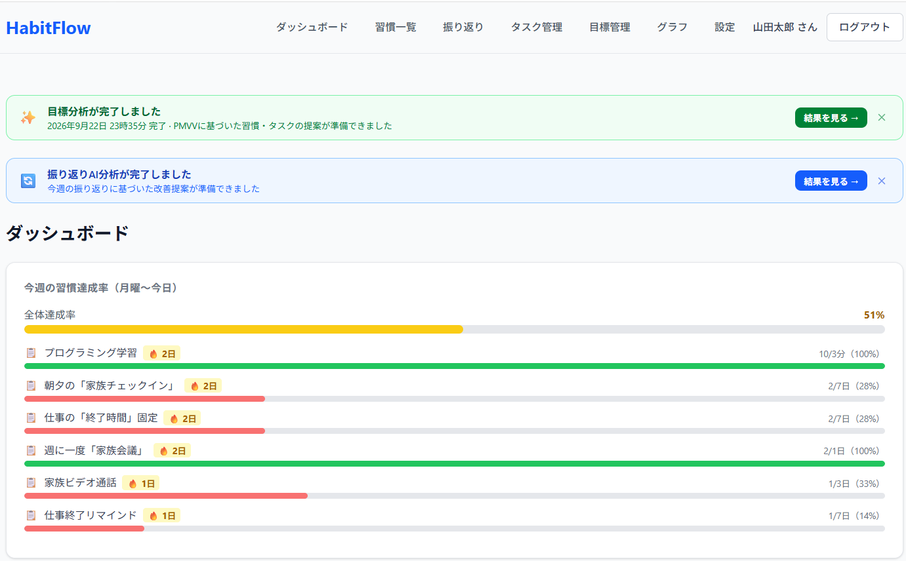
  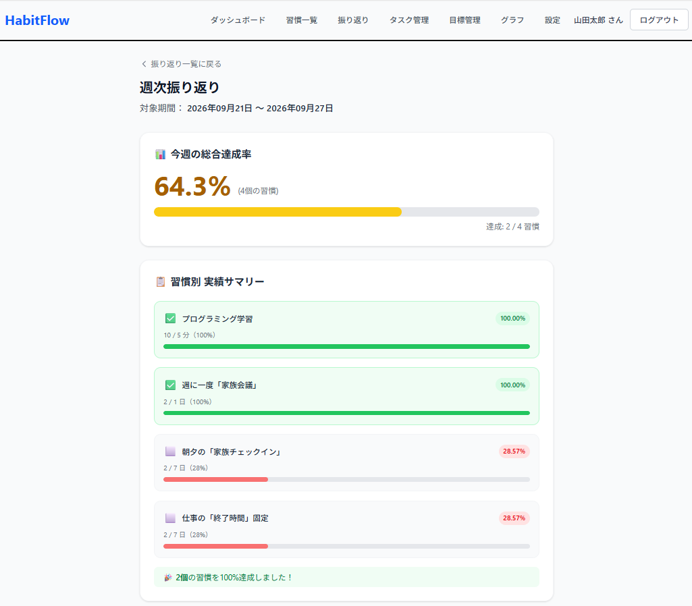
  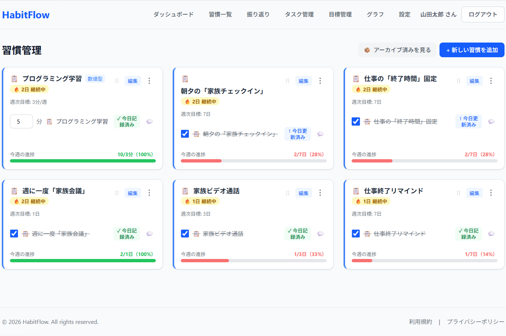
</p>

<p align="center">
  <em>ダッシュボード &nbsp;&nbsp;&nbsp; 週次振り返り &nbsp;&nbsp;&nbsp; 習慣管理</em>
</p>

<br>

---

<br>

## 🧭 利用フロー

<br>

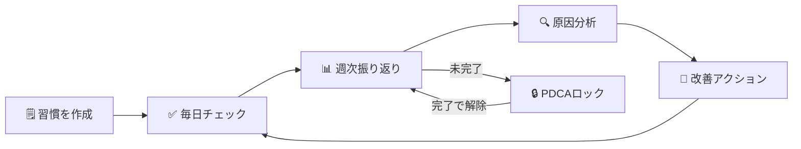
```mermaid
flowchart LR
    A[🗒️ 習慣を作成] --> B[✅ 毎日チェック]
    B --> C[📊 週次振り返り]
    C --> D[🔍 原因分析]
    D --> E[📝 改善アクション]
    E --> B
    C -->|未完了| F[🔒 PDCAロック]
    F -->|完了で解除| C
```

<br>

---

<br>

[](https://www.ruby-lang.org/)
[](https://rubyonrails.org/)
[](https://www.postgresql.org/)
[](https://www.docker.com/)
[](https://github.com/KK-arina/HabitFlow/tree/feature/A-1-db-migrations)
[](https://github.com/KK-arina/HabitFlow/tree/feature/A-2-production-deploy)
[](https://github.com/KK-arina/HabitFlow/tree/feature/A-3-good-job)
[](https://github.com/KK-arina/runteq_graduation_project/tree/feature/A-4-resend-mailer)
[](https://github.com/KK-arina/HabitFlow/tree/feature/A-5-habit-templates-seed)
[](https://github.com/KK-arina/HabitFlow/tree/feature/A-6-db-index-audit)
[](https://github.com/KK-arina/HabitFlow/tree/feature/A-7-transaction-design)
[](https://github.com/KK-arina/HabitFlow/tree/feature/B-1-numeric-habit)
[](https://github.com/KK-arina/HabitFlow/tree/feature/B-2-habit-excluded-days)
[](https://github.com/KK-arina/HabitFlow/tree/feature/B-3-streak-calculation)
[](https://github.com/KK-arina/HabitFlow/tree/feature/B-4-habit-archive)
[](https://github.com/KK-arina/HabitFlow/tree/feature/B-5-habit-menu-modal)
[](https://github.com/KK-arina/HabitFlow/tree/feature/B-6-habit-color-icon-sort)
[](https://github.com/KK-arina/HabitFlow/tree/feature/B-7-habit-record-memo)
[](https://github.com/KK-arina/HabitFlow/tree/feature/C-1-task-model-crud)
[](https://github.com/KK-arina/HabitFlow/tree/feature/C-2-task-toggle-status)
[](https://github.com/KK-arina/HabitFlow/tree/feature/C-3-task-delete-modal)
[](https://github.com/KK-arina/HabitFlow/tree/feature/C-4-weekly-reflection-task-summary)
[](https://github.com/KK-arina/HabitFlow/tree/feature/C-5-task-alarm-job)
[](https://github.com/KK-arina/HabitFlow/tree/feature/C-6-dashboard-task-priority-stats)
[](https://github.com/KK-arina/HabitFlow/tree/feature/C-7-task-ai-edit)
[](https://github.com/KK-arina/HabitFlow/tree/feature/D-1-user-purpose-model)
[](https://github.com/KK-arina/HabitFlow/tree/feature/D-2-purpose-analysis-job)
[](https://github.com/KK-arina/HabitFlow/tree/feature/D-3-pmvv-show-and-ai-result)
[](https://github.com/KK-arina/HabitFlow/tree/feature/D-4-weekly-reflection-analysis-job)
[](https://github.com/KK-arina/HabitFlow/tree/feature/D-5-crisis-intervention)
[](https://github.com/KK-arina/HabitFlow/tree/feature/D-6-ai-cost-limit)
[](https://github.com/KK-arina/HabitFlow/tree/feature/D-7-onboarding-pmvv-step)
[](https://github.com/KK-arina/HabitFlow/tree/feature/D-8-habit-ai-edit)
[](https://github.com/KK-arina/HabitFlow/tree/feature/D-9-ai-analysis-input-snapshot-validation)
[](https://github.com/KK-arina/HabitFlow/tree/feature/d-10-ai-rate-limit)
[](https://github.com/KK-arina/HabitFlow/tree/feature/d-11-ai-error-handling-ux)
[](https://github.com/KK-arina/HabitFlow/tree/feature/e-1-weekly-reflection-mood-enhancements)
[](https://github.com/KK-arina/HabitFlow/tree/feature/e-2-habit-snapshot-numeric)
[](https://github.com/KK-arina/HabitFlow/tree/feature/e3-ai-proposal-modal)
[](https://github.com/KK-arina/HabitFlow/tree/feature/e4-deep-link)
[](https://github.com/KK-arina/HabitFlow/tree/feature/e-5-reflection-show-enhancement)
[](https://github.com/KK-arina/HabitFlow/tree/feature/f-1-omniauth-google)
[](https://github.com/KK-arina/HabitFlow/tree/feature/f-2-omniauth-line)
[](https://github.com/KK-arina/HabitFlow/tree/feature/f3-terms-agreement)
[](https://github.com/KK-arina/HabitFlow/tree/feature/f4-password-reset)
[](https://github.com/KK-arina/HabitFlow/tree/feature/F-5-rack-attack)
[](https://github.com/KK-arina/HabitFlow/tree/feature/f-6-user-destroy-policy)
[](https://github.com/KK-arina/HabitFlow/tree/feature/g-1-line-notification)
[](https://github.com/KK-arina/HabitFlow/tree/feature/g2-weekly-report-mail)
[](https://github.com/KK-arina/HabitFlow/tree/feature/g3-notification-settings)
[](https://github.com/KK-arina/HabitFlow/tree/feature/g4-rest-mode)
[](https://github.com/KK-arina/HabitFlow/tree/feature/G-5-csv-export)
[](https://github.com/KK-arina/HabitFlow/tree/feature/g6-settings-page-expansion)
[](https://github.com/KK-arina/HabitFlow/tree/feature/g7-dashboard-completion-banner)
[](https://github.com/KK-arina/HabitFlow/tree/feature/G-8-monthly-ai-count-reset-test)
[](https://github.com/KK-arina/HabitFlow/tree/feature/g-9-weekly-reflection-ai-proposal-extension)
[](https://github.com/KK-arina/HabitFlow/tree/feature/h1-bottom-navigation)
[](https://github.com/KK-arina/HabitFlow/tree/feature/H-2-bottom-sheet-modal)
[](https://github.com/KK-arina/HabitFlow/tree/feature/H-3-voice-input)
[](https://github.com/KK-arina/HabitFlow/tree/feature/H-4-analytics-page)
[](https://github.com/KK-arina/HabitFlow/tree/feature/H-5-onboarding-template-selection)
[](https://github.com/KK-arina/HabitFlow/tree/feature/h-6-responsive-adjustment)
[](https://github.com/KK-arina/HabitFlow/tree/feature/h-7-empty-state-ui)
[](https://github.com/KK-arina/HabitFlow/tree/feature/h-8-personalize-ai-context)
[](https://github.com/KK-arina/HabitFlow/tree/feature/H-9-n-plus-one-optimization)
[](https://github.com/KK-arina/HabitFlow/tree/feature/h-10-crisis-skipped-banner)
[](https://github.com/KK-arina/HabitFlow/tree/feature/i-1-integration-model-tests)
[](https://github.com/KK-arina/HabitFlow/tree/feature/i-6-solid-cache)
[-完了-10b981?style=flat-square)](https://github.com/KK-arina/HabitFlow/tree/feature/i-5-sentry)
[](https://github.com/KK-arina/HabitFlow/tree/feature/i-2-security-final-check)
[](https://github.com/KK-arina/HabitFlow/tree/feature/i-2-security-final-check)
[](https://github.com/KK-arina/HabitFlow/tree/feature/i-3-production-check)
[](https://github.com/KK-arina/HabitFlow/tree/feature/i-4-readme-docs-final-update)
[]()

<br>

---

<br>

## 🌐 本番環境

<br>

**URL**: https://habitflow-web.onrender.com

<br>

| 項目 | 内容 |
|:---|:---|
| ホスティング | Render（無料プラン） |
| データベース | Neon Serverless PostgreSQL 16（永続・無料） |
| デプロイ | GitHub の `main` ブランチへの Push で自動実行 |
| Web サーバー | Puma（Worker: 2 / Thread: 3 / Cluster mode） |

<br>

> ⚠️ **Render 無料プランのスリープについて**<br>
> 15分間アクセスがないとサービスがスリープします。<br>
> 初回アクセス時は起動まで **約30〜60秒** かかる場合があります。

<br>

> 📌 **Neon を採用した理由**<br>
> Render 内蔵の無料 PostgreSQL は作成から **90日で自動削除** される制限がある。<br>
> Neon Serverless Postgres は永続的な無料プランを提供しており、長期運用に最適。<br>
> また Render と同じ Singapore リージョンに配置することで Web ↔ DB 間のレイテンシを最小化している。

<br>

---

<br>

### 🚧 本リリース開発進捗

<br>

| Week | テーマ | ISSUE | SP | 状態 |
|:---|:---|:---:|:---:|:---:|
| Week A | DB・インフラ基盤 | #A-1〜#A-7 | 24 | ✅ 完了 |
| Week B | 習慣機能拡張 | #B-1〜#B-7 | 28 | ✅ 完了 |
| Week C | タスク管理機能 | #C-1〜#C-7 | 28 | ✅ 完了 |
| Week D | AI分析・PMVV機能 | #D-1〜#D-11 | 42 | ✅ 完了 |
| Week E | 週次振り返り拡張 | #E-1〜#E-5 | 22 | ✅ 完了 |
| Week F | 認証拡張 | #F-1〜#F-6 | 21 | ✅ 完了 |
| Week G | 通知・設定拡張 | #G-1〜#G-9 | 34 | ✅ 完了 |
| Week H | フロントエンド強化 | #H-1〜#H-10 | 37 | ✅ 完了 |
| Week I | 品質・テスト・デプロイ | #I-1〜#I-6 | 22 | ✅ 完了 |
| **合計** | | **70** | **233** | |

<br>

#### ✅ 完了済みISSUE

<br>

| ISSUE | タイトル | 完了日 | ブランチ |
|:---|:---|:---:|:---|
| #A-1 | 本リリース用DBマイグレーション（全差分） | 2026-03-20 | feature/A-1-db-migrations |
| #A-2 | 本番環境デプロイ（Render + Neon PostgreSQL） | 2026-03-20 | feature/A-2-production-deploy |
| #A-3 | GoodJob 導入・非同期処理基盤構築 | 2026-03-20 | feature/A-3-good-job |
| #A-4 | Resend メール送信設定 | 2026-03-22 | feature/A-4-resend-mailer |
| #A-5 | habit_templates シードデータ・モデル作成 | 2026-03-22 | feature/A-5-habit-templates-seed |
| #A-6 | DBインデックス監査・最適化 | 2026-03-22 | feature/A-6-db-index-audit |
| #A-7 | DBトランザクション設計・複数テーブル更新の整合性保証 | 2026-03-22 | feature/A-7-transaction-design |
| #B-1 | 数値型習慣の記録・達成率計算・リフレクション手法対応 | 2026-03-27 | feature/B-1-numeric-habit |
| #B-2 | 習慣の除外日設定（habit_excluded_days） | 2026-03-28 | feature/B-2-habit-excluded-days |
| #B-3 | ストリーク計算・表示（current_streak / longest_streak） | 2026-03-29 | feature/B-3-streak-calculation |
| #B-4 | 習慣のアーカイブ機能（archived_at）| 2026-03-29 | feature/B-4-habit-archive |
| #B-5 | 習慣削除確認モーダル（M-1）⋯メニュー + デスクトップモーダル / スマホボトムシート | 2026-03-30 | feature/B-5-habit-menu-modal |
| #B-6 | 習慣のカラー・アイコン・Drag&Drop 並び替え（acts_as_list + SortableJS） | 2026-04-05 | feature/B-6-habit-color-icon-sort |
| #B-7 | habit_records.memo（日次メモ）機能 | 2026-04-06 | feature/B-7-habit-record-memo |
| #C-1 | Task モデル・基本 CRUD（Must/Should/Could優先度・todo/done/archived状態管理） | 2026-04-07 | feature/C-1-task-model-crud |
| #C-2 | タスクの完了チェック・ステータス管理（toggle_complete/archive/archive_all_done・Turbo Stream） | 2026-04-07 | feature/C-2-task-toggle-status |
| #C-3 | タスク削除確認モーダル（M-2）・手動タスク削除（ai_generated=false のみ削除可・デスクトップ中央モーダル/スマホボトムシート・Turbo Stream削除・トースト通知） | 2026-04-08 | feature/C-3-task-delete-modal |
| #C-4 | 週次振り返りのタスクスナップショット保存（weekly_reflection_task_summaries・was_completedフラグ・優先度別表示・toggle後モーダル再注入バグ修正） | 2026-04-08 | feature/C-4-weekly-reflection-task-summary |
| #C-5 | タスクアラーム通知（GoodJob + メール）・NotificationLogモデル・TaskAlarmJob・TaskMailer・alarm_enabled/scheduled_at/alarm_minutes_beforeフィールド追加・update時の再スケジュール・AlarmToggleController | 2026-04-12 | feature/C-5-task-alarm-job |
| #C-6 | ダッシュボードの Must/Should/Could 別タスク達成率表示・達成率カラーの全画面統一・習慣フォーム改善 | 2026-04-18 | feature/C-6-dashboard-task-priority-stats |
| #C-7 | タスクのAI編集ページ（11番・AI提案モーダル経由）session[:ai_context_task_id]によるアクセス制御・優先度変更不可の二重防御・ai_update_params・form_with + data: { turbo: false } | 2026-04-19 | feature/C-7-task-ai-edit |
| #D-1 | UserPurpose モデル・PMVV入力ページ（17番）・PMVV目標管理ページ（16番） | 2026-04-19 | feature/D-1-user-purpose-model |
| #D-2 | PMVV AI分析ジョブ（GoodJob + Gemini API / Groq フォールバック） | 2026-04-25 | feature/D-2-purpose-analysis-job |
| #D-3 | PMVV目標管理ページ（16番）・AI分析結果ページ（18番） | 2026-04-26 | feature/D-3-pmvv-show-and-ai-result |
| #D-4 | 週次振り返りAI分析ジョブ（GoodJob + Gemini API / Groq フォールバック） | 2026-04-26 | feature/D-4-weekly-reflection-analysis-job |
| #D-5 | 危機介入機能（Railsキーワード検出 + プロンプトルール） | 2026-05-03 | feature/D-5-crisis-intervention |
| #D-6 | AIコスト上限管理（ai_analysis_monthly_limit・14-Bモーダル） | 2026-05-03 | feature/D-6-ai-cost-limit |
| #D-7 | オンボーディング 5/5 PMVV入力ステップ | 2026-05-04 | feature/D-7-onboarding-pmvv-step |
| #D-8 | AI提案の習慣編集ページ（8番・AI経由限定）session[:ai_context_habit_id]によるアクセス制御・measurement_type変更不可の二重防御・ai_update_params・form_with + data: { turbo: false } | 2026-05-04 | feature/D-8-habit-ai-edit |
| #D-9 | AiAnalysis input_snapshot JSONBスキーマバリデーション | 2026-05-05 | feature/D-9-ai-analysis-input-snapshot-validation |
| #D-10 | AI API レート制限（連打防止）・favicon.ico UnknownFormat修正 | 2026-05-05 | feature/d-10-ai-rate-limit |
| #D-11 | AI APIエラーハンドリングUX改善（タイムアウト・失敗時） | 2026-05-06 | feature/d-11-ai-error-handling-ux |
| #E-1 | 振り返りポイント必須化・PMVV必須化・気分スコア・音声入力 | 2026-05-11 | feature/e-1-weekly-reflection-mood-enhancements |
| #E-2 | 振り返りの習慣スナップショット更新（数値型・単位対応） | 2026-05-13 | feature/e-2-habit-snapshot-numeric |
| #E-3 | AI提案プレビューモーダル・プログレスバーリアルタイム更新・AI分析完了通知 | 2026-05-16 | feature/e3-ai-proposal-modal |
| #E-4 | 通知ディープリンク実装（redirect_to パラメータ・オープンリダイレクト防止） | 2026-05-16 | feature/e4-deep-link |
| #E-5 | 振り返り詳細ページ（15番）の強化（AI分析コメント・ポーリング・免責バナー） | 2026-05-17 | feature/e-5-reflection-show-enhancement |
| #F-1 | OmniAuth Google ログイン | 2026-05-18 | feature/f-1-omniauth-google |
| #F-2 | OmniAuth LINE ログイン | 2026-05-21 | feature/f-2-omniauth-line |
| #F-3 | 利用規約・プライバシーポリシー同意（登録時必須） | 2026-05-23 | feature/f3-terms-agreement |
| #F-4 | パスワードリセット機能（Resend メール送信・BCryptトークン） | 2026-05-23 | feature/f4-password-reset |
| #F-5 | rack-attack によるブルートフォース対策 | 2026-05-23 | feature/F-5-rack-attack |
| #F-6 | ユーザーデータ削除ポリシー（退会時の論理削除 / カスケード設計） | 2026-05-24 | feature/f-6-user-destroy-policy |
| #G-1 | LINE Messaging API 通知基盤（Push通知・フォールバック・通知ログ） | 2026-05-31 | feature/g-1-line-notification |
| #G-2 | 週次レポートメール（毎週月曜日 GoodJob cron） | 2026-05-31 | feature/g2-weekly-report-mail |
| #G-3 | 通知設定ページ（UserSettingsController・トグルスイッチ・スライダー） | 2026-06-02 | feature/g3-notification-settings |
| #G-4 | お休みモード設定ページ（22番）・ストリーク維持 | 2026-06-06 | feature/g4-rest-mode |
| #G-5 | CSVエクスポート機能（習慣記録・タスク・振り返り） | 2026-06-07 | feature/G-5-csv-export |
| #G-6 | 設定ページ拡張（プロフィール編集・LINE/Google連携・タイムゾーン・AI使用状況）+ G-3通知設定修正 | 2026-06-10 | feature/g6-settings-page-expansion |
| #G-7 | AI分析完了時のダッシュボードリアルタイム通知バナー（PMVV目標分析・振り返りAI分析） | 2026-06-13 | feature/g7-dashboard-completion-banner |
| #G-8 | AI分析カウント月次リセットバッチのテスト追加（MonthlyAiCountResetJob） | 2026-06-13 | feature/G-8-monthly-ai-count-reset-test |
| #G-9 | 週次振り返りAI提案拡張（habit_modify/habit_delete/task_modify/goal_review・PROMPT_VERSION v2.0・maxOutputTokens 8192） | 2026-06-14 | feature/g-9-weekly-reflection-ai-proposal-extension |
| #H-1 | スマホ Bottom Navigation 実装（5タブ・バッジ・SafeArea対応・ia.yml連携） | 2026-06-14 | feature/h1-bottom-navigation |
| #H-2 | M-4退会確認モーダルのスマホボトムシート対応・全モーダルz-index修正・フッターBN対応 | 2026-06-14 | feature/H-2-bottom-sheet-modal |
| #H-3 | 音声入力機能（voice_input_controller.js）Web Speech API・リアルタイム追記・連打防止・複数フィールド排他制御・インライントースト表示 | 2026-06-21 | feature/H-3-voice-input |
| #H-4 | グラフ・進捗分析ページ（19番）Chart.js可視化（UMDビルド）・期間フィルター・N+1ゼロ設計・バッジ訪問ベースリセット・デスクトップ用ヘッダーリンク追加 | 2026-06-22 | feature/H-4-analytics-page |
| #H-5 | オンボーディング step2 習慣テンプレート選択（1/2）・step5 テンプレート確認（2/2） | 2026-06-26 | feature/H-5-onboarding-template-selection |
| #H-6 | スマホ対応レスポンシブ調整（iOS自動ズーム防止・タップ領域44px・横スクロール対応） | 2026-06-27 | feature/h-6-responsive-adjustment |
| #H-7 | Empty State UI 実装（共通パーシャル化・全画面統一） | 2026-06-28 | feature/h-7-empty-state-ui |
| #H-8 | パーソナライズAIコンテキスト生成（UserContextBuilderService） | 2026-06-29 | feature/h-8-personalize-ai-context |
| #H-9 | N+1クエリ検知・includes最適化（Habit#excluded_day_numbers の pluck→map）・グラフタブ青バッジ重複カウント修正（bn_ai_analysis_count に is_latest 絞り込み）・aria-current統一・PMVV/振り返り完了バナーの永続表示（✖を押すまでリロード後も残す） | 2026-07-09 | feature/H-9-n-plus-one-optimization |
| #H-10 | 危機介入レコードによるダッシュボード「分析中」誤表示の修正（最新AiAnalysisを is_latest で取得し `crisis_detected` で分岐・`@reflection_crisis_skipped` 追加・pending条件に `!@reflection_crisis_skipped`・💛「見送り」専用バナー・回帰テスト4件・`data-testid`検証・バナー文言のi18n化） | 2026-07-12 | feature/h-10-crisis-skipped-banner |
| #I-1 | 統合・モデルテスト（本リリース分）＋ `db:migrate:status` の `NO FILE` 棚卸し＋危機監査レコード保存バグ修正 | 2026-07-14 | feature/i-1-integration-model-tests |
| #I-6 | キャッシュ戦略設計（Solid Cache 導入・ダッシュボード/グラフ/AI分析結果ページのキャッシュ・`after_commit` 無効化）＋ Redis不要の単一DB構成 | 2026-07-18 | feature/i-6-solid-cache |
| #I-5 | エラー監視・本番ログ基盤構築（Sentry） | 2026-07-21 | feature/i-5-sentry |
| #I-2 | セキュリティ最終確認（Brakeman 0件 / 認可 / Strong Parameters / OmniAuth CSRF / CSV署名トークン / ai_context） | 2026-07-26 | feature/i-2-security-final-check |
| #I-3 | 本番動作確認（Render 本番の最終スモーク：本番設定/ENV 監査・Sentry 本番エラー修正・ストリークの cron 非依存化・CSP(blob/LINE)・/up ヘルスチェック・Lighthouse 対応・gem 脆弱性一括更新） | 2026-08-30 | feature/i-3-production-check |
| #I-4 | README・ドキュメント最終更新（本リリース機能反映・技術スタック実バージョン化・既知の制限事項の刷新・スクリーンショット更新・README分割スリム化・本番Groqモデル廃止対応＋全プロバイダ失敗のSentry検知追加） | 2026-09-05 | feature/i-4-readme-docs-final-update |

<br>

---

<br>

## 📋 サービス概要

<br>

HabitFlow は「なぜ習慣が続かないのか」の**真の原因**を究明し、改善サイクルを自動化する自己成長サポートアプリです。

<br>

### 解決する課題

<br>

多くの習慣管理アプリは「記録するだけ」で終わります。<br>
「仕事が忙しかった」「疲れていた」という表面的な言い訳で習慣が途切れ、同じ失敗を繰り返す。<br>
**この「甘え」は明文化・可視化されていないから許されてしまいます。**

<br>

### HabitFlow の解決アプローチ

<br>

1. **週次振り返り** — できなかった理由を明文化して記録
2. **PDCA強制ロック** — 振り返りを完了しないと新しい習慣を追加できない仕組み
3. **AI分析連携（拡張機能）** — 外部 AI に現状を共有し、「なぜ？」を3回繰り返して真の原因を究明

<br>

---

<br>

## 📸 スクリーンショット

<br>

### ① ダッシュボード

今週の達成率と今日の習慣チェックリストを一覧表示します。ヘッダーから目標管理・グラフなど本リリースの各機能へアクセスできます。

<br>


<br>

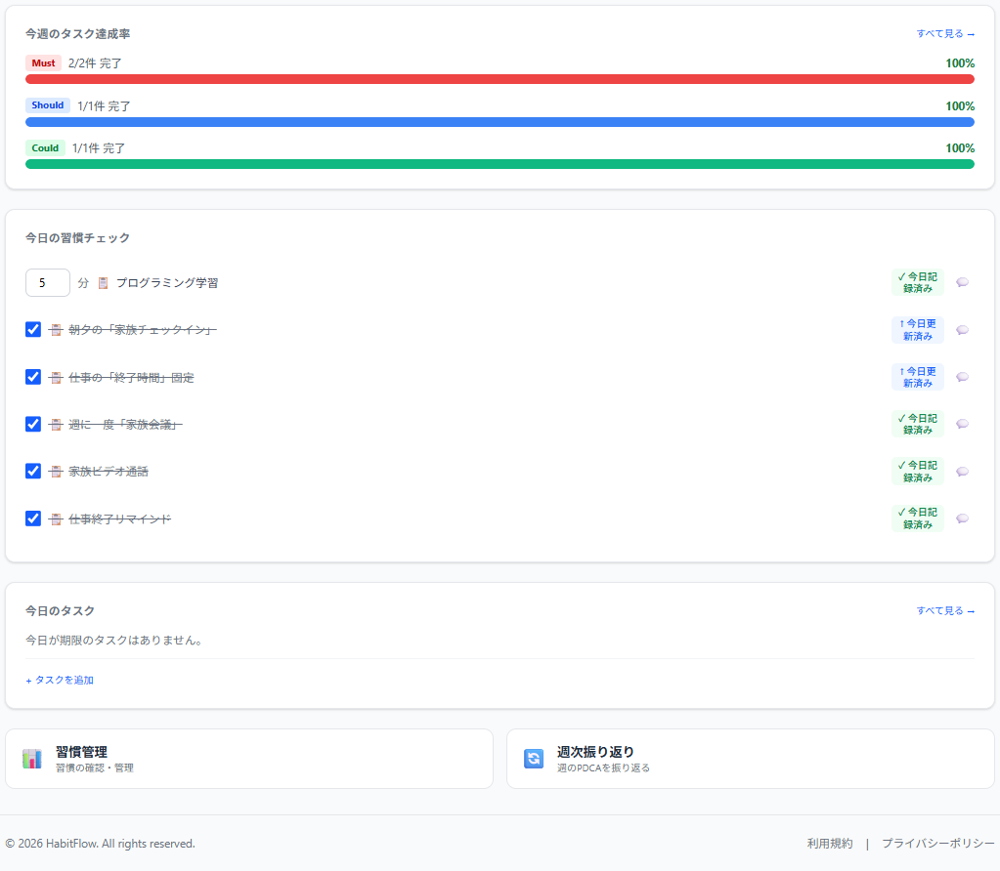

<br>

---

<br>

### ② 週次振り返り

今週の習慣達成結果を確認し、振り返りコメントを記録する画面です。AI 分析コメントや過去の振り返り履歴も確認できます。

<br>


<br>

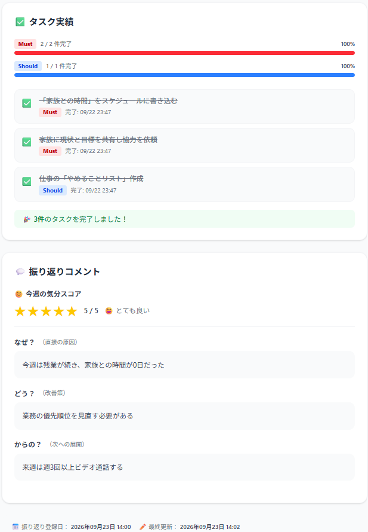

<br>

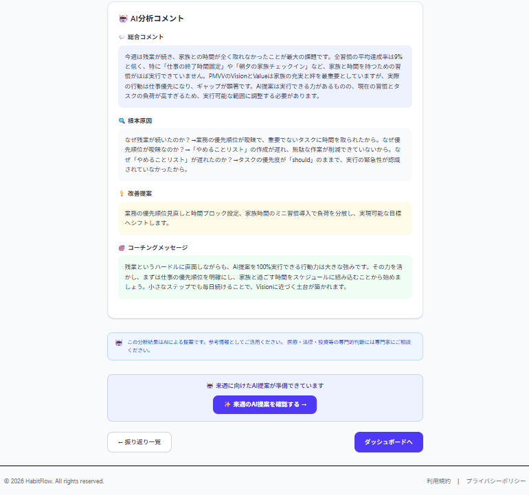

<br>

---

<br>

### ③ 習慣一覧

登録済みの習慣と今週の進捗率をカード形式で表示します。ストリーク（連続達成）・カラー・アイコンで習慣を見分けられます。

<br>


<br>

---

<br>

### ④ タスク管理

Must / Should / Could の3段階で優先度を管理し、完了チェック・アーカイブができます。

<br>

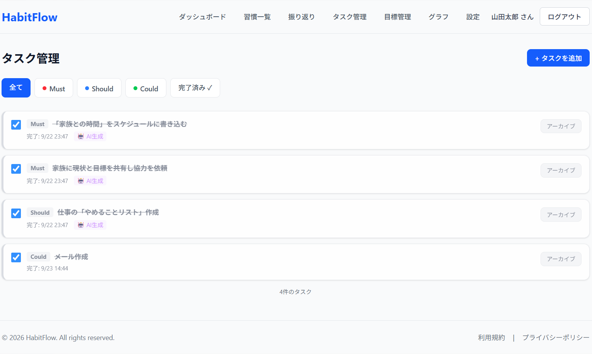

<br>

---

<br>

### ⑤ グラフ・進捗分析

Chart.js による達成率の推移グラフ。期間フィルターで週・月単位の変化を確認できます。

<br>

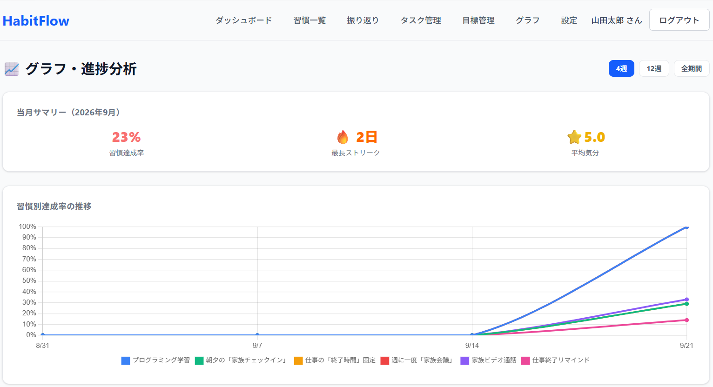

<br>

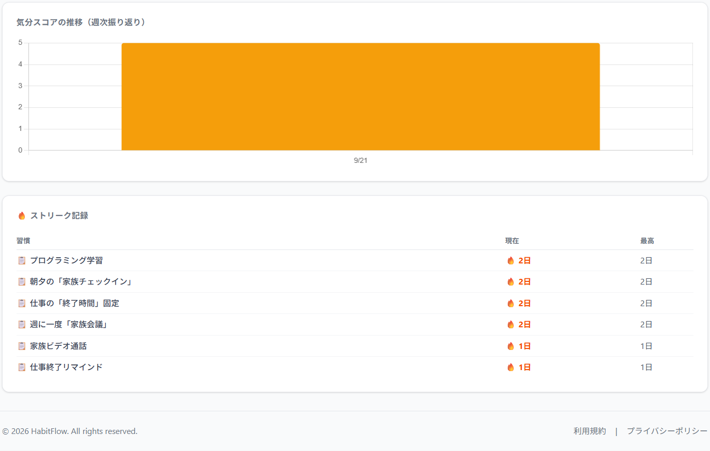

<br>

---

<br>

### ⑥ PMVV 目標管理・AI 分析

Purpose / Mission / Vision / Value を登録し、AI が習慣・タスクとの整合性を分析します。

<br>

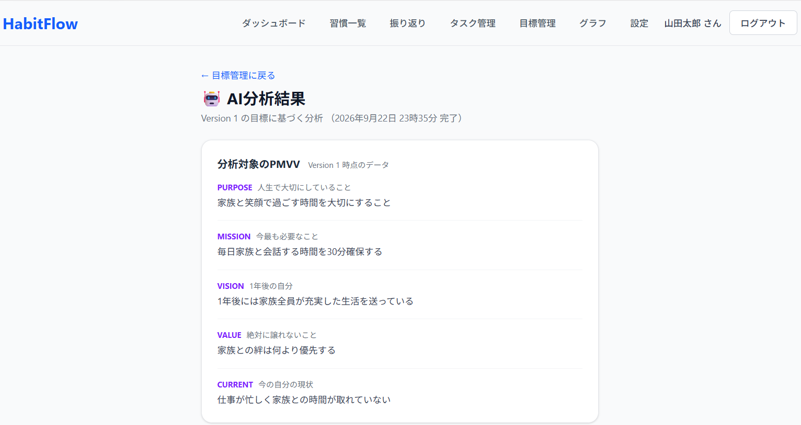

<br>

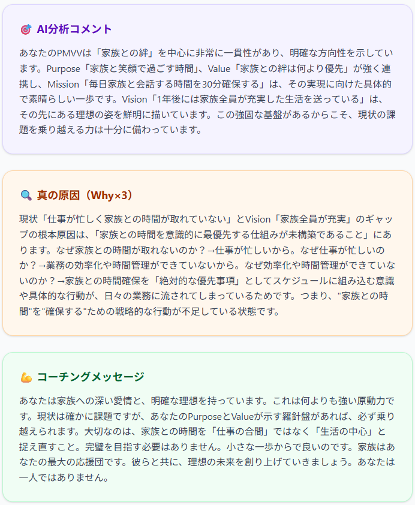

<br>

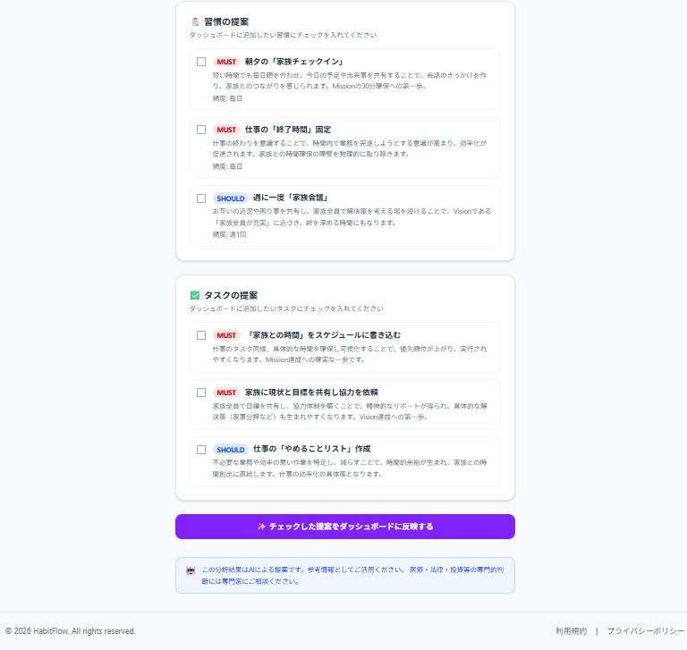

<br>

---

<br>

### ⑦ スマホ版（Bottom Navigation）

スマホでは画面下部のタブバーから主要機能へ即座にアクセスできます。

<br>

<p align="center">
  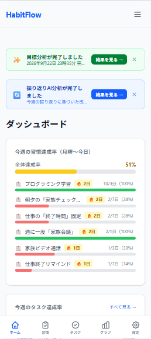
</p>

<br>

---

<br>

## ✅ 実装済み機能一覧

<br>

### 認証機能

<br>

| 機能 | 説明 |
|:---|:---|
| ユーザー登録 | メールアドレス・パスワードで新規登録 |
| ログイン / ログアウト | bcrypt による安全な認証 |
| セッション管理 | `reset_session` によるセッション固定攻撃対策 |

<br>

### 習慣管理機能

<br>

| 機能 | 説明 |
|:---|:---|
| 習慣の登録 | 習慣名（最大50文字）と週次目標回数（1〜7回）を設定 |
| 習慣の削除 | 論理削除（`deleted_at`）で過去データを保持したまま削除 |
| 日次記録 | チェックボックスをクリックするだけで即時保存（ページリロード不要） |
| 週次進捗統計 | 今週の達成率・達成日数を自動計算して表示 |

<br>

### ダッシュボード

<br>

| 機能 | 説明 |
|:---|:---|
| 今週の達成率 | 全習慣の平均達成率をプログレスバーで表示 |
| 今日の習慣チェックリスト | 今日記録すべき習慣の一覧をチェックボックス付きで表示 |
| PDCA ロック警告バナー | 振り返り未完了時に警告バナーを表示（振り返りページへの導線付き） |

<br>

### 週次振り返り機能

<br>

| 機能 | 説明 |
|:---|:---|
| 振り返り一覧 | 過去の完了済み振り返りと今週の達成率サマリーを表示 |
| 振り返り入力 | 今週の習慣実績を確認しながらコメント（最大1000文字）を記録 |
| 振り返り詳細 | 保存済みの振り返り内容と習慣別達成率を閲覧 |
| スナップショット保存 | 振り返り時点の習慣名・目標値を永続保存（後から習慣を変更しても過去記録は正確に表示） |

<br>

### PDCA 強制ロック機能

<br>

| 機能 | 説明 |
|:---|:---|
| ロック発動 | 月曜 AM4:00 以降、前週の振り返りが未完了の場合に自動ロック |
| ロック中の制限 | 習慣の新規追加・削除をブロック（日次記録のチェックは継続可能） |
| ロック自動解除 | 振り返りを完了すると即時解除され、緑色のバナーで通知 |

<br>

### UI / UX

<br>

| 機能 | 説明 |
|:---|:---|
| レスポンシブデザイン | スマホ・タブレット・PC すべてに対応 |
| ハンバーガーメニュー | モバイルでのナビゲーション |
| トースト通知 | 操作結果をフェードアウトアニメーション付きで表示 |
| カスタムエラーページ | 404 / 422 / 500 エラーページをカスタムデザインで表示 |
| アクセシビリティ | WCAG 2.1 AA 基準準拠（スキップリンク・ARIA 属性・キーボード操作対応） |

<br>

---

<br>

## 🚀 本リリース実装済み機能

<br>

本リリースで実装した全機能（#A-1〜#I-6 / 70 ISSUE）の実装詳細をまとめています。<br>
ISSUE ごとの設計判断・実装ポイント・工夫は、以下の分割ドキュメントを参照してください。

<br>

👉 **[本リリース実装済み機能の詳細（docs/features.md）](docs/features.md)**

<br>

---

<br>

## 🔧 技術的な工夫

<br>

日付境界（AM4:00）・PDCA ロック・AI フォールバック設計・DB 整合性設計など、<br>
実装上の技術的な工夫の詳細をまとめています。

<br>

👉 **[技術的な工夫の詳細（docs/technical-notes.md）](docs/technical-notes.md)**

<br>

---

<br>

## 🛠️ 技術スタック

<br>

### バックエンド

<br>

| 技術 | バージョン | 用途 |
|:---|:---|:---|
| Ruby | 3.4.10 | プログラミング言語（3.4 系最新パッチ・zlib CVE 対応） |
| Ruby on Rails | 8.1.3.1 | Web フレームワーク（7.2.3 からアップグレード・#I-3 でパッチ更新） |
| PostgreSQL | 16 | データベース |
| bcrypt | 3.1.7 系 | パスワードハッシュ化 |
| Puma | 7.2.1 | Web サーバー（#I-3 で 7.0 系 → 7.2.1 に更新） |

<br>

### 本リリース追加スタック（すべて導入済み）

<br>

| 技術 | 用途 | ISSUE | 状態 |
|:---|:---|:---|:---:|
| Neon Serverless Postgres | 永続無料 DB（Render 内蔵 DB の90日削除回避） | #A-2 | ✅ 完了 |
| GoodJob 4.19.2 | バックグラウンドジョブ（AI分析・通知・ストリーク計算・:async モードで Web プロセス内実行） | #A-3 | ✅ 完了 |
| Resend | メール送信（パスワードリセット・週次レポート） | #A-4 #G-2 | ✅ 完了 |
| letter_opener_web | 開発環境メールプレビュー（Docker対応） | #A-4 #F-4 | ✅ 完了 |
| habit_templates マスタデータ | オンボーディング用習慣テンプレート（18件） | #A-5 | ✅ 完了 |
| OmniAuth Google | ソーシャルログイン（Google） | #F-1 | ✅ 完了 |
| OmniAuth LINE（omniauth-line-v2_1） | ソーシャルログイン（LINE） | #F-2 | ✅ 完了 |
| rack-attack 6.8 | ブルートフォース対策・レート制限（Redis不要・DB/メモリキャッシュ対応） | #F-5 | ✅ 完了 |
| LINE Messaging API（Net::HTTP） | プッシュ通知（Push Message・フォールバック設計） | #G-1 | ✅ 完了 |
| faraday | Gemini REST API / Groq API の HTTP 通信 | #D-2 | ✅ 完了 |
| Gemini API（gemini-2.5-flash） | AI分析デフォルトプロバイダ（PMVV・週次振り返り） | #D-2 / #D-4 | ✅ 完了（#D-2）|
| Groq API（openai/gpt-oss-120b） | AI分析フォールバックプロバイダ | #D-2 / #D-4 | ✅ 完了（#D-2）|
| Solid Cache 1.0.10 | Redis不要のキャッシュ（ダッシュボード/グラフ/AI分析結果・単一DB構成） | #I-6 | ✅ 完了 |
| Solid Cable 3.0.12 | Redis不要の Action Cable アダプタ（DB ベース・cable.yml で primary と同一 DB を使用） | #I-6 | ✅ 完了 |
| Sentry（sentry-ruby / sentry-rails 6.6.2） | エラー監視・本番ログ基盤（Rails / AI / GoodJob / JS の例外を捕捉） | #I-5 | ✅ 完了 |
| acts_as_list | 習慣の並び替え | #B-6 | ✅ 完了 |
| Chart.js v4（UMDビルド） | グラフ可視化（折れ線・棒グラフ） | #H-4 | ✅ 完了 |
| bundler-audit | gem の既知脆弱性スキャン（`bundle exec bundle-audit`） | #I-3 | ✅ 完了 |

<br>

### フロントエンド

<br>

| 技術 | 用途 |
|:---|:---|
| Hotwire（Turbo） | ページリロードなしの即時 UI 更新 |
| Hotwire（Stimulus） | 軽量な JavaScript コントローラー |
| Tailwind CSS | ユーティリティファーストの CSS フレームワーク |
| Importmap | Node.js 不要の JavaScript モジュール管理 |

<br>

### インフラ・開発環境

<br>

| 技術 | 用途 |
|:---|:---|
| Docker / Docker Compose | ローカル開発環境の統一 |
| Render（無料プラン） | 本番環境ホスティング（Web Service） |
| Neon Serverless PostgreSQL | 本番環境データベース（永続無料） |
| GitHub | バージョン管理・自動デプロイトリガー |

<br>

### 開発補助ツール

<br>

| ツール | 用途 |
|:---|:---|
| Bullet | N+1 問題の自動検出（development 環境のみ） |
| Brakeman | セキュリティ脆弱性の静的解析 |
| RuboCop | コーディング規約チェック |
| Capybara / Selenium | E2E テスト |
| rack-mini-profiler | ページのSQL数・実行時間をリアルタイム表示（development 環境のみ） |
| Dependabot | gem・Docker の依存を毎週監視し更新 PR を自動作成（GitHub 純正・無料） |

<br>

---

<br>

## 🗄️ データベース設計

<br>

### MVP 実装済みテーブル

<br>

| テーブル名 | 説明 |
|:---|:---|
| `users` | ユーザー情報・認証 |
| `habits` | 習慣（論理削除対応） |
| `habit_records` | 日次記録（AM4:00 基準・ユニーク制約） |
| `weekly_reflections` | 週次振り返り（ユニーク制約） |
| `weekly_reflection_habit_summaries` | 振り返り時点のスナップショット |

<br>

### 本リリース追加テーブル（#A-1 完了）

<br>

| テーブル名 | 説明 | 状態 |
|:---|:---|:---:|
| `habit_excluded_days` | 習慣ごとの除外曜日 | ✅ 追加済み |
| `tasks` | タスク管理（Must/Should/Could） | ✅ 追加済み |
| `ai_analyses` | AI分析結果 | ✅ 追加済み |
| `user_settings` | ユーザー設定 | ✅ 追加済み |
| `user_purposes` | PMVV目標管理 | ✅ 追加済み |
| `habit_templates` | オンボーディング用テンプレート | ✅ 追加済み |
| `notification_logs` | 通知送信履歴 | ✅ 追加済み |
| `push_subscriptions` | Web Push購読情報（将来用） | ✅ 追加済み |
| `password_reset_tokens` | パスワードリセット | ✅ 追加済み |

<br>

### 本リリース追加カラム（#H-4 完了）

<br>

| テーブル | 追加カラム | 目的 |
|:---|:---|:---|
| `user_settings` | `last_analytics_viewed_at` | グラフページの最終閲覧日時を記録し、Bottom Navigationの未確認AI分析バッジを訪問ベースでリセットするために使用 |

<br>

詳細は [`docs/er-diagram-mvp.md`](docs/er-diagram-mvp.md) および [`docs/database-schema-mvp.md`](docs/database-schema-mvp.md) を参照してください。

<br>

### 本リリース追加テーブル（#H-8 完了）

<br>

| テーブル名 | 説明 | 主な設計ポイント |
|:---|:---|:---|
| `ai_user_profiles` | ユーザー別パーソナライズAIプロファイル（1ユーザー1レコード） | user_id UNIQUE制約・jsonb `default: {}`・analyzed_at インデックス・`on_delete: :cascade` |

<br>

### 本リリース追加カラム（#H-9 完了）

<br>

| テーブル | 追加カラム | 目的 |
|:---|:---|:---|
| `user_settings` | `pmvv_banner_dismissed_at` | ダッシュボードのPMVV完了バナーを✖で閉じた日時。最新PMVV分析の `created_at` がこれより新しければバナーを再表示する（リロード後も✖まで残す永続表示の判定に使用） |
| `user_settings` | `reflection_banner_dismissed_at` | ダッシュボードの振り返り完了バナーを✖で閉じた日時。PMVVと同じ方式で永続表示を制御する（両バナーの挙動を統一） |

<br>

### 本リリース追加テーブル（#I-6 完了）

<br>

| テーブル名 | 説明 | 状態 |
|:---|:---|:---:|
| `solid_cache_entries` | Solid Cache のキャッシュ保存領域（Redis不要・Neon 内に作成・キーは `key_hash` のユニークインデックスで検索） | ✅ 追加済み |

<br>

---

<br>

## 🚀 開発環境セットアップ

<br>

### 前提条件

<br>

以下がインストールされていることを確認してください。

<br>

| ツール | バージョン | 確認コマンド |
|:---|:---|:---|
| Docker Desktop | 24.0 以上 | `docker --version` |
| Docker Compose | 2.20 以上 | `docker compose version` |
| Git | 任意 | `git --version` |

<br>

### 手順

<br>

**① リポジトリのクローン**

<br>

```bash
git clone https://github.com/KK-arina/HabitFlow.git
cd HabitFlow
```

<br>

**② Docker コンテナの起動**

<br>

```bash
docker compose up
```

<br>

初回起動時は以下が自動実行されます（数分かかります）。

- Ruby イメージのダウンロード
- PostgreSQL イメージのダウンロード
- `bundle install`（Gem のインストール）
- Tailwind CSS のビルド

<br>

**③ データベースの作成とマイグレーション**

<br>

```bash
# 別のターミナルで実行（コンテナ起動中に行う）

# データベースを作成する
# db:create → config/database.yml の設定を元に development / test 用DBを作成する
docker compose exec web bin/rails db:create

# マイグレーションを実行する
# db:migrate → db/migrate/ 内の未実行ファイルを順番に適用してテーブルを作成する
docker compose exec web bin/rails db:migrate
```

<br>

**④ サンプルデータの投入（任意）**

<br>

```bash
# db:seed → db/seeds.rb を実行してデモ用のサンプルデータを投入する
# 実行後は test@example.com / password でログインできます
docker compose exec web bin/rails db:seed
```

<br>

**⑤ 動作確認**

<br>

ブラウザで http://localhost:3000 にアクセスしてランディングページが表示されれば成功です。

<br>

**⑥ コンテナの停止**

<br>

```bash
# Ctrl+C で停止（フォアグラウンド起動の場合）
# または別ターミナルで以下を実行
docker compose down
```

<br>

---

<br>

## 💻 開発コマンド一覧

<br>

### 基本操作

<br>

```bash
# コンテナ起動
docker compose up

# コンテナ停止
docker compose down

# コンテナ起動（バックグラウンド実行）
docker compose up -d
```

<br>

### Rails コマンド

<br>

```bash
# ⚠️ Rails コマンドは必ず「docker compose exec web」を先頭に付けて実行する
# 理由: コンテナ内の Ruby/Rails 環境を使用するため
#       「docker compose run」は一時コンテナを作成するため非推奨

# Rails コンソール（データの確認・操作に使用）
docker compose exec web bin/rails console

# マイグレーション実行
docker compose exec web bin/rails db:migrate

# マイグレーションのロールバック（直前のマイグレーションを取り消す）
docker compose exec web bin/rails db:rollback

# テスト実行（全テスト）
docker compose exec web bin/rails test

# テスト実行（特定ファイルのみ）
docker compose exec web bin/rails test test/models/user_test.rb
```

<br>

### Tailwind CSS

<br>

```bash
# 手動ビルド（CSSファイルを生成する）
docker compose exec web bin/rails tailwindcss:build

# 監視モード（ファイル変更を検知して自動ビルドする）
docker compose exec web bin/rails tailwindcss:watch
```

<br>

### データベース操作

<br>

```bash
# データベースを削除して再作成（テーブル定義をリセットしたい場合）
docker compose exec web bin/rails db:reset

# テスト用データベースを最新の状態に更新
docker compose exec web bin/rails db:test:prepare

# 現在のスキーマ状態を確認
docker compose exec web bin/rails db:schema:dump
```

<br>

### ログ確認

<br>

```bash
# Rails サーバーのログをリアルタイムで確認する
docker compose logs -f web

# データベースのログを確認する
docker compose logs -f db
```

<br>

---

<br>

## 📱 使い方ガイド（簡易版）

<br>

詳細は [`docs/user_guide.md`](docs/user_guide.md) を参照してください。

<br>

### 基本的な使い方の流れ

<br>

```
【毎日】5〜15分
  ↓
ダッシュボードを開く
  ↓
今日の習慣にチェックを入れる（自動保存）
  ↓
進捗率が自動更新される

【日曜夜】30〜60分
  ↓
週次振り返りページを開く
  ↓
今週の達成結果を確認する
  ↓
振り返りコメントを入力して完了する
  ↓
PDCAロックが解除される → 来週も習慣を追加・管理できる
```

<br>

### デモアカウント

<br>

| 項目 | 内容 |
|:---|:---|
| メールアドレス | `test@example.com` |
| パスワード | `password` |

<br>

> ⚠️ デモアカウントは公開環境です。個人情報は入力しないでください。

<br>

---

<br>

## ⚠️ 既知の制限事項

<br>

### 本リリースで実装した主要機能（MVP からの拡張）

<br>

MVP 段階で「未実装」としていた機能は、本リリースですべて実装完了しました。

<br>

| 機能 | 状態 | 対応 ISSUE |
|:---|:---|:---|
| タスク管理（Must/Should/Could・基本CRUD） | ✅ 実装済み | #C-1〜#C-7 |
| AI 分析連携（PMVV・週次振り返りの自動分析） | ✅ 実装済み | #D-2 / #D-4 |
| パスワードリセット（Resend メール送信） | ✅ 実装済み | #F-4 |
| オンボーディング（初回ガイド・習慣テンプレート選択・PMVV入力） | ✅ 実装済み | #D-7 / #H-5 |
| グラフ・チャート表示（Chart.js 進捗分析） | ✅ 実装済み | #H-4 |
| 数値型習慣（冊数・時間・km等） | ✅ 実装済み | #B-1 |
| 除外日設定（習慣ごとに実施しない曜日を設定） | ✅ 実装済み | #B-2 |
| 習慣のアーカイブ・ストリーク・カラー/アイコン並び替え | ✅ 実装済み | #B-3 / #B-4 / #B-6 |
| ソーシャルログイン（Google / LINE） | ✅ 実装済み | #F-1 / #F-2 |
| LINE / メール通知・週次レポート | ✅ 実装済み | #G-1 / #G-2 |
| CSV エクスポート | ✅ 実装済み | #G-5 |
| 危機介入（セーフティ）機能 | ✅ 実装済み | #D-5 |

<br>

### インフラ・環境制限

<br>

| 制限 | 内容 | 対策 |
|:---|:---|:---|
| Render 無料プランのスリープ | 15分間アクセスがないと起動に30〜60秒かかる | スリープ仕様として許容（ポートフォリオ用途） |
| Neon 無料プランの制限 | コンピュートリソースに上限あり（通常の用途では十分） | ユーザー増加時は有料プランへ移行 |
| 自動バックアップなし | Neon 無料プランには自動バックアップがない | 本番移行時は有料プランへ移行する |
| GoodJob Worker 非対応 | Render Free プランは Background Worker が利用不可（最低$7/月） | :async モードでWebプロセス内でジョブを実行（#A-4で対応済み） |
| メール送信 | Resend によるメール送信基盤を構築済み（#A-4完了） | パスワードリセット（#F-4）・週次レポート（#G-2）・タスクアラーム（#C-5）で実装済み |

<br>

### 仕様上の注意点

<br>

| 項目 | 仕様 |
|:---|:---|
| 日付の切り替え基準 | 深夜 **AM4:00** を1日の境界とする（例: AM3:59 は前日として記録） |
| PDCA ロックの発動タイミング | **月曜 AM4:00** 以降に前週の振り返りが未完了の場合にロックされる |
| 振り返り入力可能期間 | 週次振り返りページは常に開けるが、ロック解除には完了が必要 |
| 習慣の削除 | 論理削除（実データは残る）のため完全な削除はできない |

<br>

### AI 分析は外部 API に依存

<br>

AI 分析（PMVV・週次振り返り）はメインで Gemini API、フォールバックで Groq API を使用しています。<br>
両プロバイダが同時に障害・レート制限・モデル廃止となった場合、分析が完了しないことがあります。<br>
Groq のモデル名は環境変数 `GROQ_MODEL` で切り替え可能にしており、モデル廃止時に迅速に対応できます。

<br>

---

<br>

## 🔒 セキュリティ対策

<br>

| 対策 | 実装内容 |
|:---|:---|
| CSRF 対策 | Rails 標準の `authenticity_token` + ログイン時 `reset_session` |
| XSS 対策 | ERB の自動 HTML エスケープ・Content Security Policy（CSP）設定 |
| SQL インジェクション対策 | Active Record のプレースホルダー使用（生 SQL なし） |
| Strong Parameters | `params.permit()` で許可するパラメータを明示 |
| セッション管理 | `httponly: true` / `secure: true`（本番）/ `same_site: :lax` |
| 認可制御 | `current_user.habits.find` で他ユーザーのデータへのアクセスを遮断 |
| エラーメッセージ設計 | I18n（`ja.yml`）でメッセージを管理。重複メール時は存在を推測されにくい文言に変更 |
| メールバリデーション | 最大255文字制限・DB レベルの UNIQUE 制約で二重防御 |
| 静的解析（Brakeman） | `brakeman -w2 -z` で脆弱性を CI ゲート化し、警告 0 件を維持（#I-2） |
| OmniAuth CSRF 対策 | `omniauth-rails_csrf_protection` により認証開始（`/auth/:provider`）を POST + トークン必須に |
| AI編集のアクセス制御 | `session[:ai_context_*]`（暗号化 Cookie）で対象を検証し URL 改ざんを防止 |
| CSV ダウンロードの署名 | `MessageVerifier` 署名 + 有効期限 + 所有者照合の三重防御 |
| 依存関係の継続監視 | GitHub Dependabot による自動更新 PR＋`Dependabot alerts` / `security updates` |

<br>

---

<br>

## 📁 プロジェクト構成

<br>

本リリースで肥大化したため、各ファイルの詳細な実装履歴は [`docs/features.md`](docs/features.md) に分割しました。<br>
ここでは全体像を把握するための「地図」として、主要なディレクトリ構成を示します。

<br>

```
habitflow/
├── app/
│   ├── controllers/          # 認証・習慣・タスク・振り返り・PMVV・グラフ・設定・CSV 等の各コントローラ
│   │   └── concerns/
│   ├── models/               # user / habit / habit_record / task / ai_analysis / user_purpose 等
│   │   └── concerns/
│   │       └── crisis_detector.rb   # #D-5: 危機ワード検出モジュール
│   ├── services/             # ビジネスロジック（下記が主なもの）
│   │   ├── ai_client.rb                      # Gemini / Groq フォールバック・エラー通知
│   │   ├── notification_service.rb           # LINE / メール通知の振り分け
│   │   ├── line_notification_service.rb      # LINE Messaging API 送信
│   │   ├── weekly_reflection_complete_service.rb  # 振り返り確定・AI分析ジョブ起動
│   │   ├── csv_export_service.rb             # CSV 生成
│   │   └── user_destroy_service.rb           # 退会処理（論理削除・匿名化）
│   ├── jobs/                 # GoodJob 非同期処理
│   │   ├── application_job.rb                # 共通リトライ設定（retry_on / discard_on）
│   │   ├── weekly_reflection_analysis_job.rb # 週次振り返り AI 分析
│   │   ├── purpose_analysis_job.rb           # PMVV AI 分析
│   │   ├── task_alarm_job.rb                 # タスクアラーム通知
│   │   ├── weekly_report_job.rb              # 週次レポートメール
│   │   └── （ストリーク計算・各種リセットバッチ 等）
│   ├── mailers/              # Resend 経由のメール送信（アラーム・週次レポート・パスワードリセット・CSV完了）
│   ├── javascript/
│   │   └── controllers/      # Stimulus コントローラ（即時保存・モーダル・音声入力・グラフ・ポーリング 等）
│   └── views/                # 各画面・パーシャル・メールテンプレート
├── config/
│   ├── routes.rb
│   ├── database.yml          # 開発/テスト/本番を分離（本番は Neon の DATABASE_URL）
│   ├── cable.yml / cache.yml # solid_cable / solid_cache（Redis 不要構成）
│   ├── initializers/         # sentry / omniauth / resend / rack_attack / good_job / CSP 等
│   ├── locales/              # ja.yml（日本語）/ en.yml
│   └── environments/
├── db/
│   ├── migrate/              # MVP + 本リリース(#A-1〜)のマイグレーション
│   ├── seeds.rb              # 司令塔（テンプレート + デモを分割呼び出し）
│   ├── seeds/                # habit_templates.rb（全環境）/ demo_data.rb（開発限定・破壊的）
│   ├── schema.rb / cable_schema.rb
│   └── explain_analyze_audit.sql   # #A-6: インデックス監査用 SQL
├── docs/                     # ★ ドキュメント（README から分割）
│   ├── README.md             # ドキュメント一覧（このフォルダの目次）
│   ├── features.md           # 本リリース実装済み機能の詳細（ISSUE 別）
│   ├── technical-notes.md    # 技術的な工夫の詳細
│   ├── lessons-learned.md    # 開発を通じて得た教訓
│   ├── architecture.md       # 設計・技術実装ノート
│   ├── development.md        # 開発進捗ログ
│   ├── operations.md         # 運用・デプロイ記録
│   ├── logging_and_backup.md # ログ確認・バックアップ手順
│   ├── database-schema-mvp.md / er-diagram-mvp.md  # DB 設計書・ER 図
│   ├── user_guide.md / demo_scenario.md / known_issues.md / mvp_review_issue.md  # 利用ガイド・MVP 関連
│   ├── archive/
│   │   └── mvp-verification.md   # MVP 期の検証記録（旧 Issue #7/#9/#37/#39 を統合）
│   └── screenshots/          # スクリーンショット（PC / スマホ）
├── public/
│   └── sentry/               # #I-5: Sentry Browser SDK（self-host）
├── vendor/
│   └── javascript/           # #H-4: Chart.js UMD ビルド（依存内包）
├── test/                     # models / controllers / services / jobs / mailers / integration（詳細は「🧪 テスト」参照）
├── .github/
│   └── dependabot.yml        # gem・Docker の依存を毎週監視し更新 PR を自動作成
├── .env.example              # 環境変数のテンプレート（実際の値は .env に記載しコミットしない）
├── .ruby-version             # Ruby 3.4.10
├── Dockerfile / Dockerfile.dev / docker-compose.yml
├── render.yaml               # 本番インフラ構成（Render）
├── Gemfile / Gemfile.lock
└── README.md
```

<br>

> 💡 各ファイルの詳細な変更履歴・実装ポイントは [`docs/features.md`](docs/features.md)、<br>
> 技術的な工夫は [`docs/technical-notes.md`](docs/technical-notes.md) を参照してください。

<br>

---

<br>

## 🧪 テスト

<br>

### テスト実行

<br>

```bash
# 全テストを実行する
# 実行時間: 約30〜60秒
docker compose exec web bin/rails test
```

<br>

### 現在のテスト状況

<br>

```
868 runs, 2309 assertions, 0 failures, 0 errors, 0 skips

```

<br>

### テストファイル構成

<br>

実在する全テストをカテゴリ別に整理しています（1ファイル1行）。<br>
各テストの追加・変更履歴は [`docs/features.md`](docs/features.md) の ISSUE 別記録を参照してください。

<br>

#### モデル（`test/models/`）

<br>

| ファイル | 内容 |
|:---|:---|
| `user_test.rb` | ユーザー認証・バリデーション・OAuth（Google/LINE）ユーザー対応 |
| `habit_test.rb` | 習慣管理・論理削除・週次進捗計算 |
| `habit_record_test.rb` | 日次記録・AM4:00 境界値・numeric_value バリデーション・Service 経由保存 |
| `habit_progress_test.rb` | 週次進捗・達成率計算 |
| `habit_excluded_day_test.rb` | 除外日バリデーション・UNIQUE 制約・達成率計算 |
| `habit_streak_test.rb` | ストリーク計算・longest_streak 保護・除外日・お休みモード・AM4:00 境界 |
| `habit_archive_test.rb` | アーカイブ scope・archive!/unarchive!・状態ガード |
| `habit_sort_test.rb` | カラー・アイコンバリデーション・acts_as_list 並び順 |
| `habit_record_memo_test.rb` | memo バリデーション・has_memo? |
| `numeric_habit_achievement_test.rb` | 数値型達成率の境界値（floor / round2 の2経路） |
| `task_test.rb` | Task enum・バリデーション・スコープ・状態遷移（toggle/archive）・soft_delete |
| `weekly_reflection_test.rb` | 週次振り返り・complete!・必須フィールド・気分スコア |
| `weekly_reflection_habit_summary_test.rb` | 習慣スナップショット・数値型対応 |
| `weekly_reflection_task_summary_test.rb` | タスクスナップショット・UNIQUE 制約・by_priority |
| `ai_analysis_test.rb` | AI 分析結果・input_snapshot JSONB スキーマバリデーション・is_latest |
| `user_purpose_test.rb` | PMVV・analysis_state enum・version 検証・active_for/current_for |
| `user_setting_test.rb` | ユーザー設定・AI レート制限・通知設定 |
| `notification_log_test.rb` | 通知ログ・record_success/record_failure |
| `password_reset_token_test.rb` | トークン生成・検証・期限切れ・多重発行防止（token_digest） |
| `concerns/crisis_detector_test.rb` | 危機ワード検出・誤検出ガード・両モデル対応 |

<br>

#### コントローラー（`test/controllers/`）

<br>

| ファイル | 内容 |
|:---|:---|
| `dashboards_controller_test.rb` | ダッシュボード表示・Empty State・タスク達成率 |
| `habits_controller_test.rb` | 習慣 CRUD・ロックチェック |
| `habits_archive_controller_test.rb` | アーカイブ一覧・archive/unarchive・他ユーザー防止 |
| `habits_menu_controller_test.rb` | ⋯メニュー・モーダル・削除/アーカイブ・ロック状態 |
| `habits_sort_controller_test.rb` | 並び替え保存・不正 ID の安全処理 |
| `habits_ai_edit_controller_test.rb` | AI 経由習慣編集・アクセス制御・measurement_type 変更不可 |
| `habit_records_controller_test.rb` | 日次記録の即時保存・Turbo Stream 応答 |
| `tasks_controller_test.rb` | タスク CRUD・完了/アーカイブ・Strong Parameters・Empty State |
| `tasks_ai_edit_controller_test.rb` | AI 経由タスク編集・アクセス制御・優先度変更不可 |
| `weekly_reflections_controller_test.rb` | 振り返り作成・AI 提案確定・ディープリンク |
| `weekly_reflections_ai_limit_test.rb` | AI コスト上限・上限時スキップ・AI なし続行 |
| `user_purposes_controller_test.rb` は存在しない（PMVV は統合テスト pmvv_analysis_flow_test.rb で検証） | — |
| `onboardings_controller_test.rb` | オンボーディング各ステップ・完了・スキップ・ガード |
| `sessions_controller_test.rb` | ログイン・ディープリンク・オープンリダイレクト防止 |
| `terms_agreement_controller_test.rb` | 利用規約同意ページ・ガード |
| `password_resets_controller_test.rb` | パスワードリセット・メール列挙攻撃防止・OAuth 非送信 |
| `settings_controller_g6_test.rb` | プロフィール編集・タイムゾーン・LINE 連携解除 |
| `user_settings_controller_test.rb` | 通知設定・保存・LINE 未連携バナー |
| `user_settings_rest_mode_test.rb` | お休みモード開始/停止・バリデーション・バナー |
| `analytics_controller_test.rb` | グラフページ・Empty State・N+1 対策 |
| `csv_exports_controller_test.rb` | CSV エクスポート・data-turbo 切替 |

<br>

#### サービス（`test/services/`）

<br>

| ファイル | 内容 |
|:---|:---|
| `ai_client_test.rb` | Gemini/Groq フォールバック・全プロバイダ失敗時の Sentry 通知（#I-4） |
| `application_record_with_transaction_test.rb` | with_transaction のロールバック動作 |
| `weekly_reflection_complete_service_test.rb` | 振り返り完了フロー・トランザクション・AI ジョブ起動 |
| `weekly_reflection_complete_service_crisis_test.rb` | 危機時のジョブ抑制・crisis_detected 記録 |
| `habit_record_save_service_test.rb` | 記録保存・recalc-on-save（ストリーク再計算） |
| `csv_export_service_test.rb` | CSV 生成（UTF-8 BOM・CRLF） |
| `csv_download_token_service_test.rb` | 署名付きダウンロードトークン |
| `line_notification_service_test.rb` | LINE 送信成功/失敗・エラー処理・メッセージ形式 |
| `notification_service_test.rb` | LINE/メール振り分け・独立制御・上限スキップ |
| `user_destroy_service_test.rb` | 退会・個人情報匿名化・統計保持・同一メール再登録 |
| `user_context_builder_service_test.rb` | AI プロファイル生成・stale?・ジョブエンキュー |

<br>

#### ジョブ（`test/jobs/`）

<br>

| ファイル | 内容 |
|:---|:---|
| `weekly_reflection_analysis_job_test.rb` | 週次振り返り AI 分析・再エンキュー・上限スキップ・discard_on |
| `purpose_analysis_job_test.rb` | PMVV AI 分析・再エンキュー・failed 確定・JSON パース失敗処理 |
| `task_alarm_job_test.rb` | アラーム通知・スキップ条件・ログ記録 |
| `weekly_report_job_test.rb` | 週次レポート送信・無効/退会ユーザー除外 |
| `monthly_ai_count_reset_job_test.rb` | 月次 AI カウントリセット・月初判定・境界値 |
| `rest_mode_expiry_job_test.rb` | お休みモード期限切れ自動解除 |
| `csv_export_job_test.rb` | 非同期 CSV 生成→メール送信・email 未設定スキップ |

<br>

#### メイラー（`test/mailers/`）

<br>

| ファイル | 内容 |
|:---|:---|
| `task_mailer_test.rb` | アラーム通知メールの件名・宛先・送信元 |
| `weekly_report_mailer_test.rb` | 週次レポートメール（振り返りあり/なし/習慣なし） |
| `test_mailer_test.rb` | メール送信基盤の動作確認 |

<br>

#### 統合・E2E（`test/integration/`）

<br>

| ファイル | 内容 |
|:---|:---|
| `user_auth_flow_test.rb` / `user_registration_test.rb` / `user_login_test.rb` | 登録→ログイン→ログアウトのフロー |
| `omniauth_login_flow_test.rb` | OmniAuth（Google/LINE）コールバック→セッション→遷移 |
| `habit_full_flow_test.rb` / `habit_creation_test.rb` / `habit_management_test.rb` / `habit_deletion_test.rb` | 習慣の作成・管理・削除フロー |
| `habit_daily_record_test.rb` / `habit_record_instant_save_test.rb` | 日次記録・即時保存フロー |
| `numeric_habit_flow_test.rb` | 数値型習慣の記録→進捗→ダッシュボード表示 |
| `memo_flow_test.rb` | メモ保存・部分更新・バリデーション |
| `weekly_reflection_flow_test.rb` / `weekly_reflection_create_test.rb` / `weekly_reflection_index_test.rb` | 振り返り作成・一覧・詳細フロー |
| `pdca_lock_test.rb` / `pdca_lock_flow_test.rb` | PDCA ロック発動→解除→習慣作成 |
| `pmvv_analysis_flow_test.rb` | PMVV create/危機/update/apply_proposals フロー |
| `dashboard_test.rb` | ダッシュボード表示 |
| `rack_attack_test.rb` | ブルートフォース対策（throttle） |
| `sentry_initialization_test.rb` / `sentry_browser_test.rb` | Sentry 疎通・404 除外・JS バンドル配置 |
| `solid_cache_store_test.rb` / `i6_cache_behavior_test.rb` | Solid Cache のキャッシュ動作 |
| `error_cases_test.rb` | 404・認可エラー・他ユーザーアクセス防止 |
| `production_final_check_test.rb` / `final_check_additional_test.rb` | 本番環境最終動作確認 |

<br>

#### DB インデックス監査（`test/db/`）

<br>

| ファイル | 内容 |
|:---|:---|
| `index_audit_test.rb` | インデックス・UNIQUE 制約の存在確認（#A-6） |

<br>

> 💡 フィクスチャ（`test/fixtures/`）・テストヘルパー（`test/test_helper.rb`）・<br>
> メールプレビュー（`test/mailers/previews/`）も整備済みです。

<br>

---

<br>

## 🐛 トラブルシューティング

<br>

### ポート 3000 が使用中

<br>

```bash
# 使用中のプロセスを確認する
lsof -i :3000

# 確認後、そのプロセスを終了する（PID は上記コマンドで確認）
kill -9 <PID>
```

<br>

### データベース接続エラー

<br>

```bash
# コンテナとボリュームを完全に削除して再起動する
# ⚠️ -v オプションで DB データも削除されるため注意
docker compose down -v
docker compose up
```

<br>

### Tailwind CSS が反映されない

<br>

```bash
# ビルド成果物が存在するか確認する
docker compose exec web ls app/assets/builds/

# 存在しない場合は手動でビルドする
docker compose exec web bin/rails tailwindcss:build
```

<br>

### テスト実行時のエラー

<br>

```bash
# Sprockets キャッシュをクリアする（Permission denied エラーの場合）
sudo rm -rf tmp/cache/assets

# --- テスト用データベースを最新の状態に更新する（正しい手順） ---
#
# 【なぜ①が必要か】
# development DB の「環境ラベル」が test 等にずれていると、
# マイグレーションやテスト準備で ActiveRecord::EnvironmentMismatchError が出る。
# 先に環境ラベルを development に固定しておくと、この警告を防げる。
docker compose exec web bin/rails db:environment:set RAILS_ENV=development

# 【なぜ②が必要か】
# config/database.yml で development / test の接続先 DB を分離済み（#I-3）。
# そのため db:test:prepare を実行しても開発 DB（habitflow_development）は消えず、
# テスト DB（habitflow_test）だけが最新スキーマにリセットされる。
docker compose exec web bin/rails db:test:prepare
```

<br>

### ActiveRecord::EnvironmentMismatchError が出る

<br>

```bash
# 【症状】
# db:migrate や db:test:prepare 実行時に
#   ActiveRecord::EnvironmentMismatchError:
#   You are attempting to modify a database that was last run in `test` environment...
# のような警告が出て処理が止まる。

# 【原因】
# development DB に記録されている「最後に使った環境ラベル」が
# development 以外（test 等）になっているため。

# 【対処】development に戻してから、テスト DB を作り直す。
docker compose exec web bin/rails db:environment:set RAILS_ENV=development
docker compose exec web bin/rails db:test:prepare
```

<br>

### Render デプロイエラー

<br>

| エラー | 原因 | 対処 |
|:---|:---|:---|
| `Missing secret_key_base` | `RAILS_MASTER_KEY` が未設定 | Render の Environment Variables に `config/master.key` の内容を設定 |
| `PG::ConnectionBad` | `DATABASE_URL` が未設定 | `render.yaml` の `fromDatabase` 設定を確認 |
| CSS が全く適用されない | `RAILS_SERVE_STATIC_FILES` が未設定 | Environment Variables に `RAILS_SERVE_STATIC_FILES=true` を追加 |
| `acts_as_list` チェックサムエラー（frozen mode） | `Gemfile.lock` の `acts_as_list` エントリが空のまま push された | `docker compose exec web bundle install` を実行して `Gemfile.lock` を更新し再 push |

<br>

---

<br>

## 📚 関連ドキュメント

<br>

| ドキュメント | 内容 |
|:---|:---|
| [`docs/user_guide.md`](docs/user_guide.md) | **使い方ガイド**: 初めて使う方向けの操作手順 |
| [`docs/architecture.md`](docs/architecture.md) | **設計・技術実装ノート**: サービス設計・ER図・技術選定の理由・実装詳細 |
| [`docs/development.md`](docs/development.md) | **開発進捗ログ**: Week別SP管理・Issue完了記録・テスト推移・教訓まとめ |
| [`docs/operations.md`](docs/operations.md) | **運用・デプロイ記録**: 本番環境設定・確認チェックリスト・トラブルシューティング |
| [`docs/logging_and_backup.md`](docs/logging_and_backup.md) | **ログ確認・バックアップ手順**: 本番ログの見方・バックアップ運用 |
| [`docs/features.md`](docs/features.md) | **本リリース実装済み機能の詳細**: ISSUE ごとの実装ポイント |
| [`docs/technical-notes.md`](docs/technical-notes.md) | **技術的な工夫の詳細**: 設計判断・実装の工夫 |
| [`docs/lessons-learned.md`](docs/lessons-learned.md) | **開発を通じて得た教訓**: 失敗と学びの記録 |

<br>

---

<br>

## 🏆 開発を通じて得た主要な教訓

<br>

181 項目を超える開発の教訓（マイグレーション運用・Docker・トランザクション設計・<br>
AI 失敗前提設計・セキュリティなど）をまとめています。

<br>

👉 **[開発を通じて得た主要な教訓（docs/lessons-learned.md）](docs/lessons-learned.md)**

<br>

---

<br>

## 📄 ライセンス

<br>

このプロジェクトは個人の学習・ポートフォリオ目的で作成されています。

<br>

---

<br>

*© 2026 HabitFlow — 甘えを可視化する*
